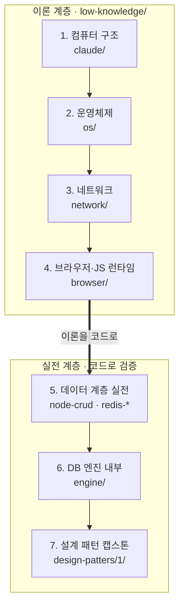

# CS 심화 학습 모노레포 — 밑바닥부터 쌓는 마스터 로드맵

프론트엔드 웹 엔지니어가 "매일 쓰지만 속을 모르는" 컴퓨터의 계층을 **가장 아래층부터** 하나씩 걷어내며 학습하는 저장소다. 트랜지스터에서 시작해 CPU·운영체제·네트워크·브라우저를 지나, 실제로 데이터베이스 엔진과 설계 패턴을 **직접 구현**하는 데까지 이어진다. 학습 방법은 파인만 학습법(Feynman Technique) 하나로 관통한다 — **10살에게 설명할 수 없으면 아직 이해한 것이 아니다.**

> 설계 원칙: 아래층의 '원자(atom)'를 먼저 확보해서, 위층을 배울 때 **"마법 상자(magic box)"가 하나도 남지 않게** 한다. 각 단계는 오직 **하나의 핵심 질문**에 답한다.

---

## 범례

| 배지 | 의미 |
|:---:|---|
| ✅ | 자료 있음 — 지금 바로 읽을 수 있는 기존 문서/코드 |
| 🆕 | 이번에 신규 추가 — 로드맵에 맞춰 새로 채워지는 모듈 |
| ✍️ | 직접 구현 과제 — 읽기만으로 끝나지 않고 손으로 만들어야 완료 |

---

## 저장소 지도

각 폴더는 로드맵의 한 계층에 대응하는 '앵커(anchor)'다.

| 폴더 | 역할 | 단계 |
|---|---|:---:|
| [`low-knowledge/claude/`](low-knowledge/claude/) | 컴퓨터 구조 이론 (한국어 12편) ✅ | 1 |
| [`low-knowledge/os/`](low-knowledge/os/) | 운영체제 이론 🆕 | 2 |
| [`low-knowledge/network/`](low-knowledge/network/) | 네트워크 이론 🆕 | 3 |
| [`low-knowledge/browser/`](low-knowledge/browser/) | 브라우저·JS 런타임 이론 🆕 | 4 |
| [`node-crud/nodes/`](node-crud/nodes/) | Node·PostgreSQL·Redis 개별 기술 실습 ✅ | 5 |
| [`redis-postgreSQL/`](redis-postgreSQL/) | 게임 DB 소형 앱 (트랜잭션·Stream·SortedSet) ✅ | 5 |
| [`redis-postgresql-nodejs/`](redis-postgresql-nodejs/) | 소셜 분석 대형 데모 (cache-aside·JWT·레이트리밋) ✅ | 5 |
| [`postgersql-15-redis/`](postgersql-15-redis/) | PostgreSQL 15 이론 문서 ✅ | 5 (병행) |
| [`study/`](study/) | PostgreSQL 아키텍처 노트 ✅ | 5 (병행) |
| [`engine/`](engine/) | C++17 DB 엔진 SimpleDB + 한국어 해설 7편 ✅ | 6 |
| [`design-patters/1/`](design-patters/1/) | TypeScript 채팅앱 백엔드 (패턴 적용) ✅ | 7 |

---

## 전체 여정

이론 4계층으로 밑바닥을 다진 뒤, 그 지식을 코드로 검증하는 실전 3계층으로 올라간다.



| 단계 | 핵심 질문 | 앵커 | 기간 | 상태 |
|:---:|---|---|:---:|:---:|
| 1 | 코드 한 줄이 실행될 때 CPU와 메모리에서 무슨 일이? | [claude/](low-knowledge/claude/) | ~2주 | ✅ |
| 2 | 브라우저 탭 하나가 죽어도 다른 탭이 사는 이유는? | [os/](low-knowledge/os/) | ~2주 | 🆕 |
| 3 | 주소창에 엔터를 치면 첫 바이트가 도착하기까지? | [network/](low-knowledge/network/) | ~2주 | 🆕 |
| 4 | 내 JS 한 줄이 화면의 픽셀이 되기까지? | [browser/](low-knowledge/browser/) | ~3주 | 🆕 |
| 5 | 좋아요 클릭이 저장되고 랭킹이 실시간 갱신되기까지? | [node-crud](node-crud/nodes/) → [redis-postgreSQL](redis-postgreSQL/) → [nodejs](redis-postgresql-nodejs/) | ~3주 | ✅ |
| 6 | INSERT 한 줄이 디스크의 어느 바이트에 어떻게 적히나? | [engine/](engine/) | ~3주 | ✅ 🆕 ✍️ |
| 7 | 코드가 커져도 무너지지 않게 하는 반복 구조는? | [design-patters/1/](design-patters/1/) | ~2주+ | 🆕 ✍️ |

---

## 1단계 · 컴퓨터 구조 ✅

> **핵심 질문 — 코드 한 줄이 실행될 때 CPU와 메모리에서 무슨 일이 일어나는가?**

- **앵커:** [`low-knowledge/claude/`](low-knowledge/claude/) · 기간 **~2주** · 상태 `✅ 자료 있음`
- **원자:** 2의 보수·IEEE 754 / ISA·명령어 사이클 / 파이프라인·해저드 / 캐시·지역성 / 메모리 계층
- **바로 읽기:** [01 수 표현](low-knowledge/claude/topics/01-number-representation.md) · [02 ISA & CPU](low-knowledge/claude/topics/02-isa-and-cpu-basics.md) · [03 파이프라인](low-knowledge/claude/topics/03-pipeline.md) · [05 메모리 계층](low-knowledge/claude/topics/05-memory-hierarchy.md) · [06 캐시](low-knowledge/claude/topics/06-cache.md)

**파인만 체크**
1. `0.1 + 0.2 ≠ 0.3`인 이유를 IEEE 754 비트 배치 **그림**으로 설명한다.
2. 캐시 미스 3종(Compulsory·Capacity·Conflict, 3C)을 **요리에 비유**한다.
3. 분기 예측(branch prediction)이 없으면 파이프라인에 무슨 일이 생기는지 말한다.

---

## 2단계 · 운영체제 🆕

> **핵심 질문 — 브라우저 탭 하나가 죽어도 다른 탭이 사는 이유는?**

- **앵커:** [`low-knowledge/os/`](low-knowledge/os/) 🆕 · 1단계 [07 가상 메모리](low-knowledge/claude/topics/07-virtual-memory.md)·[09 I/O와 인터럽트](low-knowledge/claude/topics/09-io-and-interrupts.md)와 연계 · 기간 **~2주** · 상태 `🆕 신규 추가`
- **원자:** 프로세스 vs 스레드 / 컨텍스트 스위치 / 스케줄링 / 가상 메모리 / 시스템 콜 / 파일 디스크립터·페이지 캐시 / 블로킹 vs 논블로킹·epoll

**파인만 체크**
1. 프로세스와 스레드를 **아파트(주소 공간=집, 스레드=거주자)**에 비유한다.
2. `fsync`가 왜 느린가 — 페이지 캐시와 디스크 사이에서 무슨 일이 일어나는가.
3. Node.js가 스레드 하나로 수만 개의 연결을 버티는 원리(이벤트 루프 + epoll)를 설명한다.

---

## 3단계 · 네트워크 🆕

> **핵심 질문 — 주소창에 엔터를 치면 첫 바이트가 도착하기까지 무슨 일이?**

- **앵커:** [`low-knowledge/network/`](low-knowledge/network/) 🆕 · 기간 **~2주** · 상태 `🆕 신규 추가`
- **원자:** IP·포트·라우팅 / TCP 핸드셰이크·재전송·혼잡제어 / DNS 재귀·TTL / TLS 핸드셰이크 / HTTP/1.1 → 2 → 3(QUIC) / 캐싱 헤더·CDN

**파인만 체크**
1. 3-way 핸드셰이크(SYN·SYN-ACK·ACK)를 **전화 통화**에 비유한다.
2. HTTP/2 멀티플렉싱이 푸는 문제(HOL 블로킹)를 HTTP/1.1과 대비해 설명한다.
3. CDN이 지연시간을 줄이는 **물리적 이유**(빛의 속도 × 거리)를 말한다.

---

## 4단계 · 브라우저 & JS 런타임 (FE 코어) 🆕

> **핵심 질문 — 내 JS 한 줄이 화면의 픽셀이 되기까지?**

- **앵커:** [`low-knowledge/browser/`](low-knowledge/browser/) 🆕 · 기간 **~3주** · 상태 `🆕 신규 추가`
- **원자:** V8 파싱 → 바이트코드 → JIT / 히든 클래스·인라인 캐시 / 힙·세대별 GC / 이벤트 루프(태스크·마이크로태스크·rAF) / 렌더링 파이프라인(DOM → CSSOM → 레이아웃 → 페인트 → 컴포짓) / 브라우저 프로세스·스레드 모델 / Core Web Vitals

**파인만 체크**
1. `await` 한 줄이 이벤트 루프에서 어떻게 처리되는지(마이크로태스크 큐) **그림**으로 그린다.
2. reflow와 repaint의 차이, 그리고 각각을 유발하는 **코드 예시**를 든다.
3. 히든 클래스(hidden class)가 깨지는 코드 예시(객체 모양을 뒤늦게 바꾸는 경우)를 보인다.

---

## 5단계 · 데이터 계층 실전 ✅

> **핵심 질문 — 좋아요 클릭이 저장되고 랭킹이 실시간 갱신되기까지?**

- **앵커:** [`node-crud`](node-crud/nodes/) → [`redis-postgreSQL`](redis-postgreSQL/) → [`redis-postgresql-nodejs`](redis-postgresql-nodejs/) · 병행 독서 [`postgersql-15-redis`](postgersql-15-redis/)·[`study`](study/) · 기간 **~3주** · 상태 `✅ 자료 있음`
- **원자:** 커넥션 풀 / 트랜잭션·ACID / 인덱스 활용 / 캐시 전략(cache-aside·TTL) / Redis 자료구조(Hash·Stream·SortedSet) / 레이트 리밋

이 단계는 **개별 기술 → 작고 완결된 앱 → 대형 종합**의 순서로 4개 이상의 폴더를 하나의 실습 경로로 꿴다.

### 실습 경로

1. **개별 기술 기초 —** [`node-crud/nodes/`](node-crud/nodes/)
   세 기술을 각각 따로 손에 익힌다. [nodejs-practice](node-crud/nodes/nodejs-practice/README.md)(런타임·비동기) → [postgresql-practice](node-crud/nodes/postgresql-practice/README.md)(SQL·커넥션 풀) → [redis-practice](node-crud/nodes/redis-practice/README.md)(자료구조). 각 폴더의 `PRACTICE.md`로 개념을, `test.js`로 손을 움직인다.
2. **작고 완결된 앱 —** [`redis-postgreSQL/`](redis-postgreSQL/)
   게임 DB 소형 앱. **PostgreSQL 트랜잭션**으로 정합성을, **Redis Hash / Stream / SortedSet**으로 실시간 랭킹과 이벤트 로그를 다룬다. "좋아요 → 랭킹 갱신"의 축소판을 여기서 완성한다.
3. **대형 종합 —** [`redis-postgresql-nodejs/`](redis-postgresql-nodejs/)
   소셜 분석 대형 데모. Express + PostgreSQL + Redis 위에 **cache-aside**, **JWT 인증**, **레이트 리밋**을 얹어 앞의 원자들이 실서비스 규모에서 어떻게 맞물리는지 확인한다. ([ARCHITECTURE.md](redis-postgresql-nodejs/ARCHITECTURE.md) 먼저 읽기)

**병행 독서 (실습과 나란히 읽는 이론 자료)**
- [`postgersql-15-redis/`](postgersql-15-redis/) — [PostgreSQL 15 아키텍처](postgersql-15-redis/01-architecture.md), [롤·권한](postgersql-15-redis/02-databases-and-roles.md)
- [`study/`](study/) — PostgreSQL 아키텍처 낙서 노트

**파인만 체크**
1. cache-aside에서 정합성(consistency)이 깨지는 시나리오(쓰기·삭제 사이의 경합)를 하나 든다.
2. 격리(isolation) 없는 트랜잭션의 문제를 **돈 계좌 이체**로 설명한다.
3. SortedSet 기반 랭킹 조회가 `O(log N)`인 이유(스킵 리스트)를 말한다.

---

## 6단계 · DB 엔진 내부 ✅ 🆕 ✍️

> **핵심 질문 — INSERT 한 줄이 디스크의 어느 바이트에 어떻게 적히나?**

- **앵커:** [`engine/`](engine/) + 해설 [01~07](engine/study/) + [08 확장 과제](engine/study/08_확장과제_직접구현.md) 🆕✍️ · 기간 **~3주** · 상태 `✅ 자료 있음 + ✍️ 직접 구현`
- **원자:** 4KB 페이지 / 버퍼 풀·LRU·pin / B+Tree 분할·범위 스캔 / WAL(과제) / 레코드 직렬화·CRC

5단계에서 "라이브러리로서 쓰던" PostgreSQL·Redis의 **속을 직접 열어본다.** C++17로 구현된 SimpleDB의 각 계층을 해설과 함께 따라 읽고, 마지막엔 WAL을 직접 구현한다.

**따라 읽기 순서**
[01 Page](engine/study/01_Page_클래스_기초.md) → [02 StorageManager](engine/study/02_StorageManager_파일관리자.md) → [03 BufferPoolManager](engine/study/03_BufferPoolManager_메모리캐시.md) → [04 Record](engine/study/04_Record_데이터구조.md) → [05 BTree](engine/study/05_BTree_인덱싱.md) → [06 SQLParser](engine/study/06_SQLParser_쿼리파싱.md) → [07 Database 전체](engine/study/07_Database_전체시스템.md) → ✍️ [08 확장 과제(직접 구현)](engine/study/08_확장과제_직접구현.md)

**파인만 체크**
1. 버퍼 풀(buffer pool)과 CPU 캐시의 **동형성(isomorphism)** — 둘 다 무엇을 무엇으로부터 캐싱하는가.
2. B+Tree가 이진 탐색 트리보다 **디스크에 유리한 이유**(노드 = 페이지 = 팬아웃).
3. WAL(Write-Ahead Log)이 있으면 크래시에도 데이터가 사는 원리(redo·durability)를 설명한다.

---

## 7단계 · 설계 패턴 캡스톤 🆕 ✍️

> **핵심 질문 — 코드가 커져도 무너지지 않게 하는 반복 구조는?**

- **앵커:** [`design-patters/1/`](design-patters/1/) + [STUDY.md](design-patters/1/STUDY.md) 🆕 + 프론트엔드 직접 구현 ✍️ · 기간 **~2주+** · 상태 `🆕 신규 추가 + ✍️ 직접 구현`
- **원자:** Observer(이벤트 루프·Pub/Sub과 동형) / Repository / Service Layer / Factory / MVC

1~6단계에서 만난 구조들이 **애플리케이션 설계**에서 어떻게 반복되는지 회수하는 캡스톤. TypeScript 채팅앱 백엔드에 적용된 패턴을 읽고, 프론트엔드를 직접 구현하며 마무리한다.

**파인만 체크**
1. Observer 패턴과 `addEventListener`의 관계 — 둘은 같은 것인가.
2. Repository가 있으면 테스트가 쉬워지는 이유(의존성 역전·모킹)를 든다.
3. 계층 분리(라우트 → 서비스 → 모델)의 이득을 하나의 변경 시나리오로 설명한다.

---

## 원자 주기율표

**같은 원자가 계층마다 다른 이름으로 재등장한다** — 이것이 이 로드맵의 핵심 통찰이다. 한 번 제대로 이해한 원자는 위층에서 공짜로 회수된다. (셀을 누르면 해당 계층의 앵커로 이동)

| # | 원자 | 1 구조 | 2 OS | 3 네트워크 | 4 브라우저 | 5 데이터 | 6 엔진 | 7 패턴 |
|:---:|---|---|---|---|---|---|---|---|
| 1 | 비트와 표현 | [2의보수·IEEE754](low-knowledge/claude/) | — | — | [UTF-8·JSON](low-knowledge/browser/) | — | [직렬화·CRC](engine/) | — |
| 2 | 캐시와 지역성 | [L1~L3](low-knowledge/claude/) | [TLB·페이지캐시](low-knowledge/os/) | [HTTP캐시·CDN](low-knowledge/network/) | [브라우저 캐시](low-knowledge/browser/) | [Redis](redis-postgresql-nodejs/) | [버퍼풀](engine/) | — |
| 3 | 큐와 스케줄링 | [파이프라인](low-knowledge/claude/) | [런큐](low-knowledge/os/) | [패킷 큐](low-knowledge/network/) | [태스크·마이크로태스크](low-knowledge/browser/) | [Stream·잡큐](redis-postgreSQL/) | — | — |
| 4 | 트리와 인덱스 | — | — | — | [DOM·렌더 트리](low-knowledge/browser/) | [PG 인덱스](redis-postgresql-nodejs/) | [B+Tree](engine/study/05_BTree_인덱싱.md) | — |
| 5 | 해시 | [캐시 태그](low-knowledge/claude/) | — | — | [히든클래스·해시테이블](low-knowledge/browser/) | [Redis Hash](redis-postgreSQL/) | — | — |
| 6 | 페이지와 블록 | [캐시라인](low-knowledge/claude/) | [VM 페이지](low-knowledge/os/) | [패킷·세그먼트](low-knowledge/network/) | — | — | [DB 페이지](engine/study/01_Page_클래스_기초.md) | — |
| 7 | 동시성과 원자성 | [MESI](low-knowledge/claude/) | [락·컨텍스트스위치](low-knowledge/os/) | — | [싱글스레드 이벤트루프](low-knowledge/browser/) | [트랜잭션·ACID](redis-postgresql-nodejs/) | [트랜잭션·ACID](engine/) | — |
| 8 | 계층과 추상화 | [ISA](low-knowledge/claude/) | [시스템콜](low-knowledge/os/) | [TCP/IP 스택](low-knowledge/network/) | [Web API](low-knowledge/browser/) | — | — | [서비스 계층](design-patters/1/) |
| 9 | 로그와 저널 | — | — | — | — | [Redis AOF·Stream](redis-postgreSQL/) | [WAL](engine/study/08_확장과제_직접구현.md) | [이벤트소싱·Pub/Sub](design-patters/1/) |
| 10 | 지연시간의 사다리 | L1 ~1ns · RAM ~100ns | — | RTT ~1ms(리전)·~100ms(대륙간) | — | — | SSD ~100µs | — |

### 지연시간의 사다리 (원자 10 — 모든 판단의 척도)

```
L1 캐시        ~1 ns      ┃ ▏
RAM           ~100 ns    ┃ ██                      (L1의 100배)
SSD           ~100 µs    ┃ ██████████              (RAM의 1,000배)
동일 리전 RTT   ~1 ms      ┃ ████████████            (SSD의 10배)
대륙 간 RTT     ~100 ms    ┃ ██████████████████████  (동일 리전의 100배)
```

> 직관: **한 칸 내려갈 때마다 대략 100~1000배씩 느려진다.** "왜 캐시를 하는가", "왜 CDN을 두는가", "왜 배치로 묶는가"의 모든 답이 이 사다리 안에 있다.

---

## 공통 파인만 학습 루프

어느 단계든 아래 5스텝을 한 바퀴 돌면 그 원자는 "내 것"이 된다.

1. **읽기** — 앵커 문서/코드를 훑는다. 이해가 아니라 지도를 그리는 단계.
2. **원자 분해 노트** — 등장한 개념을 더 못 쪼갤 때까지 나눠 적는다. 모르는 용어 = 아직 남은 마법 상자.
3. **소리 내어 설명** — **10살 기준**으로 말로 풀어본다. 비유가 막히는 지점이 진짜 모르는 지점.
4. **빈틈 재학습** — 3에서 걸린 부분만 콕 집어 다시 읽는다.
5. **한 장 그림 요약** — 전체를 종이 한 장의 다이어그램으로 압축한다. 그려지면 통과.

> 반복: 이 루프를 통과하지 못한 원자는 위층으로 데려가지 않는다. 그것이 "마법 상자 없는 학습"의 규칙이다.
