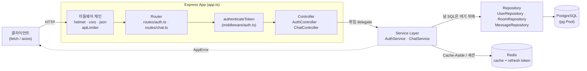
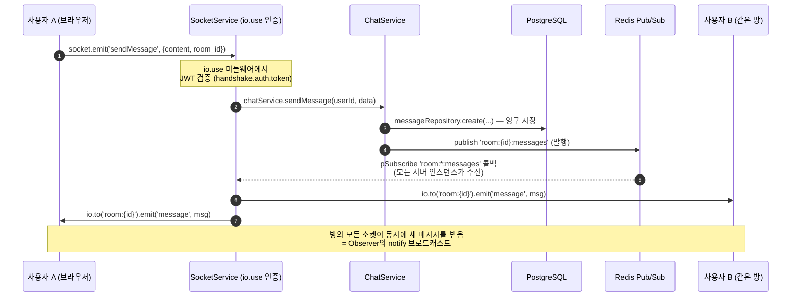

# 실시간 채팅 앱으로 배우는 디자인 패턴 (+ FE 캡스톤 과제)

> "Real knowledge is to know the extent of one's ignorance."
> 프레임워크는 원자(atom)들을 예쁘게 숨긴다. 이 문서는 그 원자들을 하나씩
> 꺼내 이름표를 붙이고, 마지막엔 **프레임워크 없이 직접 만들게** 한다. (파인만)

이 저장소의 `backend/src/`는 이미 완성된 실시간 채팅 서버다. Express +
Socket.io + PostgreSQL + Redis를 **계층형(layered)** 으로 짰다. `frontend/`는
비어 있다 — 그 빈칸이 여러분의 캡스톤이다.

프론트엔드 엔지니어에게 이 백엔드는 최고의 패턴 교과서다. 왜냐하면 우리가
매일 쓰는 React/Vue/상태관리 라이브러리가 내부에서 하는 일 — **관찰자에게
알림 보내기, 상태를 한 곳에 모으기, 요청을 파이프라인으로 흘리기** — 이
서버가 그대로, 그러나 숨김 없이 벌거벗은 채로 하고 있기 때문이다.

---

## 1. 패턴 지도 — 이 코드에 실제로 살아있는 패턴들

아래는 **책에서 베낀 목록이 아니라, `backend/src/`를 직접 뒤져 확인한** 패턴만
담았다. "이 패턴이 없다면"은 상상이 아니라, 그 패턴을 걷어냈을 때 실제로
무너지는 지점이다.

| 패턴 | 실제 위치 (파일 : 클래스·메서드) | 왜 이 패턴인가 | 이 패턴이 없다면 |
|------|-----------------------------|--------------|----------------|
| **Service Layer** (서비스 계층) | `services/ChatService.ts` → `class ChatService` (`createRoom`, `sendMessage`, `joinRoom`) · `services/AuthService.ts` → `class AuthService` (`register`, `login`, `refreshToken`) | 비즈니스 규칙("방장만 삭제 가능", "멤버만 메시지 전송")을 HTTP와 소켓 양쪽에서 재사용할 한 곳에 모은다 | 같은 규칙을 `ChatController`와 `SocketService`가 각자 복붙 → `handleSendMessage`(소켓)와 `sendMessage`(HTTP)가 서로 다르게 동작하는 버그 |
| **Repository** (저장소) | `models/User.ts` → `class UserRepository` · `models/Room.ts` → `class RoomRepository` · `models/Message.ts` → `class MessageRepository` (`findById`, `create`, `isMember` …) | 날 SQL을 메서드 뒤로 숨긴다. 서비스는 `roomRepository.isMember(...)`만 알면 되고 SQL 문법은 몰라도 된다 | 서비스 곳곳에 `SELECT ... JOIN ...` 문자열이 흩어짐. 스키마 컬럼명 하나 바꾸면 수십 곳을 grep해 고쳐야 함 |
| **Singleton** (모듈 싱글턴) | `config/index.ts` → `export const config` · `config/database.ts` → `export const pool`, `export const redisClient` · `utils/logger.ts` → `const logger` | ES 모듈은 한 번 평가되고 캐시된다. `import { pool }`은 어디서 하든 **같은 커넥션 풀 인스턴스**를 준다 | Repository마다 `new Pool()`을 만들면 커넥션이 폭발(연결 수 초과)하고, `config`가 파일마다 다르게 읽혀 설정 불일치 |
| **Factory** (함수 팩토리 / HOF) | `middleware/errorHandler.ts` → `asyncHandler(fn)` (래핑된 미들웨어 반환) · `middleware/rateLimiter.ts` → `createUserRateLimit(windowMs, max)` (설정된 미들웨어 반환) · `utils/jwt.ts` → `JWTUtil.generateTokens()` (토큰 쌍 생성) | "부품을 찍어내는 틀". `asyncHandler`는 try/catch를 자동으로 감싼 새 함수를, `createUserRateLimit`은 파라미터가 다른 미들웨어를 그때그때 생산 | 컨트롤러 15개 메서드마다 `try { } catch(next)`를 손으로 복붙 → 하나만 빠뜨려도 unhandled rejection으로 서버가 죽음 |
| **Observer / Pub-Sub** (관찰자 / 발행-구독) | `services/SocketService.ts` → `socket.on('sendMessage', …)`·`io.to('room:'+id).emit('message', …)` (관찰자 등록·통지) · `setupRedisSubscriptions()` → `subscriber.pSubscribe('room:*:messages', …)` (구독) · `services/ChatService.ts` → `publishMessage()` → `redisClient.publish(...)` (발행) | 한 명이 메시지를 보내면 방의 **모든** 소켓에 밀어준다. 서버가 여러 대여도 Redis Pub/Sub가 인스턴스 간에 이벤트를 중계 | 실시간이 사라진다. 상대는 **새로고침(polling)** 해야 새 메시지를 봄. 서버 2대면 A서버 사용자와 B서버 사용자가 서로 대화 불가 |
| **Middleware 체인** (책임 연쇄) | `app.ts` → `setupMiddleware()` (`helmet → cors → compression → json → 로깅 → apiLimiter`) · `routes/chat.ts` → `router.use(authenticateToken)` + 라우트별 `apiLimiter, messageLimiter` · `middleware/auth.ts` → `authenticateToken` (`next()` 호출) · `SocketService.ts` → `io.use(...)` (소켓 인증 체인) | 요청을 여러 관문에 순서대로 통과시킨다. 각 관문은 `next()`로 다음에 넘기거나 여기서 끊는다(401/429) | 모든 컨트롤러가 자기 안에서 인증·검증·율제한을 직접 처리 → 관심사 뒤엉킴, 보호 라우트에 인증 거는 걸 깜빡하면 그대로 뚫림 |
| **Controller** (MVC의 C · 얇은 컨트롤러) | `controllers/AuthController.ts` · `controllers/ChatController.ts` (`req` 파싱 → 서비스 호출 → `res` 포맷) | HTTP의 세계(req/res/상태코드)와 도메인의 세계(서비스)를 잇는 얇은 번역기. 비즈니스 로직을 **담지 않는 게** 핵심 | 서비스 로직이 컨트롤러에 눌어붙어 소켓에서 재사용 불가. 컨트롤러가 500줄짜리 God object로 비대해짐 |

### 보너스 패턴 (같이 확인해두면 좋은 것)

| 패턴 | 위치 | 한 줄 |
|------|------|------|
| **Cache-Aside** (캐시 우선 조회) | `services/ChatService.ts` → `getRoomById()` (Redis 확인 → 미스면 DB → 캐시 채움), `cacheRecentMessage()` | 읽기를 Redis로 흡수해 Postgres 부하를 던다. 프론트의 React Query `staleTime`과 같은 발상 |
| **Connection Pool** (객체 풀) | `config/database.ts` → `new Pool({ max: 20 })` | 커넥션은 비싸다. 미리 20개 만들어 빌려주고 반납(`client.release()`)받는다 |
| **Strategy** (검증 전략 교체) | `utils/validation.ts` → `validate(schema, data)` + `registerSchema`/`loginSchema`/`sendMessageSchema` (Joi) | `validate()`는 그대로 두고 **스키마만 갈아 끼우면** 검증 규칙이 바뀐다 |
| **Custom Error** (도메인 예외) | `middleware/errorHandler.ts` → `class AppError extends Error` (`status`, `code`) | 서비스가 `throw new AppError('...', 403, 'NOT_ROOM_MEMBER')` 하면 에러 핸들러가 상태코드까지 자동 매핑 |

> 💡 관찰 포인트: **`ChatService`가 순수 도메인, `SocketService`가 전송(transport)**
> 이라는 분리가 이 코드의 백미다. `SocketService.handleSendMessage`(소켓)와
> `ChatController.sendMessage`(HTTP)는 입구만 다를 뿐, 결국 **같은**
> `chatService.sendMessage(userId, data)`를 부른다. Service Layer가 없었다면
> 이 재사용은 불가능했다.

---

## 2. 아키텍처 다이어그램

### (a) HTTP 요청 흐름: 라우트 → 미들웨어 → 컨트롤러 → 서비스 → 저장소



핵심 규율: **의존성은 한 방향으로만 흐른다.** Controller는 Service를 알지만,
Service는 Controller(HTTP)를 모른다. Service는 Repository를 알지만, Repository는
Service를 모른다. 그래서 같은 Service를 소켓에서도 재사용할 수 있다.

### (b) 소켓 이벤트 흐름: 실시간 메시지가 방 전체에 퍼지는 길



두 그림을 겹쳐 보면 보인다: **HTTP는 "요청-응답(한 번)"**, **소켓은
"발행-구독(계속)"**. 같은 `ChatService`를 두 전송 방식이 공유한다.

---

## 3. FE 캡스톤 과제 스펙 — 빈 `frontend/`를 순수 TypeScript로

**규칙: 프레임워크 금지.** React도 Vue도 Zustand도 없다. `socket.io-client`
하나만 허용(이건 프로토콜 클라이언트라 직접 만들 대상이 아니다). 왜? React의
`useState`, Redux의 `store.subscribe`, Vue의 반응성이 **숨긴 원자**를 여러분
손으로 만들어봐야 "아, 그게 그거였구나"가 오기 때문이다.

목표: 이 백엔드에 붙는 **로그인 → 방 목록 → 실시간 채팅** SPA를 만든다.
아래 세 부품(①②③)을 먼저 만들고, 세 마일스톤(④)으로 조립한다.

### ① Observer 패턴 상태 스토어를 직접 구현

Redux/Zustand의 심장은 딱 세 메서드다: `getState`, `setState`, `subscribe`.
이것만 있으면 "상태가 바뀌면 화면이 다시 그려진다"가 성립한다.

**만들 것의 계약(스펙, 구현은 여러분 몫):**

```ts
// frontend/src/store/Store.ts  — 시그니처만. 본문은 직접 채운다.
type Listener<S> = (state: S) => void;

class Store<S> {
  private state: S;
  private listeners: Set<Listener<S>>;   // 관찰자 명부

  constructor(initial: S) { /* TODO */ }

  getState(): S { /* TODO: 현재 상태 반환 */ }

  setState(patch: Partial<S>): void {
    /* TODO:
       1) 이전 상태와 병합해 새 상태 만들기 (불변 업데이트)
       2) 등록된 모든 listener에게 새 상태를 통지(notify)
       설계 결정: 값이 안 바뀌었어도 notify 할까? (얕은 비교로 걸러낼까?) */
  }

  subscribe(listener: Listener<S>): () => void {
    /* TODO:
       1) listener를 명부에 추가
       2) '구독 해지 함수'를 반환 (명부에서 제거)  ← 이 반환값이 핵심 */
  }
}
```

**동형성(isomorphism) — 이걸 반드시 말로 설명하라:**

- `subscribe(listener)` ≡ `element.addEventListener('change', listener)`
- `setState()` 내부의 통지 ≡ `element.dispatchEvent(new Event('change'))`
- `subscribe`가 돌려주는 해지 함수 ≡ `removeEventListener`
- 그리고 **이 백엔드의 `SocketService`가 하는 일과도 같다**:
  `socket.on('message', cb)`(관찰자 등록) → `io.to(room).emit('message')`(통지).
  즉 여러분은 **브라우저 이벤트 시스템과 백엔드 소켓 시스템을 관통하는 같은
  패턴**을 손으로 재현하는 것이다.

> 유도 질문: React의 `useState`는 왜 `setState` 후 컴포넌트를 다시 부르는가?
> 여러분의 `Store`에서 그 "다시 부름"에 해당하는 건 무엇인가? (③의 render를
> subscribe에 연결하는 순간 답이 나온다.)

### ② socket.io-client 연동 서비스 계층

백엔드의 `SocketService`와 짝이 되는 **클라이언트 쪽 전송 계층**. 백엔드의
타입 계약(`types/index.ts`의 `ClientToServerEvents`, `ServerToClientEvents`)을
그대로 거울처럼 맞춘다.

**만들 것의 계약:**

```ts
// frontend/src/services/SocketClient.ts — 시그니처만.
class SocketClient {
  connect(token: string): void {
    /* TODO: io(URL, { auth: { token } }) 로 연결.
       백엔드 SocketService.setupMiddleware가 handshake.auth.token을 읽는다.
       → 로그인에서 받은 JWT를 여기로 넘겨야 인증 통과 */
  }

  joinRoom(roomId: string): void { /* TODO: socket.emit('joinRoom', roomId) */ }
  sendMessage(content: string, roomId: string): void { /* TODO: emit('sendMessage', ...) */ }

  // 서버 → 클라이언트 이벤트를 '스토어로' 흘려보낸다 (①과 연결되는 지점)
  wireTo(store: Store<AppState>): void {
    /* TODO:
       socket.on('message', msg   => store.setState({ messages: [...prev, msg] }))
       socket.on('userJoined', u  => ...)
       socket.on('onlineUsers', u => store.setState({ online: u }))
       socket.on('error', e       => store.setState({ error: e }))
       설계 결정: 서비스가 store를 직접 알게 할까, 콜백을 주입받을까? */
  }
}
```

포인트: **컨트롤러(뷰)는 소켓을 직접 만지지 않는다.** 백엔드가 Controller →
Service로 위임하듯, 프론트도 View → SocketClient로 위임한다. 같은 계층 규율을
반대편에서 재현하는 것이다.

### ③ 가상 DOM 없이 상태 → 렌더 함수

React의 VDOM/디핑은 잠시 잊는다. 가장 단순한 렌더링: **`render(state)`는 상태를
받아 DOM을 다시 그리는 순수 함수**다. 그리고 `store.subscribe(render)` 한 줄로
"상태가 바뀌면 화면이 갱신된다"가 완성된다.

```ts
// frontend/src/view/render.ts — 스펙.
function render(state: AppState, root: HTMLElement): void {
  /* TODO:
     현재 state.route에 따라 로그인/방목록/채팅 화면의 HTML을 만들어
     root.innerHTML 등으로 반영. 이벤트 핸들러를 (재)바인딩.
     설계 결정 & 유도 질문:
       - 매번 전체를 다시 그리면 <input>의 포커스/스크롤이 날아간다. 어떻게 최소화?
       - 리스트를 다시 그릴 때 각 항목을 어떻게 식별? (React가 key를 요구하는 이유를
         여기서 몸으로 만나게 된다)
       - 전체 재렌더 vs 부분 갱신의 트레이드오프는? */
}

// 조립: 이 한 줄이 상태-뷰를 잇는다
store.subscribe((state) => render(state, document.getElementById('app')!));
```

> 이 과정에서 여러분은 **가상 DOM이 왜 발명됐는지**를 스스로 발견하게 된다.
> "전체를 다시 그리면 느리고 포커스가 날아간다 → 바뀐 부분만 골라 반영하고
> 싶다 → 그러려면 이전 트리와 새 트리를 비교해야 한다 → 그게 디핑이다." 이
> 깨달음이 이 트랙의 진짜 보상이다.

### ④ 마일스톤 3개 (작은 것부터 실제로 동작시킨다)

| 마일스톤 | 목표 | 붙는 백엔드 엔드포인트 | 완료 기준 |
|---------|------|---------------------|----------|
| **M1 · 로그인** | 이메일/비번 폼 → JWT 획득 → 스토어에 토큰 저장 | `POST /api/auth/login` (`AuthController.login`) | 로그인 성공 시 `store.getState().token`이 채워지고 화면이 방 목록으로 전환 |
| **M2 · 방 목록** | 토큰으로 방 목록 조회 → 렌더 → 방 생성 | `GET /api/chat/rooms`, `POST /api/chat/rooms` (`ChatController`) | 방 배열이 스토어에 들어오고 `render`가 리스트를 그림. 방 만들면 목록에 즉시 반영 |
| **M3 · 실시간 채팅** | 소켓 연결 → 방 입장 → 송수신 → 라이브 렌더 | 소켓 `joinRoom`/`sendMessage`/`message` (`SocketService`) | 두 브라우저 탭에서 한쪽이 보낸 메시지가 **새로고침 없이** 다른 쪽에 뜬다 |

각 마일스톤은 앞 부품 위에 쌓인다: M1은 ①(스토어)만, M2는 ①+HTTP 호출, M3은
①+②(소켓)+③(라이브 렌더)이 전부 맞물려야 동작한다. **M3이 켜지는 순간이
이 캡스톤의 정상(頂上)이다** — Observer(①)와 Pub/Sub(백엔드 Redis)와 소켓(②)이
한 화면에서 동시에 살아 움직인다.

### ⑤ 마일스톤별 파인만 체크

- **M1 체크**: "로그인 성공 후 받은 JWT를 어디에, 왜 저장하는가? 이걸
  `localStorage`에 두는 것과 메모리 스토어에만 두는 것의 보안 트레이드오프를
  비전공자에게 설명해보라." (새로고침 생존 vs XSS 노출)
- **M2 체크**: "방 목록을 한 번 그린 뒤 새 방을 만들었다. 화면은 어떻게 스스로
  갱신됐는가? `setState` → `notify` → `render`의 세 걸음을 손가락으로 짚으며
  말할 수 있는가?" 못 짚으면 ①이 아직 블랙박스다.
- **M3 체크**: "내가 친 메시지가 상대 화면에 뜨기까지, `emit`부터 상대의
  `render`까지 거친 정거장을 순서대로 대라. (브라우저 → 소켓 → 백엔드
  SocketService → ChatService → Redis publish → pSubscribe → io.emit → 상대
  소켓 → 상대 스토어 setState → 상대 render)" 이 여정을 막힘없이 말하면,
  여러분은 실시간 시스템 전체를 한 문장으로 압축한 것이다.

---

## 4. 왜 이 프로젝트가 "로드맵 7단계(캡스톤)"인가

이 채팅 앱은 독립된 프로젝트가 아니라, 아래 학습 로드맵의 **마지막 7단계**로
설계됐다. 캡스톤(capstone)의 뜻 그대로, **앞 1~6단계에서 하나씩 익힌 원자들이
전부 한자리에 다시 등장해 맞물리는** 곳이기 때문이다.

| 단계 | 익히는 원자(atom) | 이 캡스톤에서 재등장하는 지점 |
|------|-----------------|---------------------------|
| 1 | **이벤트 루프 · 비동기** (콜백/Promise/async) | 컨트롤러의 `asyncHandler`, 서비스의 `await`, 소켓 콜백 — 논블로킹이 없으면 채팅 서버는 한 명 처리하다 멈춘다 |
| 2 | **클로저 · 함수 팩토리** | `createUserRateLimit(windowMs, max)`가 설정을 클로저에 가둬 미들웨어를 찍어냄 (§1 Factory) |
| 3 | **Observer · 이벤트 시스템** | 브라우저 `addEventListener` ↔ 프론트 `Store.subscribe`(③①) ↔ 백엔드 `socket.on`. **같은 패턴의 3중 등장** |
| 4 | **TCP · 소켓** | WebSocket은 TCP 위에 얹힌다. `socket.io`의 `transports: ['websocket','polling']`가 그 연결의 실체 (`SocketService` 생성자) |
| 5 | **Pub/Sub · 메시지 브로커** | Redis `publish`/`pSubscribe`로 서버 인스턴스들이 이벤트를 나눔 (§2b). 수평 확장의 원자 |
| 6 | **캐시 · 상태 관리** | Cache-Aside(`getRoomById`)와 프론트 상태 스토어(①). "진실의 원본은 하나, 사본은 빠르게"라는 같은 사상 |
| **7** | **⬆️ 위 전부의 통합 (이 프로젝트)** | 로그인(2·6) → 방 목록(1·6) → 실시간 채팅(3·4·5)이 한 SPA에서 동시에 작동 |

### 원자들이 어떻게 다시 만나는가 — 세 개의 동형쌍

- **Observer ↔ 이벤트 루프**: 프론트의 `Store.notify`가 리스너들을 부르는 것과,
  Node 이벤트 루프가 `socket.on` 콜백을 큐에서 꺼내 실행하는 것은 같은
  뼈대다 — "사건이 나면 등록된 반응들을 순서대로 깨운다". 3단계에서 배운
  Observer가 1단계의 이벤트 루프 위에서 돌아간다.
- **Pub/Sub ↔ Redis**: 5단계에서 개념으로 배운 발행-구독이, 여기선
  `redisClient.publish(...)`(`ChatService.publishMessage`)와
  `subscriber.pSubscribe('room:*:messages')`(`SocketService`)라는 **실물 코드**로
  존재한다. 서버가 2대로 늘어나는 순간 이 원자가 왜 필수인지 몸으로 안다
  (없으면 A서버 사용자와 B서버 사용자가 대화 불가).
- **소켓 ↔ TCP**: 4단계의 TCP 3-way handshake와 스트림이, 여기선
  Socket.io의 연결/재연결/하트비트로 추상화돼 있다. `transports`가 websocket
  으로 안 되면 polling으로 **폴백**하는 것까지, 전송 계층의 현실이 그대로 담겨
  있다.

### 그래서 이 캡스톤이 파인만 학습법의 종착점인 이유

1~6단계는 원자를 **하나씩 격리해서** 배웠다. 하지만 진짜 시스템은 원자들이
**동시에, 서로 의존하며** 움직인다. 이 프로젝트는:

- **읽기**로 §1~2(패턴 지도·다이어그램)에서 원자들이 실제 코드 어디에 박혀
  있는지 눈으로 확인하고,
- **만들기**로 §3(FE 캡스톤)에서 프레임워크가 숨긴 원자(Observer 스토어,
  소켓 서비스, 렌더 루프)를 직접 손으로 재현한다.

설명할 수 있고(§1~2) + 만들 수 있으면(§3), 그 원자는 이제 여러분의 것이다.
그게 캡스톤이 존재하는 이유다.

---

## 📍 관련 파일 위치 (이 문서가 인용한 지점)

- **Service Layer**: `backend/src/services/ChatService.ts`, `.../AuthService.ts`
- **Repository**: `backend/src/models/User.ts`, `Room.ts`, `Message.ts`
- **Singleton**: `backend/src/config/index.ts`, `config/database.ts`, `utils/logger.ts`
- **Factory**: `backend/src/middleware/errorHandler.ts`(asyncHandler),
  `middleware/rateLimiter.ts`(createUserRateLimit), `utils/jwt.ts`
- **Observer / Pub-Sub**: `backend/src/services/SocketService.ts`
  (`socket.on`, `io.to().emit`, `setupRedisSubscriptions`),
  `services/ChatService.ts`(`publishMessage`)
- **Middleware 체인**: `backend/src/app.ts`(setupMiddleware),
  `routes/auth.ts`, `routes/chat.ts`, `middleware/auth.ts`
- **Controller**: `backend/src/controllers/AuthController.ts`, `ChatController.ts`
- **타입 계약(프론트가 맞춰야 할 소켓 이벤트)**: `backend/src/types/index.ts`
  (`ClientToServerEvents`, `ServerToClientEvents`)
- **캡스톤 대상**: `frontend/` (현재 비어 있음 → 여러분이 채운다)
