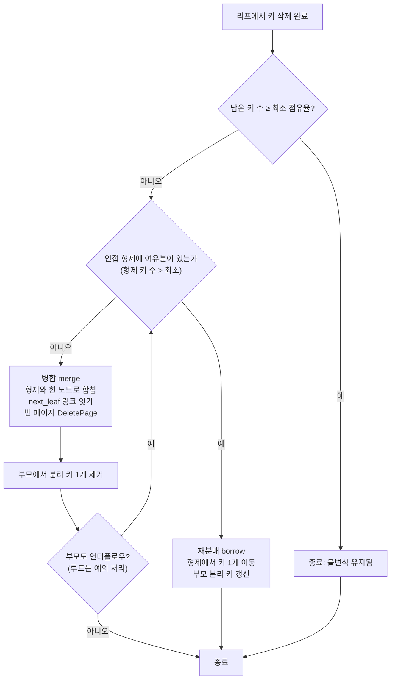
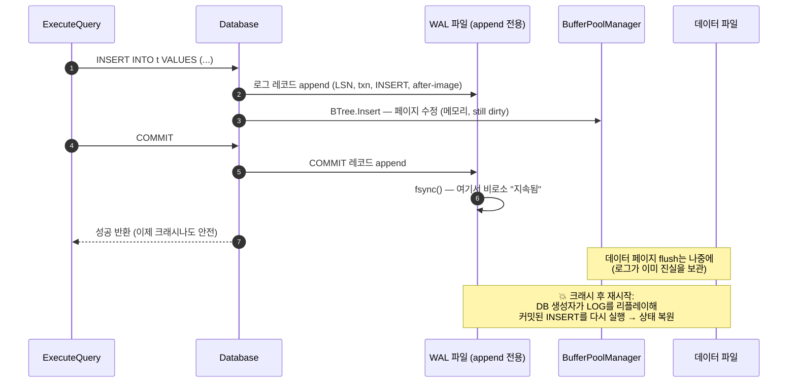

# 8단계: 확장 과제 - 이제 읽지 말고 직접 만들어라 🛠️

> "내가 만들 수 없는 것은, 내가 이해하지 못한 것이다."
> — Richard Feynman, 그의 칠판에 남긴 마지막 문장

## 🎯 왜 "읽는 가이드"가 아니라 "만드는 과제집"인가

1단계부터 7단계까지, 우리는 SimpleDB를 **읽었다**. Page, StorageManager,
BufferPool, Record, BTree, SQLParser, Database가 어떻게 맞물리는지 설명할 수
있게 됐다. 그런데 파인만 학습법의 핵심은 여기서 한 발 더 나간다.

> **설명할 수 있는 것**과 **만들 수 있는 것** 사이에는 강이 하나 있다.
> 그 강을 건너봐야 자기 이해의 빈틈이 어디였는지 정확히 알게 된다.

프론트엔드로 비유하면 이렇다. 여러분은 React의 `useState`가 "리렌더를
트리거한다"고 설명할 수 있다. 하지만 직접 `useState`를 구현해보라고 하면?
클로저로 값을 어디에 저장하지? 리렌더는 어떻게 스케줄링하지? 배치 업데이트는?
**설명은 매끄러웠는데 손이 멈추는 그 지점** — 거기가 여러분의 진짜 이해가
끝나는 곳이다.

이 문서는 SimpleDB의 **의도적으로 비어 있는 세 곳**을 직접 채우는 과제집이다.
정답 코드는 주지 않는다. 대신:

- **실패하는 구체적 시나리오** (재현 가능한 SQL/입력)
- **관련된 원자 개념** (더 쪼갤 수 없는 핵심 아이디어)
- **현재 코드가 비어 있는 정확한 위치** (`파일:줄` 인용)
- **단계별 유도 질문과 설계 결정 포인트** (답이 아니라 방향)
- **검증 방법** (`tests/test_main.cpp` 하네스에 추가할 테스트)

를 준다. 손으로 채우는 건 여러분 몫이다.

---

## 🗺️ 세 개의 트랙과 권장 순서

| 트랙 | 주제 | 난이도 | 한 줄 요약 |
|------|------|--------|-----------|
| **C** | WHERE 일반 컬럼 필터링 | 하 (워밍업) | `id` 아닌 조건이 조용히 무시되는 버그를 고친다 |
| **A** | B+Tree Delete 언더플로우 | 중 | 삭제 후 무너진 트리 불변식을 병합/재분배로 복원한다 |
| **B** | 최소 WAL (Write-Ahead Log) | 상 | 크래시가 나도 데이터가 살아남게 만든다 |

**권장 순서: C → A → B** (난이도 오름차순)

- **C**로 시작하는 이유: 코드베이스에 손을 대는 감을 잡는다. 파서/실행기의
  데이터 흐름을 따라가며 "이미 있는 함수를 올바른 자리에서 부르기만 하면 되는"
  작은 승리를 먼저 맛본다.
- **A**: 자료구조의 불변식(invariant)을 직접 지켜야 한다. 삽입의 거울상이지만
  경우의 수가 더 많다. 여기서 "부모를 어떻게 다시 찾지?" 같은 질문에 막히면
  이해의 빈틈을 찾은 것이다.
- **B**: 시스템 전체의 지속성(durability)을 다룬다. 파일 I/O, fsync, 복구 순서
  같은 저수준 계약을 설계해야 한다. Redis의 AOF가 여기서 다시 등장한다.

---

# 🟢 트랙 C (난이도 하 · 워밍업): WHERE 일반 컬럼 필터링

## ① 왜 필요한가 — 조용히 틀리는 SELECT

다음을 그대로 실행해보라.

```sql
CREATE TABLE t (id INT, val INT)
INSERT INTO t VALUES (0, 0)
INSERT INTO t VALUES (1, 10)
INSERT INTO t VALUES (2, 20)
INSERT INTO t VALUES (3, 30)

-- (1) 기본키 조건: 잘 됨
SELECT * FROM t WHERE id = 2      -- 기대: 1행(2,20)  실제: 1행 ✅

-- (2) 일반 컬럼 등호: 조용히 실패
SELECT * FROM t WHERE val = 20    -- 기대: 1행(2,20)  실제: 0행 ❌

-- (3) 일반 컬럼 부등호: 조용히 실패
SELECT * FROM t WHERE val > 10    -- 기대: 2행         실제: 0행 ❌
```

가장 위험한 종류의 버그다. **에러도 안 나고, 크래시도 안 나고, 그냥 빈 결과를
주면서 성공(`true`)을 반환한다.** 프론트엔드에서 API가 200 OK에 `[]`를
돌려주면, 우리는 "데이터가 없나 보다" 하고 넘어간다. 실제로는 필터 로직이
통째로 실행되지 않은 것인데도.

재미있는 사실: **같은 조건을 DELETE로 하면 제대로 동작한다.**

```sql
DELETE FROM t WHERE val = 20      -- 이건 실제로 (2,20)을 지운다 ✅
```

즉 엔진은 "일반 컬럼을 필터링하는 능력"을 이미 갖고 있다. SELECT만 그 능력을
호출하지 않을 뿐이다. 이 비대칭이 이번 트랙의 핵심 단서다.

## ② 관련 원자 개념

- **인덱스 경로 vs 풀 스캔 경로 (access path)**: 쿼리 실행기는 조건을 보고
  "인덱스로 바로 찾을 수 있나, 아니면 전부 훑어야 하나"를 결정한다. 기본키
  등호는 인덱스 경로(`Search`, O(log n)), 그 외는 풀 스캔 경로
  (`RangeScan` 후 필터, O(n)).
- **술어 평가 (predicate evaluation)**: 레코드 하나가 조건을 만족하는지
  판정하는 순수 함수. 프론트엔드의 `array.filter(predicate)`의 그 predicate와
  똑같다.
- **폴백(fallback) 경로**: 최적화 경로가 적용 불가일 때 반드시 존재해야 하는
  "느리지만 항상 맞는" 기본 경로. 이게 없으면 최적화가 안 되는 순간 결과가
  틀린다.

## ③ 현재 코드의 빈 곳

`src/database.cpp`의 `ExecuteSelect` (**`database.cpp:35-81`**)를 보자.

- **`database.cpp:44-57`** — 조건이 아예 없을 때(`SELECT *`)는
  `RangeScan(INT_MIN, INT_MAX)`로 전부 가져온 뒤 필터를 돈다. (빈 조건
  루프라 전부 통과 → 전체 반환. 정상.)
- **`database.cpp:58-78`** — 조건이 있을 때. 여기가 문제다. 루프가
  `condition.column == "id" && condition.op == "="` (**`database.cpp:60`**)
  **하나만** 찾는다. 이 조건에 맞는 항목이 없으면? 루프는 아무것도 안 하고
  끝나고, `last_results_`는 빈 채로 남고, 함수는 `true`를 반환한다.
  `break`(**`database.cpp:75`**)조차 `if` 블록 안에 있어서, id 조건을 처리한
  뒤에만 걸린다.

이미 존재하지만 **이 경로에서 호출되지 않는** 두 조각:

- **`database.cpp:165-192`** `EvaluateCondition` — `=`, `>`, `<`를 임의 컬럼에
  대해 평가하는 완성된 술어 함수. 잘 동작한다. 단지 비-id SELECT 경로가 여기에
  도달하지 못할 뿐이다.
- **`database.cpp:121-145`** `ExecuteDelete`의 일반 경로 — `RangeScan` 후
  `EvaluateCondition`로 필터링하는 로직이 **이미 올바르게** 짜여 있다. DELETE는
  되고 SELECT는 안 되는 이유가 바로 이 코드의 유무다.

> 검증 힌트: `tests/test_main.cpp`의 `TestSqlEndToEnd`(**`test_main.cpp:109-134`**)를
> 보면 WHERE 테스트가 `WHERE id = 4`(**`test_main.cpp:123, 130`**)뿐이다.
> 비-id WHERE는 테스트된 적이 없다. 그래서 이 버그가 지금까지 살아있었다.

## ④ 구현 단계 힌트 (정답 코드 아님 · 유도 질문)

1. **경로를 셋으로 나눠 생각하라.** (a) 조건 없음 (b) `id =` 조건이 있음
   (c) 그 외 조건. 현재 코드는 (a)와 (b)만 처리한다. (c) 경로를 어디에 끼워
   넣어야 할까? `else` 블록의 for 루프가 id 조건을 **못 찾고 끝났을 때**를
   어떻게 감지할 것인가?
2. **바퀴를 다시 발명하지 마라.** `ExecuteDelete`(**`database.cpp:121-145`**)가
   이미 하는 일 — "전체 스캔 → 각 레코드를 모든 조건으로 검사 → 통과분만
   수집" — 을 SELECT에서도 그대로 하면 된다. 두 함수의 필터 루프가 거의
   똑같아진다면, 그 공통 로직을 private 헬퍼로 뽑을지 말지도 설계 결정이다.
3. **설계 결정 포인트 — 최적화를 유지할 것인가?** 가장 단순한 수정은 "조건이
   있으면 무조건 풀 스캔 후 필터"다. 하지만 그러면 `WHERE id = 2`도 O(log n)
   인덱스 검색을 버리고 O(n)이 된다. `id =`가 있으면 인덱스 경로, 없으면 폴백
   풀 스캔 — 이 분기를 어떻게 깔끔하게 표현할까? (힌트: "사용 가능한 인덱스
   조건이 하나라도 있는가?"를 먼저 판정하는 게 read하기 좋다.)
4. **엣지 케이스를 스스로 물어라.** `WHERE id = 2 AND val = 99`처럼 인덱스
   경로로 찾은 뒤에도 **나머지 조건을 다시 검사해야** 하는가? (현재 id 경로는
   이미 그렇게 한다 — `database.cpp:65-70`. 왜 그럴까? 인덱스는 id만 좁혀줄 뿐,
   AND로 묶인 다른 술어는 여전히 평가돼야 하기 때문이다.)

## ⑤ 검증 방법 — `tests/test_main.cpp`에 추가할 시나리오

`TestSqlEndToEnd` 스타일을 따라 새 테스트 함수를 추가하고 `main()`에서
호출하라. `CHECK` 매크로(**`test_main.cpp:19-28`**)를 그대로 쓴다.

```cpp
void TestSelectNonKeyFilter() {
    const std::string path = "test_select_filter.db";
    std::remove(path.c_str());

    Database db(path);
    CHECK(db.ExecuteQuery("CREATE TABLE t (id INT, val INT)"));
    for (int i = 0; i < 4; ++i) {
        std::string sql = "INSERT INTO t VALUES (" + std::to_string(i) + ", " +
                          std::to_string(i * 10) + ")";
        CHECK(db.ExecuteQuery(sql));
    }

    // 일반 컬럼 등호: 정확히 1행이어야 한다
    CHECK(db.ExecuteQuery("SELECT * FROM t WHERE val = 20"));
    CHECK(db.GetLastResults().size() == 1u);

    // 일반 컬럼 부등호: val > 10 => (2,20),(3,30) => 2행
    CHECK(db.ExecuteQuery("SELECT * FROM t WHERE val > 10"));
    CHECK(db.GetLastResults().size() == 2u);

    // 매칭 없음: 빈 결과지만 여전히 성공
    CHECK(db.ExecuteQuery("SELECT * FROM t WHERE val = 999"));
    CHECK(db.GetLastResults().empty());

    // 회귀 방지: 기본키 경로는 여전히 동작
    CHECK(db.ExecuteQuery("SELECT * FROM t WHERE id = 2"));
    CHECK(db.GetLastResults().size() == 1u);

    std::remove(path.c_str());
}
```

**통과 기준**: 수정 전에는 첫 두 `size()` CHECK가 FAIL로 찍힌다(0을 받음).
수정 후 전부 PASS. 마지막 `id = 2` CHECK가 계속 PASS인지도 확인하라 — 인덱스
경로를 실수로 부수지 않았다는 증거다.

## 🧑‍🏫 파인만 체크 (트랙 C)

> **비전공자 친구에게 이렇게 설명해보라**: "데이터베이스한테 '값이 20인 줄
> 찾아줘'라고 했는데 빈손으로 돌아왔어. 근데 에러도 없었어. 왜 이게 크래시보다
> 더 위험한 버그일까?" — 이 질문에 3문장으로 답할 수 없다면, "조용한 실패"가
> 왜 무서운지 아직 몸으로 이해하지 못한 것이다.

---

# 🟡 트랙 A (난이도 중): B+Tree Delete 언더플로우

## ① 왜 필요한가 — 삭제가 트리를 조금씩 망가뜨린다

BTree(5단계)에서 배웠다. 노드가 꽉 차면 **분할(split)** 하고 중간값을 부모로
올린다. 삭제는 그 거울상이다. 노드가 너무 **비면** 형제와 **병합(merge)** 하거나
형제에서 키를 **빌려온다(borrow/재분배)**. 지금 SimpleDB는 이 거울상이 없다.

`BTREE_ORDER = 4`(**`btree.h:8`**)라 노드당 최대 키는 3개다. 다음을 상상해보라.

```sql
CREATE TABLE t (id INT, val INT)
-- 0..9를 넣어 트리를 여러 리프로 분할시킨다
INSERT INTO t VALUES (0, 0)
INSERT INTO t VALUES (1, 1)
...
INSERT INTO t VALUES (9, 9)

-- 특정 리프의 키를 모두 지운다
DELETE FROM t WHERE id = 6
DELETE FROM t WHERE id = 7
DELETE FROM t WHERE id = 8
```

현재 구현에서 어떤 일이 벌어지나:

- 각 `Delete`는 리프에서 키만 지운다. 리프가 **0개 키**가 돼도 그대로 트리에
  매달려 있다. 빈 리프, 반쯤 빈 리프가 계속 쌓인다.
- 내부 노드의 **분리 키(separator key)** 는 절대 갱신되지 않는다. 지운 키가
  내부 노드에도 라우팅 정보로 남아, 없는 데이터를 가리킨다.
- 트리 **높이가 줄지 않는다.** 100개를 넣고 99개를 지워도 트리는 여전히
  뚱뚱한 채다. B+Tree의 존재 이유인 "낮은 높이 = 적은 디스크 접근"이 삭제
  패턴에서 서서히 무너진다.

지금은 `Search`가 우연히 살아 있다. 리프 링크와 남은 키로 대개 찾아지기
때문이다. 하지만 이건 **불변식이 깨진 자료구조에 운으로 기대는** 상태다.
프론트엔드로 치면, 정렬됐다고 가정한 배열에 정렬 안 된 데이터를 넣고
`binarySearch`를 돌리는 것과 같다. 오늘은 맞고 내일은 틀린다.

## ② 관련 원자 개념

- **불변식 (invariant)**: "루트가 아닌 모든 노드는 최소 점유율 이상을 유지한다."
  이게 B+Tree가 항상 `O(log n)` 높이를 보장하는 근거다. 삽입은 상한(꽉 참)을,
  삭제는 하한(너무 빔)을 지킨다.
- **최소 점유율 (minimum occupancy)**: order `m`에서 내부 노드의 최소 자식 수는
  `⌈m/2⌉`, 즉 최소 키는 `⌈m/2⌉ - 1`. `m=4`면 최소 자식 2, 최소 키 1. 리프의
  최소 키 수는 구현 관례(보통 `⌈(m-1)/2⌉`)다. **정확한 숫자는 여러분이 정할
  설계 결정이다** — 정하고 나면 코드 전체가 그 약속을 지켜야 한다.
- **재분배(borrow) vs 병합(merge)**: 옆 형제에게 여유분이 있으면 한 개
  빌려온다(재분배). 형제도 빠듯하면 둘을 합친다(병합). 병합은 부모에서 분리
  키를 하나 제거하므로, **부모가 다시 언더플로우** 될 수 있다 → 위로 전파.
- **분리 키의 의미**: 내부 노드의 키는 데이터가 아니라 "왼쪽은 이 값 미만,
  오른쪽은 이 값 이상"이라는 **경계 표지판**이다. 병합/재분배 시 이 표지판을
  올바르게 다시 세우는 게 이 과제의 진짜 난이도다.

## ③ 현재 코드의 빈 곳

`src/btree.cpp`의 `Delete` (**`btree.cpp:145-169`**):

```
150:  page_id_t leaf_page_id = FindLeafPage(key);   // 리프만 찾고 부모 경로는 버린다
...
159:  leaf.keys.erase(it);                          // 키 제거
160:  leaf.records.erase(leaf.records.begin() + index);  // 레코드 제거
162:  SerializeNode(leaf, leaf_page);               // 저장
163:  UnpinPage(leaf_page_id, true);                // 끝. 언더플로우 검사 없음
164:  return true;
```

여기서 **끝나 버린다.** "이 리프가 최소 점유율 밑으로 떨어졌는가?"라는 질문
자체가 없다.

핵심 대비 — **삽입은 이미 부모 경로를 추적한다:**

- **`btree.cpp:15`** `std::vector<page_id_t> path;` — 삽입은 루트→리프로
  내려가며 부모들을 쌓아둔다.
- **`btree.cpp:23`** `path.push_back(current);` — 그래서 분할 시 위로 올라가며
  부모에 승격 키를 꽂을 수 있다(**`btree.cpp:70-106`**).
- 반면 `Delete`는 **`btree.cpp:150`**에서 `FindLeafPage`를 부르는데, 이 함수
  (**`btree.cpp:212-233`**)는 내려가면서 부모 포인터를 **전부 버린다**. 병합/
  재분배를 하려면 부모가 누구고, 내가 부모의 몇 번째 자식이며, 내 왼쪽/오른쪽
  형제가 누구인지 알아야 한다 — 지금은 그 정보가 없다.

도구는 이미 있다:

- **`buffer_pool_manager.cpp:111-128`** `DeletePage` — 병합으로 비게 된 페이지를
  반납할 수 있다. 단 `pin_count > 0`이면 실패(**`buffer_pool_manager.cpp:115`**)
  하니, 언핀 순서를 설계해야 한다.
- **`btree.cpp:57, 60`** 삽입이 다루는 `next_leaf` 링크 — 병합 시 왼쪽 리프의
  `next_leaf`를 오른쪽 리프의 것으로 이어줘야 범위 스캔이 안 끊긴다.

## ④ 구현 단계 힌트 (정답 코드 아님 · 유도 질문)

1. **먼저 부모 경로를 확보하라.** `Delete`도 삽입처럼 루트에서 리프까지
   내려가며 `path`를 쌓아야 한다. `FindLeafPage`를 그대로 쓸 수 없는 이유가
   여기 있다. 삽입의 하강 루프(**`btree.cpp:16-27`**)를 참고해 Delete용 하강을
   설계하라. **설계 결정**: 각 단계에서 "부모 page_id"만 저장할까, "부모에서
   내가 몇 번째 자식인지"까지 저장할까? 후자를 저장해두면 형제 찾기가 쉬워진다.
2. **언더플로우를 판정하라.** 키를 지운 직후, `leaf.keys.size()`가 여러분이 ②에서
   정한 최소치 미만인가? 루트는 예외다(루트는 키 0개여도 됨 — 자식이 하나뿐이면
   그 자식이 새 루트가 되는 별도 처리). 이 예외를 언제 어떻게 다룰지 정하라.
3. **재분배 먼저, 병합 나중 — 순서를 정하라.** 왼쪽/오른쪽 형제 중 하나라도
   여유가 있으면 빌려온다. 어느 형제를 먼저 볼까? 빌려올 때 **부모의 분리 키를
   어떤 값으로 갱신**해야 정렬 불변식이 유지되나? (리프에서 빌릴 때와 내부
   노드에서 빌릴 때 분리 키 갱신 규칙이 다르다 — 왜 다른지 종이에 두 케이스를
   그려보라.)
4. **병합은 위로 전파된다.** 형제와 합치면 부모에서 분리 키 하나가 사라진다.
   그러면 부모가 언더플로우일 수 있다. 이걸 어떻게 처리할까 — 재귀? `path`를
   pop하며 도는 루프? (아래 분기 다이어그램의 화살표가 `부모로` 돌아가는 게
   바로 이 전파다.)
5. **아래 케이스 분기를 코드로 옮기기 전에 손으로 트레이스하라.** `m=4`,
   키 0..9를 넣어 만든 트리에서 6,7,8을 차례로 지우며 매 단계 트리를 그려라.
   어디서 borrow가 일어나고 어디서 merge가 일어나며 언제 높이가 줄어드는지
   **먼저 손으로** 확인한 뒤 코딩하라.



## ⑤ 검증 방법 — `tests/test_main.cpp`에 추가할 시나리오

`TestBTreeSplitAndSearch`(**`test_main.cpp:78-107`**)를 확장하는 형태가 좋다.
언더플로우는 "삭제 후에도 (a) 남은 키는 다 찾아지고 (b) 지운 키는 안 찾아지며
(c) 범위 스캔이 여전히 정확한가"로 검증한다.

```cpp
void TestBTreeDeleteUnderflow() {
    const std::string path = "test_btree_delete.db";
    std::remove(path.c_str());

    StorageManager sm(path);
    BufferPoolManager bpm(50, &sm);
    BTree tree(&bpm);

    constexpr int N = 50;
    for (int i = 0; i < N; ++i) {
        Record r; r.AddValue(i); r.AddValue(i * 10);
        CHECK(tree.Insert(i, r));
    }

    // 연속 구간을 통째로 지워 리프가 여러 번 언더플로우 되도록 강제
    for (int i = 10; i < 30; ++i) {
        CHECK(tree.Delete(i));
    }

    // (a) 지운 키는 사라졌다
    for (int i = 10; i < 30; ++i) {
        Record r;
        CHECK(!tree.Search(i, r));
    }
    // (b) 안 지운 키는 전부 살아있다
    for (int i = 0; i < 10; ++i)  { Record r; CHECK(tree.Search(i, r)); }
    for (int i = 30; i < N; ++i)  { Record r; CHECK(tree.Search(i, r)); }

    // (c) 범위 스캔이 구멍 난 구간을 정확히 반영한다
    auto range = tree.RangeScan(0, 49);
    CHECK(range.size() == 30u);           // 50개 중 20개 삭제 => 30개

    auto hole = tree.RangeScan(10, 29);
    CHECK(hole.empty());                  // 그 구간은 통째로 비었다

    // (d) 존재하지 않는 키 삭제는 false
    CHECK(!tree.Delete(999));

    std::remove(path.c_str());
}
```

**더 독한 검증(선택)**: 삽입/삭제를 무작위로 섞어 수천 번 돌린 뒤, 매번
`std::set`(정답 오라클)과 `RangeScan` 결과를 대조하라. 자료구조 버그는
"특정 순서에서만" 터지므로, 무작위 시퀀스가 손으로 못 찾는 케이스를 잡아준다.
불변식 검사기(모든 비-루트 노드의 키 수 ≥ 최소치)를 디버그용으로 만들어 매
연산 후 호출하면, 어느 연산이 불변식을 깼는지 즉시 짚어낸다.

## 🧑‍🏫 파인만 체크 (트랙 A)

> **10살에게 설명하라**: "책장에 책이 알파벳 순으로 칸칸이 꽂혀 있어. 한 칸이
> 거의 비면 어떻게 정리해야 나중에 책을 빨리 찾을 수 있을까? 옆 칸에서 한 권
> 빌려올 때랑, 두 칸을 아예 하나로 합칠 때는 각각 언제야?" — 아이가 알아듣게
> 말할 수 있다면 borrow와 merge의 트리거 조건을 진짜로 이해한 것이다.

---

# 🔴 트랙 B (난이도 상): 최소 WAL - 크래시에서 살아남기

## ① 왜 필요한가 — 지금은 전원이 꺼지면 데이터가 증발한다

이 시나리오를 상상하라. 사용자가 100건을 INSERT했다. 버퍼풀이 아직 더티
페이지 몇 개를 메모리에 들고 있는데, **그 순간 서버 전원이 나간다.** 재시작하면?

- 디스크로 이미 내려간 페이지는 살아있다.
- 메모리에만 있던 더티 페이지는 **사라진다.**
- 최악은 **부분 쓰기(torn write)**: 한 페이지를 쓰는 도중 크래시가 나면,
  절반은 새 데이터, 절반은 옛 데이터인 **손상된 페이지**가 남는다. 트리 노드가
  이렇게 깨지면 `Search`가 엉뚱한 페이지로 점프하거나 무한 루프에 빠진다.

게다가 지금은 페이지가 **아무 순서로나** 디스크에 내려간다. 버퍼풀은 LRU
victim을 쫓아낼 때 더티 페이지를 flush(**`buffer_pool_manager.cpp:148-160`**)할
뿐, "새 루트보다 자식이 먼저 저장돼야 한다" 같은 순서 보장이 전혀 없다.
크래시 타이밍에 따라 트리가 앞뒤 안 맞는 상태로 굳어버릴 수 있다.

프론트엔드 비유: 낙관적 업데이트(optimistic update)를 화면에 그려놓고 서버
저장이 실패했는데 롤백을 안 한 상태. UI(메모리)와 진실(디스크)이 어긋난다.
WAL은 이 어긋남을 원천 봉쇄하는 "먼저 적어두고 나중에 반영한다"는 규율이다.

**Redis를 써봤다면 이미 사촌을 안다: AOF(Append Only File).** Redis는 모든
쓰기 명령을 파일 끝에 계속 append하고, 재시작 시 그 파일을 처음부터 다시
실행(replay)해 메모리 상태를 복원한다. `appendfsync everysec` 설정이 바로
"얼마나 자주 디스크에 강제로 내릴까"의 트레이드오프다. 우리가 만들 WAL은
개념적으로 AOF와 **동형(isomorphic)** 이다. 이름과 레코드 포맷만 다를 뿐,
"로그 먼저, 반영 나중, 크래시 후 리플레이"라는 뼈대가 똑같다.

## ② 관련 원자 개념

- **지속성 (durability)**: 커밋이 성공했다고 답한 데이터는 크래시 후에도
  반드시 살아있어야 한다. ACID의 D.
- **Write-Ahead 규칙**: 데이터 페이지를 디스크에 반영하기 **전에**, 그 변경을
  기술한 로그 레코드가 **먼저** 디스크에 안착해야 한다. 순서가 생명이다.
- **`flush` vs `fsync`**: 둘은 다르다. C++ 스트림 `flush`는 프로그램 버퍼를
  OS로 넘길 뿐, 데이터는 여전히 **OS 페이지 캐시**에 있다 — 전원이 나가면
  사라진다. `fsync`/`fdatasync`는 OS에게 "진짜 물리 디스크 플래터/셀까지
  내려라"라고 강제한다. WAL의 durability는 오직 fsync에서 나온다.
- **리두(redo) / 언두(undo)**: 리플레이 시, 커밋된 트랜잭션의 변경은 다시
  적용(redo)하고, 커밋 안 된 채 크래시된 변경은 되돌린다(undo). 최소 구현은
  redo-only(커밋된 것만 반영)로 시작할 수 있다.
- **체크포인트 (checkpoint)**: 로그는 무한히 자란다. 주기적으로 "이 시점까지의
  더티 페이지는 전부 디스크에 반영됨"을 기록해두면, 리플레이를 로그 처음이
  아니라 마지막 체크포인트부터 시작할 수 있다. Redis의 `BGREWRITEAOF`(AOF
  재작성/압축)가 같은 목적이다.
- **LSN (Log Sequence Number)**: 각 로그 레코드에 붙는 단조 증가 번호. "이
  페이지는 LSN 42까지 반영됐다"처럼 진행 상황을 추적하는 좌표계.

## ③ 현재 코드의 빈 곳

WAL은 지금 **어디에도 없다.** 채워야 할 자리들:

- **`storage_manager.cpp:69-75`** `WritePage`:
  ```
  73:  file_stream_.flush();   // OS로 넘길 뿐 — fsync 아님. 전원 나가면 소실 가능
  ```
  durability 계약이 여기서 새고 있다. 진짜 내구성을 원하면 로그 파일에 대한
  fsync가 어딘가에 있어야 한다.
- **`storage_manager.h:7-23`** — 로그 파일 핸들도, fsync API도 없다. `StorageManager`는
  데이터 파일 하나만 안다. WAL은 별도 로그 파일(append 전용)이 필요하다.
- **`database.h:23-28`** — `Database`의 멤버는 `storage_manager_`,
  `buffer_pool_manager_`, `parser_`, `tables_`, `last_results_`뿐. **로그
  매니저도, 트랜잭션 상태도 없다.** `BeginTransaction/Commit/Rollback`이 존재하지
  않는다.
- **`database.cpp:11-33`** `ExecuteQuery` — 파싱 후 바로 실행. 쓰기 연산
  (INSERT/DELETE) 전에 로그를 남기는 훅이 들어갈 자리가 바로 여기다.
- **`buffer_pool_manager.cpp:148-160`** `FlushFrame` → `WritePage` — 더티
  페이지가 디스크로 내려가는 유일한 길목. Write-Ahead 규칙을 강제하려면
  "이 페이지를 쓰기 전에 관련 로그가 fsync됐는지" 확인하는 지점이 여기 근처가
  된다. (최소 구현에서는 "커밋 시 로그 fsync → 그다음에 페이지 flush"라는
  더 단순한 순서로 시작해도 된다.)

> 참고: 7단계 문서도 트랜잭션을 "현재 미구현"으로 명시하며 확장 포인트로
> 남겨뒀다(**`07_Database_전체시스템.md:574-589`**). 이 트랙이 그 빈칸이다.

## ④ 구현 단계 힌트 (정답 코드 아님 · 유도 질문)

1. **로그 레코드 포맷부터 종이에 설계하라.** 최소한 무엇이 들어가야 복구가
   가능한가? 후보: `LSN`, 레코드 타입(`BEGIN`/`INSERT`/`DELETE`/`COMMIT`),
   트랜잭션 ID, 대상 테이블/키, 그리고 **after-image**(새 값). undo까지
   하려면 before-image(옛 값)도. **설계 결정**: 물리 로깅(바이트 단위 페이지
   변경)인가, 논리 로깅(SQL/연산 단위)인가? SimpleDB 규모에선 논리 로깅(=AOF
   처럼 "이 INSERT를 했다"를 기록)이 훨씬 단순하다. 왜 그럴까?
2. **append + fsync 시점을 정하라.** 언제 로그를 쓰고, 언제 fsync를 부를까?
   가장 단순한 정책: 쓰기 연산마다 로그 append, 커밋마다 fsync. Redis의
   `appendfsync always`(매번) vs `everysec`(초당 한 번)의 트레이드오프를
   떠올려라 — fsync는 비싸다(수 ms). 안전성과 처리량 중 어디에 다이얼을 둘까?
3. **Write-Ahead 순서를 코드로 강제하라.** "데이터 페이지 flush 전에 로그
   fsync"를 어떻게 보장할까? 최소 구현이라면: 커밋 시점에 (i) COMMIT 로그
   append (ii) 로그 파일 fsync (iii) 그 후에야 성공 반환. 데이터 페이지 자체는
   나중에 버퍼풀이 편할 때 내려도 된다 — 왜냐하면 로그에 이미 진실이 있으니까.
   이 "로그가 곧 진실"이라는 관점이 왜 성립하는지 스스로 논증해보라.
4. **시작 시 리플레이를 설계하라.** `Database` 생성자(**`database.cpp:5-9`**)가
   할 새 일: 로그 파일이 있으면 처음부터(또는 마지막 체크포인트부터) 읽으며,
   커밋된 연산을 순서대로 **다시 실행**해 메모리 상태(테이블/인덱스)를 복원한다.
   **설계 결정**: 커밋 안 된 채 끝난 트랜잭션의 로그를 만나면? (redo-only
   전략이면: COMMIT이 안 붙은 트랜잭션은 그냥 무시한다. 왜 이게 안전한가?)
5. **체크포인트를 나중에 얹어라.** 처음엔 매번 로그 전체를 리플레이해도 된다.
   동작을 확인한 뒤, "체크포인트 시점엔 모든 더티 페이지를 flush하고 체크포인트
   레코드를 남긴다 → 리플레이는 그 지점부터"를 추가하라. 이게 Redis
   `BGREWRITEAOF`와 어떻게 대응되는지 문서 여백에 적어보라.



## ⑤ 검증 방법 — `tests/test_main.cpp`에 추가할 시나리오

WAL의 검증 포인트는 "**프로세스를 죽였다 살려도** 커밋된 데이터가 남아있는가"다.
테스트 하네스에서 진짜 `kill -9`는 어렵지만, **`Database` 객체를 소멸시켰다가
새로 만드는 것**으로 "재시작"을 흉내 낼 수 있다. 이미 `TestStorageManager`
(**`test_main.cpp:43-76`**)가 이 재오픈 패턴(`{ ... } { ... }` 블록 스코프로
객체 파괴/재생성)을 쓰고 있으니 그대로 빌린다.

```cpp
void TestWalRecovery() {
    const std::string path = "test_wal.db";
    // 데이터 파일과 로그 파일 둘 다 깨끗이
    std::remove(path.c_str());
    std::remove((path + ".wal").c_str());   // 로그 파일명 규약은 설계 결정

    // 1) 첫 세션: 넣고 커밋한 뒤, 데이터 파일에 flush하지 '않은 채'로 닫힌다고 가정
    {
        Database db(path);
        CHECK(db.ExecuteQuery("CREATE TABLE t (id INT, val INT)"));
        for (int i = 0; i < 5; ++i) {
            std::string sql = "INSERT INTO t VALUES (" + std::to_string(i) +
                              ", " + std::to_string(i * 100) + ")";
            CHECK(db.ExecuteQuery(sql));
        }
        // 여기서 db가 스코프를 벗어나 소멸 = "재시작 직전" 상태
    }

    // 2) 두 번째 세션: 새 Database가 WAL을 리플레이해 상태를 복원해야 한다
    {
        Database db(path);
        CHECK(db.ExecuteQuery("SELECT * FROM t"));
        CHECK(db.GetLastResults().size() == 5u);      // 커밋분이 살아있다

        CHECK(db.ExecuteQuery("SELECT * FROM t WHERE id = 3"));
        CHECK(db.GetLastResults().size() == 1u);      // 개별 조회도 정확
    }

    std::remove(path.c_str());
    std::remove((path + ".wal").c_str());
}
```

**통과 기준**: WAL 리플레이가 없으면 두 번째 세션의 `size() == 5` CHECK가
FAIL(메모리에만 있던 테이블/인덱스 메타가 날아감)이다. WAL을 제대로 붙이면
PASS. **한 걸음 더**: 커밋 전에 소멸시킨 트랜잭션(예: COMMIT 없이 INSERT만 한
로그)을 흉내 내, 그 미완 트랜잭션은 복원되지 **않는지**도 검증하면 redo-only
전략의 정확성을 확인할 수 있다.

> 주의: 이 테스트를 의미 있게 하려면 "커밋 = 로그 fsync"와 "데이터 파일 flush"가
> 분리돼 있어야 한다. 만약 커밋마다 데이터 파일까지 완전히 flush한다면 WAL 없이도
> 통과해버려, 정작 WAL의 가치(빠른 커밋 + 지연된 페이지 쓰기)를 검증하지 못한다.
> 그래서 이 트랙이 "상" 난이도다 — 무엇을 언제 디스크에 내리는지의 경계를
> 여러분이 직접 그어야 한다.

## 🧑‍🏫 파인만 체크 (트랙 B)

> **WAL을 10살에게 '일기장'으로 설명해보라**: "나는 뭘 하기 전에 항상 일기장에
> '지금부터 이걸 할 거야'라고 먼저 적어. 그리고 진짜로 해. 만약 하다가
> 쓰러져서 기억을 잃어도, 일기장을 처음부터 다시 읽으면 내가 뭘 했는지 그대로
> 복원할 수 있어." — 여기까지 말했다면 이어서 물어라: "그럼 왜 '하고 나서'가
> 아니라 '하기 전에' 적어야 할까?" 이 질문에 스스로 답할 수 있으면 Write-Ahead의
> '-Ahead'를 이해한 것이다. Redis를 아는 친구에겐 "이게 바로 AOF야"라고 한마디
> 덧붙이면 동형성이 완성된다.

---

## 🏁 마무리: 강을 건넜는가

세 트랙을 다 통과했다면, 여러분은 이제 SimpleDB를 **설명할 수 있는** 사람에서
**고칠 수 있고 확장할 수 있는** 사람이 됐다. 그리고 더 중요한 건, 실무에서
Postgres/MySQL/Redis를 쓸 때 이런 질문이 자동으로 떠오르게 된다는 것이다.

- "이 DELETE가 인덱스를 fragment시키진 않나? (트랙 A)"
- "`fsync=off`로 벤치마크 숫자를 부풀린 건 아닌가? (트랙 B)"
- "이 ORM이 만든 쿼리가 인덱스를 못 타고 풀 스캔으로 떨어진 건 아닌가? (트랙 C)"

이 질문들을 **몸으로** 하게 되는 것 — 그게 직접 만들어본 사람과 읽기만 한
사람의 차이다.

## 📍 관련 파일 위치 (이 과제집에서 인용한 지점)

- **트랙 C**: `src/database.cpp:35-81`(ExecuteSelect), `:58-78`(비-id 조건이
  무시되는 분기), `:60`(id= 만 검사), `:75`(if 안의 break),
  `:121-145`(DELETE의 올바른 필터 경로), `:165-192`(EvaluateCondition)
- **트랙 A**: `src/btree.cpp:145-169`(Delete), `:150`(부모 경로 없이 리프만
  찾음), `:159-160`(키/레코드 제거 후 끝), `:15,:23`(삽입의 path 추적 대비),
  `:212-233`(FindLeafPage가 부모를 버림), `src/btree.h:8`(BTREE_ORDER),
  `src/buffer_pool_manager.cpp:111-128`(DeletePage), `:115`(pin_count 제약)
- **트랙 B**: `src/storage_manager.cpp:69-75`(WritePage), `:73`(flush ≠ fsync),
  `src/storage_manager.h:7-23`(로그 파일 없음), `src/database.h:23-28`(로그
  매니저/트랜잭션 상태 없음), `src/database.cpp:11-33`(ExecuteQuery 훅 자리),
  `src/buffer_pool_manager.cpp:148-160`(FlushFrame)
- **테스트 하네스**: `tests/test_main.cpp:19-28`(CHECK 매크로),
  `:43-76`(재오픈 패턴), `:78-107`(BTree 테스트), `:109-134`(SQL E2E)

## ➡️ 다음 단계

트랙 B의 체크포인트를 붙였다면, 자연스러운 다음 확장은 **다중 인덱스**(id 외
컬럼에도 BTree)와 **동시성 제어**(트랜잭션이 둘 이상일 때의 락/래치)다.
둘 다 이 세 트랙에서 만든 근육 위에 얹힌다.
