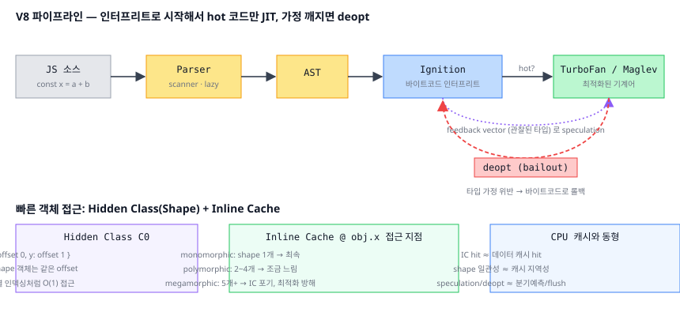
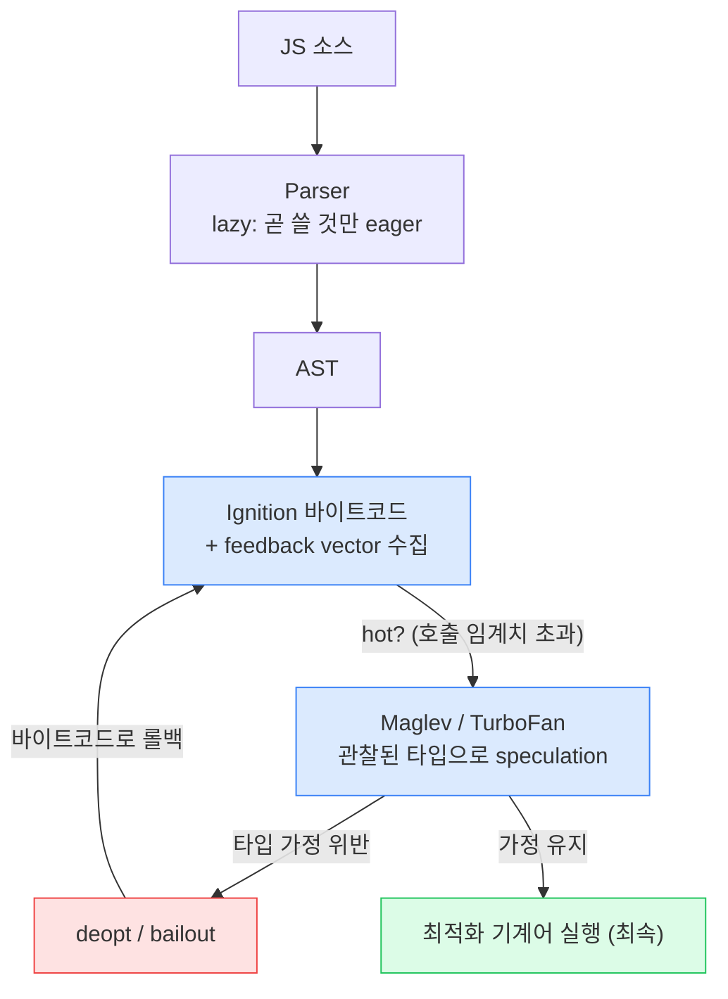

# 01. V8 파이프라인 (Parser → Ignition → TurboFan)

> **핵심 질문:** 내가 쓴 `const x = a + b` 한 줄은 CPU가 실행하기까지 어떤 단계를 거치며, 왜 **같은 코드가 두 번째부터 빨라지는가?**

## TL;DR

V8은 JS를 (1) **파서**로 토큰화해 AST를 만들고, (2) **Ignition** 인터프리터가 바이트코드로 컴파일해 즉시 실행하며, (3) 자주 도는 hot 코드만 **TurboFan/Maglev** JIT이 관찰된 타입을 근거로 기계어로 최적화한다. 타입 가정이 깨지면 **deopt**으로 바이트코드로 되돌아간다. **Hidden class(shape)** 와 **inline cache**가 "객체 속성 접근"을 배열 인덱싱만큼 빠르게 만드는 핵심 장치다.

---

## 원자 분해 (Atomic Decomposition)

```
JS 한 줄이 실행되기까지
├─ 소스 → 실행 준비
│  ├─ 파싱 (scanner/tokenizer, lazy vs eager)
│  ├─ AST (추상 구문 트리)
│  └─ 바이트코드 (Ignition이 생성)
├─ 실행 & 최적화
│  ├─ 인터프리트 (Ignition, feedback 수집)
│  ├─ 프로파일링 (feedback vector = 관찰된 타입)
│  ├─ JIT 컴파일 (Maglev 중간 tier → TurboFan 최상위)
│  └─ deopt (가정 위반 시 롤백)
└─ 빠른 객체 모델
   ├─ Hidden Class / Shape (Map)
   └─ Inline Cache (mono/poly/megamorphic)
```



---

## 본문

### 원자 1 — 파서: 안 쓸 코드는 지금 파싱하지 않는다

브라우저가 받은 것은 그냥 텍스트다. **스캐너**가 문자열을 토큰(`const`, `x`, `=`, ...)으로 쪼개고, 파서가 문법 트리(AST)를 만든다. 문제는 큰 번들 전체를 파싱하면 느리다는 것.

그래서 V8은 **lazy parsing(지연 파싱)** 을 한다. 함수 본문은 처음엔 **pre-parser**가 문법 오류·변수 범위만 훑고 넘어가고, 실제로 그 함수가 **호출될 때** 비로소 완전히(eager) 파싱한다.

> 핵심 직관: **"곧 실행될 코드"만 비싸게 처리한다.** 라이브러리에 export만 해놓고 안 쓰는 함수 100개는 pre-parse 비용만 낸다. 즉시 실행 함수(IIFE)나 `(function(){...})()` 패턴은 "지금 쓴다"는 신호라 eager로 처리된다.

### 원자 2 — AST → 바이트코드: 왜 기계어를 바로 안 만드나

Ignition은 AST를 **바이트코드**로 컴파일한다. 기계어를 바로 만들지 않는 이유:

- **메모리**: 최적화된 기계어는 바이트코드보다 훨씬 크다. 대부분 코드는 몇 번 안 돈다 → 기계어로 만들면 낭비.
- **시작 지연**: 컴파일이 느리면 첫 화면이 늦어진다. 바이트코드는 빨리 만든다.

Ignition은 레지스터 기반 가상 머신이다. 한 번 만든 바이트코드는 그대로 인터프리트하며 실행한다.

### 원자 3 — feedback vector: 실행하면서 타입을 훔쳐본다

Ignition은 그냥 실행만 하지 않는다. `a + b`를 실행할 때마다 "a와 b가 무슨 타입이었나"를 **feedback vector**에 기록한다. 정수만 들어왔는가? 문자열이 섞였는가? 객체는 무슨 shape였는가?

이 관찰 데이터가 JIT의 재료다. JIT은 미래를 이 관찰로 **추측(speculate)** 한다.

### 원자 4 — TurboFan JIT: hot 코드를 추측 기반으로 최적화

같은 함수가 임계치를 넘게 호출되면(hot) V8은 그 함수를 **최적화 컴파일러**로 넘긴다. 현대 V8은 tier가 여러 개다:

| Tier | 이름 | 특징 |
|------|------|------|
| 0 | Ignition | 바이트코드 인터프리트, 시작이 빠름 |
| 1 | Sparkplug | 바이트코드 → 단순 기계어 (최적화 X, 빠른 컴파일) |
| 2 | Maglev | 중간 최적화 (2023~), feedback 활용 |
| 3 | TurboFan | 최상위 최적화, 공격적 speculation |

TurboFan은 "이 함수의 `a`, `b`는 늘 정수였다"는 관찰을 근거로, 타입 체크·박싱·다형성 처리를 **다 생략한 기계어**를 만든다. 정수 덧셈 하나면 `add` 명령 한 방이다.

### 원자 5 — deopt: 추측이 틀리면 되돌린다

TurboFan은 "늘 정수였다"고 **가정**했을 뿐이다. 어느 날 `a`에 문자열이 들어오면 그 기계어는 틀린 코드다. 이때 **deoptimization(bailout)** 이 일어난다: 최적화 코드를 버리고 Ignition 바이트코드로 실행을 되돌린다.

```js
function add(a, b) { return a + b; }
for (let i = 0; i < 100000; i++) add(1, 2);   // 정수만 → TurboFan 최적화
add('x', 'y');   // 문자열! → deopt → 바이트코드로 롤백
```

한 번의 deopt은 괜찮다. 문제는 **deopt loop**: 최적화 → 위반 → deopt → 다시 hot → 최적화 → 또 위반... 무한 왕복하면 최적화 이득이 사라진다.

### 원자 6 — Hidden Class(Shape): 객체를 배열처럼 빠르게

JS 객체는 원리상 해시맵(문자열 키 → 값)이다. 매번 해시 조회하면 느리다. V8은 같은 "모양"의 객체들이 레이아웃을 공유하도록 **hidden class**(내부적으로 Map, 다른 엔진은 Shape/Structure)를 만든다.

```js
function Point(x, y) { this.x = x; this.y = y; }
const a = new Point(1, 2);   // hidden class C0: {x:offset 0, y:offset 1}
const b = new Point(3, 4);   // 같은 C0 공유
```

`a.x`는 해시 조회가 아니라 "offset 0에서 읽어라"는 고정 위치 접근이 된다. 프로퍼티를 **추가할 때마다 새 hidden class로 전이(transition)** 한다.

```
{} ──add x──▶ C1{x} ──add y──▶ C2{x,y}     ← 이 경로를 탄 객체는 C2 공유 (빠름)
{} ──add y──▶ C3{y} ──add x──▶ C4{y,x}     ← 다른 경로 = 다른 shape (IC 갈라짐)
```

> 그래서 **프로퍼티 추가 순서가 같아야** 같은 hidden class를 공유한다. `{a, b}`와 `{b, a}`는 다른 shape다. 생성자에서 늘 같은 순서로 초기화하면 모든 인스턴스가 한 transition 경로를 타 IC가 monomorphic으로 유지된다.

### 원자 7 — Inline Cache: 접근 지점마다 캐시

`obj.x`를 읽는 **코드 위치마다** V8은 "지난번 이 자리에서 본 shape와 offset"을 캐싱한다. 이게 **inline cache(IC)** 다.

| IC 상태 | 본 shape 수 | 속도 |
|---------|------------|------|
| monomorphic | 1개 | 최속 (offset 바로 읽기) |
| polymorphic | 2~4개 | 조금 느림 (여러 개 비교) |
| megamorphic | 5개+ | IC 포기, 일반 조회 + 최적화 방해 |

한 함수에 제각각 다른 shape 객체를 밀어넣으면 IC가 megamorphic이 되어 최적화가 무너진다.



---

## 프론트엔드에서 이렇게 만난다

- **객체 shape를 일관되게**: 생성자/팩토리에서 **모든 프로퍼티를 같은 순서로** 초기화하라. 나중에 조건부로 `obj.z = ...`를 붙이면 shape가 갈라진다.
- **`delete`를 피하라**: 프로퍼티 삭제는 hidden class를 깨고 객체를 느린 **dictionary mode**로 떨어뜨린다. `obj.x = undefined`나 새 객체 생성이 낫다.
- **배열은 타입을 섞지 마라**: V8은 배열을 `PACKED_SMI`(정수) → `PACKED_DOUBLE` → `PACKED_ELEMENTS`(객체) 순으로 다룬다. 정수 배열에 `undefined`나 객체를 넣으면 elements kind가 후퇴하고, 중간에 빈 칸(hole)을 만들면 더 느린 `HOLEY_*`가 된다.
- **함수를 monomorphic하게**: 한 유틸 함수에 온갖 타입을 넘기면 IC가 megamorphic이 된다. 뜨거운 경로의 함수는 입력 타입을 좁혀라.
- **미세 최적화에 집착하지 마라**: `try/catch`, `arguments`는 예전엔 최적화를 막았지만 지금은 대부분 해결됐다. 진짜 병목은 대개 shape 안정성과 알고리즘이다.

### DevTools로 직접 관찰

```bash
# Node/d8 에서 바이트코드와 최적화/탈최적화 로그 보기
node --print-bytecode --print-bytecode-filter=add app.js
node --trace-opt --trace-deopt app.js     # 어떤 함수가 최적화/deopt 됐는지
node --allow-natives-syntax app.js         # %OptimizeFunctionOnNextCall / %GetOptimizationStatus
```

Chrome DevTools **Performance 탭**에서 함수 실행을 기록하면 JIT 계층 전환과 "Recompilation"이 보이고, 뜨거운 함수에서 반복되는 deopt은 flame chart에 자잘한 재컴파일로 드러난다.

---

## 이전 계층과의 연결

- **Inline Cache ↔ 1단계 캐시** ([06-cache.md](../../claude/topics/06-cache.md)): IC는 "최근에 본 것을 접근 지점 옆에 캐싱해 재접근을 공짜로 만드는" 장치다. **IC hit = 데이터 캐시 hit**, megamorphic = 캐시 thrashing. 원리가 문자 그대로 같다.
- **Hidden Class ↔ 캐시 지역성**: 같은 shape 객체는 프로퍼티가 고정 offset에 연속 배치된다 → 배열처럼 예측 가능한 접근 → CPU가 **캐시 라인(64B)** 과 프리페처를 100% 활용한다. shape가 제각각이면 포인터 추적이 늘어 캐시 미스가 폭증한다.
- **TurboFan speculation ↔ 투기 실행** ([04-microarchitecture.md](../../claude/topics/04-microarchitecture.md)): JIT의 타입 speculation은 CPU의 branch speculation과 구조가 똑같다. **deopt = branch misprediction의 rollback/flush**. 둘 다 "추측해서 이득 보고, 틀리면 되돌린다".
- **바이트코드 인터프리터 dispatch ↔ 분기 예측** ([03-pipeline.md](../../claude/topics/03-pipeline.md)): 인터프리터의 dispatch 루프는 거대한 간접 분기다. BTB 예측에 의존하며, 이것이 인터프리트가 JIT보다 느린 근본 이유 중 하나다.

---

## 파인만 체크 (10살에게 설명하기)

1. **왜 JS 엔진은 "인터프리터"와 "JIT" 두 개를 다 갖고 있어?** 하나만 쓰면 안 돼? (힌트: 요리를 딱 한 번 할 때와 매일 100번 할 때, 레시피를 대하는 방식이 왜 다른지)
2. **Hidden class가 뭐야?** 왜 `{이름, 나이}`로 만든 카드와 `{나이, 이름}`으로 만든 카드를 컴퓨터는 "다른 종류"로 취급해?
3. **deopt이 뭐야?** "늘 그럴 거라 믿고 빨리 가다가 아니어서 되돌아오는 것"이 CPU가 갈림길에서 하는 일과 뭐가 똑같아?
