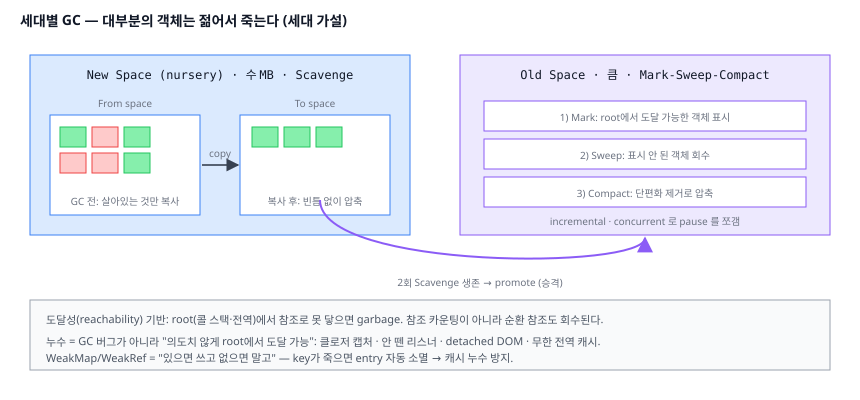
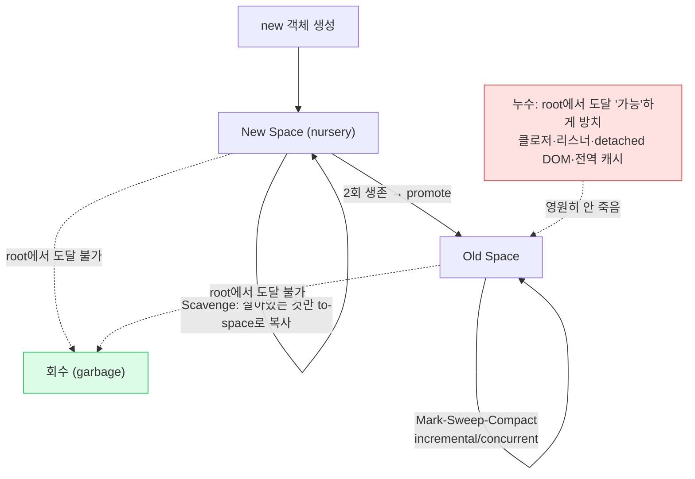

# 02. 메모리와 가비지 컬렉션 (Heap & GC)

> **핵심 질문:** 내가 `new`로 만든 객체는 **언제, 어떻게 메모리에서 사라지는가?** 그리고 왜 어떤 객체는 안 사라져서 메모리 누수가 되는가?

## TL;DR

V8 힙은 짧게 사는 객체용 **new space**(작음, 수 MB)와 오래 사는 **old space**로 나뉜다. "대부분의 객체는 젊어서 죽는다"는 **세대 가설** 덕에, new space는 빠른 **Scavenge**(복사식)로, old space는 **Mark-Sweep-Compact**로 수집한다. GC는 원래 stop-the-world지만 incremental/concurrent로 pause를 잘게 쪼갠다. FE 누수는 GC 버그가 아니라 **의도치 않게 살아있는 참조**(클로저·리스너·detached DOM·전역 캐시) 때문이다. **WeakMap/WeakRef**로 "있으면 쓰고 없으면 마는" 참조를 만든다.

---

## 원자 분해 (Atomic Decomposition)

```
객체는 언제 사라지는가
├─ 힙 구조
│  ├─ new space (nursery, from/to semi-space)
│  ├─ old space (승격된 장수 객체)
│  └─ large object / code / map space
├─ GC 알고리즘
│  ├─ 도달성(reachability) & root set  ← 참조 카운팅 아님
│  ├─ Scavenge (minor GC, Cheney copying)
│  ├─ Mark-Sweep-Compact (major GC)
│  └─ incremental / concurrent / parallel (pause 쪼개기)
├─ 세대 가설 (왜 세대를 나누나)
└─ 누수 & 약한 참조
   ├─ 누수 패턴 (클로저 · 리스너 · detached DOM · 전역 캐시)
   └─ WeakMap / WeakSet / WeakRef / FinalizationRegistry
```



---

## 본문

### 원자 1 — 도달성: "닿을 수 있으면 산다"

GC는 객체가 "필요한지" 알 수 없다. 대신 **도달 가능한지(reachable)** 를 본다. **root**(현재 콜 스택의 지역 변수, 전역 객체 `window`/`globalThis`)에서 시작해 참조를 따라간다. 닿는 객체는 살리고, **못 닿는 객체는 garbage**로 회수한다.

이것이 **참조 카운팅이 아니라는 점**이 중요하다. 서로만 참조하는 두 객체(순환 참조)는 참조 수가 0이 안 되지만, root에서 못 닿으면 회수된다.

```js
let a = {}; let b = {};
a.ref = b; b.ref = a;   // 순환 참조
a = null; b = null;     // root에서 끊김 → 순환이어도 둘 다 회수 ✅
```

### 원자 2 — 힙 구조: 나이대별 구역

V8 힙은 용도별로 나뉜다.

| 공간 | 용도 | 크기 대략 |
|------|------|-----------|
| **New space** (nursery) | 갓 만든 객체 | 파티션당 ~1–16MB (작음) |
| **Old space** | Scavenge를 2회 살아남아 승격된 객체 | 큼 (수백 MB+) |
| Large object space | 큰 배열/문자열 (복사 비용 회피) | 필요만큼 |
| Code space | JIT이 만든 기계어 | — |

new space는 다시 **from-space / to-space** 두 반쪽(semi-space)으로 나뉜다.

### 원자 3 — Scavenge: 살아있는 것만 옮기고 나머지는 통째로 버린다

new space의 minor GC는 **Cheney 복사 알고리즘**이다.

1. from-space가 꽉 차면 GC 시작.
2. root에서 도달 가능한(살아있는) 객체만 **to-space로 복사**하며 빈틈 없이 압축.
3. from/to 역할을 **스왑**. 옛 from-space는 죽은 객체째 통째로 버린다(포인터만 리셋).

> 핵심 직관: **죽은 객체는 만지지도 않는다.** 비용이 "죽은 것 수"가 아니라 "**살아있는 것 수**"에 비례한다. 젊은 객체는 대부분 죽으니 살아있는 게 적고 → 매우 빠르다(보통 **1ms 미만**). 대신 메모리를 절반만 쓴다(from/to). 작으니 감당 가능한 거래다.

객체가 Scavenge를 **2회** 살아남으면 "이건 오래 살 놈"이라 판단해 old space로 **promote(승격)** 한다.

### 원자 4 — Mark-Sweep-Compact: 늙은 구역은 다르게 청소한다

old space는 크고, 여기 있는 객체는 대부분 살아있다. 복사식은 낭비이므로 **표시-회수-압축**을 쓴다.

1. **Mark**: root에서 도달 가능한 객체를 전부 표시(그래프 순회).
2. **Sweep**: 표시 안 된 영역을 free list에 반납.
3. **Compact**: 단편화가 심하면 살아있는 객체를 한쪽으로 밀어 압축(가끔).

### 원자 5 — 세대 가설: 왜 굳이 나누나

**약한 세대 가설(weak generational hypothesis): "대부분의 객체는 젊어서 죽는다."** 실측으로 참인 경험칙이다. 함수 안 임시 객체, 반복문 중간값, 렌더 프레임마다 만드는 배열... 거의 다 즉시 죽는다.

그래서 갓 태어난 구역만 **자주·작게·빠르게** 청소하면 대부분의 쓰레기를 싼값에 치운다. 늙어서까지 산 소수만 비싼 major GC 대상이 된다. **big-O가 아니라 통계로 최적화**하는 설계다.

### 원자 6 — pause 쪼개기: 멈추면 화면이 언다

순진한 GC는 stop-the-world — 그동안 JS(mutator)가 멈춘다. major GC가 수십 ms 걸리면 프레임을 놓쳐 화면이 버벅인다. V8(Orinoco 프로젝트)의 대응:

- **Incremental marking**: 마킹을 잘게 쪼개 JS 실행 사이사이에 조금씩.
- **Concurrent marking/sweeping**: 별도 헬퍼 스레드가 JS와 **동시에** 마킹.
- **Parallel**: 여러 스레드가 나눠서.

목표는 main-thread **pause를 수 ms 이하**로 유지하는 것. 그래도 GC는 공짜가 아니다 — 프레임 예산(16.6ms, [04](04-rendering-pipeline.md))을 GC가 먹으면 jank가 된다.

### 원자 7 — 누수: GC가 못 치우는 게 아니라 "닿게 놔둔" 것

FE 메모리 누수의 거의 전부는 **의도치 않게 root에서 도달 가능한 상태**다.

```js
// 1) 안 뗀 이벤트 리스너 — listener 클로저가 bigData를 가둔다
const bigData = new Array(1e6).fill(0);
el.addEventListener('click', () => use(bigData));
// el을 지워도 리스너를 remove 안 하면 bigData가 산다

// 2) detached DOM — JS가 떼어낸 노드를 계속 참조
const cache = [];
cache.push(document.getElementById('row'));   // DOM에서 제거돼도 배열이 붙잡음

// 3) 무한 전역 캐시 — 지우는 로직이 없으면 계속 증가
const memo = {};
function f(k, v) { memo[k] = v; }   // 언제 비우나?

// 4) 안 끝낸 타이머 — 콜백이 스코프를 영원히 잡음
setInterval(() => tick(state), 1000);   // clearInterval 안 하면 state 영원히 삼
```

공통점: **참조를 끊어주는 짝(코드)이 없다.** SPA에서 컴포넌트가 몇 번이나 마운트/언마운트되는지 생각하면, 정리 안 된 참조가 쌓여 누수가 된다.

### 원자 8 — 약한 참조: "있으면 쓰고 없으면 말고"

**WeakMap/WeakSet**은 키를 **약하게** 참조한다. 그 키를 가리키는 다른 강한 참조가 사라지면, WeakMap 엔트리는 GC가 자동으로 없앤다. 그래서 **누수 없는 부가 데이터 저장소**로 쓴다(키를 순회할 수 없다는 게 대가).

```js
const meta = new WeakMap();
meta.set(domNode, { clicks: 0 });   // domNode가 사라지면 이 항목도 자동 소멸
```

- **WeakRef**: 객체를 약하게 참조. `ref.deref()`로 접근하되 없으면 `undefined`. 캐시에 유용하나 남용 주의.
- **FinalizationRegistry**: 객체가 회수될 때 정리 콜백. 타이밍이 비결정적이라 "best effort"로만.



---

## 프론트엔드에서 이렇게 만난다

- **정리 코드를 짝으로**: `addEventListener` ↔ `removeEventListener`, `setInterval` ↔ `clearInterval`, `observe` ↔ `disconnect`. React면 `useEffect`의 **cleanup 함수**에서 반드시 해제.
- **detached DOM 누수 사냥**: Memory heap snapshot에서 `Detached`로 필터하면 DOM에서 떨어졌는데 JS가 잡고 있는 노드가 보인다.
- **큰 캐시는 경계를 둬라**: 무한 증가 `Map` 대신 **LRU**나 **WeakMap**(키가 객체일 때). "언제 비우는가"에 답이 있어야 한다.
- **클로저가 무엇을 가두는지 의식**: 이벤트 핸들러가 거대한 배열/DOM을 캡처하면, 핸들러가 사는 한 그것도 산다.
- **GC를 프레임 예산 안에서 생각**: 프레임마다 대량 임시 객체를 만들면 minor GC가 잦아진다. 뜨거운 애니메이션 루프에서는 객체 재사용(object pool)을 고려.

### DevTools로 직접 관찰

- **Memory 탭 → Heap snapshot**: 두 시점 스냅샷을 찍고 "Comparison"으로 **늘어난 객체**를 본다. `Retainers` 트리로 "무엇이 이걸 붙잡고 있나"를 역추적 — 누수 범인이 여기 나온다.
- **Memory 탭 → Allocation instrumentation on timeline**: 시간축으로 할당을 기록해 회수 안 되는(파란 막대로 남는) 할당을 찾는다.
- **Performance 탭**: 기록 중 **Minor GC / Major GC** 이벤트가 막대로 표시된다. 프레임 드롭과 겹치는 major GC가 보이면 pause가 원인.
- Node: `node --trace-gc app.js`로 GC 종류·소요·회수량을 콘솔에 찍는다.

---

## 이전 계층과의 연결

- **Compaction ↔ 캐시 지역성** ([06-cache.md](../../claude/topics/06-cache.md)): 압축은 살아있는 객체를 연속 배치해 단편화를 없앤다. 연속 배치 = **캐시 라인/프리페처 적중** ↑. 단편화된 힙은 포인터가 메모리 곳곳으로 튀어 캐시 미스를 유발한다. GC의 compact는 성능상 캐시 최적화이기도 하다.
- **New/Old space ↔ 메모리 계층** ([05-memory-hierarchy.md](../../claude/topics/05-memory-hierarchy.md)): "자주 쓰는 작은 것은 빠른 곳, 큰 것은 뒤로"라는 계층 원리의 소프트웨어 판. 작은 new space는 CPU 캐시에 상주할 만한 크기라 Scavenge가 더 빠르다.
- **Mark 단계의 포인터 추적 ↔ 캐시 미스/DRAM latency**: 큰 힙을 마킹하는 것은 참조 그래프를 무작위로 순회하는 일 → **DRAM 랜덤 접근(~80–100ns)** 이 지배한다. GC가 느린 진짜 이유는 알고리즘이 아니라 메모리 대기다.
- **Stop-the-world ↔ 2단계 OS 스케줄링** (`../../os/`): GC 스레드가 mutator 스레드를 멈추는 것은 OS의 스레드 조율 위에서 일어난다. concurrent GC는 진짜 멀티코어([08-multicore-coherence.md](../../claude/topics/08-multicore-coherence.md))를 쓴다.

---

## 파인만 체크 (10살에게 설명하기)

1. **왜 컴퓨터는 "젊은 물건"과 "오래된 물건"을 다르게 치워?** (힌트: 책상 위 방금 쓴 메모지 더미와, 책장에 꽂힌 책 — 어느 쪽을 더 자주 훑어서 버려?)
2. **왜 "몇 명이 이 물건을 가리키나"를 세는 대신 "현관에서 손잡고 손잡고 닿을 수 있나"로 판단해?** 서로만 붙잡고 있는 두 물건은 어떻게 돼?
3. **WeakMap이 보통 Map이랑 뭐가 달라?** 왜 "약한(weak)"이라고 불러? 붙잡은 물건이 사라지면 메모가 저절로 없어지는 게 왜 좋아?
