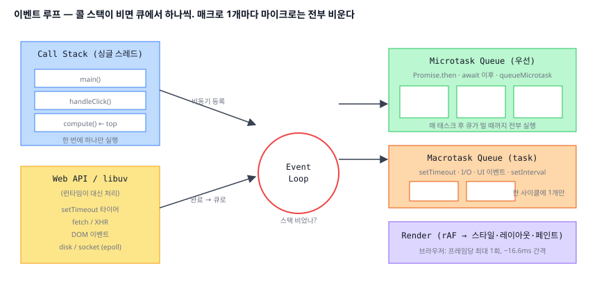
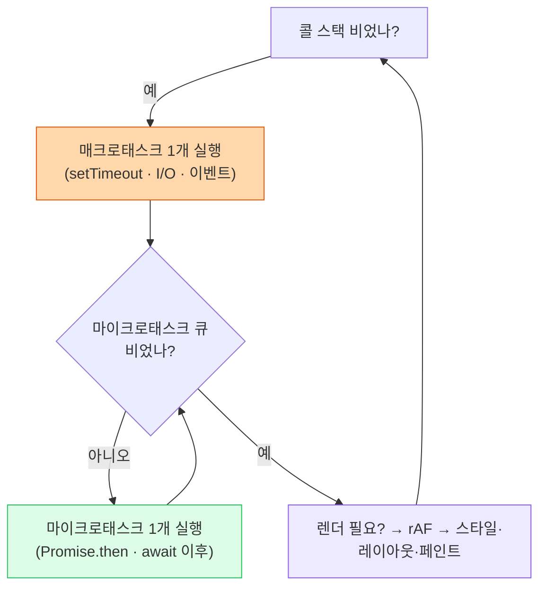

# 03. 이벤트 루프 (Event Loop)

> **핵심 질문:** JS는 싱글 스레드인데 어떻게 setTimeout·fetch·클릭을 "동시에" 처리하는가? 그리고 `await` 다음 줄은 **정확히 언제** 실행되는가?

## TL;DR

JS 실행 자체는 **하나의 콜 스택**(싱글 스레드)이다. 비동기는 런타임(브라우저 Web API / Node libuv)이 대신 처리하고, 완료되면 콜백을 **큐**에 넣는다. 이벤트 루프는 "콜 스택이 비면 큐에서 하나 꺼내 실행"의 반복이다. 단, **매크로태스크 1개를 실행할 때마다 마이크로태스크 큐를 전부 비운다** → Promise/`await` 콜백이 `setTimeout`보다 항상 먼저 실행된다. `requestAnimationFrame`은 렌더링 직전에 별도로 실행된다.

---

## 원자 분해 (Atomic Decomposition)

```
싱글 스레드가 어떻게 동시에 일하나
├─ 실행 컨텍스트
│  ├─ 콜 스택 (한 번에 하나)
│  ├─ 힙 (객체 저장)
│  └─ Web API / libuv (실제 비동기 담당, JS 밖)
├─ 큐 & 우선순위
│  ├─ 매크로태스크 큐 (task: setTimeout, I/O, UI 이벤트)
│  ├─ 마이크로태스크 큐 (job: Promise.then, await, queueMicrotask)
│  └─ 규칙: 태스크 1개 → 마이크로태스크 전부 → (렌더)
├─ 특수 타이밍
│  ├─ requestAnimationFrame (렌더 직전, 프레임당 1회)
│  └─ requestIdleCallback (여유 시간에)
├─ Promise / async-await 의 실제 처리
└─ 런타임 차이 (브라우저 vs Node libuv phases)
```



---

## 본문

### 원자 1 — 콜 스택: 한 번에 하나

JS 엔진은 함수 호출을 **콜 스택**에 쌓고, 위(top)에서부터 실행한다. 이게 싱글 스레드의 의미다 — **동시에 두 줄이 실행되는 일은 없다.** 그래서 무거운 동기 작업(큰 `for`, 동기 `JSON.parse`)은 스택을 오래 점유해 **모든 것을 막는다**(블로킹).

### 원자 2 — Web API/libuv: 비동기를 대신 해주는 손

그럼 `setTimeout`이 도는 3초 동안 스택은 뭘 하나? **아무것도 안 붙잡는다.** `setTimeout(fn, 3000)`은 콜백을 **런타임에게 맡기고 즉시 반환**한다. 타이머를 재는 것도, 네트워크를 기다리는 것도, 디스크를 읽는 것도 JS가 아니라 **런타임(브라우저의 C++ Web API, Node의 libuv)** 이 별도로 한다.

> 핵심 직관: **JS는 싱글 스레드지만 "런타임"은 멀티 스레드다.** JS는 "이거 끝나면 이 콜백 좀 큐에 넣어줘"라고 부탁만 하고 손을 뗀다. 그래서 기다리는 동안 다른 JS가 돌 수 있다.

### 원자 3 — 이벤트 루프: 스택이 비면 큐에서 하나

런타임이 "완료됐다"며 콜백을 큐에 넣어도, 콜 스택이 실행 중이면 못 끼어든다. **이벤트 루프**가 이 조율을 한다:

```
while (true) {
  if (콜 스택이 비었다) {
    task = 매크로태스크 큐에서 하나 꺼냄
    실행(task)                     // 이 안에서 새 마이크로태스크가 쌓일 수 있음
    마이크로태스크 큐가 빌 때까지 전부 실행
    필요하면 렌더링 (rAF → 스타일 → 레이아웃 → 페인트)
  }
}
```

### 원자 4 — 두 큐: 마이크로가 매크로를 이긴다

큐가 하나가 아니라 둘이라는 게 모든 순서 퀴즈의 열쇠다.

| 큐 | 무엇이 들어가나 | 언제 실행 |
|----|----------------|-----------|
| **매크로태스크** (task) | `setTimeout`/`setInterval`, I/O 완료, UI 이벤트, `MessageChannel` | 한 사이클에 **1개** |
| **마이크로태스크** (job) | `Promise.then/catch/finally`, `await` 이후, `queueMicrotask`, `MutationObserver` | 매크로 1개 후 **전부 소진** |

**규칙: 매크로태스크 하나를 실행한 뒤, 마이크로태스크 큐가 완전히 빌 때까지 계속 비운다.** 그래서 Promise 콜백은 언제나 다음 `setTimeout`보다 먼저다.

```js
console.log('1: sync');
setTimeout(() => console.log('4: macro (setTimeout)'), 0);
Promise.resolve().then(() => console.log('3: micro (promise)'));
console.log('2: sync');
// 출력: 1 → 2 → 3 → 4
// 동기 먼저 → 스택 빔 → 마이크로 전부 → 그 다음에야 매크로
```

### 원자 5 — await의 실제 정체

`async/await`는 마법이 아니라 **Promise + 마이크로태스크**의 문법 설탕이다. `await expr`는 함수를 그 지점에서 **일시정지**하고, "expr이 resolve되면 나머지를 이어 실행하라"를 **마이크로태스크로 등록**한 뒤 제어를 돌려준다.

```js
async function f() {
  console.log('A');
  await null;          // 여기서 함수 일시정지, 나머지는 마이크로태스크로
  console.log('C');    // 마이크로태스크로 나중에
}
console.log('start'); f(); console.log('B');
// 출력: start → A → B → C  (await 아래는 동기 코드 다음에)
```

> 즉 `await`는 "여기서 잠깐 멈추고, 지금 큐에 있는 다른 마이크로태스크 뒤에 줄 서겠다"는 뜻이다. 병렬이 아니라 **양보**다.

### 원자 6 — rAF와 idle: 렌더 타이밍에 맞춘 콜백

`requestAnimationFrame(cb)`은 **다음 화면 그리기 직전**에 `cb`를 부른다. 프레임당 **정확히 1회**, 60Hz면 **약 16.6ms 간격**. 그래서 애니메이션은 `setTimeout`이 아니라 rAF로 해야 화면 갱신 리듬과 어긋나지 않는다(렌더 파이프라인은 [04](04-rendering-pipeline.md)).

`requestIdleCallback(cb)`은 프레임에 **남는 시간**이 있을 때 부른다. 급하지 않은 작업(로그 전송, prefetch)을 밀어넣는 용도.

### 원자 7 — 브라우저 vs Node(libuv)

브라우저와 Node는 이벤트 루프의 뼈대는 같지만 세부가 다르다. Node의 libuv는 루프를 **여러 phase**로 돈다:

```
   ┌───────────────────────┐
┌─>│  timers (setTimeout)   │   process.nextTick 큐 + 마이크로태스크 큐는
│  ├───────────────────────┤   ★ 각 phase 사이마다 ★ 비워진다
│  │  pending callbacks     │
│  ├───────────────────────┤
│  │  poll (I/O, ← epoll)   │   여기서 fd들을 대기/수집
│  ├───────────────────────┤
│  │  check (setImmediate)  │
│  ├───────────────────────┤
│  │  close callbacks       │
│  └───────────────────────┘
└──────────< 반복 >
```

- Node엔 `process.nextTick`(마이크로태스크보다도 먼저)과 `setImmediate`(check phase)가 추가로 있다.
- 브라우저는 "매 태스크 후 마이크로태스크 소진 + 필요 시 렌더" 모델이라 rAF/렌더 개념이 1급이다. Node엔 렌더가 없다.



---

## 프론트엔드에서 이렇게 만난다

- **긴 작업이 UI를 얼린다**: 콜 스택을 오래 잡으면 클릭·스크롤·렌더가 전부 대기한다. 50ms를 넘는 **Long Task**가 곧 버벅임이다. 해법: 작업을 청크로 쪼개 `setTimeout`/`MessageChannel`/`scheduler.yield()`로 양보하거나, 통째로 **Web Worker**([05](05-browser-architecture.md))로 옮긴다.
- **마이크로태스크 굶김**: 마이크로태스크가 또 마이크로태스크를 무한히 만들면(재귀 `Promise`) 이벤트 루프가 매크로태스크와 **렌더로 못 넘어간다** → 화면이 영영 안 그려진다. 무거운 반복은 마이크로가 아니라 매크로로 쪼개라.
- **`await` 순서 버그**: `await`를 넣는 순간 그 아래는 다음 마이크로태스크 tick으로 밀린다. "동기라 믿었는데 순서가 뒤집힌" 버그의 단골 원인.
- **INP 최적화**: 사용자 입력→다음 페인트 지연(INP, [06](06-loading-performance.md))은 곧 "이벤트 핸들러가 스택을 얼마나 오래 잡는가 + 큐에서 얼마나 기다렸나"다. 핸들러를 짧게, 무거운 후속 작업은 다음 프레임으로.

### DevTools로 직접 관찰

**Performance 탭**에서 기록하면 **Main 스레드** 트랙에 태스크 단위 flame chart가 그려진다. 50ms를 넘는 태스크는 우상단에 **빨간 삼각형(Long Task)** 으로 표시된다. 태스크 블록을 클릭하면 그 안의 마이크로태스크 소진, rAF 콜백, "Recalculate Style/Layout"이 시간순으로 보인다. 콘솔에서 아래를 실행해 순서를 직접 실험해 보라.

```js
console.log('sync-1');
setTimeout(() => console.log('macro'), 0);
queueMicrotask(() => console.log('micro'));
Promise.resolve().then(() => console.log('promise-micro'));
requestAnimationFrame(() => console.log('raf (렌더 직전)'));
console.log('sync-2');
// sync-1 → sync-2 → micro → promise-micro → (raf) → macro
```

---

## 이전 계층과의 연결

- **이벤트 루프 ↔ 2단계 OS epoll** (`../../os/`): 브라우저와 libuv가 "많은 소켓/타이머를 하나의 루프로 감시하다 준비된 것만 처리"하는 방식은, 커널의 **epoll/kqueue** 다중화 그 자체를 사용한다. libuv의 **poll phase**가 epoll을 호출해 준비된 fd를 수집한다. 이벤트 루프는 커널 이벤트 다중화의 애플리케이션 계층 얼굴이다.
- **Web API 스레드 ↔ 프로세스/스레드** (`../../os/`): JS는 싱글 스레드지만 런타임은 스레드 풀(libuv는 기본 4개)로 blocking I/O를 대신 처리한다. "싱글 스레드로 보이는 동시성"의 진짜 정체는 OS 스레드다.
- **콜백 dispatch ↔ 인터럽트** ([09-io-and-interrupts.md](../../claude/topics/09-io-and-interrupts.md)): I/O 완료를 알리는 커널의 인터럽트/완료 통지가, 위로 올라오면 "콜백을 큐에 넣는" 이벤트가 된다. 하드웨어 인터럽트 → 이벤트 큐잉의 계층 사슬.

---

## 파인만 체크 (10살에게 설명하기)

1. **JS는 한 번에 한 가지 일만 하는데, setTimeout으로 "3초 뒤에 해줘" 하면 그 3초 동안 다른 일을 어떻게 해?** (힌트: 식당에서 주문받은 요리사가 오븐 타이머를 맞춰놓고 손 놓고 기다려? 아니면 다른 주문을 받아?)
2. **`Promise.then`이랑 `setTimeout(0)` 중에 왜 항상 Promise가 먼저 실행돼?** 줄이 두 개 있고, 한 줄이 우대받는다면?
3. **무거운 `for` 반복문이 왜 화면을 얼려버려?** 콜 스택이 "한 번에 하나"라는 것과 무슨 관계야?
