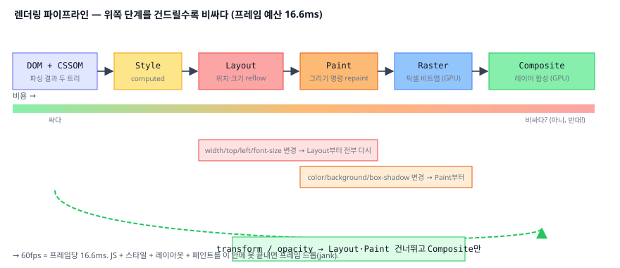

# 04. 렌더링 파이프라인 (Pixel Pipeline)

> **핵심 질문:** `element.style.width = '200px'` 한 줄이 화면 픽셀을 바꾸기까지 브라우저는 어떤 파이프라인을 도는가? 왜 어떤 애니메이션은 부드럽고 어떤 건 버벅이는가?

## TL;DR

픽셀 파이프라인은 **DOM + CSSOM → Style(계산 스타일) → Layout(위치·크기, reflow) → Paint(그리기 명령) → Raster(비트맵) → Composite(레이어 합성)** 이다. **위쪽 단계를 건드릴수록 비싸다.** `transform`/`opacity`는 Layout·Paint를 건너뛰고 컴포지터(GPU)에서만 처리돼 싸다. 60fps는 **프레임당 16.6ms** 예산이고, 이 안에 JS + 스타일 + 레이아웃 + 페인트를 다 끝내야 한다.

---

## 원자 분해 (Atomic Decomposition)

```
JS 한 줄이 픽셀이 되기까지
├─ 트리 구성
│  ├─ DOM (HTML 파싱 결과)
│  ├─ CSSOM (CSS 파싱 결과)
│  └─ Render tree (visible 노드만)
├─ Style  : 셀렉터 매칭 → 노드별 computed style
├─ Layout : geometry 계산 (reflow) — 위치·크기
├─ Paint  : 그리기 명령 생성 (repaint) — 색·테두리·그림자
├─ Raster : 그리기 명령 → 실제 픽셀 비트맵 (GPU)
├─ Composite : 레이어들을 GPU가 합성
├─ 프레임 예산 (16.6ms @ 60fps, rAF와 직결)
└─ 최적화
   ├─ 컴포지터 전용 속성 (transform / opacity)
   ├─ will-change / layer 승격
   └─ layout thrashing (forced synchronous layout)
```



---

## 본문

### 원자 1 — 두 트리: DOM과 CSSOM

파서는 HTML을 **DOM 트리**로, CSS를 **CSSOM 트리**로 만든다. 브라우저는 이 둘을 합쳐 **render tree**를 만드는데, 여기엔 **실제로 보이는 노드만** 들어간다. `display:none`은 render tree에서 빠지고(공간도 안 차지), `visibility:hidden`은 남는다(공간은 차지). `<head>`, `<script>`도 render tree엔 없다.

### 원자 2 — Style: 각 노드의 최종 스타일 확정

셀렉터를 매칭해 각 노드의 **computed style**(실제 적용될 값)을 계산한다. 상속·우선순위·단위 변환을 여기서 해결한다. 셀렉터가 복잡하거나 노드가 많으면 이 단계가 비싸진다("Recalculate Style").

### 원자 3 — Layout(reflow): 어디에, 얼마나 크게

각 노드의 **기하(위치·크기)** 를 계산한다. 뷰포트 최상단부터 박스 모델을 풀어나간다. 핵심은 **연쇄성**이다: 한 요소의 width를 바꾸면 그 형제·자식·때로는 조상까지 다시 계산해야 한다.

```
<body> width 변경
  └─ <main>          ← 재계산
      ├─ <article>   ← 재계산
      │   └─ <p> …   ← 재계산 (텍스트 줄바꿈 다시)
      └─ <aside>     ← 재계산
  한 곳을 건드리면 서브트리 전체가 다시 흐른다 (reflow = "다시 흐름")
```

> Layout을 유발하는 변경: `width/height`, `top/left`, `margin/padding`, `font-size`, 텍스트 내용, DOM 추가/삭제 — **크기와 위치에 관한 모든 것.** 가장 비싼 단계이므로 프레임마다 피해야 한다. 반대로 `color`처럼 기하와 무관한 변경은 Layout을 건너뛴다.

### 원자 4 — Paint(repaint): 무엇을 그릴지 명령으로

레이아웃으로 정해진 박스에 **무엇을 그릴지**를 그리기 명령 목록(디스플레이 리스트/`SkPicture`)으로 만든다. 색, 배경, 테두리, 그림자, 텍스트 글리프... `color`나 `box-shadow`만 바꾸면 Layout은 건너뛰고 **Paint부터** 다시 한다.

### 원자 5 — Raster: 명령을 실제 픽셀로

그리기 명령은 아직 그림이 아니라 "레시피"다. **래스터화**가 이걸 실제 픽셀 비트맵으로 채운다. 현대 브라우저는 화면을 **타일**로 나눠 GPU로 래스터한다. 보이는 영역 근처부터 우선 처리한다.

### 원자 6 — Composite: 레이어를 겹쳐 최종 화면

페이지는 여러 **레이어**로 나뉠 수 있다(포토샵 레이어처럼). **컴포지터**가 각 레이어 비트맵을 올바른 순서·위치로 GPU에서 합성해 최종 프레임을 만든다. 여기서 핵심 이득이 나온다.

```
   레이어 1 (배경)      ┐
   레이어 2 (본문)      ├─→  컴포지터가 z순서·위치대로 GPU에서 겹침 → 최종 프레임
   레이어 3 (모달, transform) ┘
   transform 애니메이션 = 레이어 3의 "합성 위치"만 매 프레임 바꿈 (재페인트 없음)
```

> **`transform`과 `opacity`만 바꾸면** 레이아웃도 페인트도 다시 안 하고, 이미 래스터된 레이어를 **컴포지터가 다른 위치/투명도로 다시 합성**하기만 하면 된다. 그래서 이 둘은 컴포지터 스레드(메인 스레드와 별개, [05](05-browser-architecture.md))에서 처리돼 **JS가 바빠도 부드럽다.**

**무엇이 별도 레이어를 만드나(compositing 승격)**: `will-change: transform/opacity`, 3D transform(`translateZ(0)`, `translate3d`), `<video>`/`<canvas>`, `position: fixed`, 애니메이션 중인 `transform`/`opacity` 등. 레이어는 공짜가 아니다 — 각 레이어는 자기 비트맵을 GPU 메모리에 갖는다. 그래서 **레이어를 너무 많이 만들면(layer explosion)** 메모리와 합성 비용이 되레 늘어 느려진다.

### 원자 7 — 프레임 예산 16.6ms

디스플레이가 60Hz면 초당 60프레임, **프레임 하나에 주어진 시간은 1000/60 ≈ 16.6ms**. 이 안에 그 프레임의 JS(rAF 콜백 포함) + 스타일 + 레이아웃 + 페인트 + 합성을 **다 끝내야** 한다. 넘기면 프레임을 놓쳐(**dropped frame / jank**) 화면이 끊긴다. 120Hz 기기면 예산은 **8.3ms**로 더 빡세다. 실제로 브라우저 내부 처리를 빼면 JS에 쓸 수 있는 건 **약 10ms 남짓**이다.

```mermaid
flowchart LR
  JS["JS / rAF"] --> S["Style<br/>재계산"]
  S --> L["Layout<br/>reflow"]
  L --> P["Paint<br/>repaint"]
  P --> R["Raster"]
  R --> C["Composite"]
  L -. "transform/opacity는 여기로 점프" .-> C
  P -. "" .-> C
  classDef hot fill:#fee2e2,stroke:#ef4444
  classDef cool fill:#dcfce7,stroke:#22c55e
  class L,P hot
  class C cool
```

### 원자 8 — Layout Thrashing: 읽기-쓰기를 번갈아 하지 마라

브라우저는 스타일 변경을 모아뒀다 프레임 끝에 한 번에 레이아웃한다(batching). 그런데 JS가 **레이아웃 결과를 지금 당장 읽으면**(`offsetHeight`, `getBoundingClientRect`, `scrollTop`...), 브라우저는 정확한 값을 주려고 **밀린 레이아웃을 강제로 즉시 실행**한다. 이게 **forced synchronous layout(강제 동기 레이아웃)** 이다.

```js
// ❌ layout thrashing — 읽기와 쓰기를 번갈아 → 매 회 강제 reflow
for (const el of items) {
  el.style.width = box.offsetWidth + 'px';   // write 후 즉시 read → 강제 flush
}

// ✅ 읽기를 모으고 → 쓰기를 모은다 (read/write 분리)
const w = box.offsetWidth;                   // read 한 번
for (const el of items) el.style.width = w + 'px';  // write만
```

> 핵심 직관: 읽기(read)는 "지금까지의 모든 쓰기를 반영한 정답"을 요구하므로, 앞선 쓰기들을 강제로 확정시킨다. read→write→read→write는 매 사이클 reflow를 부른다. **read 몰아서 → write 몰아서**가 원칙(FastDOM 패턴).

강제 동기 레이아웃을 유발하는 **읽기** 속성들(이걸 스타일 변경 직후에 읽으면 위험): `offsetTop/Left/Width/Height`, `clientTop/…`, `scrollTop/Left/Width/Height`, `getBoundingClientRect()`, `getComputedStyle()`, `offsetParent`, `innerText`. 뜨거운 루프에서 이들을 쓰기와 번갈아 호출하지 마라.

❓ **"reflow와 repaint의 차이는?"** reflow(Layout)는 위치·크기를 다시 계산하는 것이고 항상 그 뒤 repaint를 동반한다. repaint(Paint)는 기하는 그대로 두고 픽셀만 다시 칠하는 것(예: `color` 변경)이라 더 싸다. 가장 싼 건 둘 다 건너뛰는 `transform`/`opacity`.

---

### 원자 9 — 속성별 비용표: 무엇이 어디까지 되돌리나

같은 "스타일 변경"이라도 어느 단계부터 다시 하느냐가 비용을 가른다.

| 바꾸는 속성 | 다시 도는 단계 | 비용 |
|-------------|----------------|------|
| `width`, `height`, `top`, `left`, `margin`, `font-size`, `display` | **Layout** → Paint → Composite | 가장 비쌈 |
| `color`, `background`, `box-shadow`, `border-radius`, `visibility` | **Paint** → Composite (Layout 생략) | 중간 |
| `transform`, `opacity`, (컴포지터 레이어의) `filter` | **Composite만** | 가장 쌈 |

> 실전 규칙: 뜨거운 애니메이션(스크롤 연동, 60fps 이동/페이드)은 **Composite-only 속성으로만** 짠다. `left`로 옮기고 싶으면 `transform: translateX()`로, `height`로 접었다 펴고 싶으면 `transform: scaleY()` + `transform-origin`으로 우회한다.

❓ **"브라우저는 왜 스타일 변경을 즉시 반영하지 않고 모아두나?"** 한 프레임 안에서 스타일을 열 번 바꿔도 화면은 한 번만 그려지면 되기 때문이다. 변경을 프레임 끝까지 모았다 **한 번에** 레이아웃/페인트하면 낭비가 없다. `offsetHeight` 같은 동기 읽기가 이 batching을 깨뜨리는 게 layout thrashing의 본질이다.

---

## 프론트엔드에서 이렇게 만난다

- **애니메이션은 `transform`/`opacity`로**: 위치 이동은 `left/top`이 아니라 `transform: translate()`, 크기는 `width` 대신 `transform: scale()`. 페이드는 `opacity`. Layout·Paint를 건너뛰어 컴포지터에서만 돌아 60fps를 지킨다.
- **layout thrashing 제거**: DOM 측정과 변경을 분리하라. 라이브러리(FastDOM) 또는 `requestAnimationFrame` 안에서 read → write 순으로.
- **큰 리스트**: `content-visibility: auto`로 화면 밖 요소의 레이아웃/페인트를 건너뛰거나, 가상 스크롤(virtualization)로 실제 DOM 수를 줄인다.
- **`will-change` 신중히**: `will-change: transform`은 "이 요소를 미리 별도 레이어로 승격해 두라"는 힌트다. 애니메이션 직전에만 켜라 — 남발하면 레이어가 늘어 **GPU 메모리와 합성 비용**이 폭증한다.
- **CSS Containment**: `contain: layout paint`로 한 요소의 레이아웃 영향이 바깥으로 새어나가지 않게 격리해 reflow 범위를 좁힌다.

### DevTools로 직접 관찰

- **Rendering 탭**(Cmd/Ctrl+Shift+P → "Show Rendering"):
  - **Paint flashing**: 다시 칠해지는 영역이 초록색으로 번쩍인다. 불필요한 repaint 사냥에 직방.
  - **Layer borders**: 컴포지터 레이어 경계를 주황 선으로 표시. `transform`/`will-change`가 레이어를 만들었는지 확인.
  - **Frame Rendering Stats**: 실시간 FPS와 GPU 메모리.
- **Performance 탭**: 기록하면 프레임마다 **Recalculate Style / Layout / Paint / Composite Layers** 이벤트가 색색으로 쌓인다. 보라색 Layout이 두꺼우면 reflow 과다. 강제 동기 레이아웃은 **"Forced reflow is a likely performance bottleneck"** 경고로 뜬다.

---

## 이전 계층과의 연결

- **Raster/Composite ↔ SIMD/GPU** ([10-simd-and-vector.md](../../claude/topics/10-simd-and-vector.md)): 픽셀을 채우고 레이어를 합성하는 일은 픽셀마다 같은 연산을 반복하는 **데이터 병렬** 작업이다. 그래서 GPU(수천 개의 SIMD 레인)가 압도적으로 잘한다. 컴포지터가 GPU를 쓰는 이유가 이것이다.
- **레이어 비트맵 ↔ 메모리 대역폭** ([06-cache.md](../../claude/topics/06-cache.md)): 레이어가 크고 많으면 그 비트맵을 VRAM에 담고 매 프레임 읽어야 한다. `will-change` 남발이 느려지는 이유는 **메모리 대역폭 압박**이다. 캐시/대역폭 원리가 그대로 적용된다.
- **프레임 예산 16.6ms ↔ 이벤트 루프 rAF** ([03](03-event-loop.md)): rAF 콜백은 이 파이프라인 **바로 앞**에서 실행된다. rAF에서 무거운 JS를 돌리면 그만큼 파이프라인에 남는 시간이 줄어 프레임을 놓친다.
- **Forced reflow ↔ 파이프라인 flush** ([03-pipeline.md](../../claude/topics/03-pipeline.md)): CPU가 결과를 미리 만들어야 할 때 파이프라인을 flush하듯, `offsetHeight` 읽기는 "지금까지의 쓰기"를 강제로 확정(flush)시킨다. **미리 계산을 강제당하는 비용**이라는 구조가 닮았다.

---

## 파인만 체크 (10살에게 설명하기)

1. **왜 `transform: translateX(100px)`로 옮기면 부드럽고, `left: 100px`로 옮기면 버벅여?** (힌트: 이미 그려둔 스티커를 손으로 밀기 vs. 그림을 지우고 새 위치에 다시 그리기)
2. **"프레임 예산 16.6ms"가 뭐야?** 이걸 넘으면 화면에 무슨 일이 생겨? (힌트: 만화영화가 초당 몇 장으로 만들어지는지)
3. **layout thrashing이 왜 느려?** 자로 재고→옮기고→다시 재고→또 옮기고를 반복하는 것과, 한 번에 다 재고→한 번에 다 옮기는 것의 차이로 설명해봐.
