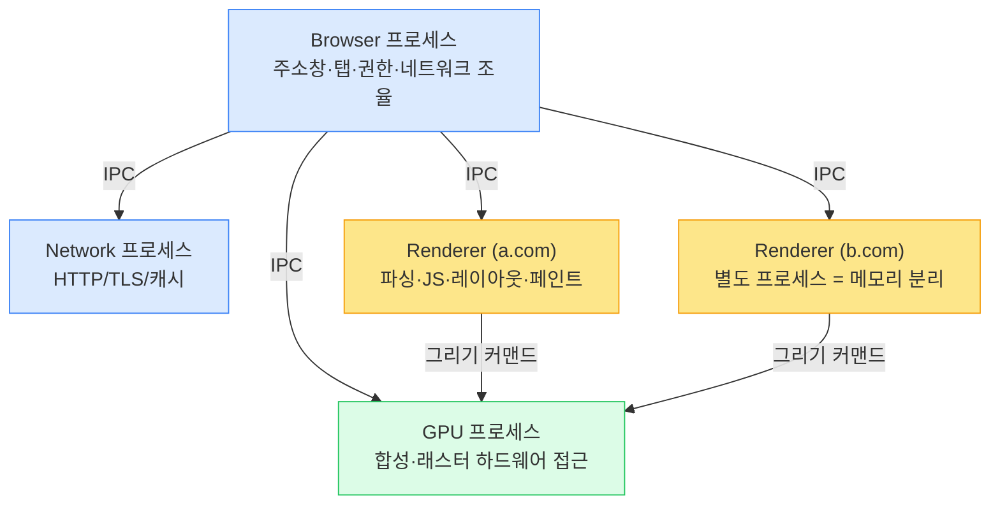

# 05. 브라우저 아키텍처 (Multi-process & Threads)

> **핵심 질문:** 탭 하나가 크래시해도 왜 다른 탭은 멀쩡한가? 그리고 한 웹사이트가 다른 사이트의 메모리를 훔칠 수 없게 브라우저는 어떻게 막는가?

## TL;DR

현대 브라우저는 **멀티프로세스**다: 브라우저(UI·조율) 프로세스 + **사이트별 렌더러** 프로세스 + GPU 프로세스 + 네트워크/유틸리티. 렌더러는 **샌드박스**에 갇혀 OS에 직접 못 닿는다. Spectre 이후 **사이트 격리(Site Isolation)** 로 서로 다른 출처를 다른 프로세스에 배치해 **메모리 자체를 분리**한다. 렌더러 내부는 메인/컴포지터/래스터/워커 스레드로 나뉜다. **Web Worker/SharedArrayBuffer**로 JS도 진짜 병렬로 돈다.

---

## 원자 분해 (Atomic Decomposition)

```
탭 하나가 죽어도 나머지가 사는 구조
├─ 멀티프로세스 모델
│  ├─ 브라우저 프로세스 (주소창·네트워크 조율·권한)
│  ├─ 렌더러 프로세스 (파싱·JS·레이아웃·페인트) ← 사이트별
│  ├─ GPU 프로세스 (합성·그리기)
│  └─ 네트워크/유틸리티 프로세스
├─ 격리 & 보안
│  ├─ 샌드박스 (렌더러는 OS 직접 접근 불가)
│  └─ 사이트 격리 (Spectre 대응: 출처별 프로세스 분리)
├─ 렌더러 내부 스레드
│  ├─ 메인 스레드 (JS · DOM · 스타일 · 레이아웃 · 페인트 명령)
│  ├─ 컴포지터 스레드 (스크롤 · transform 애니메이션)
│  ├─ 래스터 스레드 (타일 비트맵)
│  └─ 워커 스레드 (Web/Service Worker)
└─ JS 병렬성
   ├─ Web Worker (별도 스레드 + 별도 이벤트 루프)
   └─ SharedArrayBuffer + Atomics (공유 메모리)
```

---

## 본문

### 원자 1 — 왜 멀티프로세스인가

옛 브라우저는 한 프로세스에 모든 탭을 담았다. 탭 하나가 크래시하면 **브라우저 전체가 죽었다.** 악성 페이지가 하나 뚫리면 모든 것을 장악했다. 그래서 Chrome은 **프로세스 분리**를 택했다.

| 이득 | 설명 |
|------|------|
| **안정성** | 렌더러 하나가 크래시해도 그 탭만 죽고 브라우저는 산다 |
| **보안** | 렌더러를 샌드박스에 가둬, 뚫려도 피해를 그 프로세스 안에 제한 |
| **반응성** | 무거운 탭이 다른 탭·UI를 얼리지 않음 |

대가는 **메모리**다. 프로세스마다 V8 인스턴스와 런타임을 따로 갖는다. 그래서 Chrome은 기기 사양에 따라 프로세스 수를 조절한다(저사양이면 사이트를 묶기도).

❓ **"멀티프로세스 vs 멀티스레드, 브라우저는 왜 굳이 무거운 프로세스를 골랐나?"** 스레드는 같은 주소 공간을 공유해 가볍지만, 그게 바로 문제다 — 한 스레드가 메모리를 오염시키면 전부 오염되고, Spectre로 서로를 훔쳐볼 수 있다. **프로세스는 주소 공간이 분리**돼 격리가 하드웨어(가상 메모리)로 강제된다. 안정성·보안을 메모리와 맞바꾼 선택이다. 그래서 렌더러 **내부**는 다시 스레드로 잘게 나눈다(격리는 프로세스로, 병렬은 스레드로).

### 원자 2 — 프로세스별 역할



- **브라우저 프로세스**: 주소창·탭·북마크 UI, 권한, 그리고 자식 프로세스들의 조율. 유일하게 신뢰된 프로세스.
- **렌더러 프로세스**: 우리가 앞 문서에서 본 모든 것(HTML/CSS 파싱, V8, 레이아웃, 페인트)이 여기서 일어난다. **가장 위험한 코드(임의의 웹 콘텐츠)를 실행**하므로 가장 강하게 가둔다.
- **GPU 프로세스**: 여러 렌더러의 합성·래스터 요청을 받아 GPU에 접근.
- **네트워크/유틸리티 프로세스**: 네트워크 스택, 오디오, 확장 등.

### 원자 3 — 샌드박스: 렌더러는 손이 묶여 있다

렌더러는 파일 시스템·네트워크·다른 프로세스 메모리에 **직접 접근할 수 없다.** 필요하면 **IPC로 브라우저 프로세스에 요청**한다. 그래서 악성 페이지가 렌더러를 장악(RCE)해도, 샌드박스를 또 뚫지 않는 한 사용자 파일을 훔치거나 OS를 건드릴 수 없다. OS의 권한 축소 기능(seccomp-bpf, job object 등)을 쓴다 → 2단계 OS 계층.

### 원자 4 — 사이트 격리: Spectre를 프로세스 벽으로 막는다

여기가 1단계 하드웨어 보안과 직접 이어지는 대목이다. **Spectre**([12-security-side-channel.md](../../claude/topics/12-security-side-channel.md))는 CPU의 투기 실행을 악용해 **같은 주소 공간 안의** 임의 메모리를 캐시 사이드채널로 읽는다. 소프트웨어 경계(같은 프로세스 안의 JS 샌드박스)로는 못 막는다 — 하드웨어가 경계를 무시하니까.

브라우저의 답은 근본적이다: **cross-origin 데이터를 애초에 그 렌더러의 주소 공간에 두지 않는다.** `a.com`과 `b.com`을 **다른 프로세스**에 배치하면(사이트 격리), `a.com`의 코드는 Spectre로 읽을 `b.com` 데이터가 **메모리에 아예 없다.**

> 핵심 직관: 하드웨어 수준 누출(Spectre)은 소프트웨어 경계로 못 막으니, **더 굵은 하드웨어 경계(별도 프로세스 = 별도 가상 주소 공간)** 로 방어한다. iframe도 cross-origin이면 별도 프로세스로 뽑는다(out-of-process iframe). 이것이 사이트 격리다.

### 원자 5 — 렌더러 내부 스레드

렌더러 하나도 싱글 스레드가 아니다.

| 스레드 | 하는 일 |
|--------|---------|
| **메인** | JS 실행, DOM, 스타일 계산, 레이아웃, 페인트 명령 생성 (이벤트 루프가 여기 산다) |
| **컴포지터** | 스크롤과 `transform`/`opacity` 애니메이션을 **메인 없이** 처리 |
| **래스터** | 그리기 명령을 타일 비트맵으로 (GPU와 협력) |
| **워커** | Web Worker, Service Worker |

> **컴포지터 스레드가 메인과 분리된 이유**: 메인 스레드가 무거운 JS로 꽉 차 있어도, 이미 레이어로 분리된 요소의 스크롤과 `transform` 애니메이션은 **컴포지터 스레드가 독립적으로 계속** 굴린다. 그래서 JS가 버벅여도 스크롤은 부드럽다. ([04](04-rendering-pipeline.md)에서 `transform`이 싼 이유의 진짜 배경.)

### 원자 6 — Web Worker와 공유 메모리

JS 메인 스레드는 하나뿐이라 무거운 계산은 UI를 얼린다([03](03-event-loop.md)). **Web Worker**는 별도 OS 스레드에서 **별도 이벤트 루프**로 JS를 돌린다.

- DOM 접근 불가(DOM은 메인 스레드 전용). `postMessage`로 통신하며, 데이터는 기본적으로 **구조화 복제(structured clone)** 로 복사된다.
- 큰 버퍼는 **transferable**(소유권 이전, 복사 없음)로 넘긴다.
- **SharedArrayBuffer + Atomics**: 여러 스레드가 **같은 메모리**를 진짜로 공유한다(복사 없음). 단 Spectre 위험 때문에 한때 비활성화됐다가, **COOP/COEP 헤더로 cross-origin isolation**을 켠 페이지에서만 다시 허용된다.

```js
// main.js — 무거운 계산을 워커로 넘겨 메인 스레드를 비운다
const worker = new Worker('heavy.js');
worker.postMessage({ rows: bigMatrix });          // 구조화 복제로 전달
worker.onmessage = (e) => render(e.data.result);  // 결과는 콜백(= 큐 → 이벤트 루프)

// heavy.js (워커: DOM 없음, 별도 이벤트 루프)
onmessage = (e) => {
  const result = compute(e.data.rows);            // UI를 얼리지 않고 별도 스레드에서
  postMessage({ result });                        // transfer로 넘기면 복사도 생략
};
```

> 워커의 결과가 `onmessage` **콜백**으로 돌아온다는 점에 주목하라 — 워커는 별도 스레드지만, 메인 입장에선 결국 이벤트 루프([03](03-event-loop.md)) 큐에 실려 오는 또 하나의 비동기 소스다.


---

## 프론트엔드에서 이렇게 만난다

- **무거운 계산은 Worker로**: 대용량 파싱·이미지 처리·암호화는 메인 스레드에서 빼내 Web Worker로. INP/프레임률이 살아난다.
- **SharedArrayBuffer를 쓰려면 헤더부터**: `Cross-Origin-Opener-Policy: same-origin` + `Cross-Origin-Embedder-Policy: require-corp`로 cross-origin isolation을 켜야 `SharedArrayBuffer`와 정밀 타이머가 열린다. WASM 스레드도 이게 전제.
- **컴포지터에 얹어 부드럽게**: 스크롤 연동 애니메이션을 `transform`/`opacity`로 짜면 메인 스레드 부하와 무관하게 컴포지터가 굴린다.
- **프로세스 수 = 메모리**: 사이트 격리로 iframe·탭이 많으면 프로세스가 늘어 메모리를 먹는다. 모바일에서 특히 체감. 서드파티 iframe 남발을 경계.

### DevTools로 직접 관찰

- **Chrome Task Manager** (`Shift+Esc` 또는 메뉴 → More Tools → Task Manager): 탭·확장·GPU·유틸리티가 **각각 다른 프로세스**로 뜨고, 프로세스별 메모리·CPU·GPU 메모리를 볼 수 있다. cross-origin iframe이 별도 프로세스로 분리되는 것도 확인 가능.
- **`chrome://process-internals`**: 사이트 격리 상태와 프레임-프로세스 매핑.
- **Performance 탭**: 기록하면 **Main / Compositor / Raster / GPU** 등 스레드별 트랙이 나뉘어 보인다. 메인이 꽉 찼는데 컴포지터가 스크롤을 계속 처리하는 장면을 눈으로 확인할 수 있다.

---

## 이전 계층과의 연결

- **사이트 격리 ↔ Spectre** ([12-security-side-channel.md](../../claude/topics/12-security-side-channel.md)): 1단계에서 배운 투기 실행 사이드채널(Spectre)은 같은 주소 공간을 읽는다. 브라우저는 이를 **프로세스 경계(별도 가상 주소 공간)** 라는 더 굵은 벽으로 막는다. 하드웨어 취약점을 소프트웨어 격리 정책으로 상쇄하는 대표 사례.
- **프로세스·스레드·샌드박스 ↔ 2단계 OS** (`../../os/`): 프로세스 격리는 곧 **가상 메모리 주소 공간 분리**([07-virtual-memory.md](../../claude/topics/07-virtual-memory.md))다. 스레드 스케줄링·IPC·seccomp 권한 축소가 전부 OS 기능. 브라우저는 OS 위에 지은 작은 운영체제다.
- **컴포지터/래스터/워커 스레드 ↔ 멀티코어** ([08-multicore-coherence.md](../../claude/topics/08-multicore-coherence.md)): 이 스레드들이 진짜 병렬로 도는 건 멀티코어 하드웨어 덕이다. SharedArrayBuffer의 `Atomics`는 8장의 메모리 모델·배리어 위에서 정확히 동작한다.
- **IPC ↔ 인터럽트/시스템 콜** ([09-io-and-interrupts.md](../../claude/topics/09-io-and-interrupts.md)): 렌더러가 브라우저에 파일/네트워크를 요청하는 IPC는 결국 커널을 경유하는 프로세스 간 통신이다.

---

## 파인만 체크 (10살에게 설명하기)

1. **왜 브라우저는 탭마다 "다른 프로그램"을 띄워?** 한 프로그램으로 다 하면 뭐가 위험해? (힌트: 방을 하나로 트는 것 vs. 방마다 벽을 세우는 것)
2. **사이트 격리가 Spectre를 어떻게 막아?** "옆방에서 벽 두드려 소리로 엿듣는" 도둑이 있다면, 애초에 훔칠 물건을 그 옆방에 두지 않는 게 왜 답이야?
3. **컴포지터 스레드가 따로 있어서 좋은 점은?** 메인 요리사가 주문이 밀려 정신없을 때도, 다른 직원이 손님 스크롤(자리 안내)을 계속 해주면 뭐가 좋아?
