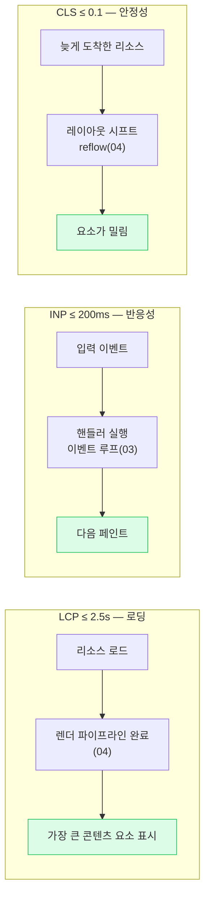

# 06. 로딩과 성능 (Loading & Core Web Vitals)

> **핵심 질문:** URL을 치고 콘텐츠가 뜨기까지, 왜 어떤 사이트는 즉시 뜨고 어떤 건 하얀 화면이 오래가는가? 그리고 내 `<script>` 태그 하나가 그걸 어떻게 좌우하는가?

## TL;DR

HTML 파서는 위→아래로 DOM을 만들다가 `<script>`(async/defer 없는)를 만나면 **멈춘다**(파서 블로킹). CSS는 **렌더**를 막는다. **프리로드 스캐너**가 파서와 별개로 리소스를 미리 긁어온다. **크리티컬 렌더링 패스**를 짧게 하는 것이 첫 화면 속도의 핵심이다. **Core Web Vitals**(LCP·INP·CLS)는 이 내부 동작을 사용자 체감으로 옮긴 지표다. **하이드레이션**은 SSR로 그린 HTML에 JS 이벤트를 다시 붙이는 비용이다.

---

## 원자 분해 (Atomic Decomposition)

```
URL → 화면 콘텐츠, 무엇이 늦추나
├─ HTML 파싱
│  ├─ 파서 블로킹 (script)
│  ├─ 렌더 블로킹 (CSS)
│  ├─ defer / async / type=module
│  └─ 프리로드 스캐너 (lookahead 파서)
├─ 크리티컬 렌더링 패스 (첫 픽셀까지의 최소 경로)
├─ 리소스 우선순위 (preload / prefetch / preconnect / fetchpriority)
├─ Core Web Vitals
│  ├─ LCP (로딩)   ≤ 2.5s
│  ├─ INP (반응성) ≤ 200ms
│  └─ CLS (안정성) ≤ 0.1
└─ 렌더링 전략 & 하이드레이션 (CSR / SSR / SSG, hydration 비용)
```

---

## 본문

### 원자 1 — 파서 블로킹: script가 파싱을 멈춘다

HTML 파서는 문서를 위에서 아래로 읽으며 DOM을 **스트리밍**으로 만든다. 그러다 `<script>`(속성 없는)를 만나면 **파싱을 멈추고** 스크립트를 다운로드·실행한 뒤에야 재개한다.

왜? 스크립트가 `document.write`나 DOM 조작을 할 수 있어서, 그 결과를 모른 채 파서가 앞서갈 수 없기 때문이다. 그래서 `<head>`에 그냥 넣은 큰 스크립트는 **DOM 구성 자체를 막아** 하얀 화면을 늘린다.

```
없는 <script>:   [HTML 파싱 ██]→[⛔ script 다운로드 ████][script 실행 █]→[HTML 파싱 재개 ██]
                                      ↑ 이 구간 내내 DOM 구성 정지 = 하얀 화면
defer <script>:  [HTML 파싱 ████████████████████]→[DOM 완성][defer script 실행 █]
                  [script 다운로드 ████] (파싱과 병렬)
```

### 원자 2 — defer / async / module

이 블로킹을 푸는 속성이 있다.

| 속성 | 다운로드 | 실행 시점 | 순서 보장 | 용도 |
|------|----------|-----------|-----------|------|
| (없음) | 즉시, **파싱 중단** | 다운로드 직후 즉시 | 순서대로 | 피해야 할 기본값 |
| `async` | 파싱과 병렬 | **도착 즉시**(파싱 중단) | ❌ 없음 | 독립적 서드파티(애널리틱스) |
| `defer` | 파싱과 병렬 | **DOM 완성 후**, `DOMContentLoaded` 직전 | ✅ 순서대로 | 앱 스크립트 기본 |
| `type="module"` | 파싱과 병렬 | 기본 defer처럼 | ✅ | ES 모듈 |

> 실무 기본값: **앱 코드는 `defer`, 순서·DOM과 무관한 서드파티는 `async`.** `defer`는 다운로드는 미리 하되 실행은 DOM 완성 뒤로 미뤄, 파싱을 막지 않으면서 순서도 지킨다.

### 원자 3 — CSS는 렌더를 막는다

CSS는 파서를 (대개) 막지 않지만 **렌더를 막는다**. CSSOM이 완성되기 전에 그리면 스타일 없는 날것이 번쩍(FOUC)이므로, 브라우저는 **CSSOM이 준비될 때까지 첫 페인트를 미룬다**. 게다가 `<script>`는 자기 앞의 CSSOM이 준비돼야 실행될 수 있다(스크립트가 스타일을 읽을 수 있으니). 그래서 큰 CSS는 **렌더 블로킹 리소스**다 — critical CSS만 인라인하고 나머지는 뒤로 미루는 이유.

❓ **"CSS는 파서를 안 막는데 왜 성능에 치명적인가?"** DOM 구성(파싱)은 계속되지만 **첫 페인트가 CSSOM 완성까지 대기**하기 때문이다. 사용자 눈엔 파싱이 됐든 안 됐든 "하얀 화면"으로 똑같다. 게다가 뒤따르는 스크립트 실행까지 지연시키므로 크리티컬 렌더링 패스 전체가 CSS에 발목 잡힌다. 미디어 쿼리(`media="print"`)로 당장 불필요한 CSS는 non-blocking으로 뺄 수 있다.

### 원자 4 — 프리로드 스캐너: 막힌 파서를 앞질러 긁는다

메인 파서가 `<script>`에서 멈춰 있으면, 그 아래의 이미지·CSS·폰트는 언제 받나? 여기서 **프리로드 스캐너**(lookahead 파서)가 등장한다. 메인 파서와 **별개로** 원시 HTML을 미리 훑어 `src`/`href`를 발견하는 즉시 다운로드를 **선행 시작**한다.

> 핵심 직관: 요리사(메인 파서)가 한 재료를 손질하느라 멈춰 있어도, 보조(프리로드 스캐너)가 미리 장을 봐 온다. 그래서 **네트워크가 놀지 않는다.** 단, 스캐너는 정적 HTML만 본다 — JS가 런타임에 만든 ``나 동적 import는 못 본다(그래서 LCP 이미지는 정적 태그나 `<link rel=preload>`로 노출해야 한다).

### 원자 5 — 크리티컬 렌더링 패스와 리소스 힌트

**크리티컬 렌더링 패스**는 "HTML 받기 → 첫 의미 있는 픽셀"까지의 최소 경로다. 이걸 짧게 하는 게 초기 로딩 최적화의 전부다: 렌더 블로킹 CSS 최소화(critical CSS 인라인), JS `defer`, 필요한 것 먼저.

**리소스 힌트**로 브라우저에 우선순위를 알려준다.

| 힌트 | 의미 |
|------|------|
| `<link rel=preconnect>` | 이 출처에 곧 붙을 거야 → DNS·TCP·TLS를 미리 |
| `<link rel=preload>` | 이 리소스 지금 곧 필요해 → 높은 우선순위로 당장 |
| `<link rel=prefetch>` | 다음 페이지에서 쓸 거야 → 여유 있을 때 |
| `fetchpriority="high"` | 이 요청 우선순위를 올려 (LCP 이미지 등) |

### 원자 6 — Core Web Vitals를 내부 동작으로 설명

CWV는 마케팅 숫자가 아니라 **앞 문서에서 배운 내부 동작의 사용자 체감 지표**다.



- **LCP (Largest Contentful Paint)**: 화면에서 가장 큰 콘텐츠(주로 히어로 이미지/제목)가 그려지는 시각. 내부적으론 **그 리소스의 네트워크 로드 + 렌더 파이프라인([04](04-rendering-pipeline.md)) 완료**다. 개선: LCP 이미지 `preload` + `fetchpriority=high`, 렌더 블로킹 제거.
- **INP (Interaction to Next Paint)**: 사용자 입력→다음 페인트까지 지연. 곧 **이벤트 루프에서 큐 대기 + 핸들러가 스택을 잡은 시간 + 렌더**([03](03-event-loop.md))다. 개선: 긴 태스크 쪼개기, 핸들러 경량화, 무거운 계산은 Worker로.
- **CLS (Cumulative Layout Shift)**: 예상 못 한 레이아웃 이동의 누적. 이미지/광고/폰트가 **늦게 도착해 뒤늦게 reflow**([04](04-rendering-pipeline.md))가 일어나 이미 읽던 요소를 밀어낸다. 개선: 이미지·비디오에 `width/height` 명시, 폰트 `font-display`, 광고 자리 예약.

### 원자 7 — 하이드레이션: 보이는데 안 눌리는 순간

렌더링 전략은 트레이드오프다.

| 전략 | HTML을 누가/언제 그리나 | 첫 화면(LCP) | 상호작용(INP/TTI) |
|------|------------------------|--------------|-------------------|
| **CSR** | 클라이언트가 런타임에 | 느림 (JS 실행 후) | 하이드레이션 없음 |
| **SSR** | 서버가 요청마다 | 빠름 | 하이드레이션 비용 |
| **SSG** | 빌드 타임에 미리 | 가장 빠름(정적) | 하이드레이션 비용 |
| **ISR/streaming** | 서버, 점진 전송 | 빠름(스트리밍) | 부분 하이드레이션 |

- **CSR**: 빈 HTML + 큰 JS 번들 → JS가 다 실행돼야 화면이 뜬다. LCP 늦음.
- **SSR/SSG**: 서버가 HTML을 미리 그려 보낸다 → **FCP/LCP가 빠르다.** 하지만 그 HTML은 "죽은 그림"이다. 버튼을 눌러도 반응 안 한다.

살아나려면 클라이언트가 **같은 JS를 다운로드→파싱→실행([01](01-v8-pipeline.md))**하고 DOM에 **이벤트 리스너를 다시 붙여야** 한다. 이 과정이 **하이드레이션(hydration)** 이다. 그 사이 화면은 **보이지만 안 눌리는** 구간(uncanny valley)이 생긴다.

```
SSR 타임라인:
[서버 렌더 HTML 전송]→[브라우저: HTML 그림 (FCP/LCP 빠름 ✅)]
                          └─[JS 다운로드]→[파싱·실행]→[리스너 부착 = 상호작용 가능]
                             ↑───────── 이 구간: 보이지만 안 눌림 (INP 나쁨) ─────────┘
```

> 하이드레이션은 공짜가 아니다 — 서버가 이미 한 렌더 작업을 클라이언트가 **한 번 더** 한다. 큰 앱일수록 이 JS 실행이 INP와 TTI를 갉아먹는다. 대응: **islands 아키텍처**(상호작용 필요한 조각만 hydrate), **부분/점진(progressive) 하이드레이션**, **React Server Components**(클라이언트로 안 보내는 컴포넌트), lazy hydration.

---

## 프론트엔드에서 이렇게 만난다

- **script는 `defer`가 기본, 서드파티는 `async`**. `<head>`의 blocking 스크립트를 걷어내는 것만으로 하얀 화면이 짧아진다.
- **critical CSS 인라인 + 나머지 지연 로드**. 렌더 블로킹 CSS를 줄여 첫 픽셀을 당긴다.
- **이미지에 `width`/`height` (또는 `aspect-ratio`)** 를 반드시 지정해 CLS를 막는다.
- **LCP 요소를 최우선으로**: 히어로 이미지 `preload` + `fetchpriority=high`, lazy-load 금지.
- **INP는 이벤트 루프 문제([03](03-event-loop.md))**: 핸들러를 짧게, 무거운 후속은 `scheduler.yield()`나 다음 프레임으로, 계산은 Worker로.
- **하이드레이션 비용 줄이기**: 번들 코드 스플리팅, islands/RSC로 클라이언트 JS 총량 자체를 줄인다.

### DevTools로 직접 관찰

- **Network 탭 워터폴**: 각 리소스의 **Priority**, 큐 대기/연결/다운로드 구간을 막대로 본다. 렌더 블로킹 리소스와 프리로드 스캐너가 당겨온 요청이 보인다. "Highest/High/Low" 우선순위 열을 확인.
- **Performance 탭 / Performance Insights**: 타임라인에서 **FCP · LCP · Layout Shift** 마커가 찍힌다. LCP 마커를 클릭하면 어떤 요소·요청이 LCP인지, CLS 마커는 어떤 요소가 밀렸는지 짚어준다.
- **Lighthouse**: LCP/INP/CLS 점수와 개선 항목(렌더 블로킹 리소스, 미사용 JS 등)을 자동 진단.
- **Coverage 탭**: 로드된 CSS/JS 중 **실제로 쓰인 비율**을 보여줘 죽은 코드를 찾는다.
- 실사용자 측정: `web-vitals` 라이브러리나 `PerformanceObserver`로 실제 방문자의 CWV를 수집(랩 데이터 ≠ 필드 데이터).

---

## 이전 계층과의 연결

- **preconnect / 프리로드 스캐너 ↔ 3단계 네트워크** (`../../network/`): `preconnect`는 **DNS 조회 + TCP 핸드셰이크 + TLS 협상의 RTT를 미리** 치른다. HTTP/2·HTTP/3의 멀티플렉싱·우선순위·0-RTT가 여기서 로딩 속도를 좌우한다. 프리로드 스캐너가 하는 일의 절반은 네트워크 왕복(RTT)을 겹쳐 숨기는 것.
- **INP ↔ 이벤트 루프** ([03](03-event-loop.md)): 상호작용 지연은 큐에서 기다린 시간 + 긴 태스크가 스택을 잡은 시간이다. 이벤트 루프를 이해해야 INP를 고친다.
- **CLS/LCP ↔ 렌더 파이프라인** ([04](04-rendering-pipeline.md)): 시프트는 늦은 reflow, LCP는 파이프라인 완료 시점. 둘 다 4장 파이프라인의 사용자 체감판이다.
- **하이드레이션 ↔ V8 파이프라인** ([01](01-v8-pipeline.md)): 하이드레이션 비용의 실체는 JS **파싱·컴파일·실행**이다. 번들이 클수록 파서·Ignition·TurboFan이 더 오래 일한다.
- **파서 블로킹 대기 ↔ 2단계 I/O 대기** (`../../os/`): 스크립트를 네트워크에서 받는 동안 파서가 멈추는 것은, 결국 커널 소켓 I/O를 기다리는 것이다.

---

## 파인만 체크 (10살에게 설명하기)

1. **`<script>`를 그냥 넣는 것과 `defer`를 붙이는 것의 차이는?** (힌트: 책을 읽다가 심부름 쪽지를 만나면, 지금 당장 심부름을 다녀와서 마저 읽기 vs. 쪽지만 챙겨두고 책을 다 읽은 뒤 다녀오기)
2. **프리로드 스캐너가 왜 필요해?** 요리사 한 명이 재료 손질에 멈춰 있을 때, 보조가 미리 장을 봐 오면 뭐가 좋아?
3. **하이드레이션이 뭐야?** 서버가 이미 예쁜 그림(화면)을 보냈는데, 왜 버튼이 잠깐 안 눌려? 그림에 "생명(이벤트)"을 불어넣는 데 시간이 걸린다면?
