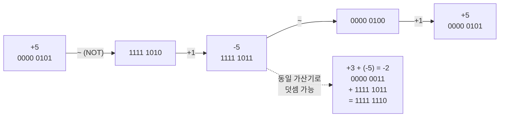
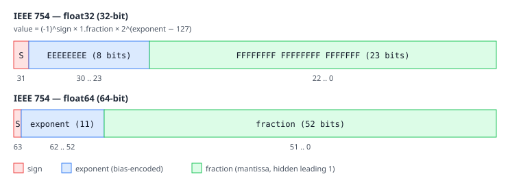
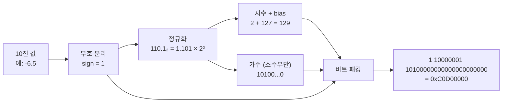
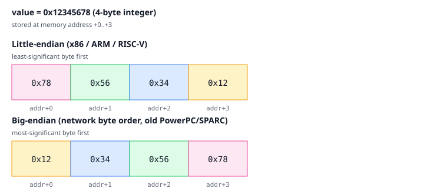

# 01. 수 표현 (Number Representation)

## TL;DR

컴퓨터는 모든 데이터를 **비트(bit)**로 표현한다. 부호 있는 정수는 **2의 보수(two's complement)**, 실수는 **IEEE 754 부동소수점**, 멀티바이트 데이터의 저장 순서는 **엔디안(endianness)**으로 결정된다. 정밀도 손실, 오버플로, 부호 비교 함정이 모두 여기서 출발한다.

---

## 기초 (면접/CS)

### 진법

- **2진수**: `0b` 접두 (`0b1010 = 10`)
- **16진수**: `0x` 접두 (`0xFF = 255`). 1자리 = 4비트(니블) → 비트 패턴을 보기 좋게 표현하기 위해 거의 모든 로우레벨 코드에서 사용.
- 8비트 = 1바이트. `KiB=1024`, `KB=1000` (구분 모호하나 실무에선 보통 1024 사용).

### 부호 있는 정수: 2의 보수

8비트 정수에서 `-5`를 표현하는 법:
1. `+5 = 0000 0101`
2. 비트 반전: `1111 1010`
3. +1: `1111 1011` ← 이것이 `-5`



**8-bit 표현 범위 시각화**
```
부호 없음:  0 ─────────────── 255
부호 있음:        -128 ──── 0 ──── 127
                    ↑              ↑
              INT_MIN(절댓값        INT_MAX
              표현 불가!)
```

특징:
- **0은 하나뿐** (부호-크기 표현은 +0/-0 두 개 → 비교 복잡 → 2의 보수가 이김)
- **덧셈/뺄셈 회로가 동일** — 부호와 무관하게 같은 가산기 사용
- N비트 표현 범위: `[-2^(N-1), 2^(N-1)-1]` → 8bit는 `[-128, 127]`로 음수가 1 더 많음
- **`INT_MIN`의 절댓값은 표현 불가** (`-(-128) = 128`은 8bit overflow)

### 부동소수점: IEEE 754

`float` (32bit) = `[부호 1] [지수 8] [가수 23]`
`double` (64bit) = `[부호 1] [지수 11] [가수 52]`

값 = `(-1)^sign × 1.가수 × 2^(지수-bias)` (정규화된 경우)



**float 예: `1.0`의 비트 표현**
```
sign=0  exp=01111111(=127, bias 적용 시 0)  fraction=0...0
        ↓
0 01111111 00000000000000000000000   →  0x3F800000

값 = (-1)^0 × 1.0 × 2^0 = 1.0
```



핵심 함정:
- **`0.1 + 0.2 != 0.3`** — 0.1을 2진수로 정확히 표현 불가
- **부동소수점 비교는 `==` 대신 `abs(a-b) < epsilon`**
- 특수값: `+0`/`-0`, `±Inf`, `NaN` (NaN은 자기 자신과도 같지 않음)
- **subnormal/denormal**: 0 근처에서 정밀도가 줄어드는 영역. 일부 CPU에서 매우 느려짐 → SIMD에서는 보통 FTZ/DAZ 플래그로 0 처리.

### 엔디안 (Endianness)

`0x12345678` (4바이트)을 메모리에 저장할 때:
```
주소:        +0    +1    +2    +3
Little-end:  78    56    34    12     ← x86, ARM(기본), RISC-V
Big-endian:  12    34    56    78     ← 네트워크 바이트 오더, 옛 PowerPC/SPARC
```



확인 코드:
```c
uint16_t x = 1;
char *p = (char*)&x;
// little-endian: p[0]==1, p[1]==0
// big-endian:    p[0]==0, p[1]==1
```

❓ **면접: "왜 네트워크는 빅 엔디안인가?"** 1970년대 IBM/SPARC 시대 표준이 그대로 RFC 791에 박힌 역사적 이유. `htons`/`ntohl` 같은 변환 함수가 그래서 필요.

---

## 심화 (마이크로아키텍쳐)

### 부호 확장 (sign extension)

8bit `-5 (0xFB)`를 32bit로 확장:
- 부호 있는 확장: `0xFFFFFFFB` (상위 비트에 부호 비트 복제)
- 부호 없는 확장 (zero-extend): `0x000000FB`

x86의 `movsx` vs `movzx`. 잘못 쓰면 음수가 양수가 되는 버그 발생.

### 정수 연산의 하드웨어 구현

- **가산기**: ripple-carry → carry-lookahead → carry-select (지연 vs 면적 트레이드오프)
- **곱셈**: Booth's algorithm, Wallace tree → 3 cycle 정도
- **나눗셈**: 가장 비싼 정수 연산. ~10-40 cycle. **컴파일러는 상수 나눗셈을 곱셈+시프트로 변환** (`x / 10` → `(x * 0xCCCC...) >> 35` 같은 매직 넘버).

### 부동소수점 유닛 (FPU) 동작

- `mul`/`add`는 보통 4~5 cycle, 파이프라인되어 throughput 1/cycle
- `div`/`sqrt`는 비파이프라인, 10~30 cycle. 알고리즘 상 반복 연산이 들어가서.
- **FMA (Fused Multiply-Add)**: `a*b + c`를 한 번에. 정밀도도 더 좋고 (한 번만 반올림) 속도도 2배. ARMv8, x86 (Haswell+)에서 지원.

### Apple Silicon / 최신 칩

- M 시리즈는 정수/부동소수점 유닛이 8개씩 → 같은 사이클에 수많은 연산이 동시에 발사됨.
- ARM은 `FPCR` 레지스터로 NaN, denormal 처리 모드 제어.

---

## 실무 성능 관점

### 1. signed overflow는 UB (C/C++)

```c
int i;
for (i = 0; i <= INT_MAX; i++) { ... }  // 무한 루프! 컴파일러가 i+1>i를 항상 참으로 가정
```
→ 반복 변수는 `size_t` 또는 `int`만 쓰되 범위를 신중히. **unsigned overflow는 정의됨** (modulo 2^N).

### 2. 부동소수점 비교의 함정

```c
if (a == b) ...                         // 위험
if (fabs(a - b) < 1e-9) ...             // 절대 오차
if (fabs(a - b) <= eps * fmax(|a|,|b|)) // 상대 오차 — 큰 수에서 안전
```

### 3. 부동소수점은 결합법칙 성립 X

`(a + b) + c != a + (b + c)` (큰 값과 작은 값을 더하면 작은 값이 흡수됨)
→ 컴파일러는 `-ffast-math`가 없으면 부동소수점 식 순서를 바꾸지 못함 → **자동 벡터화가 깨지는 흔한 원인**.

### 4. denormal 함정

오디오/물리 시뮬레이션에서 값이 점점 0에 수렴하면 denormal 영역에 들어가 **갑자기 100배 느려짐**. 해결:
```c
_MM_SET_DENORMALS_ZERO_MODE(_MM_DENORMALS_ZERO_ON);
_MM_SET_FLUSH_ZERO_MODE(_MM_FLUSH_ZERO_ON);
```

### 5. 비트 연산 트릭

```c
x & (x - 1)   // 가장 낮은 set bit 제거 → popcount 구현에 사용
x & -x        // 가장 낮은 set bit만 추출
__builtin_popcount(x)  // 1 비트 개수 (Intel POPCNT 한 번에 처리)
__builtin_clz(x)       // leading zero count → 로그/MSB 위치
```

### 6. 엔디안과 직렬화

네트워크/파일 포맷 다룰 때 `htonl/ntohl` 또는 `__builtin_bswap32` 사용. **memcpy로 raw struct를 그대로 보내면 다른 아키텍쳐에서 깨진다.**

---

## 파인만 체크 (10살에게 설명하기)

1. **왜 컴퓨터는 뺄셈기를 따로 안 만들고 덧셈기 하나로 음수까지 다 계산해?** `-5`를 왜 하필 "`+5`를 뒤집고(1111 1010) 1을 더한(1111 1011)" 모양으로 정했어? (힌트: 이렇게 만들면 `3 + (-5)`가 그냥 평범한 덧셈이 되는지 직접 자릿수를 더해보기)
2. **왜 `0.1 + 0.2`를 시키면 `0.3`이 아니라 `0.30000...4` 같은 이상한 값이 나와?** (힌트: 10진수로 `1/3`을 적으면 `0.333...`으로 안 끝나는 것처럼, 2진수로는 `0.1`이 딱 떨어지지 않는다는 점)
3. **`0x12345678`을 메모리에 넣을 때 왜 어떤 컴퓨터는 뒤에서부터 `78 56 34 12` 순으로 거꾸로 저장해?** (힌트: 1의 자리(낮은 자리)를 낮은 주소에 두면 계산기가 아래 자리부터 더해 나갈 때 편하다는 점 — 엔디안)

---

## 추가 학습 키워드

- Booth multiplier, Wallace tree, Goldschmidt division
- Kahan summation, compensated summation
- bfloat16, FP8, mixed precision (ML 가속)
- Saturation arithmetic, rounding modes (RN, RZ, RD, RU)
- Posit numbers (대안 부동소수점)
