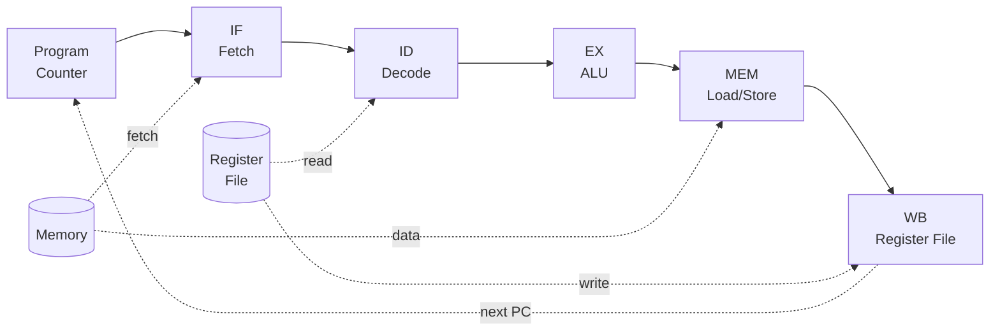
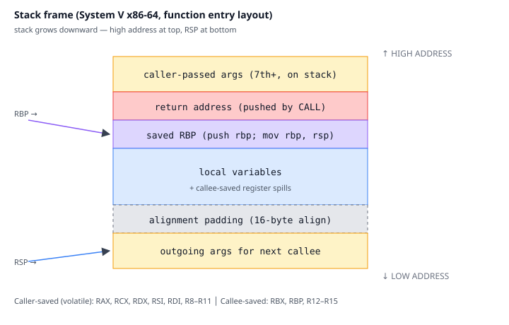

# 02. ISA & CPU 기본 (Instruction Set Architecture)

## TL;DR

**ISA**는 하드웨어와 소프트웨어 사이의 계약이다. 명령어 종류, 레지스터, 주소 지정 방식, 메모리 모델을 정의한다. **RISC**(고정 길이, 단순 명령, load/store 분리)와 **CISC**(가변 길이, 복합 명령) 두 진영이 있고, 현대 CPU는 **폰 노이만 구조**(명령과 데이터가 같은 메모리)에서 **명령어 사이클**(Fetch–Decode–Execute–Memory–Writeback)을 반복한다.

---

## 기초 (면접/CS)

### 폰 노이만 vs 하버드

| | 폰 노이만 | 하버드 |
|---|----------|--------|
| 명령/데이터 메모리 | 통합 | 분리 |
| 장점 | 유연 (코드 수정 가능) | 동시 fetch 가능 |
| 사용처 | 일반 PC/서버 | DSP, 마이크로컨트롤러 |
| 현실 | L1만 분리(I$/D$), 메인 메모리는 통합 → "modified Harvard" | |

> 현대 CPU는 사실상 modified Harvard: L1 명령어 캐시(I-cache)와 데이터 캐시(D-cache)는 분리, 그 아래는 통합.

### 명령어 사이클 (5단계 기준)

```
1. IF  (Instruction Fetch)   PC가 가리키는 명령 읽기
2. ID  (Instruction Decode)  명령 해독, 레지스터 읽기
3. EX  (Execute)             ALU 연산
4. MEM (Memory Access)       load/store
5. WB  (Write Back)          결과를 레지스터에 기록
```



**CPU 블록 다이어그램 (개념도)**
```
                     ┌──────────────────────────────────┐
   ┌──────────┐      │             CPU Core              │
   │  Memory  │◄────►│  ┌────────────────────────────┐   │
   │   /L1$   │      │  │  Front-end                 │   │
   └──────────┘      │  │  Fetch → Decode → Rename   │   │
                     │  └────────────┬───────────────┘   │
                     │               ▼                   │
                     │  ┌────────────────────────────┐   │
                     │  │  Back-end (OoO)            │   │
                     │  │  Scheduler ─► EX (ALU/FPU) │   │
                     │  │              ─► LSU        │   │
                     │  └────────────┬───────────────┘   │
                     │               ▼                   │
                     │  ┌────────────────────────────┐   │
                     │  │  Retire (in-order, ROB)    │   │
                     │  │  → Architectural Reg File  │   │
                     │  └────────────────────────────┘   │
                     └──────────────────────────────────┘
```

### RISC vs CISC

| | RISC (ARM, RISC-V, MIPS) | CISC (x86, x86-64) |
|---|--------------------------|---------------------|
| 명령 길이 | 고정 (4 byte) | 가변 (1~15 byte) |
| 명령 수 | 적음 (~100) | 많음 (~1000) |
| 메모리 접근 | load/store만 | 임의 명령에서 가능 |
| 디코딩 | 단순 | 복잡 (마이크로옵으로 분해) |

> **현실은 수렴**: x86도 내부적으로 명령을 **μops(마이크로옵)**로 분해해 RISC-like 코어에서 실행. ARM도 명령을 점점 추가.

### 레지스터

- **범용 레지스터(GPR)**: x86-64는 16개(RAX, RBX, ..., R15), ARMv8은 31개(X0~X30) + zero register
- **특수 레지스터**: PC(IP), SP(스택 포인터), 플래그 레지스터(EFLAGS/CPSR)
- **벡터 레지스터**: SSE(XMM0~15, 128bit), AVX(YMM, 256bit), AVX-512(ZMM, 512bit), ARM NEON(V0~V31, 128bit)

### 주소 지정 방식 (Addressing Modes)

```asm
mov rax, 5            ; immediate
mov rax, rbx          ; register
mov rax, [rbx]        ; register indirect
mov rax, [rbx+8]      ; base + displacement
mov rax, [rbx+rcx*4]  ; base + index*scale (배열 접근)
mov rax, [rip+label]  ; PC-relative (PIC 코드)
```

❓ **면접: "x86은 왜 이렇게 복잡한가?"** 1978년 8086부터의 하위 호환성을 30년 이상 유지한 결과. 내부 마이크로아키텍쳐는 RISC-like, 디코더가 호환성 레이어 역할.

---

## 심화 (마이크로아키텍쳐)

### x86-64 명령 디코딩

x86 명령은 가변 길이(1~15 byte). 디코딩 자체가 비싼 작업이라:
1. **L1 I-cache + 디코딩 → μop 캐시(DSB)**: Intel은 ~1500개 μop 캐시. 작은 루프는 디코더를 우회 → 전력/지연 절감.
2. **Loop Stream Detector(LSD)**: 작은 루프는 μop 큐에서 그대로 재실행.

### 콜링 컨벤션 (Calling Convention)

함수 호출 시 어느 레지스터에 인자를 넣고 누가 저장하는가에 대한 약속. **ABI의 일부**.

| | System V (Linux/macOS x86-64) | Windows x64 | ARM64 (AAPCS) |
|---|------------------------------|-------------|---------------|
| 정수 인자 | RDI, RSI, RDX, RCX, R8, R9 | RCX, RDX, R8, R9 | X0~X7 |
| 부동소수 | XMM0~7 | XMM0~3 | V0~V7 |
| 반환값 | RAX | RAX | X0 |
| Caller-saved | RAX, RCX, RDX, RSI, RDI, R8-R11 | RAX, RCX, RDX, R8-R11 | X0-X18 |
| Callee-saved | RBX, RBP, R12-R15 | RBX, RBP, RDI, RSI, R12-R15 | X19-X28 |

### 스택 프레임

```
높은 주소
+----------------+
| 인자 (스택 전달)|
+----------------+
| 리턴 주소       |  <- call이 push
+----------------+
| 이전 RBP        |  <- 함수 진입 시 push rbp; mov rbp, rsp
+----------------+
| 로컬 변수       |
+----------------+
| 정렬 패딩       |  <- ABI는 보통 16-byte align 요구
+----------------+
낮은 주소         <- RSP
```



```mermaid
sequenceDiagram
  autonumber
  participant Caller
  participant Stack
  participant Callee
  Caller->>Stack: 인자 → RDI/RSI/...  (7+는 push)
  Caller->>Stack: CALL → push return addr
  Callee->>Stack: push rbp; mov rbp, rsp
  Callee->>Stack: sub rsp, N  (locals 공간)
  Note over Callee,Stack: 함수 본문 실행<br/>callee-saved 보존
  Callee->>Stack: leave (mov rsp, rbp; pop rbp)
  Callee->>Caller: RET → pop return addr
```

### Privilege Level (Ring)

- x86: Ring 0(커널) ~ Ring 3(유저). Ring 1/2는 거의 사용 안 됨.
- ARM: EL0(유저) ~ EL3(시큐어 모니터, TrustZone)
- 시스템 콜은 `syscall`/`svc` 명령으로 권한 전환 → 매우 비싼 동작 (수백 cycle).

### Apple Silicon / ARMv8 특이점

- **명령 길이 고정 4 byte** → 디코더 8-wide 가능 (M1은 8-wide, x86은 보통 4-wide)
- **레지스터 31개 + 큰 ROB(630+)** → 더 많은 명령을 동시에 inflight 유지
- **TSO 모드 지원**: x86 코드를 빠르게 에뮬레이션(Rosetta 2)하기 위한 강한 메모리 순서 모드

---

## 실무 성능 관점

### 1. 함수 호출은 공짜가 아니다

- 호출/리턴: 보통 ~5 cycle
- caller-saved 레지스터 spill/restore: 스택 접근 비용
- inline 가능한 작은 함수는 컴파일러가 inline → 호출 비용 + 인접 코드 최적화 기회 동시 확보
- `__attribute__((always_inline))`, `inline`, link-time optimization(LTO) 활용

### 2. 시스템 콜은 매우 비싸다

- syscall 한 번 ~200~1000 cycle (커널 진입/exit, TLB 일부 무효화 등)
- io_uring, vDSO(`gettimeofday`), epoll 같은 최적화는 모두 syscall 횟수 줄이기 위한 것
- **사용자 공간 락(예: futex)**도 contention 없을 땐 syscall 없이 동작

### 3. ABI 호환성 함정

- 다른 컴파일러로 빌드된 라이브러리 링크 시 calling convention/구조체 정렬 mismatch → 실리콘이 실제 실행하다 잘못된 데이터 읽음
- C++의 name mangling, vtable layout은 ABI마다 다름 → **C ABI**가 사실상 만국공통어

### 4. PC-relative 주소 지정과 PIC

- ASLR(주소 공간 무작위화)을 위해 공유 라이브러리는 **Position Independent Code**로 컴파일
- x86-64는 RIP-relative 주소 지정으로 PIC가 거의 공짜
- 32bit 시절에는 GOT/PLT를 거쳐야 해서 비용이 컸음

### 5. 레지스터 부족(register pressure)

- x86-64는 16개로 빡빡 → 컴파일러가 스택에 spill → 캐시 접근 발생
- **이게 ARM이나 RISC-V가 32개 GPR을 둔 이유**
- 핫 루프에서는 변수 수를 줄이거나 함수를 잘게 쪼개 register pressure 완화

---

## 추가 학습 키워드

- ABI (Application Binary Interface), System V AMD64 ABI, AAPCS64
- micro-ops fusion, macro-op fusion
- DSB (Decoded Stream Buffer), uop cache
- vDSO, syscall, sysenter, svc
- ARMv9, SVE2 (Scalable Vector Extension)
- RISC-V extensions: RVV, B, M, F, D
