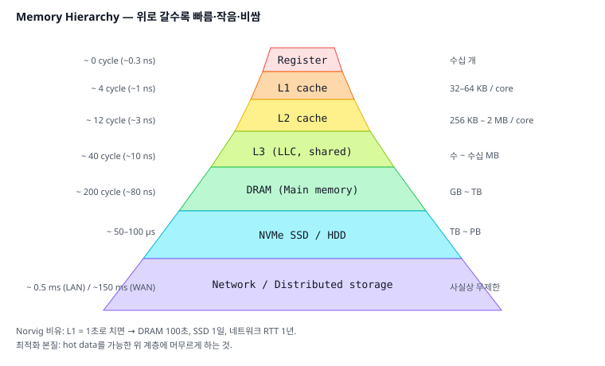
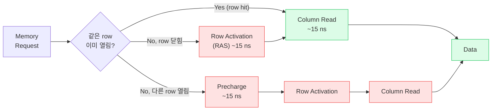

# 05. 메모리 계층 (Memory Hierarchy)

## TL;DR

빠른 메모리는 비싸고 작고, 느린 메모리는 싸고 크다. 그 사이의 차이를 **계층 구조**(레지스터 → L1 → L2 → L3 → DRAM → SSD → 네트워크)로 메우고, 작동 원리는 **지역성(locality)** — 시간 지역성과 공간 지역성에 의존한다. 한 단계 내려갈 때마다 지연시간이 **약 한 자릿수씩 증가**하므로, 모든 성능 최적화의 본질은 "데이터를 가능한 한 위 계층에 머무르게 하는 것"이다.

---

## 기초 (면접/CS)



### 메모리 계층 비교 (현대 데스크탑 기준)

| 계층 | 지연 | 용량 | 비고 |
|------|------|------|------|
| 레지스터 | 0 cycle | ~수십 개 | CPU 안에 직접 |
| L1 캐시 | ~4 cycle (~1ns) | 32~64 KB | 코어 전용, I/D 분리 |
| L2 캐시 | ~12 cycle (~3ns) | 256 KB ~ 2 MB | 코어 전용 |
| L3 캐시 (LLC) | ~40 cycle (~10ns) | 수 ~ 수십 MB | 코어 간 공유 |
| DRAM | ~200 cycle (~80~100ns) | GB ~ TB | 메인 메모리 |
| NVMe SSD | ~10~100 µs | TB | 영구 저장 |
| HDD | ~5~10 ms | TB | 회전 디스크 |
| 네트워크 (LAN) | ~0.5 ms | — | 같은 데이터센터 |
| 네트워크 (대륙간) | ~150 ms | — | RTT |

> **체감 비유** (Norvig의 latency numbers): L1을 1초로 친다면, DRAM은 100초, SSD는 1일, 네트워크 RTT는 1년.

### 왜 계층이 필요한가

- 빠른 메모리(SRAM)는 비트당 트랜지스터 6개 → 비싸고 면적 큼
- DRAM은 트랜지스터 1개 + 캐패시터 → 싸고 밀도 ↑, 하지만 refresh 필요 + 느림
- 모두를 SRAM으로 만들면 가격/면적/전력 폭발

### 지역성 (Locality)

#### 시간 지역성 (Temporal locality)
방금 접근한 데이터를 곧 다시 접근할 가능성 ↑ → 캐시에 보관.

#### 공간 지역성 (Spatial locality)
어떤 주소를 접근하면 인접 주소도 접근할 가능성 ↑ → **캐시 라인(64 byte)** 단위로 가져옴.

```c
// 좋은 지역성
for (i = 0; i < N; i++) sum += a[i];

// 나쁜 지역성 (stride가 큼)
for (i = 0; i < N; i++) sum += a[i * 1024];
```

❓ **면접: "캐시는 왜 64 byte 단위인가?"** DRAM burst 길이, 버스 폭, 공간 지역성과 메타데이터 오버헤드의 절충. 과거에는 32 byte, 향후 128 byte로 늘 수도.

---

## 심화 (마이크로아키텍쳐)

### DRAM의 동작

```
DIMM → Rank → Bank → Row → Column
```



1. **Row Activation (RAS)**: row 전체를 row buffer로 복사 (~15 ns)
2. **Column Read (CAS)**: row buffer에서 원하는 column 읽기 (~15 ns)
3. **Precharge**: 다른 row 접근 전 row 닫기 (~15 ns)

→ **같은 row 연속 접근**(row hit)은 빠르고, **다른 row 접근**(row miss)은 RAS+Precharge 비용.

#### Bank Parallelism
DRAM은 보통 8~16 bank가 병렬. **다른 bank 동시 접근 가능** → 메모리 컨트롤러가 요청을 재정렬.

#### DDR vs LPDDR vs HBM
- DDR4/5: 일반 PC/서버, ~30~50 GB/s
- LPDDR: 모바일/노트북, 전력 효율
- HBM: GPU/HPC, 수천 GB/s, but 작은 용량

### Memory Controller

CPU 내부에 통합 (옛날엔 노스브리지). 주요 일:
- Read/Write 큐, 우선순위 결정
- Open page policy: row를 열어둘지 즉시 닫을지
- Refresh 스케줄링 (~7.8 µs마다, 모든 row를 64 ms 안에)
- ECC: SECDED(Single Error Correct, Double Error Detect)

### 대역폭 vs 지연시간

- DRAM **지연**: 수십 년간 거의 안 줄어듦 (~50~100 ns)
- DRAM **대역폭**: 매년 빠르게 증가 (DDR5는 50+ GB/s, HBM은 1+ TB/s)
- → "지연은 지수보다 느리게, 대역폭은 지수로" = Patterson's wall

### Memory-Level Parallelism (MLP)

OoO + 큰 LSU + non-blocking cache 덕에 동시에 여러 메모리 요청 inflight 유지 가능. Skylake는 MSHR(Miss Status Handling Register) ~10개 → 동시 outstanding miss 10개. 이게 늘어날수록 latency를 throughput으로 가림.

### Apple Silicon의 unified memory

- CPU/GPU/Neural Engine이 **물리 RAM과 같은 풀 공유**
- GPU↔CPU 데이터 복사 없음 → ML/그래픽에 큰 이점
- LPDDR 사용 → 전력당 대역폭 우수

---

## 실무 성능 관점

### 1. Working Set Size 인지

알고리즘이 다루는 hot data가:
- < L1 (32 KB): 매우 빠름
- < L2 (수백 KB): 빠름
- < L3 (수 MB): 보통
- > L3: DRAM bound — **알고리즘 자체를 캐시 친화적으로 바꿔야 함**

→ 핫 데이터 구조의 크기를 측정하고, L1/L2에 맞게 chunking 하는 게 cache-blocking의 본질.

### 2. AoS vs SoA

**캐시 라인 활용도 (한 라인 = 64 byte) 시각화**
```
AoS — struct Particle {x,y,z,vx,vy,vz,m} (28 byte)
   라인 1: [x0 y0 z0 vx0 vy0 vz0 m0  x1 y1 z1 ...]
            ▓▓                   ← x만 쓸 때 해치 채워진 부분만 유효
                                    나머지 ~75% 캐시 낭비

SoA — float x[N]; float y[N]; ...
   라인 1: [x0 x1 x2 x3 x4 x5 x6 x7 x8 x9 x10 x11 ...]
            ▓▓▓▓▓▓▓▓▓▓▓▓▓▓▓▓▓▓▓▓▓▓▓▓▓▓▓▓▓▓▓▓▓▓▓▓▓
                                    100% 활용 → SIMD에도 친화적
```


```c
// Array of Structs - 모든 필드 같이 적재 → 안 쓰는 필드도 캐시 잡아먹음
struct Particle { float x, y, z, vx, vy, vz, mass; } p[N];
for (i=0; i<N; i++) sum += p[i].x;   // y,z,vx,...도 같이 적재됨

// Struct of Arrays - 필요한 필드만 적재
struct { float x[N], y[N], z[N], ...; } p;
for (i=0; i<N; i++) sum += p.x[i];   // x만 dense하게 stream
```
SoA가 SIMD에도 친화적. 게임 엔진의 ECS 패턴이 SoA의 발전형.

### 3. Sequential vs Random 접근

```c
// Sequential — DRAM 대역폭 거의 다 활용 (~30 GB/s)
for (i = 0; i < N; i++) sum += a[i];

// Random pointer chasing — 매 접근마다 DRAM latency
for (i = 0; i < N; i++) p = p->next;
```
Linked list가 vector보다 항상 느린 이유. 이론적 시간복잡도가 같아도 **실제 시간은 100배 차이**.

### 4. Prefetching

#### 하드웨어 prefetch
CPU가 stride 패턴을 감지해 자동 prefetch. Sequential은 거의 항상 잡힘.

#### 소프트웨어 prefetch
```c
for (i = 0; i < N; i++) {
    __builtin_prefetch(&a[i + 16]);   // 16칸 앞 미리 가져오기
    process(a[i]);
}
```
효과는 워크로드마다. 너무 많이 쓰면 캐시 오염, 적게 쓰면 무용. 측정 필수.

### 5. NUMA 인식

서버에서 두 소켓이 있으면 **로컬 DRAM 접근(~80ns)이 원격 DRAM 접근(~150ns)보다 빠름**.
- `numactl --cpunodebind=0 --membind=0 ./prog` 로 같은 노드 고정
- (8장에서 더 자세히)

### 6. cache hierarchy 측정

```bash
lscpu | grep cache
# L1d cache: 32 KiB (per core)
# L2 cache:  256 KiB (per core)
# L3 cache:  16 MiB (shared)

perf stat -e L1-dcache-loads,L1-dcache-load-misses,LLC-loads,LLC-load-misses ./prog
```

### 7. Latency Hiding

OoO + prefetch + MLP로 latency를 가릴 수 있는 만큼 가린다. 가릴 수 없는 본질적 latency는 알고리즘 변경 외엔 답 없음 (예: pointer chasing은 본질적으로 dependent — 다음 주소를 알려면 현재 load 결과 필요).

---

## 추가 학습 키워드

- Norvig's "Latency Numbers Every Programmer Should Know"
- Memory wall, Patterson's law
- Row hammer (DRAM 보안 이슈)
- Refresh interval, partial activation
- 3D-stacked memory, HBM, HMC
- CXL (Compute Express Link), tiered memory
- Persistent memory (Optane — 단종됨)
