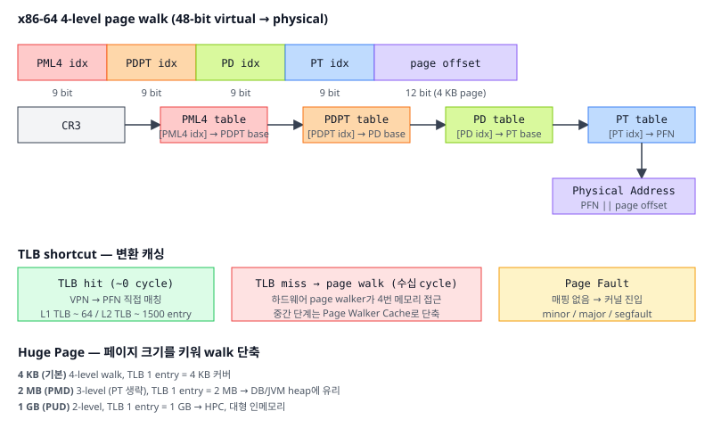
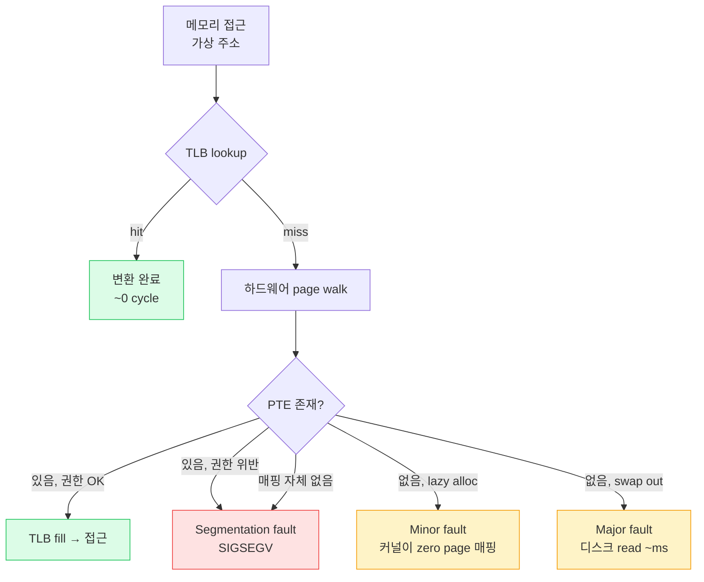

# 07. 가상 메모리 (Virtual Memory)

## TL;DR

**가상 메모리**는 각 프로세스에게 자신만의 연속된 주소 공간 환상을 주고, OS+MMU가 그것을 물리 메모리(또는 디스크)에 매핑한다. 매핑은 **페이지 테이블**(보통 4단계 트리)에 저장되며, **MMU**가 메모리 접근마다 변환을 수행한다. 매번 트리 워크는 비싸므로 **TLB**가 최근 변환을 캐싱한다. TLB 미스, 페이지 폴트, 메모리 단편화는 모두 여기서 발생.

---

## 기초 (면접/CS)

### 왜 가상 메모리인가

1. **격리(Isolation)**: 프로세스끼리 서로 메모리 못 침범
2. **연속된 주소 공간 환상**: 물리 RAM은 단편화돼도 프로세스는 깔끔한 64-bit 공간
3. **물리 RAM > 실제 RAM**: 일부를 디스크로 swap
4. **공유 메모리**: 같은 물리 페이지를 여러 프로세스에 매핑 (공유 라이브러리, IPC)
5. **권한 제어**: 페이지별로 RWX 비트, 커널/유저 분리

### 페이지

- 가상 주소 공간을 **고정 크기 블록**으로 나눔. 일반적으로 4KB.
- 4KB 페이지 + 64-bit 주소 → 페이지 번호 52 bit, 페이지 내 offset 12 bit



### 페이지 테이블 (4단계, x86-64 기준)

```
가상 주소 (48-bit, signed canonical):
[ PML4 idx | PDPT idx | PD idx | PT idx | offset ]
   9 bit     9 bit     9 bit    9 bit    12 bit

CR3 → PML4 → PDPT → PD → PT → 물리 페이지 + offset
        4 KB   4 KB  4 KB 4 KB  4 KB
```

매 주소 변환마다 메모리 접근 4번 → 너무 느림. **TLB로 캐싱**.

### TLB (Translation Lookaside Buffer)

- 매우 작은 fully associative 캐시 (수십 ~ 수백 entry)
- L1 TLB / L2 TLB 계층 존재
- TLB hit: 변환 거의 0 cycle
- TLB miss: 페이지 워크 → 4번의 메모리 접근, 보통 캐시 hit이라 ~수십 cycle

### 페이지 폴트

가상 주소를 변환하려는데 페이지 테이블 entry가 없거나 권한 위반:
- **Minor fault**: 페이지가 물리적으론 있지만 매핑이 안 된 상태 (빠른 처리)
- **Major fault**: 디스크에서 가져와야 함 (수 ms)
- **Segfault**: 잘못된 접근 → 프로세스 종료



❓ **면접: "fork()는 어떻게 빠른가?"** **Copy-on-Write (CoW)**: fork 시 페이지 테이블만 복사하고 모든 페이지를 read-only로 표시. 한쪽이 쓰려 할 때만 그 페이지를 복제.

---

## 심화 (마이크로아키텍쳐)

### x86-64 5단계 페이징 (LA57)

기본은 48-bit (256 TB). LA57 enable 시 5단계 → 57-bit (128 PB). 거대 메모리 서버에서 사용.

### Huge Page

- 일반 4KB → 2MB (PMD-level), 1GB (PUD-level)
- 장점: TLB 1 entry로 더 큰 영역 커버 → TLB 미스 감소, 페이지 워크 단계 단축
- 단점: 메모리 단편화에 약함, 작은 할당에 낭비

```bash
# Linux Transparent Huge Pages 상태
cat /sys/kernel/mm/transparent_hugepage/enabled
# explicit: madvise(addr, len, MADV_HUGEPAGE)
```

### TLB shootdown

코어 A가 페이지 매핑을 변경하면 코어 B의 TLB에도 옛 매핑이 남아있을 수 있음. → IPI(Inter-Processor Interrupt)로 다른 코어에 "TLB invalidate" 명령. 매우 비싼 작업 (수 µs). munmap, mprotect 남발 시 큰 비용.

### Page Walker / Hardware Page Walker

페이지 워크는 OS가 아니라 **MMU의 하드웨어 워커**가 수행. 워커도 자체 캐시(Page Walker Cache)가 있어 중간 단계 entry를 캐싱.

### ASID (Address Space ID) / PCID

context switch마다 TLB flush하면 너무 비쌈 → 각 프로세스에 ID 부여, TLB entry를 ASID와 함께 저장 → flush 없이 공존. x86은 PCID, ARM은 ASID.

### Memory Layout (Linux x86-64 유저 프로세스)

```
0x7fff_ffff_ffff   ┌─────────────┐
                   │ kernel      │ (커널 공간, 유저는 접근 불가)
0x7fff_8000_0000   ├─────────────┤
                   │ stack ↓     │ (자라나는 방향)
                   │             │
                   │   gap       │
                   │             │
                   │ mmap ↓      │ (공유 라이브러리, mmap 영역)
                   │             │
                   │ heap ↑      │ (brk/sbrk로 확장)
                   ├─────────────┤
                   │ BSS         │ (zero-init 글로벌)
                   │ data        │ (init 글로벌)
                   │ text        │ (코드)
0x0000_0000_0000   └─────────────┘
```

ASLR로 stack/heap/mmap/text 시작 주소 무작위화.

### Apple Silicon 페이지 크기

- macOS는 16KB 페이지 (Linux는 보통 4KB)
- 큰 페이지 → TLB 효율 ↑, VIPT L1 alias 제약 완화 → L1 더 크게 가능

---

## 실무 성능 관점

### 1. TLB 미스가 보이는 워크로드

- 큰 해시 테이블 random access
- 대용량 인메모리 DB (Redis, RocksDB)
- 그래프 트래버설

```bash
perf stat -e dTLB-load-misses,iTLB-load-misses ./prog
```
미스 비율이 높으면 **Huge Page** 시도.

### 2. mmap vs read

- 큰 파일 처리 시 `mmap`이 종종 유리: 페이지 단위 lazy load, 페이지 캐시 직접 활용
- 단점: page fault 비용 + 파일 크기가 커지면 가상 주소 공간 압박, mmap된 파일이 사라지면 SIGBUS

### 3. Lazy allocation

```c
char *buf = malloc(10 * GB);   // 즉시 10GB 안 씀
buf[0] = 0;                    // 첫 페이지만 실제 할당
```
Linux의 **overcommit**: 가상 주소 공간만 잡고 실제 페이지는 첫 쓰기 시점에 할당. 그래서 RSS(실제 사용)와 VSS(가상 크기)가 다름.

### 4. Page Cache

OS는 디스크에서 읽은 데이터를 free RAM에 캐시 → 다음 read는 메모리에서. `free` 명령에서 "buff/cache"가 이것. 회수 가능한 메모리.

```bash
sync && echo 3 > /proc/sys/vm/drop_caches   # 페이지 캐시 비우기 (벤치 시)
```

### 5. NUMA-aware 할당

```c
numa_alloc_onnode(size, node);   // 특정 노드에 할당
mbind(addr, size, MPOL_BIND, ...);
```
또는 first-touch 정책: **처음 쓴 코어가 속한 노드에 할당** → 핫 데이터를 쓰는 코어가 직접 init하면 자동으로 NUMA-local.

### 6. Stack 크기

기본 8MB. 큰 로컬 배열은 stack overflow 유발 → heap이나 `static`으로. `ulimit -s` 또는 `pthread_attr_setstacksize` 로 조절.

### 7. Address Sanitizer/Valgrind 와 가상 메모리

ASan은 모든 할당 주변에 가드 페이지를 두어 overflow를 즉시 페이지 폴트로 변환. 메모리 사용량 폭증의 원인. 프로덕션 빌드엔 빼되, CI에서는 켜두자.

---

## 파인만 체크 (10살에게 설명하기)

1. **게임과 브라우저가 둘 다 "0번지"를 쓰는데 왜 서로 안 부딪혀?** 각자 자기가 메모리를 통째로 가진 줄 아는 이 "착각"을 누가 어떻게 만들어줘? (힌트: 프로그램마다 다른 "주소 번역표(페이지 테이블)"를 가져서, 같은 가상 주소도 서로 다른 진짜 칸으로 번역된다는 점)
2. **주소 하나를 진짜 위치로 바꾸려면 표를 4번이나 뒤져야 하는데, 자주 쓰는 번역을 작은 수첩(TLB)에 적어두면 왜 그렇게 빨라져?** (힌트: 접근 한 번에 표를 4번 vs 수첩에서 곧바로 — 그 차이가 매 메모리 접근마다 쌓임)
3. **`fork`로 4GB짜리 프로그램을 복제하는데 왜 순식간이야?** 4GB를 진짜 다 복사하면 오래 걸릴 텐데. (힌트: 일단 둘이 "같이 읽기(read-only)"로 공유하다가, 누가 고치려 할 때만 그 페이지 한 장만 진짜 복사하는 Copy-on-Write)

---

## 추가 학습 키워드

- Inverted page table (PowerPC)
- Hashed page table
- Software-managed TLB (MIPS)
- KASLR / SMAP / SMEP / KPTI
- KSM (Kernel Same-page Merging)
- madvise: HUGEPAGE, RANDOM, SEQUENTIAL, DONTNEED
- vmstat, pmap, /proc/<pid>/maps, /proc/<pid>/smaps
- Demand paging vs prepaging
- Working set model (Denning)
