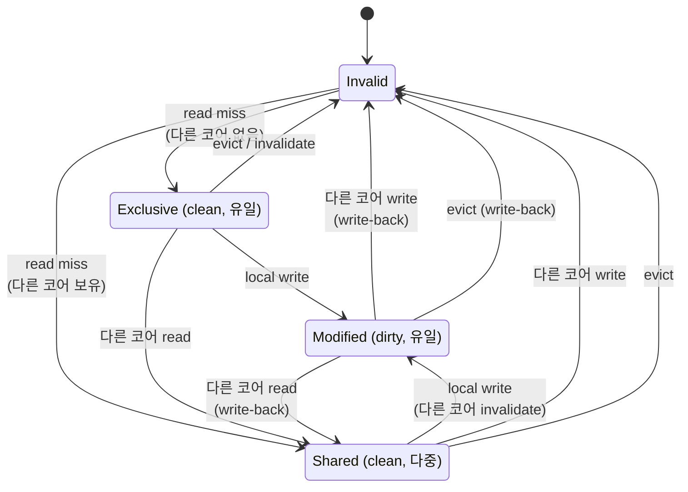
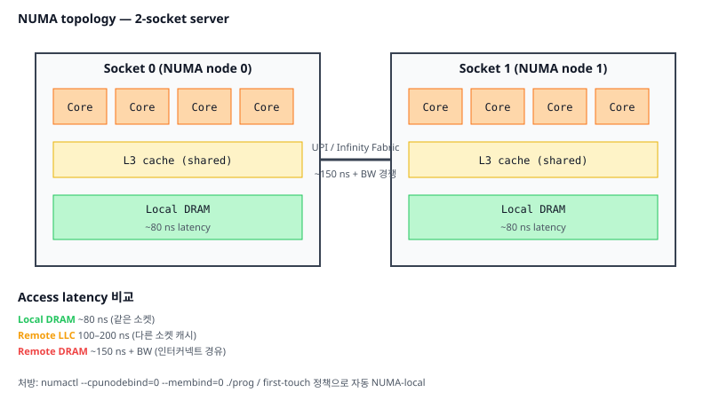

# 08. 멀티코어 & 캐시 일관성 (Multicore & Coherence)

## TL;DR

여러 코어가 같은 메모리를 캐싱하면 **일관성(coherence)** 문제가 생긴다. 하드웨어가 **MESI 같은 프로토콜**로 라인 단위로 sync하지만, 프로그램 순서대로 보이리라는 보장은 더 약하다 — **메모리 모델(memory consistency)**이 무엇을 보장하고 무엇을 보장하지 않는지를 규정한다. x86은 강한 모델(TSO), ARM/POWER는 약한 모델 → 멀티스레드 코드의 이식성 함정. **메모리 배리어**와 **atomic 연산**이 도구.

---

## 기초 (면접/CS)

### Coherence vs Consistency

자주 혼동되는 두 개념:
- **Coherence**: *한 메모리 위치*에 대해 모든 코어가 같은 값을 보는가 — 하드웨어가 보장
- **Consistency**: *서로 다른 위치들*의 접근 순서가 어떻게 보이는가 — 메모리 모델이 정의

### MESI 프로토콜

각 캐시 라인의 상태:
- **M (Modified)**: 나만 가지고 있고 dirty (메모리와 다름)
- **E (Exclusive)**: 나만 가지고 있고 clean
- **S (Shared)**: 여러 코어가 clean 카피
- **I (Invalid)**: 무효



상태 전이 (예시):
```
코어 A read X  → A가 E (메모리에서 가져옴)
코어 B read X  → A,B 모두 S
코어 A write X → A가 M, B는 I (B에 invalidate 메시지)
코어 B read X  → A가 데이터 보내고 M→S, B도 S
```

확장: MOESI(Owned 추가), MESIF(Forward 추가)

### 메모리 모델

#### Sequential Consistency (SC)
모든 코어가 모든 명령을 프로그램 순서대로 본다. 이상적이지만 너무 느려서 실 하드웨어는 거의 안 함.

#### Total Store Order (x86, SPARC)
- store는 store 순서 유지
- store→load는 재정렬 가능 (store buffer 때문)
- 비교적 강함

#### Weak Memory Model (ARM, POWER, RISC-V)
- 모든 종류의 재정렬 허용
- 명시적 배리어 없으면 거의 어떤 순서든 가능

❓ **면접: "x86에서 잘 돌던 코드가 ARM에서 깨진 적 있다."** TSO에선 대부분의 store-store, load-load 재정렬이 일어나지 않아 우연히 동작. ARM에선 명시적 release/acquire가 없으면 깨짐.

### Atomic 연산

`atomic_compare_exchange`, `fetch_add` 등은 **하드웨어가 lock prefix(x86)** 또는 **LL/SC(ARM)** 로 구현. 단일 명령으로 read-modify-write 보장.

### Memory Order — 강함 ↔ 약함 시각화

```
강함  ┌────────────────────────────────────────┐
  ↑   │  seq_cst   모든 코어가 같은 순서로 봄     │ 비쌈
      │  acq_rel   release-acquire 동기화         │
      │  acquire   이 load 이후 op이 뒤따라옴      │
      │  release   이전 op이 이 store와 함께 보임 │
      │  consume   data dependency만             │
  ↓   │  relaxed   순서 보장 X (atomic만 보장)    │ 빠름
약함  └────────────────────────────────────────┘

producer (코어 A)              consumer (코어 B)
  data = 42;          ─────►    while (!ready.load(acquire));
  ready.store(release, true);   assert(data == 42);  ✓ 보장
```

### Memory Order (C++/Rust)

```cpp
std::atomic<int> x;
x.store(1, std::memory_order_relaxed);   // 순서 보장 X
x.store(1, std::memory_order_release);   // 이 store 이전 메모리 op이 다른 코어에 보일 때 함께 보임
x.load(std::memory_order_acquire);       // 이 load 이후 op이 release 이전 op 다음에 일어나도록
x.load(std::memory_order_seq_cst);       // SC — 가장 강하고 가장 비쌈
```

---

## 심화 (마이크로아키텍쳐)

### Store Buffer

코어가 store를 발행하면 즉시 캐시에 가지 않고 **store buffer**에 들어감 → 후속 명령은 진행. 캐시는 나중에 update.
→ 같은 코어의 후속 load가 이 store를 봐야 한다 = **store-to-load forwarding**
→ 다른 코어는 이 store를 아직 못 봄 = TSO에서 store→load 재정렬의 원인

### Cache Coherence 디렉토리 vs 스누핑

#### 스누핑 (Snooping)
모든 코어가 공유 버스의 트래픽을 모두 봄. 작은 시스템(~수십 코어)에 적합.

#### 디렉토리 (Directory-based)
중앙(또는 분산) 디렉토리가 어느 코어가 어느 라인을 가지는지 추적. 큰 시스템(NUMA, 메니코어)에 필수.

현대 서버 CPU(48+ 코어)는 디렉토리 + ring/mesh 인터커넥트 조합.

### NUMA (Non-Uniform Memory Access)

```
[Socket 0]                     [Socket 1]
 ┌─Core─Core─...┐               ┌─Core─Core─...┐
 │              │               │              │
 │   L3 cache   │ ─UPI/Infinity─│   L3 cache   │
 │              │     Fabric    │              │
 └──────┬───────┘               └──────┬───────┘
        │                              │
   DRAM (local)                   DRAM (local)
```



- 같은 소켓 DRAM: ~80 ns
- 원격 소켓 DRAM: ~150 ns + 인터커넥트 BW 경쟁
- 원격 LLC: 100~200 ns

→ **데이터와 스레드를 같은 노드에 묶는 게 핵심**.

### False Sharing 재방문

```c
struct {
    atomic<int> a;   // core 0
    atomic<int> b;   // core 1
} shared;
```
같은 라인 → core 0의 update가 core 1의 라인을 invalidate → bouncing.

| | 단순 access | False sharing |
|---|------------|---------------|
| 처리량 | 십억 ops/s | 수천만 ops/s |
| 비율 | 1x | 100x 느림 |

→ `alignas(64)` 또는 `std::hardware_destructive_interference_size`로 라인 분리.

### Lock의 비용 (Linux Futex 기준)

| 케이스 | 비용 |
|--------|------|
| Uncontended atomic CAS | ~10~20 cycle |
| Uncontended mutex (futex) | ~25 ns |
| Contended → kernel sleep | 수~수십 µs |
| Cache line bouncing under contention | ~50~100 ns/op |

→ contention 줄이는 게 본질. lock-free보다 **shard, partition, batch**가 더 자주 답.

### Apple M / ARM의 메모리 모델 특이점

- **Acquire/Release semantics가 ISA 레벨**: `ldar`, `stlr` 명령. 별도 배리어 없이 하나의 load/store로 처리.
- 작은 약화로 큰 성능 이득.
- Rosetta 2는 x86 코드 실행 시 TSO 모드 enable → 더 비싼 메모리 모델 강제, but 호환성.

---

## 실무 성능 관점

### 1. 스케일링 안 되면 캐시 바운싱 의심

스레드 수 늘려도 처리량 안 늘면:
1. `perf c2c` → cache-to-cache 트래픽 분석
2. atomic counter, shared mutable state, false sharing 의심
3. **Sharding**: 코어별 카운터 → 주기적으로 합산
4. **Per-CPU 데이터** (Linux `__per_cpu`, `RCU`)

### 2. Lock-free는 쉽지 않다

- ABA problem, memory order, 정확성 검증의 어려움
- **대부분의 경우 단순 mutex + 작은 critical section이 더 나음**
- 정말 핫 패스면 `std::atomic` + 잘 정의된 알고리즘 (queue, ring buffer 등)

### 3. RCU (Read-Copy-Update)

read-mostly 데이터에 강력 — read는 lock 없이, write는 새 버전 만들고 grace period 후 옛 버전 free. Linux 커널에서 광범위 사용.

### 4. Reader-Writer 락의 함정

대량의 reader가 동시에 reader lock을 잡으면 그 자체가 atomic counter contention → 단순 mutex보다 느릴 수 있음. 진짜 read-heavy일 때만.

### 5. NUMA 운영

```bash
numactl --hardware                   # NUMA 토폴로지
numactl --cpunodebind=0 --membind=0 ./prog
numastat -p <pid>                    # 노드별 메모리 사용
```

서버 워크로드는 NUMA balancing 자동 마이그레이션이 켜져있으나, latency sensitive에선 명시적 핀이 안전.

### 6. Memory ordering 디버깅

- ARM에서 재현되지만 x86에서 안 되는 race → memory order 부족
- TSAN(ThreadSanitizer)으로 race detect
- 정말 어려운 건 모델 체커(CDSChecker, Loom for Rust) 활용

### 7. CAS 루프

```cpp
int expected = atomic_x.load();
while (!atomic_x.compare_exchange_weak(expected, expected + 1));
```
contention 높으면 CAS 실패율 ↑ → exponential backoff, sharding 고려.

---

## 파인만 체크 (10살에게 설명하기)

1. **코어 4개가 같은 숫자를 각자 캐시에 복사해뒀는데 한 코어가 그 숫자를 고치면, 나머지가 옛날 값을 보면 안 되잖아.** 코어들은 어떻게 서로 "야, 그거 이제 낡았어"라고 알려줘(MESI)? (힌트: 복사본마다 상태 딱지(Modified/Shared/Invalid)를 붙이고, 하나가 고치면 나머지를 Invalid로 만드는 것)
2. **똑같은 멀티스레드 코드가 인텔 맥에서는 잘 돌다가 애플 실리콘(ARM)에서 갑자기 버그가 나.** 왜 CPU가 내가 쓴 명령 순서를 몰래 바꾸고, 왜 ARM이 더 심하게 바꿔? (힌트: "한 스레드 안에서만" 결과가 같으면 순서를 재배치해도 된다고 보는 메모리 모델 — x86은 엄격, ARM은 느슨)
3. **두 코어가 같은 카운터를 1억 번씩 `+1` 했는데 결과가 2억이 아니라 더 작게 나와.** 숫자가 어디서 새어나간 거고, "atomic(원자적) 연산"은 이걸 어떻게 막아? (힌트: `+1`은 사실 읽고-더하고-쓰는 3동작이라 둘이 엇갈리면 서로의 갱신을 덮어쓴다는 점)

---

## 추가 학습 키워드

- MOESI, MESIF, Dragon protocol
- Sequential Consistency, Linearizability, Serializability
- DRF (Data Race Free), C++ memory model paper
- Hazard pointers, epoch-based reclamation
- Transactional memory (Intel TSX — 보안 이슈로 disable됨)
- AMD CCX/CCD, Infinity Fabric, Intel Mesh, ARM CoreLink CMN
- Last-level cache slicing
- Inclusive vs non-inclusive coherence
- TSO, PSO, RMO, RCpc/RCsc
