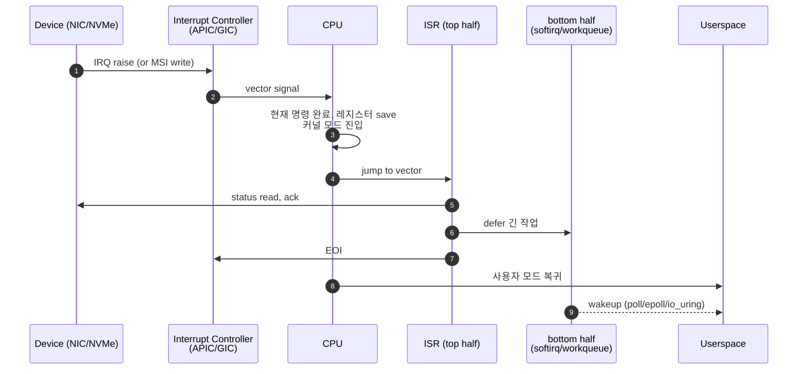
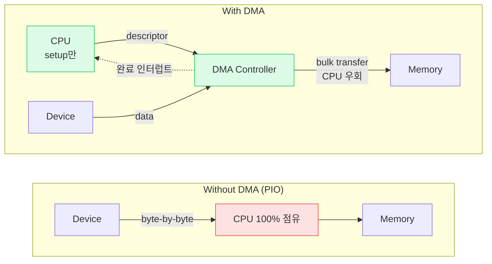
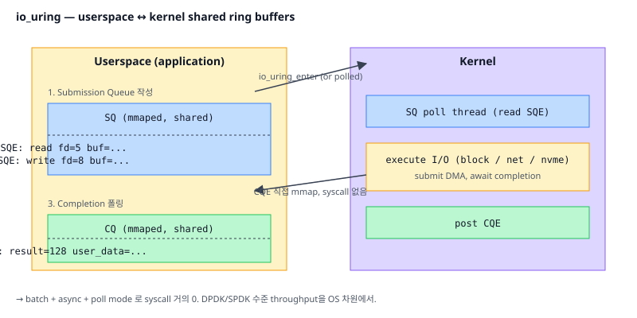

# 09. I/O & 인터럽트 (I/O & Interrupts)

## TL;DR

CPU가 외부 장치와 통신하는 방법은 (1) **폴링(busy wait)**, (2) **인터럽트(이벤트 통보)**, (3) **DMA(CPU 우회 데이터 전송)** 세 가지다. 인터럽트는 **컨텍스트 스위치**를 유발해 비싸지만 latency가 좋고, 폴링은 CPU를 잡아먹지만 가장 빠르다. 현대 고성능 I/O는 폴링과 인터럽트를 적응적으로 섞고(NAPI, io_uring), DMA + 인터럽트 결합으로 CPU 부담을 최소화한다.

---

## 기초 (면접/CS)

### I/O 통신 방법

#### 1. Memory-Mapped I/O (MMIO)
디바이스 레지스터를 메모리 주소 공간에 매핑. 일반 load/store로 접근.
- 거의 모든 현대 시스템 표준
- ARM은 MMIO만, x86은 MMIO + Port I/O 둘 다 (`in/out` 명령)

#### 2. 폴링 (Polling)
```c
while (!(*status_reg & READY)) ;   // 비지 웨이트
```
- CPU 100% 점유 → 다른 일 못 함
- but latency 최저 → NVMe, 고성능 NIC에서 활용

#### 3. 인터럽트 (Interrupt)
디바이스가 준비되면 CPU에 신호 → CPU는 ISR(Interrupt Service Routine) 실행.
- CPU 효율적 사용
- but ISR 진입/종료 비용 (~수백 cycle)

### 인터럽트 처리 흐름

```
1. 디바이스 → 인터럽트 컨트롤러 (APIC, GIC) → CPU
2. CPU: 현재 명령 완료 → 레지스터 저장 → ISR로 점프 (커널 모드)
3. ISR: 디바이스 확인 → 짧은 작업 (top half)
   긴 작업은 워크큐/태스크릿 (bottom half)
4. EOI 신호 → 인터럽트 종료 → 사용자 모드 복귀
```



### DMA (Direct Memory Access)




CPU 개입 없이 디바이스가 직접 메모리에 read/write.
```
구식: 디바이스 → CPU (read each byte) → 메모리   [CPU 부담 큼]
DMA: 디바이스 → 메모리 (DMA controller)         [CPU는 시작/완료만 통보받음]
```
- NIC, 디스크, GPU 모두 DMA 사용
- IOMMU로 가상화 + 보호

### 컨텍스트 스위치

스레드/프로세스 전환 비용:
- 레지스터 save/restore: ~수십 cycle
- TLB flush (다른 프로세스): 큰 비용
- 캐시 cold: hot data 잃음
- 전체 비용: ~1~10 µs

### 시스템 콜 vs 함수 콜

| | 함수 콜 | 시스템 콜 |
|---|---------|-----------|
| 모드 전환 | 없음 | 유저→커널 |
| 비용 | 수 cycle | 수백~천 cycle |
| 명령 | call | syscall (x86), svc (ARM) |
| 인자 전달 | 레지스터 | 레지스터 (calling convention 다름) |

❓ **면접: "왜 컨텍스트 스위치가 비싼가?"** 단순 레지스터 save/restore 외에도 (1) TLB, (2) 캐시 cold, (3) 분기 예측기/uop 캐시 reset, (4) MSR 변경 → 실제로는 회복 시간까지 포함하면 수십 µs.

---

## 심화 (마이크로아키텍쳐)

### Interrupt Controller

- **PIC** (Intel 8259, 옛날): 단일 CPU
- **APIC** (Advanced PIC): 멀티코어용. Local APIC + I/O APIC.
- **MSI/MSI-X** (Message Signaled Interrupt): 별도 핀 없이 메모리 write로 인터럽트 통보. PCIe 표준.
- **ARM GIC** (Generic Interrupt Controller): GICv2/v3/v4

### Interrupt Coalescing

대량 패킷이 들어올 때 매 패킷마다 인터럽트 → 인터럽트 폭주.
- NIC가 여러 이벤트를 모아 한 번에 인터럽트 → CPU 부담 ↓
- 단점: latency 증가
- 트레이드오프 조절: `ethtool -C eth0 rx-usecs 50`

### NAPI (Linux Network)

처음 패킷 도착 → 인터럽트 → 이후 일정 시간 동안 폴링 → 트래픽 줄면 인터럽트로 복귀. 인터럽트와 폴링의 적응적 결합.

### io_uring (Linux 5.1+)

- 유저-커널 공유 ring buffer (submission/completion)
- syscall 거의 없이 비동기 I/O
- polling 모드: 완전 syscall-free 가능
- DPDK/SPDK가 했던 것을 OS 차원에서



### DPDK / SPDK / Kernel Bypass

극도로 latency sensitive한 워크로드 (HFT, 5G):
- 전용 코어를 폴링에 할당 → 인터럽트 없음
- 유저 공간에서 직접 NIC/NVMe 다룸
- 100Gbps NIC를 single core로 saturate 가능

### IOMMU

- VT-d (Intel), AMD-Vi
- 디바이스의 DMA 주소를 가상화 → VM에 디바이스 직접 패스스루
- 보안: 악의적 디바이스가 임의 메모리 접근 못 하게

### 인터럽트 affinity

```bash
cat /proc/interrupts                          # IRQ 분포 확인
echo 2 > /proc/irq/<n>/smp_affinity           # CPU 1번에 핀
```
NIC RX queue를 특정 코어에 핀 → cache 친화적, NUMA-local. RPS/RFS와 결합.

---

## 실무 성능 관점

### 1. syscall 줄이기

#### 배치
- `writev`/`readv`로 여러 버퍼 한 번에
- io_uring으로 N개 I/O를 1 syscall로

#### vDSO
`gettimeofday`, `clock_gettime`은 syscall 없이 사용자 공간에서 직접 (커널이 매핑한 페이지 사용).

#### sendfile / splice
파일→소켓 전송 시 유저 공간 copy 없이 커널이 직접.

### 2. epoll vs select vs io_uring

| | scalability | API |
|---|------------|-----|
| select | O(n), FD 1024 한계 | 단순 |
| poll | O(n) | 단순 |
| epoll | O(1) per event | edge/level trigger |
| io_uring | submission ring, async | 가장 빠르지만 복잡 |

### 3. 컨텍스트 스위치 줄이기

- 코어수 ≈ 워커 스레드 수 (스레드 pool)
- CPU pinning (`pthread_setaffinity_np`, `taskset`)
- 코루틴/그린 스레드 (Go goroutine, Java virtual thread): 커널 스위치 없이 유저 공간에서 다중화
- `perf stat -e context-switches,cs` 로 측정

### 4. NIC 튜닝 (서버)

- RSS (Receive Side Scaling): 패킷을 코어별 queue로 분산
- IRQ affinity 코어별 분산
- ring buffer 크기 조정 (`ethtool -G`)
- TSO/GRO: large segment를 커널/하드웨어가 분할/병합

### 5. DMA-coherent vs streaming

- coherent: CPU/디바이스 모두 같은 cache view (snoop) — 작은 디스크립터에
- streaming: dma_map_single → 디바이스가 끝나면 unmap, cache flush — 큰 데이터 페이로드에

### 6. 모니터링 명령

```bash
vmstat 1                  # context switch, interrupt rate
mpstat -P ALL 1           # CPU별 idle/sys/iowait
iostat -xz 1              # 디스크 latency, queue depth
sar -n DEV 1              # 네트워크 패킷
```

### 7. 인터럽트 storm 디버깅

`watch -d 'cat /proc/interrupts'` → 어느 IRQ가 폭증하는지. NIC 문제, watchdog, ACPI 등.

---

## 파인만 체크 (10살에게 설명하기)

1. **택배를 기다릴 때 (1) 1분마다 문 열어 확인하기(폴링) vs (2) 초인종 울리면 나가기(인터럽트).** CPU도 장치를 이 두 방식으로 기다리는데, 각각 언제 쓰는 게 좋고 뭐가 손해야? (힌트: 계속 확인하면 다른 일을 못 하고, 초인종은 편하지만 나갔다 오는 채비(ISR 진입) 비용이 든다는 점)
2. **디스크에서 1GB를 메모리로 옮길 때, CPU가 한 바이트씩 나르는 대신 "DMA"한테 시키고 자긴 딴 일 한대.** 왜 CPU가 직접 안 나르는 게 이득이야? (힌트: 짐 나르기는 단순노동이라 전담 일꾼에게 맡기고, CPU는 "다 됐다"는 신호만 나중에 받으면 되는 것)
3. **CPU가 하던 일을 멈추고 다른 일로 갈아타는 게(컨텍스트 스위치) 왜 그렇게 비싸?** 지금 숫자들(레지스터)만 종이에 적어두면 되는 거 아냐? (힌트: 레지스터 저장은 금방이고, 진짜 비용은 캐시·TLB·분기예측기가 새 작업 것으로 다시 "데워지는" 회복 시간)

---

## 추가 학습 키워드

- APIC, x2APIC, ARM GICv3
- Interrupt latency, jitter
- RT_PREEMPT (real-time Linux)
- Tickless kernel (NOHZ_FULL)
- Receive Packet Steering (RPS), Receive Flow Steering (RFS)
- XDP (eXpress Data Path), AF_XDP
- DPDK, SPDK, RDMA, RoCE
- SR-IOV
- VFIO (userspace device driver framework)
