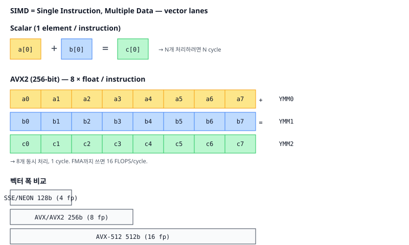
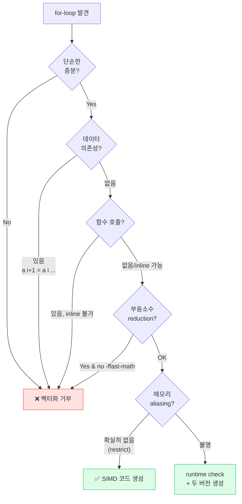

# 10. SIMD / 벡터 (SIMD / Vector Processing)

## TL;DR

**SIMD (Single Instruction Multiple Data)**는 한 명령으로 여러 데이터에 동시에 같은 연산을 수행한다. 256-bit AVX2는 float 8개, int 32개를 한 cycle에 처리 — 잘 맞는 워크로드(이미지/영상/ML/시뮬레이션)에서 4~8배 가속. 컴파일러의 **자동 벡터화**가 점점 잘 되지만, 한계가 있어 **intrinsic** 또는 **벡터 라이브러리**(Highway, xsimd)가 실무 표준.

---

## 기초 (면접/CS)

### SIMD 명령어 세트

| 세트 | 폭 | 등장 | 비고 |
|------|-----|------|------|
| MMX | 64 bit | 1996 | 정수만, 거의 안 씀 |
| SSE/SSE2 | 128 bit | 1999~ | float/double 지원, x86-64 baseline |
| SSE3/SSSE3/SSE4 | 128 bit | 2004~ | 추가 명령 |
| AVX/AVX2 | 256 bit | 2011~ | float 8개, 일반 PC 표준 |
| AVX-512 | 512 bit | 2016~ | float 16개, 서버/HPC, 최근 컨슈머에서 사라짐 |
| ARM NEON | 128 bit | 2009~ | ARMv7+, 모바일/Apple 표준 |
| ARM SVE/SVE2 | 가변 (128~2048) | 2016~ | 길이 무관 코드 작성 가능 |

### 벡터 레지스터

```
XMM0~15  (128 bit)  : SSE
YMM0~15  (256 bit)  : AVX
ZMM0~31  (512 bit)  : AVX-512
V0~V31   (128 bit)  : NEON
Z0~Z31   (가변)     : SVE
```



### 기본 동작 예시

```c
// 스칼라
for (i = 0; i < 8; i++) c[i] = a[i] + b[i];

// AVX 벡터화 (intrinsic)
__m256 va = _mm256_loadu_ps(a);
__m256 vb = _mm256_loadu_ps(b);
__m256 vc = _mm256_add_ps(va, vb);   // 8개 float 동시 add
_mm256_storeu_ps(c, vc);
```
1 cycle 안에 8 float = 8 FLOPS, FMA까지 쓰면 16 FLOPS/cycle.

### 자동 벡터화

`-O2`/`-O3`에서 컴파일러가 단순 루프 자동 벡터화. 조건:
- iter 수가 컴파일 타임에 고정이거나 단순
- 데이터 의존성 없음
- 함수 호출 없음 (inline 가능 제외)
- 부동소수점은 `-ffast-math`가 있어야 자유로운 재정렬



```bash
gcc -O3 -march=native -fopt-info-vec-all -c file.c
# 어떤 루프가 벡터화/거부되었는지 출력
```

❓ **면접: "왜 SIMD가 그렇게 빠른가?"** 같은 cycle에 N개 데이터 처리(throughput N배), 명령 fetch/decode 비용 1/N로 분산, 메모리 접근도 wide load로 병합.

---

## 심화 (마이크로아키텍쳐)

### 실행 유닛

- Skylake: 2x 256-bit FMA 유닛 → 32 SP FLOPS / cycle
- Apple M1 Firestorm: 4x 128-bit NEON 유닛 → 16 SP FLOPS / cycle (코어당)
- AVX-512: 1~2 ZMM 유닛, 워크로드 따라 throughput

### Mask Register (AVX-512, SVE)

조건부 SIMD 처리:
```c
__m512i a, b, c;
__mmask16 m = _mm512_cmpgt_epi32_mask(a, b);   // a > b인 lane
c = _mm512_mask_blend_epi32(m, a, b);          // mask에 따라 선택
```
SSE/AVX는 마스크 없이 blend로 흉내. AVX-512는 1st-class mask로 if-conversion 깔끔.

### Gather / Scatter

```c
__m256i indices = ...;
__m256 data = _mm256_i32gather_ps(base, indices, 4);   // base[indices[i]]
```
- 흩어진 메모리 접근을 SIMD로
- 비싸지만 sparse 처리에 유용
- AVX-512 scatter 추가

### 다운클럭 함정 (AVX-512)

- AVX-512 명령 사용 시 코어 클럭이 자동 저하 (Intel) → 근처 스칼라 코드까지 영향
- 짧게 쓰면 스칼라 대비 손해. 길게/주력 워크로드일 때만 이득.
- 최근 Sapphire Rapids에서는 완화. 컨슈머 칩(Alder Lake+)에서는 AVX-512 비활성.

### SVE / Vector Length Agnostic

```c
svfloat32_t va = svld1(svptrue_b32(), a);   // 길이 모르고 작성
svfloat32_t vb = svld1(svptrue_b32(), b);
svfloat32_t vc = svadd_x(svptrue_b32(), va, vb);
```
하드웨어가 128, 256, 512 bit 어느 거든 같은 코드 작동. 미래지향.

### Apple AMX

ARMv8 표준이 아닌 Apple 전용 행렬 곱 가속. CoreML/Accelerate가 자동 활용. NEON보다 한 자릿수 빠름.

---

## 실무 성능 관점

### 1. 자동 벡터화를 막는 흔한 패턴

```c
for (i = 0; i < n; i++) {
    if (a[i] < 0) break;        // 조기 탈출 → 벡터화 X
    sum += a[i];
}

for (i = 0; i < n; i++)
    a[i+1] = a[i] * 2;          // 의존 → 벡터화 X (각 iter가 이전 결과 필요)

float sum = 0;
for (i = 0; i < n; i++) sum += a[i];   // 부동소수 결합법칙 X → -ffast-math 없으면 거부
```

### 2. 데이터 정렬 (alignment)

```c
alignas(32) float a[N];
__m256 v = _mm256_load_ps(a);    // aligned load
// vs
__m256 v = _mm256_loadu_ps(a);   // unaligned, 옛 CPU에서 느렸음. 현재는 거의 동일
```
AVX는 32B align, AVX-512는 64B align 권장.

### 3. SoA가 SIMD 친화적

```c
// AoS: x,y,z 섞여있어 같은 SIMD 레지스터에 x만 모으기 어려움
struct V3 { float x, y, z; } v[N];

// SoA: x[]만 한 번에 wide load
struct { float x[N], y[N], z[N]; } v;
```

### 4. Reduction 합산

```c
// horizontal sum AVX
__m256 v = ...;
__m128 lo = _mm256_castps256_ps128(v);
__m128 hi = _mm256_extractf128_ps(v, 1);
lo = _mm_add_ps(lo, hi);
lo = _mm_hadd_ps(lo, lo);
lo = _mm_hadd_ps(lo, lo);
float result = _mm_cvtss_f32(lo);
```
가능하면 누적기를 4~8개 두고 마지막에만 합치기 (3장 ILP).

### 5. ISA 분기 처리

런타임 CPU 검사 후 다른 함수 디스패치:
```c
if (__builtin_cpu_supports("avx2"))
    fn = process_avx2;
else
    fn = process_sse;
```
GCC `__attribute__((target("avx2")))` + IFUNC, 또는 Highway 라이브러리.

### 6. SIMD 라이브러리 활용

스스로 intrinsic 작성 vs:
- **Eigen**: C++ 행렬, 자동 SIMD
- **xsimd / Highway**: 크로스 플랫폼 SIMD wrapper
- **ISPC**: Intel SPMD compiler — GPU-like 코드를 CPU SIMD로
- **Pytorch/JAX**: ML 워크로드는 그냥 라이브러리 사용

### 7. 측정

```bash
perf stat -e fp_arith_inst_retired.256b_packed_single ./prog
```
SIMD 명령이 실제로 발사됐는지 확인. 자동 벡터화 의심 시 disasm 확인 (`objdump -d`).

---

## 파인만 체크 (10살에게 설명하기)

1. **친구 8명에게 사탕을 하나씩 줄 때, 한 명씩 8번 주는 대신 "다 같이 하나씩!" 한 번의 명령으로 끝내는 게 SIMD래.** 왜 이게 8배 빨라? 명령을 한 번만 읽어도 되는 게 왜 이득이야? (힌트: 명령을 가져와 해석하는 비용을 8명이 나눠 내고, 메모리도 넓게 한 번에 가져오는 것)
2. **컴파일러가 반복문을 자동으로 SIMD로 바꿔주는데, `a[i+1] = a[i] * 2`처럼 앞 결과가 있어야 다음을 계산하는 코드는 왜 못 바꿔?** (힌트: 8명이 "동시에" 하려면 서로 답을 기다리면 안 되는데, 이건 앞사람 답이 나와야 뒷사람이 시작할 수 있다는 점)
3. **`float`를 다 더하는 합산은 왜 컴파일러가 함부로 SIMD로 못 바꿔?** `(a+b)+c`와 `a+(b+c)`가 컴퓨터에선 살짝 다른 값이 나온다는데 그게 왜 문제야? (힌트: 8칸을 병렬로 더하면 더하는 "순서"가 바뀌고, 부동소수점은 순서만 바뀌어도 반올림 결과가 미세하게 달라진다는 점 — 1장과 연결)

---

## 추가 학습 키워드

- AVX-512 subsets: F, CD, BW, DQ, VL, VNNI, BF16
- Intel SDM, Agner Fog's instruction tables
- ARM NEON intrinsics, SVE/SVE2
- ISPC (Implicit SPMD Program Compiler)
- Highway (Google), xsimd, simdjson
- Bitmanip (BMI1/BMI2), GFNI, VPCLMULQDQ
- Vector instructions on RISC-V (RVV)
- GPU vs CPU SIMD: warp/wave vs lane
