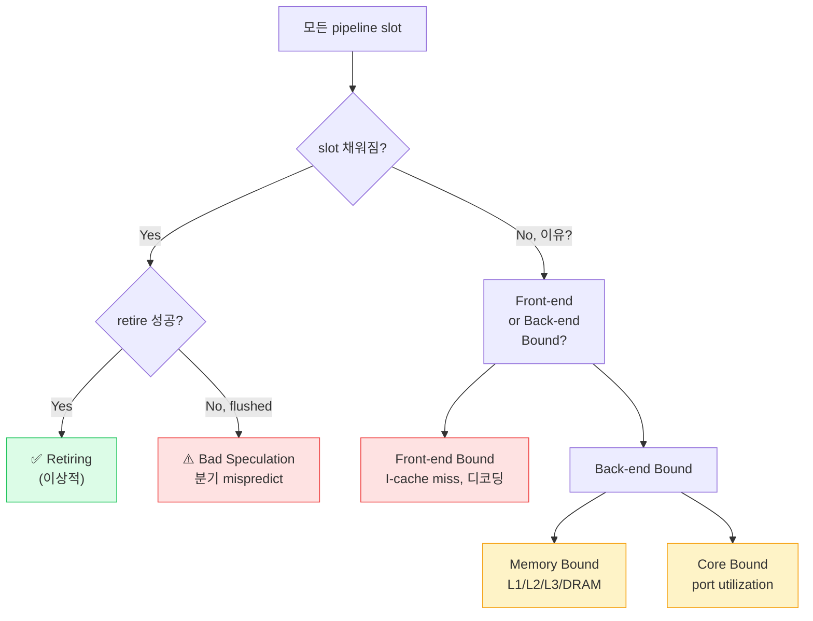
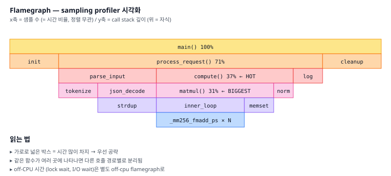

# 11. 성능 튜닝 (Performance Tuning)

## TL;DR

성능 튜닝의 99%는 (1) **측정해서 병목 찾기**, (2) **알고리즘/데이터 구조 바꾸기**, (3) **메모리/캐시 패턴 개선** 순이다. 마이크로옵티마이제이션은 마지막. 병목은 **CPU bound / Memory bound / I/O bound**로 분류하고, 도구는 **perf, flamegraph, top-down 분석**이 기본. 좋은 성능 엔지니어는 코드를 짜기 전에 **수치를 추정**할 수 있다 (back-of-envelope).

---

## 기초 (면접/CS)

### 핵심 메트릭

#### CPI / IPC
- **CPI (Cycles Per Instruction)**: 1보다 작은 게 좋음
- **IPC (Instructions Per Cycle) = 1/CPI**: 클수록 좋음
- 일반 코드: IPC 1~2, 잘 짠 SIMD: 4~6, 메모리 bound: < 0.5

```bash
perf stat ./prog
# instructions, cycles → IPC = instructions / cycles
```

#### Throughput vs Latency
- **Throughput**: 단위 시간당 처리량 (req/s, GB/s)
- **Latency**: 한 요청 처리 시간 (ms)
- **Little's Law**: `concurrency = throughput × latency`. 시스템 사이징의 기본.

#### 백분위 (percentile)
- 평균은 거짓말. 항상 **p50/p95/p99/p999**를 보자.
- p99가 평균의 10배면 long tail 문제 — GC, 캐시 미스, lock contention 의심.

### 암달의 법칙 (Amdahl's Law)

```
speedup = 1 / ( (1-P) + P/N )
```
P = 병렬화 가능 비율, N = 코어 수.
- P = 0.95라도 N=∞일 때 speedup 한계는 **20배**
- → 직렬 부분이 병렬화의 천장

### 관련: Gustafson's Law
문제 크기를 키우면 직렬 비율이 줄어 더 큰 speedup 가능.

### 병목의 분류

| 카테고리 | 증상 | 도구 |
|---------|------|------|
| CPU bound | CPU 100%, 다른 자원 한가 | perf, flamegraph |
| Memory bound | 낮은 IPC, 높은 LLC miss rate | perf, toplev |
| I/O bound | 낮은 CPU, iowait 높음 | iostat, blktrace |
| Lock bound | 스레드 늘려도 안 빨라짐 | perf lock, c2c |

❓ **면접: "성능 최적화 어디부터?"** 측정 → profiling → hotspot의 알고리즘부터. "premature optimization is the root of all evil" (Knuth) — 단 측정 없는 최적화 한정.

---

## 심화 (마이크로아키텍쳐)

### Top-Down Analysis (Intel/AMD)

CPU pipeline slot을 4가지로 분류:

```
                   Slot 채워짐?
                  /            \
                 Yes            No
                /                \
          retire 됨?         이유는?
            /    \              /    \
        Retiring  Bad      Front-end  Back-end
                  Speculation Bound    Bound
                                       /     \
                                  Memory   Core
                                  Bound    Bound
                                  /  \      / \
                              L1 L2 L3..  Port
                              Bnd Bnd     Util
```



```bash
toplev.py --level 2 ./prog
```
어느 카테고리가 30% 넘으면 그쪽부터 손대자.

### Profiling 도구 비교

| 도구 | 종류 | 용도 |
|------|------|------|
| `perf record` | sampling | hotspot 찾기 |
| `perf c2c` | sampling | false sharing |
| `perf mem` | PEBS | 메모리 latency 분석 |
| `perf lock` | tracing | lock contention |
| flamegraph | viz | call stack 히트맵 |
| Intel VTune | GUI 통합 | top-down 등 |
| Apple Instruments | macOS GUI | Time Profiler, System Trace |
| eBPF (bcc, bpftrace) | tracing | 커스텀 측정 |

### Sampling Profiler 동작 원리

- 일정 주기로 인터럽트 → 현재 실행 중인 PC, call stack 기록
- 통계적 샘플링 → 자주 나오는 함수가 hot
- 단점: **샘플링 윈도우보다 짧은 함수는 누락**, **CPU off (waiting) 시간은 안 보임**

### Off-CPU profiling

I/O wait, lock wait 같은 **CPU 안 쓰는 시간**이 진짜 latency 원인일 때:
```bash
offcputime-bpfcc -f 30 > out.stacks
```
flamegraph로 시각화.

### Microbenchmark 함정

- 워크로드가 캐시에 다 들어가 → 실전과 다름
- 컴파일러가 dead code elimination → 측정 자체가 사라짐 (`benchmark::DoNotOptimize`)
- CPU 주파수 변동 (turbo, throttling)
- 같은 코어에서 백그라운드 노이즈
- 권장: Google Benchmark, criterion(Rust), JMH(Java) 같은 검증된 프레임워크

---

## 실무 성능 관점

### 1. 측정 우선

```bash
# 1단계: 무엇이 느린가? (sampling)
perf record -F 99 -g ./prog
perf report

# 2단계: 왜 느린가? (counter)
perf stat -d ./prog
# IPC, cache miss rate, branch miss rate 한번에

# 3단계: top-down
toplev.py --level 2 ./prog
```

### 2. Flamegraph

```bash
git clone https://github.com/brendangregg/FlameGraph
perf record -F 99 -g ./prog -- sleep 30
perf script | ./stackcollapse-perf.pl | ./flamegraph.pl > out.svg
```
가로 = 샘플 수, 세로 = call stack. 넓은 box를 우선 공략.



### 3. 알고리즘 vs 마이크로옵티마이제이션

- O(n²) → O(n log n) 알고리즘 변경: **수십~수만 배** 가속
- 캐시 friendly 데이터 구조: **2~10배**
- SIMD 벡터화: **4~16배**
- 비트 트릭, 어셈블리: **1.1~2배**

→ 위에서 아래로. 알고리즘 안 바꾸고 SIMD부터 들어가면 시간 낭비.

```
효과 크기 (log scale)
    10000x ┤  ████████████████████  알고리즘 (O(n²)→O(n log n))
     100x  ┤  ████████              데이터 레이아웃 / 캐시
      10x  ┤  ████                  SIMD / 병렬화
       2x  ┤  ██                    PGO/LTO/할당기 교체
       1x  ┤  █                     비트 트릭, 어셈블리
            └─────────────────────────────────────────►
            우선순위: 위 → 아래
```

### 4. Back-of-envelope

성능 추정 능력 = 좋은 엔지니어의 표지.

예: "1억 개 정수 중 sum 구하기"
- 1억 × 4 byte = 400 MB → DRAM bound (L3 초과)
- DRAM ~30 GB/s → 400 MB / 30 GB = ~13 ms
- → 13 ms보다 훨씬 느리면 메모리 패턴 문제, 13 ms 근처면 한계.

### 5. 흔한 안티패턴

#### 잘못된 데이터 구조
- Random insertion에 vector → O(n) shift. list/deque로.
- Lookup-heavy하면 sorted vector + binary search > std::map (캐시 친화적)

#### 작은 객체 많이 할당
- malloc/new는 락 + 시스템 콜. arena allocator, object pool.
- jemalloc/tcmalloc/mimalloc로 교체만 해도 30%↑

#### 문자열 처리
- `std::string +=` 반복 → 재할당. reserve.
- 짧은 문자열은 SSO(Small String Optimization)로 stack에 — 컴파일러/표준 라이브러리에 따라 다름

#### 가짜 병렬화
- spawn 비용 > 일 비용. 작업 단위 키우기.
- thread pool, work stealing (TBB, rayon).

### 6. 측정 환경 위생

```bash
# CPU governor 고정 (Linux)
sudo cpupower frequency-set -g performance

# Turbo 끄기
echo 1 > /sys/devices/system/cpu/intel_pstate/no_turbo

# CPU 코어 격리 + 타깃 코어 핀
taskset -c 2 ./prog
```

### 7. 메모리 할당기 교체

```bash
LD_PRELOAD=/usr/lib/libjemalloc.so ./prog
LD_PRELOAD=/usr/lib/libtcmalloc.so ./prog
LD_PRELOAD=/usr/lib/libmimalloc.so ./prog
```
멀티스레드 + 작은 alloc 많은 워크로드에 큰 차이. RocksDB/Redis 가이드에서 권장.

### 8. PGO + LTO

- **PGO (Profile-Guided Optimization)**: 실측 프로파일로 hot/cold 구분 → 코드 레이아웃 최적화 → 5~30% 향상
- **LTO (Link-Time Optimization)**: 모듈 경계 넘어 inline → 5~10% 향상
- gcc/clang `-flto`, `-fprofile-generate / -fprofile-use`

### 9. 치명적 함정 — 코드 위치(I-cache)

PGO 핵심 효과는 데이터가 아니라 **코드 레이아웃**. hot 함수끼리 모으면 I-cache miss ↓. 큰 vtable, 깊은 콜 스택, hot/cold 섞인 경우에 큰 차이.

### 10. 회귀 방지

성능 개선했으면 CI에 벤치마크 추가. **마이크로 벤치만 보지 말고 end-to-end도**. 코드 짜는 동안 실전 워크로드와 갈수록 멀어지므로.

---

## 추가 학습 키워드

- Brendan Gregg "Systems Performance" (책)
- Agner Fog instruction tables, microarchitecture pdfs
- USE method, RED method, Golden Signals (SRE)
- LMbench, mlc (Memory Latency Checker)
- coz profiler (causal profiling)
- Linux perf events, PEBS, LBR (Last Branch Record)
- ROOFline model
- BOLT (binary optimization tool)
- Flame graph, icicle graph, differential flame graph
- chaos engineering (성능 + 신뢰성 검증)
