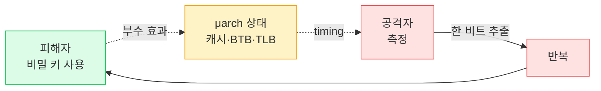
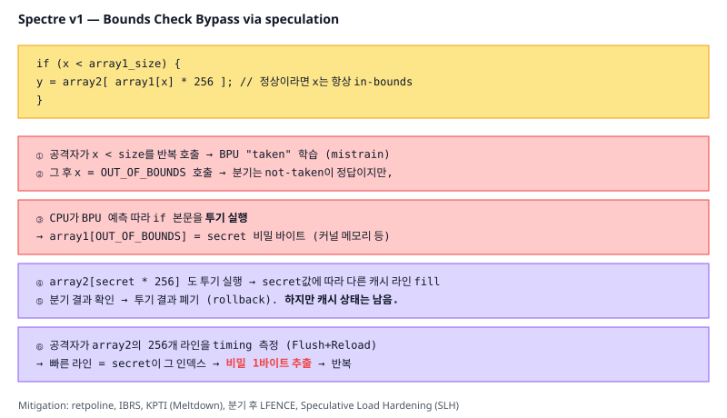

# 12. 보안 / 사이드채널 (Hardware Security & Side Channels)

## TL;DR

마이크로아키텍쳐의 성능 최적화 (분기 예측, 투기 실행, 캐시 공유)는 **사이드채널 정보 누출**의 통로다. **Spectre/Meltdown(2018)** 이후 모든 현대 CPU는 부분적 mitigation으로 인해 약간의 성능을 잃었다. 사이드채널은 **timing**(연산 시간 차이), **cache**(캐시 점유 패턴), **power**(전력 소비), **EM**(전자기 방사) 등으로 비밀을 추출한다. 암호 코드는 **상수 시간(constant-time)**, **데이터 독립적 메모리 접근**으로 작성해야 한다.

---

## 기초 (면접/CS)

### 사이드채널 (Side Channel)이란

알고리즘의 **로직**이 아니라 **부수적 현상**(시간, 전력, 캐시 상태, 에러 메시지...)으로부터 비밀 정보를 추출하는 공격.

**예: 비밀번호 비교**
```c
// 취약: 첫 다른 글자에서 즉시 return → 시간이 다름
for (i = 0; i < n; i++)
    if (a[i] != b[i]) return false;
return true;

// 안전: 모든 글자 비교 후 결과 반환
int diff = 0;
for (i = 0; i < n; i++) diff |= a[i] ^ b[i];
return diff == 0;
```
첫 번째 코드는 정답에 가까울수록 비교 시간이 길어짐 → 한 글자씩 추출 가능.

### 캐시 사이드채널



#### Flush+Reload
1. 공격자가 공유 라이브러리 코드 라인을 캐시에서 flush (`clflush`)
2. 피해자가 동작
3. 공격자가 같은 라인 접근 → 빠르면(피해자가 접근함) / 느리면(접근 안 함)

→ 어느 코드 경로를 탔는지 추측 가능 → 비밀 키의 비트 추출.

#### Prime+Probe
1. 공격자가 캐시 set을 자기 데이터로 가득 채움 (prime)
2. 피해자 동작
3. 다시 접근 → 느려진 라인 = 피해자가 evict한 set

### Spectre / Meltdown (2018)

#### Meltdown (CVE-2017-5754)
유저 모드에서 커널 메모리 읽기:
```
1. mov rax, [kernel_addr]    ; 권한 위반, 예외 발생 예정
2. mov rbx, [array + rax]    ; 예외 전 투기 실행 → 캐시에 영향
```
예외는 retire 시점에 발생하지만 **투기 실행은 이미 캐시를 변형**. Flush+Reload로 rax 값 추출.

→ 영향: Intel만 (AMD/ARM은 권한 검사 시점이 달라 안전)
→ mitigation: **KPTI** (커널/유저 페이지 테이블 분리) → context switch 비용 ↑

#### Spectre v1 (CVE-2017-5753) — Bounds Check Bypass
```c
if (x < array1_size) {       // 공격자가 일부러 mistrain → 분기예측 taken
    y = array2[array1[x] * 256];   // x가 큰 값이어도 투기 실행
}
```
→ 비밀 메모리를 캐시 패턴으로 누출.



```mermaid
sequenceDiagram
  autonumber
  participant Atk as 공격자
  participant BPU as 분기 예측기
  participant Spec as 투기 실행
  participant Cache as 캐시
  participant Mem as 비밀 메모리

  Atk->>BPU: x &lt; size 반복 호출 (training)
  BPU->>BPU: "taken" 학습
  Atk->>BPU: x = OUT_OF_BOUNDS 호출
  BPU->>Spec: 예측: taken → if 본문 투기 실행
  Spec->>Mem: array1[x] 읽음 = secret
  Spec->>Cache: array2[secret * 256] fetch
  BPU-->>Spec: 분기 진짜 결과 도착 → rollback
  Note over Cache: 캐시 상태는 그대로 남음 ⚠️
  Atk->>Cache: array2[i*256] 256번 측정 (Flush+Reload)
  Cache-->>Atk: timing 차이 → secret 추출
```

#### Spectre v2 — Branch Target Injection
간접 분기의 BTB를 mistrain → 다른 컨텍스트의 코드 gadget을 투기 실행.

→ mitigation: **IBPB, IBRS, retpoline** (간접 jump를 ret 기반으로 우회)

### 후속 취약점

- **MDS** (Microarchitectural Data Sampling): 내부 버퍼 누출 → mitigate via VERW + buffer clear
- **L1TF** (Foreshadow): L1 데이터 누출 → flush
- **ZombieLoad, RIDL, Fallout**: MDS variant
- **Downfall** (2023, AVX-Gather): AVX gather 명령 누출
- **Inception** (2023, AMD)
- **Reptar** (2023, Intel REP MOVSB)

→ 매년 새 변종. 기본적으로 **고성능 추측 실행 = 사이드채널 위험**의 트레이드오프.

---

## 심화 (마이크로아키텍쳐)

### 왜 투기 실행이 정보를 누출하는가

- 투기 실행은 결과가 폐기돼도 **마이크로아키텍쳐 상태**(캐시, BTB, TLB, store buffer)는 남음
- 공격자는 그 상태 차이를 timing으로 측정 가능

### Mitigation 비용

- KPTI: syscall ~30% 느림 (Meltdown)
- retpoline: 간접 분기 ~2x 느림
- 마이크로코드 업데이트로 BPU/buffer flush 추가
- → 일반 워크로드 5~30% 손실, syscall heavy는 더 큼
- **AMD/ARM/Apple은 일부 mitigation 불필요 (설계가 다름)**

### Constant-time 암호 코드

- 분기 X (분기 예측이 비밀을 누설)
- 메모리 접근 패턴이 비밀 무관 (캐시 패턴 누설 방지) → table lookup 위험
- 현대 라이브러리는 SIMD bitslicing이나 dedicated instruction 사용
  - Intel/ARM **AES-NI**, **SHA extensions**: 한 명령으로 라운드 처리, constant-time 보장

### Trusted Execution Environments

- **Intel SGX**: enclave (deprecated, 사이드채널 취약)
- **AMD SEV/SEV-SNP**: VM 메모리 암호화
- **ARM TrustZone**: secure world
- **Apple Secure Enclave**: 별도 보조 프로세서

### Rowhammer

DRAM 셀을 빠르게 반복 접근 → 인접 row의 비트 flip → 권한 상승.
- 2014~ 알려짐, 2020~ DDR5에도 변종(Half-Double 등)
- mitigation: **TRR** (Target Row Refresh), ECC, refresh 빈도 ↑

### 아키텍쳐 간 비교

| | 메모리 모델 | 투기 실행 누출 mitigation 부담 |
|---|-----------|---------------------------|
| Intel x86 | TSO (강함) | 큼 (Meltdown 영향) |
| AMD x86 | TSO | 중간 (Meltdown은 면역) |
| ARM (Apple/Cortex) | Weak | 작음 (설계 차이) |
| RISC-V | Weak | 구현 의존 |

---

## 실무 성능 관점

### 1. 인증 코드 작성 시

- **`memcmp`을 비밀번호 비교에 쓰지 말 것** — early exit
- `CRYPTO_memcmp` (OpenSSL), `consttime_memequal`, 또는 직접 XOR 누적
- 라이브러리: libsodium, BoringSSL — constant-time 보장
- 자체 암호 구현 금지 (전문가도 사이드채널 실수)

### 2. 컴파일러 mitigation 옵션

```bash
gcc -fstack-protector-strong       # 스택 카나리
gcc -D_FORTIFY_SOURCE=2            # 일부 함수 boundary 검사
gcc -mretpoline                    # Spectre v2 mitigation
gcc -Wl,-z,relro,-z,now            # GOT readonly
```
대부분 자동 활성화이지만, 제거 시 성능 ↑ 보안 ↓.

### 3. 커널 설정으로 trade-off

```bash
# Spectre/Meltdown mitigation 끄기 (성능 +, 보안 -)
mitigations=off                    # 부트 옵션
```
신뢰된 환경(폐쇄 워크로드)에서만. 다중 테넌트(클라우드, 컨테이너 호스트)에서는 절대 금물.

### 4. 컨테이너/멀티테넌트 환경

- 같은 물리 코어 SMT 공유 → 사이드채널로 다른 컨테이너 정보 누출 가능
- 보안 critical 테넌트는 **SMT 비활성** 또는 **dedicated core**
- gVisor/Firecracker 같은 격리 강화 런타임 활용

### 5. timing attack 방어 일반화

- API에 일정 latency floor 추가 (constant-time하지 못한 코드)
- 로그인 응답 시간 일정화
- 외부에서 측정 가능한 모든 차이가 채널

### 6. 신뢰 경계 인식

```
[유저 코드] → [라이브러리] → [시스템 콜] → [커널] → [하이퍼바이저] → [하드웨어]
                                                     ↑
                                              사이드채널은 이 경계를 모두 무시
```
멀티테넌트 환경에서는 어떤 사용자도 다른 사용자의 비밀에 영향을 미쳐선 안 됨.

### 7. 보안 모니터링

- intel-microcode, AMD ucode 정기 업데이트
- `lscpu` 또는 `/sys/devices/system/cpu/vulnerabilities/*`로 mitigation 상태 점검
- 컨테이너 이미지 베이스 OS 패치

---

## 추가 학습 키워드

- Power analysis (DPA, SPA)
- Electromagnetic side channel (TEMPEST)
- Acoustic cryptanalysis
- Cold boot attack
- Cache partitioning (Intel CAT) for security
- Speculative Load Hardening (SLH)
- Pointer authentication (ARM PAC)
- BTI (Branch Target Identification, ARM)
- CET (Intel Control-flow Enforcement Technology): IBT, Shadow Stack
- Memory Tagging Extension (ARM MTE)
- Confidential computing, Intel TDX, AMD SEV-SNP
- LVI (Load Value Injection)
