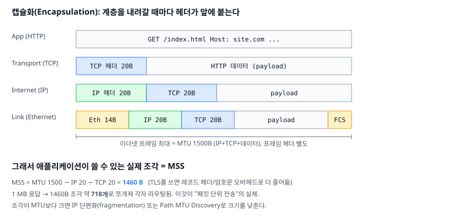
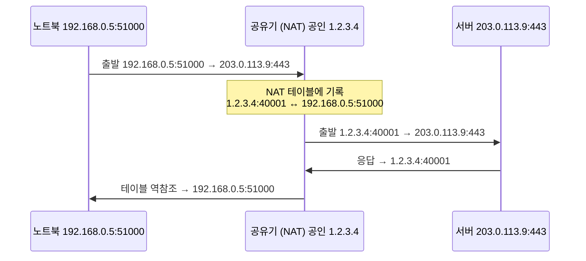

# 01. 패킷의 여행 — IP, 라우팅, NAT

> **핵심 질문**
> 내 노트북에서 나온 데이터 한 조각은, 전체 경로를 아무도 모르는데 어떻게 지구 반대편 서버를 정확히 찾아가는가?

## TL;DR

- 인터넷은 데이터를 통째로 보내지 않고 **1500B 이하 패킷**으로 쪼개 하나씩 흘려보낸다. 이게 전송의 원자다.
- 각 패킷은 목적지로 **IP 주소**(어느 기계)와 **포트**(그 기계의 어느 프로세스)를 적는다.
- 중간 **라우터**들은 목적지 IP만 보고 "다음 홉"으로 넘기는 릴레이일 뿐, 전체 경로를 아는 주체는 없다.
- 집·회사의 사설 IP는 **NAT**를 거쳐 하나의 공인 IP로 변환되어 나간다.
- IP는 "일단 보내본다(best-effort)"만 약속한다. 순서·도착 보장은 위층(TCP, 다음 문서)의 몫이다.

---

## 원자 분해

```
패킷의 여행
├─ 주소 체계 (누구에게?)
│  ├─ IP 주소 ── 기계를 가리키는 번호 (IPv4 32bit / IPv6 128bit)
│  └─ 포트    ── 기계 안의 프로세스를 가리키는 번호 (0~65535)
├─ 전송 단위 (무엇을?)
│  └─ 패킷    ── 헤더(주소·제어) + 페이로드, MTU 1500B로 상한
├─ 길찾기 (어떻게 도달?)
│  ├─ 라우팅 테이블 ── "이 대역이면 저 홉으로" 규칙표
│  ├─ 홉(hop)       ── 라우터 간 릴레이, TTL로 무한 루프 차단
│  └─ BGP           ── AS(자율 시스템) 간 경로 광고
└─ 주소 변환 (누가 대신 나가나?)
   └─ NAT ── 사설 IP:포트 ↔ 공인 IP:포트 매핑
```

---

## IP 주소 — 기계의 번호

IP 주소는 인터넷에 붙은 **기계(정확히는 네트워크 인터페이스)를 가리키는 번호**다.

- **IPv4**: 32bit → 약 **43억 개**. `203.0.113.9`처럼 8bit씩 4토막. 2011년 상위 대역이 이미 고갈됐다.
- **IPv6**: 128bit → 약 **3.4 × 10³⁸ 개**. `2001:db8::1`. 주소 고갈을 근본적으로 없앤다.
- **공인 vs 사설**: 사설 대역(`10.0.0.0/8`, `172.16.0.0/12`, `192.168.0.0/16`)은 인터넷에 그대로 못 나간다. 집 공유기 뒤 기기들이 쓰는 주소다.
- **CIDR / 서브넷**: `203.0.113.0/24`는 "앞 24bit가 네트워크, 뒤 8bit가 호스트" → 이 대역에 256개 호스트. 라우터는 이 **네트워크 부분**만 보고 길을 정한다.

> 직관: IP 주소는 "번지수"다. 도로명(네트워크)까지는 라우터가 안내하고, 마지막 집(호스트)은 그 동네가 찾는다.

IP 헤더 20B 안에는 이 여행에 필요한 최소 정보만 들어 있다:

```
0        8        16                   31 bit
┌────────┬────────┬─────────────────────┐
│버전/길이│  TOS   │     전체 길이         │
├────────┴────────┼──────┬──────────────┤
│   식별자         │flags │  fragment off │  ← 단편화 제어
├────────┬────────┼──────┴──────────────┤
│  TTL   │프로토콜 │     헤더 체크섬       │  ← 프로토콜=6이면 TCP, 17이면 UDP
├────────┴────────┴─────────────────────┤
│           출발지 IP (32bit)            │
├───────────────────────────────────────┤
│           목적지 IP (32bit)            │
└───────────────────────────────────────┘
```

주목할 점: 헤더 어디에도 **"순서 번호"나 "잘 받았다는 확인"이 없다.** IP는 그런 걸 책임지지 않기 때문이다. 이 공백이 곧 다음 문서(TCP)가 존재하는 이유다.

## 포트 — 프로세스의 번호

IP는 기계 문 앞까지만 데려다준다. 그 기계에서 웹서버·DB·SSH가 동시에 돌 때, **어느 프로세스로 줄지**를 정하는 게 포트다.

- 범위 **0 ~ 65535**(16bit). `1024` 미만은 well-known: **HTTP 80, HTTPS 443, DNS 53, SSH 22**.
- 하나의 연결은 **5-tuple**로 유일하게 식별된다: `(프로토콜, 출발 IP:포트, 목적 IP:포트)`.
- 브라우저가 서버에 붙을 때 출발 포트는 OS가 임시로 하나 빌려준다(**ephemeral port**, 보통 49152~65535).

그래서 한 서버의 `443` 포트에 수만 명이 붙어도, **클라이언트 IP:포트가 다르므로** 연결이 안 섞인다.

## 패킷 — 전송의 원자

데이터를 왜 통째로 안 보내고 쪼갤까? 세 가지 이유가 전부다.

1. **회선 공유(통계적 다중화)**: 한 사람이 1GB를 통으로 점유하면 나머지가 굶는다. 조각으로 쪼개 번갈아 보내면 회선을 공평하게 나눠 쓴다.
2. **국소 재전송**: 중간에 한 조각만 깨지면 그 조각만 다시 보내면 된다.
3. **경로 유연성**: 조각마다 다른 경로로 갈 수 있어, 한 링크가 죽어도 우회한다.



핵심 숫자:

| 항목 | 값 | 의미 |
|------|-----|------|
| MTU (이더넷) | **1500 B** | 프레임 하나에 담기는 IP 패킷 상한 |
| IP 헤더 | 20 B | 출발·목적 IP, TTL, 프로토콜 |
| TCP 헤더 | 20 B | 포트, seq/ack |
| **MSS** | **1460 B** | 실제 애플리케이션 데이터 = 1500 − 20 − 20 |

→ **1MB 응답은 약 718개 패킷**(1MB ÷ 1460B)으로 쪼개져 각자 여행한다. "패킷 단위 전송"의 실체가 이것이다. 조각이 MTU를 넘으면 IP 단편화(fragmentation)가 일어나거나, Path MTU Discovery로 크기를 낮춘다.

## 라우팅 — 홉 단위 릴레이

인터넷에는 "출발지→도착지 전체 경로"를 아는 주체가 **없다**. 각 라우터는 오직 **다음 한 걸음**만 안다.


- 라우터는 패킷의 **목적지 IP**를 라우팅 테이블에서 **longest prefix match**로 찾아 "다음 홉"으로만 넘긴다. 편지를 받은 우체국이 방향만 보고 다음 우체국으로 넘기는 것과 같다.
- **TTL(Time To Live)**: IP 헤더의 카운터(리눅스 기본 64). 홉을 지날 때마다 1씩 줄고, 0이 되면 패킷을 버린다. 라우팅 루프가 영원히 도는 것을 막는다. `traceroute`는 TTL을 1,2,3…으로 늘려 보내며 "누가 버렸는지"로 경로를 역추적한다.
- 서울↔미국 같은 국제 경로도 실제 홉 수는 **10~20개** 정도다. 위 그림의 각 화살표가 그 한 홉이고, 홉마다 큐잉·직렬화 지연이 조금씩 쌓인다.
- DNS의 TTL(문서 03)과 이름만 같고 단위가 다르다: IP TTL은 **홉 수**, DNS TTL은 **초**. 관습적으로 "수명"이라는 같은 은유를 썼을 뿐이다.
- **BGP(Border Gateway Protocol)**: 통신사 규모의 **AS(자율 시스템)**들이 "이 IP 대역은 나한테 보내면 돼"라고 서로 광고하는 프로토콜. 인터넷의 대륙 간 지도를 만든다.

> 서울↔미국 동부의 물리적 왕복은 광속 한계로 **최소 ~70ms**, 실제로는 홉·큐 지연까지 더해 **150~200ms**가 흔하다. 이 숫자가 뒤 문서 전체를 지배한다.

**Anycast**: 같은 IP 주소를 세계 여러 곳의 서버가 동시에 광고하면, BGP가 각 사용자를 **가장 가까운 곳**으로 자동 라우팅한다. DNS 루트 서버(문서 03)와 CDN 엣지(문서 06)가 이 기법으로 "하나의 주소, 수백 개의 물리 위치"를 구현한다.

## best-effort — IP가 약속하지 않는 것

IP의 설계 철학은 **"똑똑한 끝단, 멍청한 중간(dumb network, smart edges)"**, 이른바 **end-to-end 원칙**이다. 중간 라우터는 최대한 단순하게(빠르게) 만들고, 복잡한 보장은 양 끝 컴퓨터가 맡는다. 그래서 IP는 딱 하나만 약속한다: **"버리지 않는 한 최선을 다해 다음 홉으로 넘긴다."** 반대로 약속하지 **않는** 것:

| IP가 보장 안 하는 것 | 실제로 벌어지는 일 | 누가 해결하나 |
|--------------------|------------------|-------------|
| 도착 | 큐가 넘치면 라우터가 그냥 **drop** | TCP 재전송 |
| 순서 | 조각마다 경로가 달라 **뒤바뀜** | TCP seq 재정렬 |
| 중복 없음 | 재전송이 겹쳐 **두 번** 올 수 있음 | TCP가 걸러냄 |
| 무결성 | 헤더 체크섬만 검사(데이터는 아님) | TCP/TLS 체크섬 |

이 표가 다음 문서의 예고편이다. **IP는 엽서를 "일단 부치는" 일까지만** 하고, "빠짐없이 순서대로 받았는지"는 위층이 조립한다.

## NAT — 사설망의 문지기

집에 노트북·폰·TV가 있어도 밖으로는 **공인 IP 하나**로 나간다. 그 변환을 하는 게 NAT다.



- **IPv4 고갈 완화**: 수십 대가 공인 IP 하나를 공유한다.
- **은근한 방화벽**: 밖에서 안으로 **먼저** 연결을 걸 수 없다(테이블에 항목이 없으니 어디로 보낼지 모른다).
- **부작용**: 그래서 P2P·화상통화는 STUN/TURN 같은 우회(hole punching)가 필요하다. 프론트에서 WebRTC를 다룰 때 이 벽을 만난다.

> IPv6가 있으면 NAT가 필요 없는데 왜 아직 쓰나? 전 세계 IPv6 채택률이 2020년대 중반에도 절반 안팎이라, ISP는 여러 가정을 공인 IP 하나로 다시 묶는 **CGNAT(Carrier-Grade NAT)**까지 쓴다. "왜 이렇게 복잡한가"의 답은 대개 "43억이라는 IPv4 주소가 애초에 너무 적었기 때문"이다.

---

## 프론트엔드에서 이렇게 만난다

- **`fetch('https://api.site.com/users')`도 결국 소켓 하나**다. 브라우저는 host를 IP로 바꾸고(다음다음 문서 DNS), `:443` 포트로 5-tuple 연결을 연다.
- **`localhost:3000` / `127.0.0.1`**: 루프백. 패킷이 NIC까지 안 가고 커널이 되돌린다. 그래서 개발 서버가 빠르다.
- **CORS의 `origin` = `scheme + host + port`**. `https://site.com`과 `https://site.com:8443`은 **다른 오리진**이다. 포트 하나 때문에 CORS가 터지는 이유.
- **"사내망에서만 되는 API"**: 사설 IP(`10.x`, `192.168.x`)로만 라우팅되는 서버. 집에서 VPN을 켜야 그 사설 대역으로 길이 뚫린다.
- 요청이 느릴 때 `traceroute api.site.com` / `mtr`로 어느 홉에서 지연·손실이 나는지 본다.

---

## 이전 계층과의 연결

- **패킷 큐 ↔ 1단계 [09 I/O·인터럽트](../claude/topics/09-io-and-interrupts.md)**: 도착한 패킷은 NIC의 링 버퍼에 쌓이고, **DMA**로 메모리에 올라온 뒤 **인터럽트**로 CPU를 깨운다. 초당 수백만 패킷이면 인터럽트 폭풍이 나므로 NAPI·인터럽트 병합 같은 기법을 쓴다. 네트워크의 "패킷 도착"은 1단계의 "I/O 완료"와 같은 사건이다.
- **소켓 ↔ 2단계 OS의 fd**: 소켓은 파일 디스크립터다. `read(fd)`가 `recv`, `write(fd)`가 `send`. 그래서 소켓도 `epoll`/`kqueue`로 감시한다(2단계 OS 모듈에서 이어짐).
- **longest prefix match ↔ 1단계 [06 캐시](../claude/topics/06-cache.md)**: 라우팅 테이블 조회는 캐시의 tag 매칭과 구조가 닮았다. 라우터는 이걸 TCAM(하드웨어 병렬 매칭)으로 나노초 단위에 한다.

---

## 파인만 체크 (10살에게 설명하기)

1. **편지와 우체국**: 전체 경로를 아무도 모르는데 편지(패킷)가 어떻게 도착하지? 우체국(라우터)이 "방향만" 보고 다음 우체국에 넘긴다는 걸로 설명해봐라. TTL이 왜 "편지에 붙은 남은 이동 횟수 도장"인지도.
2. **아파트 동·호수**: IP는 아파트 동, 포트는 호수라고 하자. 왜 동만으로는 부족하고 호수가 필요한지 말해봐라.
3. **큰 짐 나눠 부치기**: 이삿짐(1MB)을 상자 여러 개(패킷)로 쪼개 보내면, 하나가 깨졌을 때 왜 전부 다시 안 보내도 되는지 설명해봐라.
