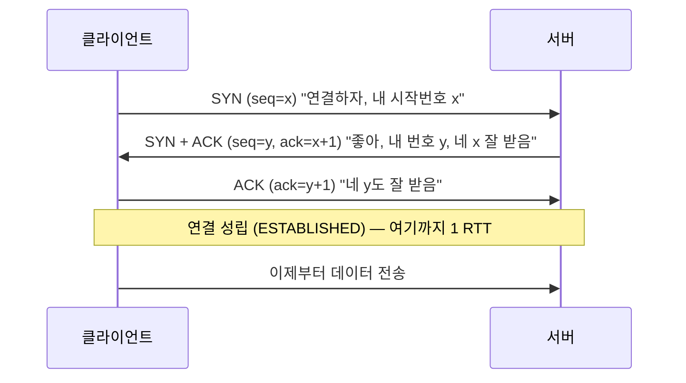
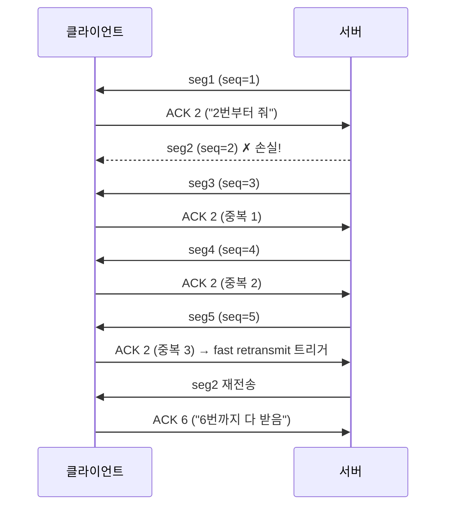

# 02. TCP와 UDP — 신뢰성은 공짜가 아니다

> **핵심 질문**
> IP는 그저 "보내보기(best-effort)"만 하는데, 어떻게 그 위에서 한 바이트도 빠짐없이, 순서대로 데이터가 도착하는가? 그리고 그 보장의 대가는 무엇인가?

## TL;DR

- TCP는 IP의 엽서(best-effort) 위에 **가상의 신뢰성 있는 파이프**를 얹는다: 순서 보장·무손실·중복 제거.
- 시작은 **3-way 핸드셰이크**(SYN → SYN·ACK → ACK, 1 RTT). 데이터엔 **순서번호(seq)**, 받으면 **확인응답(ACK)**, 안 오면 **재전송**.
- 받는 쪽 속도에 맞추는 **흐름 제어(receive window)**, 망 혼잡에 맞추는 **혼잡 제어(slow start·AIMD)**가 붙는다.
- 이 모든 보장의 비용이 **HOL 블로킹**: 앞 조각 하나가 늦으면 뒤 조각 전부가 대기한다.
- **UDP**는 이를 전부 포기하고 "그냥 던진다". 실시간·DNS·QUIC(HTTP/3)의 토대다.

---

## 원자 분해

```
TCP / UDP
├─ 연결 수립
│  └─ 3-way handshake ── SYN / SYN·ACK / ACK, 1 RTT, ISN 교환
├─ 신뢰성 (TCP의 심장)
│  ├─ seq / ack ── 바이트마다 번호, 누적 확인
│  ├─ 재전송    ── RTO(타임아웃) + fast retransmit(중복 ACK 3회)
│  └─ 재정렬    ── 수신 버퍼에서 순서대로 조립
├─ 속도 조절
│  ├─ 흐름 제어 ── receive window (느린 수신자 보호)
│  └─ 혼잡 제어 ── slow start → AIMD (네트워크 보호)
├─ 비용
│  └─ HOL 블로킹 ── 순서 보장의 그림자
└─ UDP ── 무연결·무보장, 대신 8B 헤더로 가볍고 빠름
```

---

## 3-way 핸드셰이크 — 통화 연결음

데이터를 보내기 전에 양쪽은 먼저 **"서로 잘 들리는지"**를 확인한다.



- **왜 3번인가?** 양쪽이 서로의 **송신·수신 능력**을 모두 확인해야 한다. 2번이면 서버는 클라이언트가 자기 응답을 받았는지 모른다.
- **ISN(초기 순서번호)은 랜덤**이다. 예측 가능하면 공격자가 연결을 가로챌 수 있고, 이전 연결의 늦은 패킷과 섞일 수 있다.
- **비용 = 1 RTT**. 실제 데이터 한 바이트도 보내기 전에 왕복 한 번을 쓴다. 서울↔미국이면 이 악수만 **~180ms**. 그래서 `preconnect`(문서 06)가 이걸 미리 해두려는 것이다.
- **SYN flood**: 공격자가 SYN만 잔뜩 보내고 마지막 ACK를 안 보내면, 서버는 반쯤 열린 연결로 큐가 찬다. 방어는 **SYN cookie**(상태를 저장하지 않고 응답에 서명을 실어 보냄).

**연결 종료는 4-way다.** 여는 건 3번, 닫는 건 각자 "나 할 말 끝났어(FIN)"를 보내고 상대가 확인(ACK)하므로 총 4번이다.

```
C ──FIN──▶ S      C: "난 다 보냈어"
C ◀─ACK── S       S: "알겠어"
C ◀─FIN── S       S: "나도 다 보냈어"
C ──ACK──▶ S      C: "확인"  → 이후 C는 TIME_WAIT로 대기
```

- **TIME_WAIT**: 마지막 ACK를 보낸 쪽은 소켓을 **2×MSL(약 60초)** 붙잡는다. 뒤늦게 온 패킷이 같은 포트의 새 연결을 오염시키지 않도록. 트래픽 많은 서버에서 소켓·포트 고갈의 흔한 원인이라, `SO_REUSEADDR`·연결 재사용으로 완화한다.

## 순서 보장과 재전송 — 번호표와 영수증

TCP는 보내는 **모든 바이트에 순서번호(seq)**를 매긴다. 받는 쪽은 "여기까지 연속으로 잘 받았다"를 **ACK**로 알린다(누적 확인).

- **RTO(재전송 타임아웃)**: ACK가 예상 시간 안에 안 오면 재전송한다. 타임아웃 값은 측정된 RTT로 동적 조정(SRTT + 4×변동)한다. 너무 짧으면 헛재전송, 너무 길면 복구가 굼뜨다.
- **Fast retransmit**: 타임아웃을 기다리면 느리다. 같은 ACK가 **3번 중복**으로 오면 "3번 조각이 빠졌구나"로 판단하고 즉시 재전송한다.
- **SACK(Selective ACK)**: "3번만 빼고 4~7 다 받았다"를 알려, 이미 받은 것까지 다시 보내는 낭비를 막는다.
- **재정렬**: 조각은 경로가 달라 뒤바뀌어 도착할 수 있다. TCP는 수신 버퍼에서 seq 순으로 **다시 정렬해** 애플리케이션에 순서대로 넘긴다.



> 즉 IP가 흩뿌린 조각들을, TCP가 양 끝에서 번호표(seq)와 영수증(ACK)으로 **완전한 스트림으로 복원**한다. IP 헤더에 없던 바로 그 두 필드다(문서 01). 위 그림에서 중복 ACK 3개가 타임아웃보다 **훨씬 빨리** 손실을 알려주는 게 fast retransmit의 이득이다.

## 흐름 제어 — 수신자가 손을 든다

빠른 서버가 느린 클라이언트에게 쏟아부으면 수신 버퍼가 넘친다. 그래서 수신자는 매 ACK에 **receive window(rwnd)** = "지금 내 버퍼에 남은 여유"를 실어 보낸다. 송신자는 **확인 안 된 데이터를 rwnd 이상 날리지 않는다**. 버퍼가 꽉 차 `rwnd=0`이 되면 송신이 멈추고, 주기적 probe로 여유가 생겼는지 확인한다.

## 혼잡 제어 — 도로가 막히면 속도를 줄인다

흐름 제어가 **수신자**를 보호한다면, 혼잡 제어는 **네트워크 전체**를 보호한다. 모두가 무작정 최대로 쏘면 라우터 큐가 터져 대량 손실이 난다(혼잡 붕괴). TCP는 별도의 **혼잡 윈도우(cwnd)**를 두고, 실제 전송량은 `min(rwnd, cwnd)`로 정한다.

- **Slow start**: 처음엔 조심스럽게. `cwnd`를 초기 **10 MSS(약 14KB)**에서 시작해 ACK를 받을 때마다 **지수적으로**(1→2→4→8…) 늘린다.
- **Congestion avoidance**: `ssthresh` 문턱을 넘으면 폭주를 멈추고 **선형** 증가로 전환한다.
- **손실 = 혼잡 신호**: 패킷 손실이 감지되면 `cwnd`를 확 줄인다. 이 **AIMD(Additive Increase, Multiplicative Decrease)** 톱니가 TCP 처리량의 특징적 모양이다.

```
cwnd
 │           손실!             손실!
 │            ↓                 ↓
 │        ／|              ／|
 │      ／  |  (선형 증가)／  |
 │    ／    ↓ 반토막    ／    ↓ 반토막
 │  ／      |         ／      |
 │／________|_______／________|____▶ 시간
   slow start(지수)  congestion avoidance(선형)
```

- **알고리즘의 진화**: 리눅스 기본은 **CUBIC**(시간의 3차 함수로 더 공격적 회복). 구글의 **BBR**은 손실이 아니라 **대역폭·RTT를 직접 모델링**해, 버퍼가 부풀어도(bufferbloat) 속지 않는다.

> 핵심 함의: **새 연결은 항상 느리게 시작한다.** cold TCP는 `cwnd`가 작아, 큰 응답의 첫 구간이 특히 굼뜨다. 그래서 연결 재사용(keep-alive)과 CDN이 중요하다 — 이미 `cwnd`가 자란 연결을 쓰는 셈이다.

**숫자로 보는 창의 힘 (BDP)**: 한 번에 날릴 수 있는 양은 창(window) 크기에, 처리량은 `창 ÷ RTT`에 묶인다. 대역폭 100Mbps, RTT 100ms 경로를 꽉 채우려면 창이 최소 `100Mbps × 0.1s ÷ 8 = 1.25MB` 있어야 한다. 창이 64KB로 고정돼 있으면? `64KB ÷ 0.1s ≈ 5Mbps`밖에 못 낸다. **회선이 100Mbps여도 5Mbps로 기어간다.** 고대역·고지연 경로에서 "대역폭을 늘려도 안 빨라지는" 미스터리의 답이 이 창 크기다(문서 06의 "RTT vs 대역폭"으로 이어진다).

## HOL 블로킹 — 순서 보장의 그림자

순서 보장에는 대가가 있다. 조각 3이 손실되면, 뒤이은 **4·5·6이 멀쩡히 도착해도** TCP는 앱에 넘겨주지 못한다. "순서대로"를 약속했기 때문이다. 3이 재전송돼 도착할 때까지 **모두 대기**한다.

```
수신 버퍼:  [1][2][ ✗3 ][4][5][6]   ← 3만 손실
앱에 전달:  [1][2] ...  🚧 여기서 정지 (3 기다리는 중, 4~6 인질)
```

이 **Head-of-Line 블로킹**이 문서 05의 핵심 갈등이다. HTTP/2는 요청들을 **하나의 TCP 연결**에 다중화하는데, 그 연결에서 패킷 하나가 손실되면 **무관한 다른 요청들까지 전부 멈춘다.** HTTP/3가 TCP를 버리고 QUIC(UDP 기반)으로 간 이유가 바로 이 블로킹을 스트림별로 끊어내기 위해서다.

## UDP — 신뢰성을 버린 자유

UDP는 TCP가 하는 걸 **거의 다 안 한다**. 헤더는 **8B**(출발·목적 포트, 길이, 체크섬)뿐. 핸드셰이크 없음, ACK 없음, 재전송 없음, 순서 없음, 혼잡 제어 없음.

| | TCP | UDP |
|---|-----|-----|
| 연결 | 3-way 핸드셰이크 (1 RTT) | 없음, 바로 전송 |
| 신뢰성 | 순서·무손실·중복제거 | 없음 (앱이 알아서) |
| 헤더 | 20B+ | 8B |
| 속도 조절 | 흐름·혼잡 제어 | 없음 |
| 쓰는 곳 | 웹·파일·메일 | DNS, 게임, 음성/영상, QUIC |

왜 신뢰성을 버릴까? **늦은 정확함보다 이른 대충이 나은 경우**가 있기 때문이다.

- **실시간(게임·음성)**: 0.3초 전 화면을 재전송받느니 그냥 **다음 프레임**을 받는 게 낫다.
- **DNS(문서 03)**: 요청 1개·응답 1개면 끝인데 핸드셰이크 1 RTT가 아깝다.
- **QUIC / HTTP-3(문서 05)**: TCP의 경직성(HOL, 커널 고정 구현)을 피하려고, **UDP 위에 필요한 신뢰성만 새로 얹는다**. "TCP를 버렸다"기보다 "TCP를 사용자 공간에서 다시 설계했다"에 가깝다.

---

## 프론트엔드에서 이렇게 만난다

- **연결 비용이 곧 지연**이다. 새 오리진에 붙으려면 TCP 1 RTT + TLS 1~2 RTT. cross-region이면 그것만 수백 ms → 그래서 **keep-alive로 연결을 재사용**한다.
- DevTools Network 탭의 타이밍 바에서 **"Initial connection"**(TCP 핸드셰이크), **"SSL"**(TLS), **"Stalled"**(연결 대기)가 이 문서의 실물이다.
- **HTTP/1.1의 "오리진당 6연결" 제한** = 6개의 독립 TCP 파이프. 각자 slow start를 다시 겪는다.
- **HTTP/2 단일 연결의 취약점** = TCP HOL. 손실률 높은 모바일에서 HTTP/2가 오히려 느려지는 순간이 여기서 나온다 → 문서 05.
- WebRTC 데이터채널, HTTP/3는 모두 **UDP 기반**이다.
- **Nagle 알고리즘 + delayed ACK의 함정**: TCP는 작은 조각을 모아 한 번에 보내려(Nagle) 하고, 수신자는 ACK를 조금 미룬다(delayed ACK, ~40ms). 이 둘이 겹치면 작은 요청·응답이 왕복마다 **최대 40ms씩 지연**된다. 실시간성이 중요한 소켓은 `TCP_NODELAY`로 Nagle을 끈다. 프론트에서 WebSocket·SSE의 미세 지연을 쫓다 보면 이 이름을 만난다.

> **왜 브라우저는 오리진당 연결을 6개로 제한할까?** 연결이 많을수록 각자 slow start를 반복하고 서버 소켓을 잡아먹어, 오히려 전체가 느려지고 서버를 괴롭힌다. "무한정 병렬"이 답이 아니라는 이 깨달음이 HTTP/2 단일 연결 설계로 이어진다(문서 05).

---

## 이전 계층과의 연결

- **수신·재전송 버퍼 ↔ 1단계 메모리**: TCP는 "확인 안 된 데이터"를 재전송용으로 **메모리에 붙들고** 있어야 한다. 소켓 버퍼 크기(`SO_RCVBUF`)와 대역폭·지연 곱(**BDP = 대역폭 × RTT**)이 최대 처리량을 좌우한다. 고대역·고지연 경로일수록 큰 버퍼가 필요하다.
- **슬라이딩 윈도우 ↔ 1단계 [03 파이프라인](../claude/topics/03-pipeline.md)**: "여러 조각을 확인 전에 미리 in-flight로 날린다"는 발상은 CPU 파이프라인이 명령을 겹쳐 처리하는 것과 같은 아이디어다. 창(window)이 곧 파이프의 깊이다.
- **소켓 fd·ACK 타이머 ↔ 2단계 OS**: 소켓은 fd이고, ACK 처리와 RTO 타이머는 커널이 인터럽트/타이머로 돌린다. `epoll`이 "이 소켓에 읽을 게 생겼다"를 알려주는 그 소켓이다.

---

## 파인만 체크 (10살에게 설명하기)

1. **전화 여보세요**: 3-way 핸드셰이크를 "여보세요?" — "응, 잘 들려?" — "어, 나도 잘 들려"로 설명해봐라. 왜 두 마디로는 부족한지도.
2. **번호표와 영수증**: 택배 상자마다 번호표(seq)를 붙이고, 받는 사람이 "5번까지 받았어요"(ACK)라고 답하는 걸로 재전송을 설명해봐라. 5번이 안 오면 어떻게 되지?
3. **고속도로 진입 미터링**: 차가 막히면 진입 램프 신호로 차를 조금씩만 들여보낸다. slow start와 "막히면 속도 반으로"(AIMD)를 이 비유로 설명해봐라.
