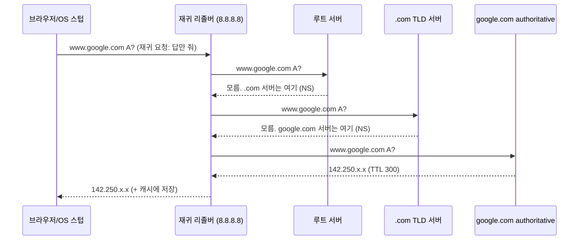

# 03. DNS — 이름을 숫자로 바꾸는 분산 전화번호부

> **핵심 질문**
> `www.google.com`이라는, 사람이 읽는 이름은 어떻게 `142.250.x.x`라는 숫자가 되는가? 그리고 왜 매번 전 세계에 물어보지 않아도 되는가?

## TL;DR

- DNS는 사람이 읽는 이름(도메인)을 IP로 바꾸는 **전 세계 분산 데이터베이스**다.
- 이름은 계층 구조(root → TLD → authoritative)이고, **리졸버**가 이 계층을 대신 순회해 답을 찾아 온다.
- 매번 순회하면 느리므로 **여러 층의 캐시**(브라우저 → OS → 리졸버)가 **TTL**이 만료될 때까지 답을 재사용한다.
- 첫 조회(cold)는 **20~120ms**, 캐시 히트는 거의 **0ms**. 그래서 사이트 첫 방문이 유독 느리다.
- 프론트는 `dns-prefetch`·`preconnect`로 이 비용을 페이지 파싱 전에 미리 치른다.

---

## 원자 분해

```
DNS
├─ 이름 공간 (계층 구조)
│  ├─ root (.)        ── 13개 논리 서버, anycast
│  ├─ TLD             ── .com, .org, .kr …
│  └─ authoritative   ── 그 도메인의 진짜 답을 가진 서버
├─ 질의 방식
│  ├─ recursive(재귀) ── 리졸버가 "끝까지 대신 알아봐 줌"
│  └─ iterative(반복) ── 각 서버는 "다음은 저기 가봐"만 알려줌
├─ 캐싱 계층 (안 느린 진짜 이유)
│  ├─ 브라우저 캐시 → OS 스텁 캐시 → 리졸버 캐시
│  └─ TTL ── 각 답의 캐시 수명(초)
├─ 레코드 타입 ── A / AAAA / CNAME / NS / MX / TXT
└─ 프론트 최적화 ── dns-prefetch, preconnect, DoH/DoT
```

---

## 이름은 계층이다 — 오른쪽부터 읽는다

`www.google.com`은 사실 오른쪽 끝에 숨은 점이 있다: `www.google.com.` 이 마지막 점이 **루트(root)**다. 이름은 **오른쪽에서 왼쪽으로** 좁혀진다.

```
        .            ← root: "com 서버는 저기 있다"
        └── com      ← TLD: "google 서버는 저기 있다"
             └── google   ← authoritative: "www는 142.250.x.x다"
                  └── www
```

- **위임(delegation)**: 루트는 최종 답을 모른다. 오직 **"`.com`을 관리하는 서버가 어디인지"**만 안다. `.com` 서버는 `google.com`의 authoritative 서버 위치만 안다. 각 층은 **"다음 층이 어디인지"만** 알고 책임을 넘긴다.
- **왜 계층인가?** 전 세계 수억 개 도메인을 한 곳에서 관리하는 건 불가능하다. 계층+위임으로 각 조직이 자기 이름만 관리하면 **무한히 확장**된다. 이것이 DNS의 핵심 설계다: 중앙 집중이 아니라 위임된 분산.

> **왜 루트 서버는 하필 "13개"인가?** DNS는 원래 UDP 한 패킷(512B)에 응답이 다 들어가도록 설계됐다(문서 02의 UDP). 512B 안에 루트 서버 목록(NS + 주소)을 담으려니 **13개가 상한**이었다. 지금은 EDNS0로 이 한계가 풀렸지만 번호(a~m.root-servers.net)는 남았고, 각 번호는 anycast로 **실제 수백 대**다. "왜 이 숫자인가"의 답이 패킷 크기라는 게 네트워크다운 이야기다.

## 재귀 vs 반복 질의 — 심부름꾼과 안내판

내 컴퓨터는 이 순회를 직접 하지 않는다. **재귀 리졸버**에게 "알아서 답만 가져와"라고 시킨다.



- **스텁 리졸버**(OS의 `getaddrinfo`): 앱을 대신해 리졸버에 **재귀 질의**를 던진다. "네가 끝까지 책임지고 답을 가져와."
- **재귀 리졸버**(ISP나 `8.8.8.8`/`1.1.1.1`): 루트 → TLD → authoritative를 **반복 질의**로 훑는다. 각 서버는 최종 답 대신 "다음 안내판"만 준다.
- **왜 역할을 나눌까?** 클라이언트는 단순하게(스텁 하나) 유지하고, 무겁고 반복적인 순회는 리졸버가 대행한다. 게다가 리졸버 하나가 **수많은 사용자의 캐시를 공유**하므로, 인기 도메인은 대부분 이미 캐시에 있다.

이 순회를 눈으로 보려면 `dig +trace`를 쓴다:

```
$ dig +trace www.example.com
.            NS   a.root-servers.net ...      ← 루트가 준 안내판
com.         NS   a.gtld-servers.net ...      ← .com TLD 안내판
example.com. NS   ns1.example.com ...         ← authoritative 안내판
www.example.com. 300 IN A 93.184.216.34       ← 최종 답 (TTL 300초)
```

각 줄이 "한 층 내려가며 다음 안내판을 받는" 반복 질의의 실물이다. 마지막 줄의 `300`이 TTL이다.

## 캐싱과 TTL — 안 느린 진짜 이유

위 순회를 매번 하면 방문마다 수십 ms가 깨진다. 그래서 **모든 층이 답을 캐시**한다.

```
브라우저 DNS 캐시   (수십 초~분, 크롬은 자체 캐시)
      │ miss
OS 스텁 리졸버 캐시  (nscd/systemd-resolved)
      │ miss
재귀 리졸버 캐시     (ISP/8.8.8.8 — 수백만 명이 공유)
      │ miss
authoritative 순회   ← 여기까지 내려가면 "cold"
```

- **TTL(Time To Live)**: 각 레코드에 붙는 "이만큼(초) 캐시해도 된다"는 수명. `300`(5분), `3600`(1시간)이 흔하다. 캐시된 답은 TTL이 지나면 버려지고 다시 조회한다.
- **트레이드오프**: TTL이 **길면** 빠르지만(캐시 잘 맞음) 서버 IP를 바꿔도 반영이 느리다 → 장애 조치(failover)·마이그레이션이 굼떠진다. **짧으면** 유연하지만 질의가 폭증한다. 그래서 배포 직전엔 TTL을 60초로 낮춰 두는 운영 기법을 쓴다.
- **숫자**: cold 조회는 **20~120ms**(리졸버가 얼마나 순회하냐에 따라), 캐시 히트는 사실상 **0ms**. 첫 바이트까지의 예산(문서 04 타임라인)에서 DNS가 통째로 사라질 수도, 통째로 얹힐 수도 있다.
- **부정 캐싱(negative caching)**: "그런 이름 없다(NXDOMAIN)"라는 답도 캐시된다. 그래서 방금 만든 서브도메인이 한동안 "없음"으로 잡히는 일이 생긴다. 오타 도메인에 대한 반복 질의로 인프라가 시달리지 않게 하는 장치이기도 하다.

**전송은 UDP 53, 큰 답은 TCP로 승격**: DNS 질의는 대부분 UDP 한 방(요청 1 · 응답 1)으로 끝난다 — TCP 핸드셰이크 1 RTT가 아까우니까. 응답이 512B(EDNS0면 더 큰 값)를 넘치면 "잘렸음(truncated)" 플래그를 세우고 **TCP로 재질의**한다. DNSSEC 서명이나 큰 레코드가 이 경계를 넘긴다.

**TTL이 운영에서 아픈 순간**: 서버 IP를 급히 바꿔야 하는 장애 상황을 생각해보자.

```
TTL 3600(1시간)으로 걸어둔 상태에서 서버가 죽음
 → 최악의 경우 전 세계 리졸버 캐시가 비워질 때까지 최대 1시간, 사용자는 죽은 IP로 계속 감
TTL을 60초로 낮춰뒀다면
 → 1분이면 새 IP로 전환. 대신 질의량은 60배
```

그래서 마이그레이션·배포 전날 TTL을 낮췄다가(“TTL 워밍다운”) 안정되면 다시 올리는 게 정석이다. **캐시의 수명을 내 손으로 조율하는** 흔치 않은 순간이다.

## 레코드 타입 — 이름표의 종류

| 타입 | 의미 | 예 |
|------|------|-----|
| **A** | 이름 → IPv4 | `google.com → 142.250.x.x` |
| **AAAA** | 이름 → IPv6 | `→ 2404:6800::...` |
| **CNAME** | 별칭(이 이름은 사실 저 이름) | `www → cdn.provider.net` |
| **NS** | 이 도메인의 authoritative 서버 | 위임에 사용 |
| **MX** | 메일 서버 | 이메일 라우팅 |
| **TXT** | 임의 텍스트 | SPF, 도메인 소유 검증 |

- **CNAME 체인**의 함정: `www.site.com → site.map.cdn.net → A 레코드`처럼 별칭이 이어지면, 리졸버가 각 단계를 따라가며 **추가 왕복**이 생긴다. 최상위(apex) 도메인엔 CNAME을 못 붙이는 제약(ANAME/ALIAS로 우회)도 여기서 나온다.

## 프론트 최적화 & 보안

- **`<link rel="dns-prefetch" href="//cdn.example.com">`**: 이 도메인의 DNS를 **미리** 조회해 둔다. HTML 파서가 그 자원을 만나기 전에 이름→IP를 끝내 둔다.
- **`<link rel="preconnect" href="https://api.example.com">`**: DNS에 더해 **TCP 핸드셰이크와 TLS까지** 미리(문서 06). dns-prefetch보다 강력하지만 비싸니 정말 곧 쓸 오리진에만.
- **DoH(DNS over HTTPS) / DoT**: 원래 DNS는 UDP 53 **평문**이라 중간에서 어떤 사이트를 보는지 엿보고 조작할 수 있다. DoH는 이를 HTTPS로 감싼다. 최신 브라우저는 OS를 거치지 않고 **직접 DoH**로 질의하기도 한다.

실제 `<head>`에 넣는 모습:

```html
<!-- 곧 쓸 게 확실한 오리진: DNS+TCP+TLS까지 미리 -->
<link rel="preconnect" href="https://api.example.com" crossorigin>
<link rel="preconnect" href="https://fonts.gstatic.com" crossorigin>
<!-- 쓸지도 모르는 오리진: 값싼 DNS만 미리 -->
<link rel="dns-prefetch" href="//analytics.example.com">
```

`preconnect`는 연결을 통째로 잡아 두므로 **3~4개 이내**로 아껴 쓴다. 남발하면 정작 중요한 자원의 연결 슬롯을 뺏는다. "가능성"만 있는 도메인은 값싼 `dns-prefetch`로 충분하다.

---

## 프론트엔드에서 이렇게 만난다

- DevTools Network 타이밍의 **"DNS Lookup"** 막대가 이 문서다. cold면 수십 ms, warm이면 0에 수렴한다.
- **첫 방문이 유독 느린** 흔한 원인: 페이지가 참조하는 서드파티 도메인(analytics, 폰트, 광고, CDN)마다 DNS 조회가 처음이라 순차적으로 쌓인다.
- 그래서 `<head>` 상단에 자주 쓰는 서드파티 오리진을 **`dns-prefetch`/`preconnect`**로 선언한다. Lighthouse의 "Preconnect to required origins" 감사가 이걸 지적한다.
- SPA라면 첫 API 호출 도메인을 **`preconnect`** 해두면, 앱 번들이 실행되어 `fetch`를 부를 즈음엔 연결이 이미 준비돼 있다.
- 긴 CNAME 체인을 쓰는 CDN 설정은 조회 왕복을 늘린다 — WebPageTest의 워터폴에서 눈으로 확인된다.
- 크롬은 페이지의 `<a href>` 링크 도메인을 미리 조회해 두기도 한다(예측 프리페치). 사용자가 링크를 누르기 전에 DNS를 끝내려는 것. 개인정보 설정에서 끌 수 있다.
- `chrome://net-internals/#dns`에서 브라우저 자체 DNS 캐시를 들여다보고 비울 수 있다 — "DNS 바꿨는데 왜 안 바뀌지"의 첫 점검 지점.

---

## 이전 계층과의 연결

- **캐시 계층 + TTL ↔ 1단계 [06 캐시](../claude/topics/06-cache.md)**: 브라우저→OS→리졸버로 내려가는 DNS 캐시 계층은 L1→L2→L3→DRAM과 **정확히 같은 구조**다. "가까울수록 빠르고 작고, 멀수록 느리고 크다." 그리고 **TTL은 시간 기반 무효화**로, 캐시의 만료·교체 정책과 한 몸이다.
- **스텁·리졸버 ↔ 2단계 OS**: 앱이 부르는 `getaddrinfo()`는 라이브러리 함수(스텁)이고, 실제 조회 정책은 `/etc/resolv.conf`, 로컬 오버라이드는 `/etc/hosts`가 쥔다. 리졸버는 별도 프로세스/데몬이다.
  - 참고로 `/etc/hosts`가 DNS보다 **우선**한다. 개발 중 특정 도메인을 로컬로 돌릴 때 여기에 한 줄 추가하는 게 그 이유다.
- **anycast ↔ 문서 01 라우팅**: "13개 루트 서버"는 실제로는 anycast로 전 세계에 수백 대가 흩어져 있고, BGP가 나를 가장 가까운 인스턴스로 보낸다. 문서 06의 CDN과 같은 원리다.
- **부정 캐싱 ↔ 캐시 무효화**: "없음(NXDOMAIN)"을 캐시하는 것도 1단계 캐시의 "미스도 기록"과 같은 최적화다. 같은 헛질의를 반복하지 않으려는 발상.

---

## 파인만 체크 (10살에게 설명하기)

1. **도서관 사서(재귀)**: 네가 사서에게 "이 책 어디 있어요?"라고 물으면, 사서가 대신 여러 서고를 돌아 찾아 가져다준다. 재귀 리졸버가 왜 "심부름꾼"인지, 루트·TLD가 왜 "책 전체가 아니라 다음 서고 위치만" 알려주는지 설명해봐라.
2. **전화번호부를 왜 나눌까**: 전 세계 번호를 한 권으로 못 만드는 이유(계층·위임)와, 자주 거는 번호를 수첩에 적어두는 이유(캐시)를 연결해 설명해봐라.
3. **우유 유통기한(TTL)**: 냉장고 우유에 유통기한이 있듯 캐시된 답에도 수명이 있다. 기한이 길면/짧으면 각각 뭐가 좋고 나쁜지 말해봐라.
