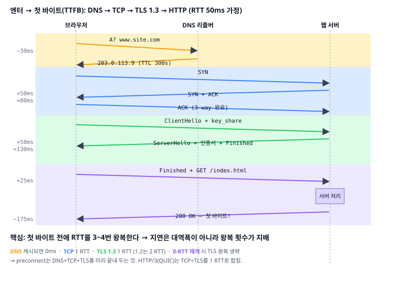
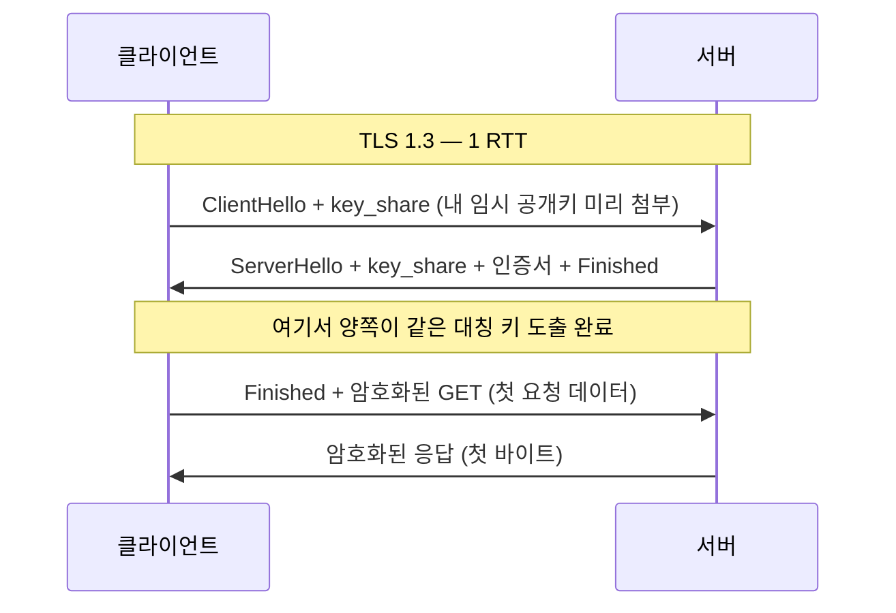

# 04. TLS — 처음 보는 서버와 비밀 채널 열기

> **핵심 질문**
> 중간에서 누구나 엿볼 수 있는 인터넷에서, 어떻게 방금 처음 본 서버와 "나와 그 서버만 아는" 비밀 채널을 여는가? 그리고 그 서버가 **진짜 그 서버**인지 어떻게 믿는가?

## TL;DR

- TLS는 평문 TCP 위에 **기밀성·무결성·인증** 세 가지를 얹는다.
- **비대칭 암호**로 키를 안전하게 합의하고, 그 키로 **대칭 암호**를 써서 실제 데이터를 빠르게 암호화한다.
- "이 서버가 진짜인가"는 **인증서 체인**과, 브라우저에 미리 심긴 **루트 CA**로 검증한다.
- TLS 1.3은 핸드셰이크를 **1 RTT**로 줄였고(1.2는 2 RTT), 재방문엔 **0-RTT**도 가능하다.
- HTTPS는 프론트에 규칙을 강제한다: mixed content 차단, secure context 전용 API 등.

---

## 원자 분해

```
TLS
├─ 목표 (왜 필요한가)
│  ├─ 기밀성 ── 엿봐도 못 읽음        (암호화)
│  ├─ 무결성 ── 변조하면 들킴          (AEAD 태그)
│  └─ 인증   ── 상대가 진짜인가        (인증서)
├─ 암호의 조합 (왜 둘을 섞나)
│  ├─ 비대칭(공개키) ── 키 합의·서명, 느림
│  └─ 대칭(AES)      ── 대량 데이터, 빠름
├─ 신뢰의 사슬
│  ├─ 인증서       ── 공개키 + 신원 + CA 서명
│  ├─ 체인         ── leaf → 중간 CA → root
│  └─ 루트 스토어  ── OS/브라우저가 미리 신뢰
├─ 핸드셰이크
│  ├─ TLS 1.2 (2 RTT)
│  ├─ TLS 1.3 (1 RTT)
│  └─ 세션 재개 / 0-RTT
└─ HTTPS가 프론트에 강제하는 것
   ├─ mixed content
   ├─ HSTS
   └─ secure context (SW·geolocation·Web Crypto…)
```

---

## 세 가지 목표 — 암호화'만'이 아니다

TLS를 "암호화"로만 아는 건 절반이다. 세 다리로 선다.

1. **기밀성(Confidentiality)**: 도청자가 패킷을 다 캡처해도 내용을 못 읽는다.
2. **무결성(Integrity)**: 중간에서 한 비트라도 바꾸면 **수신 측이 즉시 안다**(AEAD 인증 태그가 안 맞음).
3. **인증(Authentication)**: 지금 대화하는 상대가 **진짜 그 도메인의 소유자**임을 확인한다.

세 번째가 없으면 나머지가 무의미하다. 인증 없이 암호화만 하면, **중간자(MITM)와 열심히 암호화**하고 있을 수 있다. 그래서 "자물쇠 아이콘"은 암호화가 아니라 **"신원 확인된 상대와 암호화 중"**을 뜻한다.

## 비대칭 + 대칭 = 실용적 타협

두 종류의 암호는 정반대의 장단점을 가진다. TLS는 **둘을 섞어** 각자의 약점을 가린다.

| | 비대칭 (RSA, ECDHE) | 대칭 (AES-256) |
|---|---|---|
| 키 | 공개키/개인키 쌍 | 하나의 공유 비밀 |
| 용도 | 키 합의, 서명 | 실제 데이터 암호화 |
| 속도 | **느림** (수천 배) | **빠름** (AES-NI로 GB/s) |
| 문제 | 대량 데이터엔 부적합 | 키를 어떻게 안전히 나눠 갖지? |

- **아이디어**: 비대칭으로 **"대칭 키 하나를 안전하게 합의"**만 하고, 이후 실제 트래픽은 전부 빠른 대칭 암호로 처리한다. 무거운 공개키 연산은 핸드셰이크 때 딱 한 번.
- **ECDHE 키 교환 + 순방향 비밀성(Forward Secrecy)**: 현대 TLS는 매 세션 **임시 키**를 생성해 합의한다. 그래서 훗날 서버 개인키가 유출돼도 **과거에 녹음된 세션은 복호화되지 않는다.** "지금 훔쳐 저장했다가 나중에 깨겠다"는 공격을 막는다.

## 인증서 체인 — 신뢰를 위임한다

"이 공개키가 정말 `bank.com`의 것"임을 어떻게 믿나? 제3자인 **CA(인증 기관)**가 보증한다.

```
   [ 루트 CA ]          ← OS/브라우저에 미리 심긴 신뢰의 앵커 (~100여 개)
        │ 서명
   [ 중간 CA ]          ← 루트를 대신해 실무 발급 (루트 개인키 보호)
        │ 서명
   [ leaf 인증서 ]      ← bank.com: 공개키 + 도메인 + 유효기간
```

- **검증 과정**: 브라우저는 서버가 준 leaf 인증서의 서명을 중간 CA 공개키로, 중간 CA를 루트로 따라 올라가 **루트 스토어에 닿으면** 신뢰한다. 동시에 **도메인 일치**, **유효기간**, **폐기 여부**(OCSP/CRL)를 확인한다.
- **왜 루트를 믿나?** 브라우저·OS 제조사가 엄격한 감사를 거친 루트만 **미리** 스토어에 담아 배포하기 때문이다. 신뢰의 출발점(trust anchor)을 소프트웨어에 내장하는 것 — 이게 전체 웹 PKI의 뿌리다.
- **흔한 실수**: 서버가 **중간 CA 인증서를 빠뜨리고** leaf만 보내면, 어떤 클라이언트(중간 CA를 캐시 못 한)는 체인을 못 잇는다. "내 브라우저는 되는데 남은 안 되는" 인증서 오류의 단골 원인이다. Let's Encrypt가 인증서를 무료·자동(90일 갱신)으로 풀면서 HTTPS가 기본이 됐다.

서버가 실제로 보내는 체인을 눈으로 확인하려면:

```
$ openssl s_client -connect example.com:443 -showcerts
...
Certificate chain
 0 s:CN=example.com          ← leaf
   i:CN=R3, O=Let's Encrypt  ← 발급한 중간 CA
 1 s:CN=R3, O=Let's Encrypt  ← 중간 CA (여기가 비면 체인 오류!)
   i:CN=ISRG Root X1         ← 루트로 이어짐
```

각 인증서의 `s:`(주체)와 `i:`(발급자)가 사슬처럼 맞물려 루트까지 올라가야 한다. 검증 실패는 대개 (1) 중간 CA 누락, (2) 도메인 불일치(`CN`/`SAN`), (3) 만료 셋 중 하나다.

## 핸드셰이크 — 1.2 vs 1.3, 그리고 0-RTT



위 타임라인의 초록 구간이 TLS다. 버전에 따라 이 구간이 1 RTT냐 2 RTT냐가 갈린다.



- **TLS 1.2 (2 RTT)**: ClientHello → ServerHello+인증서 → 클라이언트가 키 교환 자료 전송 → 완료. 왕복 두 번을 쓴 뒤에야 데이터를 보낸다.
- **TLS 1.3 (1 RTT)**: 클라이언트가 **첫 메시지에 임시 키(key_share)를 미리** 실어 보낸다. 서버는 한 번의 응답으로 키 합의를 끝낸다. 왕복 한 번이 통째로 사라졌다.
- **0-RTT 재개(session resumption)**: 전에 접속한 적 있으면, 이전 세션에서 받은 티켓으로 **첫 요청 데이터까지 핸드셰이크와 함께** 보낸다 → 사실상 TLS 왕복 0. 단, 이 데이터는 **재전송 공격(replay)** 위험이 있어 **부작용 없는 요청(GET 등 idempotent)에만** 허용한다. "장바구니 담기" 같은 요청엔 못 쓴다.

**재개는 어떻게 "기억"하나?** 두 가지 방식이 있다.

- **Session ID**: 서버가 세션 상태를 자기 메모리에 저장하고 ID만 발급. 서버가 여러 대면 같은 서버로 가야 해서 확장이 불리하다.
- **Session Ticket**: 서버가 세션 상태를 **암호화해 클라이언트에게** 통째로 맡긴다(티켓). 재접속 때 클라이언트가 그 티켓을 도로 내밀면 서버는 저장 없이 복원한다. 서버가 상태를 안 들고 있어 **로드밸런싱에 유리**하다. 대신 티켓 암호화 키 관리가 forward secrecy의 새 급소가 된다.

**OCSP Stapling — 검증에 왕복을 더하지 않기**: 인증서가 폐기됐는지 확인하려면 원래 브라우저가 CA의 OCSP 서버에 따로 물어야 한다(또 다른 왕복 + CA 장애 시 지연). **OCSP stapling**은 서버가 미리 받아둔 "이 인증서 아직 유효함" 서명을 핸드셰이크에 **끼워서(staple)** 함께 준다. 검증을 위한 추가 왕복이 사라진다 — 이 문서 전체를 관통하는 "왕복을 줄여라"의 또 다른 사례다.

**핸드셰이크에서 협상되는 것**: ClientHello/ServerHello는 인사만 하는 게 아니라 **cipher suite**(키 교환·대칭 암호·해시의 조합, 예 `TLS_AES_128_GCM_SHA256`), TLS 버전, ALPN(다음 계층에서 HTTP/2를 쓸지 등, 문서 05)을 한 번에 정한다. 양쪽이 공통으로 지원하는 가장 강한 조합을 고른다.

**한 걸음씩 — TLS 1.3 핸드셰이크 안에서 벌어지는 일:**

1. 클라이언트가 지원하는 cipher suite 목록과 **임시 공개키(key_share)**를 ClientHello에 담아 보낸다.
2. 서버가 하나의 cipher suite를 고르고, **자기 임시 공개키**와 **인증서 체인**을 보낸다.
3. 양쪽은 각자의 개인키 + 상대의 공개키로 **같은 대칭 비밀**을 독립적으로 계산한다(Diffie-Hellman). 이 비밀은 **네트워크에 한 번도 흐르지 않는다.**
4. 클라이언트는 인증서 체인을 루트까지 검증하고 도메인·유효기간을 확인한다.
5. 검증 통과 즉시 그 대칭 키로 **첫 HTTP 요청을 암호화해** 함께 보낸다.
6. 서버가 암호화된 응답의 첫 바이트를 돌려준다.

3번이 마법의 핵심이다: **비밀 자체는 오가지 않고, 양쪽이 각자 계산해 도달한다.** 그래서 중간에서 전부 엿봐도 대칭 키는 못 구한다.

> 종합하면: cold HTTPS 연결은 TCP 1 RTT + TLS 1 RTT = **최소 2 RTT**를 첫 바이트 전에 쓴다. cross-region이면 그것만 300~400ms. 문서 05의 HTTP/3(QUIC)는 이 둘을 **1 RTT로 합쳐** 버린다.

## HTTPS가 프론트엔드에 강제하는 것

HTTPS는 선택이 아니라, 켜는 순간 여러 규칙을 **강제**한다.

- **Mixed content**: HTTPS 페이지가 `http://` 자원을 부르면 브라우저가 막는다.
  - **Active(차단)**: `<script src="http://...">`, `fetch('http://...')`, `<iframe>`, CSS — 페이지를 장악할 수 있으니 아예 로드 실패.
  - **Passive(경고)**: ``, `<video>` — 자물쇠 아이콘이 깨지지만 로드는 됨.
  - 그래서 사이트를 HTTPS로 옮기면 모든 하위 자원 URL도 함께 옮겨야 한다. `Content-Security-Policy: upgrade-insecure-requests`로 자동 승격할 수 있다.
- **HSTS(HTTP Strict Transport Security)**: `Strict-Transport-Security` 헤더를 한 번 받으면, 브라우저는 이후 그 도메인을 **무조건 HTTPS로만** 접속한다. preload 목록에 올리면 첫 방문부터 강제된다.
- **Secure context 전용 API**: **Service Worker, Geolocation, getUserMedia(카메라/마이크), Web Crypto, 알림, HTTP/2·3**은 secure context(HTTPS 또는 `localhost`)에서만 동작한다. PWA를 만들려면 HTTPS가 전제다.
- **쿠키의 `Secure`/`SameSite`**: 민감 쿠키는 HTTPS에서만 전송되도록 강제하는 흐름과 맞물린다.

---

## 프론트엔드에서 이렇게 만난다

- DevTools Network 타이밍의 **"SSL"** 막대가 TLS 핸드셰이크다. cold 연결에서 눈에 띄게 잡힌다.
- 인증서 만료·체인 누락 시 **`NET::ERR_CERT_*`**로 페이지 전체가 막힌다. 특히 위에서 말한 **중간 CA 누락**은 "일부 사용자만" 실패해 재현이 까다롭다.
- **`localhost`는 secure context 예외**라, HTTPS 없이도 Service Worker·getUserMedia 개발이 된다. 배포하면 HTTPS가 필수가 되는 이유.
- 콘솔의 **"Mixed Content" 경고**는 HTTP 자원 URL이 남아 있다는 신호다.
- HSTS가 걸린 도메인은 `http://`로 테스트해도 브라우저가 **강제로 https로 바꿔** 요청한다. 로컬에서 자체 서명 인증서로 HSTS를 켰다가 낭패 보는 일이 흔하니, 개발용 도메인엔 preload를 걸지 않는다.
- 사내 프록시·안티바이러스가 TLS를 중간에서 가로채(자체 루트 CA를 기기에 심어) 트래픽을 검사하기도 한다 — 회사 노트북에서만 인증서 경고가 뜨는 이유가 이것일 수 있다.

---

## 이전 계층과의 연결

- **대칭 암호 ↔ 1단계 [10 SIMD/AES-NI](../claude/topics/10-simd-and-vector.md)**: AES가 실용적으로 빠른 건 CPU에 **AES-NI 전용 명령어**가 있어서다. 하드웨어 가속이 없다면 HTTPS는 서버 CPU를 잡아먹어 지금처럼 보편화되지 못했다. "왜 대칭을 쓰나"의 답 절반은 이 하드웨어에 있다.
- **난수 ↔ 2단계 OS 엔트로피**: 임시 키·ISN은 예측 불가능한 난수여야 한다. OS의 엔트로피 풀(`/dev/urandom`, `getrandom()`)이 약하면 키가 예측돼 암호 전체가 무너진다. 초기 부팅 시 엔트로피 부족은 실제 취약점이었다.
- **핸드셰이크는 TCP 위에서 ↔ 문서 02**: TLS는 TCP 연결이 선 다음에 시작한다. 그래서 첫 바이트 예산은 TCP RTT + TLS RTT의 **직렬 합**이다. 문서 05의 QUIC은 이 둘을 통합해 계층 경계를 허문다.

---

## 파인만 체크 (10살에게 설명하기)

1. **자물쇠 있는 상자**: 누구나 잠글 수 있지만(공개키), 열쇠는 나만 갖는(개인키) 상자로 "어떻게 처음 본 사람과 비밀을 나누는지" 설명해봐라. 그리고 왜 비밀을 나눈 **뒤**엔 더 빠른 방식(대칭)으로 바꾸는지도.
2. **신분증과 보증 도장**: 인증서를 "신분증 + 그걸 보증하는 상급기관 도장(CA 서명)"으로 설명하고, 왜 우리가 그 상급기관(루트 CA)을 처음부터 믿기로 했는지 말해봐라.
3. **왕복을 줄이기**: TLS 1.3이 "인사와 동시에 필요한 걸 미리 건네" 왕복 한 번을 줄인 걸, 처음 만나는 사람과 대화를 최소 왕복으로 시작하는 비유로 설명해봐라.
