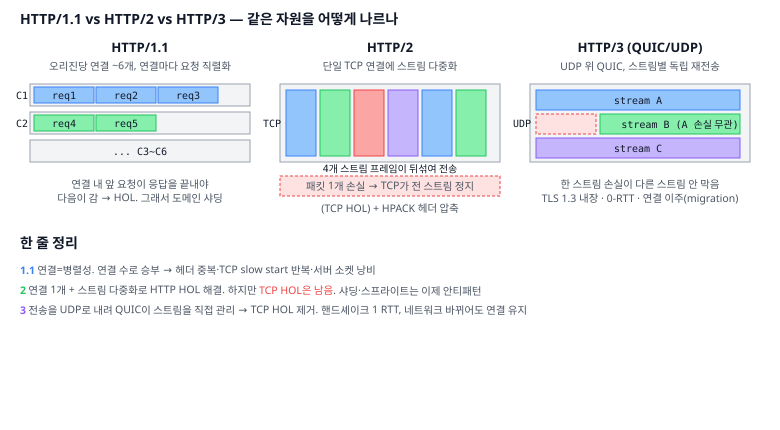
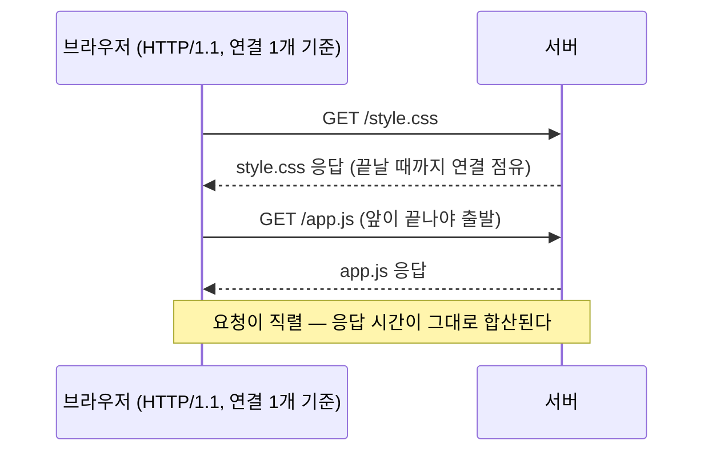
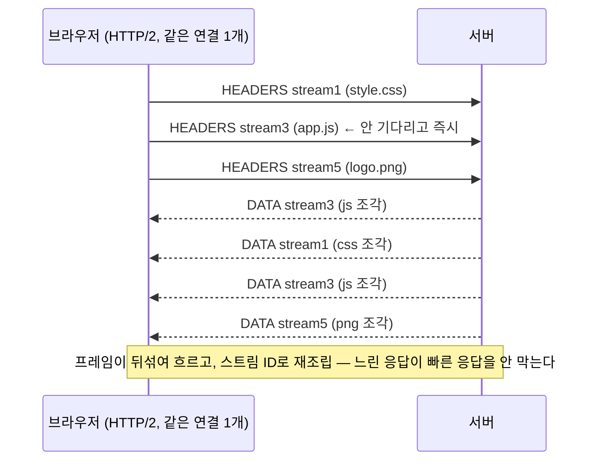
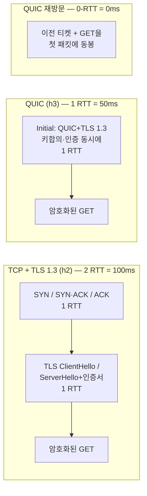

# 05. HTTP의 진화 — 왜 같은 HTML을 세 번이나 다시 나르는 법을 만들었나

> **핵심 질문**
> 같은 HTML·CSS·JS를 받아오는 일인데, HTTP는 왜 1.1 → 2 → 3으로 **세 번이나** 근본 전송 구조를 갈아엎었는가?

## TL;DR

- HTTP/1.1은 연결 하나에 요청 하나씩. 병렬성이 필요해 **연결 6개 + 도메인 샤딩**으로 우회했다.
- HTTP/2는 **한 연결에 스트림 다중화** + 헤더 압축으로 그 우회를 없앴다. 하지만 **TCP HOL**이 남았다.
- HTTP/3은 전송을 **UDP 기반 QUIC**로 바꿔 TCP HOL을 제거하고, 핸드셰이크를 1 RTT로 합쳤다.
- 세 번의 개정은 전부 **"한 페이지에 자원 수십~수백 개"**라는 현실과 **지연(RTT)**의 싸움이다.
- 프론트 실무: 샤딩·스프라이트·인라이닝 같은 1.1 시대 기법은 2/3에서 오히려 **안티패턴**이 된다.

---

## 원자 분해

```
HTTP 진화
├─ 공통의 적 ── 한 페이지 = 자원 수십~수백 개 × 비싼 RTT
├─ HTTP/1.1
│  ├─ keep-alive ── 연결 재사용
│  ├─ HOL(연결 단위) ── 요청 직렬화
│  └─ 우회 ── 오리진당 6연결, 도메인 샤딩, 번들/스프라이트
├─ HTTP/2
│  ├─ 멀티플렉싱 ── 스트림 + 바이너리 프레임
│  ├─ HPACK ── 헤더 압축
│  ├─ 우선순위 ── 스트림 의존/가중치
│  └─ 남은 문제 ── TCP HOL, server push 실패
├─ HTTP/3
│  ├─ QUIC ── UDP 위에 신뢰성 재구현
│  ├─ 스트림별 독립 ── TCP HOL 제거
│  ├─ 1 RTT 핸드셰이크 ── TCP+TLS 통합
│  ├─ 연결 이주 ── IP 바뀌어도 유지
│  └─ 버전 협상 ── ALPN(h2), Alt-Svc/HTTPS 레코드(h3)
└─ 불변 ── 의미론(GET/상태코드/헤더)은 그대로, 전송만 교체
```

---

## 공통의 적: RTT × 자원 수

세 버전을 관통하는 문제를 먼저 못 박자.

- 현대 웹 페이지는 자원(HTML·CSS·JS·이미지·폰트)이 흔히 **70~150개**다.
- 각 자원이 왕복(RTT)을 요구하면, 지연이 **자원 수 × RTT**로 폭발한다.
- 대역폭을 아무리 늘려도 이 **왕복의 직렬 합**은 줄지 않는다(문서 06의 "RTT vs 대역폭").
- **HTTP 진화의 역사 = 이 왕복 수를 어떻게 줄이느냐의 역사**다. 이 한 문장이 나머지 전부를 설명한다.

## HTTP/1.1 — 연결이 곧 병렬성



- **keep-alive**: HTTP/1.0은 요청마다 TCP를 새로 열고 닫았다(매번 핸드셰이크 + slow start). 1.1은 연결을 **재사용**해 이 반복을 없앴다. 기본값이 됐다.
- **연결 단위 HOL**: 그래도 한 연결에서는 **요청 하나의 응답이 끝나야** 다음 요청이 나간다. 앞 요청이 느리면 뒤가 전부 막힌다.
- **pipelining의 실패**: "응답을 안 기다리고 요청을 연달아 보내자"는 시도가 있었지만, 서버가 **받은 순서대로** 응답해야 해서 HOL이 그대로였고, 중간 장비 버그까지 겹쳐 사실상 폐기됐다.

그래서 1.1 시대의 프론트엔드는 **우회 기법**으로 버텼다:

- **오리진당 ~6개 연결**: 브라우저가 병렬로 6개까지 TCP를 연다. 사실상 6배 병렬.
- **도메인 샤딩**: `img1.site.com`, `img2.site.com`으로 도메인을 쪼개 "6연결 × N도메인"으로 병렬을 더 늘림.
- **요청 수 줄이기**: CSS 스프라이트(이미지 합치기), 번들링(JS/CSS 합치기), 인라이닝(base64로 HTML에 박기).

이 우회의 **대가**도 분명했다:

- 요청마다 **헤더가 통째로 반복**된다(특히 큰 쿠키). 작은 요청도 헤더가 수백 바이트.
- 연결마다 **slow start를 새로** 겪는다(문서 02). 6개면 6번.
- 서버는 **소켓·메모리**를 연결 수만큼 쓴다.

## HTTP/2 — 하나의 연결, 여러 흐름

HTTP/2의 통찰: **"연결을 늘리지 말고, 한 연결 안에서 병렬화하자."** 같은 연결 하나가 두 버전에서 어떻게 다르게 쓰이는지 나란히 보자.





- **멀티플렉싱**: 하나의 TCP 연결에 여러 **스트림**이 공존한다. 각 요청/응답을 작은 **프레임**으로 쪼개 뒤섞어 보내고, 받는 쪽이 스트림 ID로 재조립한다. 6연결 우회가 필요 없어졌다.
- **바이너리 프레이밍**: 사람이 읽던 텍스트 프로토콜을 **바이너리 프레임**(HEADERS, DATA…)으로 바꿔 파싱을 단순·견고하게 했다.
- **HPACK 헤더 압축**: 요청마다 반복되던 헤더를 **인덱스 테이블 + 허프만 부호화**로 압축한다. 매번 실려 가던 쿠키·User-Agent가 두 번째부턴 몇 바이트로 준다.
  - 숫자 감각: 요청 헤더는 흔히 **500~800B**(쿠키 크면 수 KB). 자원 100개면 헤더만 **50~80KB**를 매번 나르던 것. HPACK은 반복 헤더를 **85~90% 압축**한다 — "같은 걸 두 번 보내지 말라"는 캐시의 발상(1단계)을 헤더에 적용한 셈.
- **우선순위**: 스트림에 의존 관계·가중치를 줘 "CSS·폰트 먼저, 화면 밖 이미지는 나중"을 서버에 알린다. 다만 h2의 의존 트리는 너무 복잡해 서버들이 제각각 무시했고, HTTP/3에서는 단순한 **urgency 0~7 + incremental**(RFC 9218)로 다시 설계됐다. `fetchpriority` 속성이 이 값으로 번역된다.

하지만 두 가지가 발목을 잡았다:

- **TCP HOL이 남았다(핵심)**: 스트림은 HTTP 레벨에서만 독립이다. 그 밑의 **단일 TCP 연결**에서 패킷 하나가 손실되면, TCP는 순서 보장을 위해 **무관한 모든 스트림을 멈춘다**(문서 02의 HOL). 연결을 하나로 합친 대가가, 손실률 높은 모바일에서 **HTTP/1.1보다 느려지는** 역설로 돌아왔다.
- **Server Push의 실패**: "요청도 안 했는데 서버가 미리 밀어주기"는 캐시와 자주 어긋나 대역폭만 낭비했다. 크롬은 결국 제거했고, 대신 가벼운 **103 Early Hints**(먼저 preload 힌트만 흘려주기)로 방향을 틀었다.

## HTTP/3 — 전송 계층을 통째로 갈아끼우다

진단은 명확했다: **HOL의 뿌리는 TCP의 "순서 보장"**이다(문서 02). HTTP에서 아무리 다중화해도, 밑의 TCP가 다시 한 줄로 세운다. 그럼 **TCP를 안 쓰면 된다.**

- **QUIC = UDP 위에 새로 지은 신뢰성 계층**. UDP는 순서·재전송을 강제하지 않는 "맨 통로"라, 그 위에 필요한 것만 골라 얹었다.
- **스트림별 독립 재전송**: QUIC은 스트림을 **직접** 관리한다. A 스트림의 패킷이 손실돼도 B·C는 그대로 진행한다. **TCP HOL이 근본적으로 사라진다.**
- **1 RTT 핸드셰이크**: QUIC은 **TLS 1.3을 내장**한다. TCP 핸드셰이크와 TLS 핸드셰이크를 따로 하던 걸(문서 04 타임라인의 파랑+초록) **한 번에** 끝낸다. 재방문은 0-RTT.
- **연결 이주(migration)**: 연결을 IP:포트가 아니라 **연결 ID**로 식별한다. 그래서 와이파이 → LTE로 네트워크가 바뀌어도 **연결이 끊기지 않는다**(TCP였다면 5-tuple이 바뀌어 재연결). 모바일에 결정적.
- **사용자 공간 구현**: TCP는 커널·중간장비에 굳어 개정이 수년~수십 년 걸린다. QUIC은 앱과 함께 배포돼 **빠르게 진화**한다.

핸드셰이크 왕복 수를 나란히 놓으면 이렇다 (RTT 50ms 가정, 첫 요청 데이터 출발 시점까지):



**브라우저는 어떤 버전을 쓸지 어떻게 아나?** 버전 협상도 왕복을 아끼도록 설계돼 있다.

- **h2**: TLS 핸드셰이크의 **ALPN** 확장(문서 04)에 "나 h2 할 줄 알아"를 실어 보내고, 서버가 ServerHello에서 고른다. **추가 왕복 0**으로 협상 끝.
- **h3**: 첫 방문은 TCP로 가고, 응답의 **`Alt-Svc: h3=":443"`** 헤더를 보고 "다음부턴 QUIC으로 와"를 기억한다. 요즘은 DNS의 **HTTPS 레코드**(문서 03)에 h3 지원을 미리 실어, 첫 방문부터 QUIC으로 직행하기도 한다.

대가도 있다: UDP를 막는 방화벽·미들박스, 초기엔 커널 오프로드(TSO 등) 부족으로 **CPU 사용이 더 큼**. 그래서 실패 시 HTTP/2로 폴백하는 설계를 함께 쓴다.

## 변하지 않은 것 — 의미론과 전송의 분리

세 번을 갈아엎었지만 **`GET /index.html`, 상태 코드 200/404, 헤더의 의미는 한 번도 안 바뀌었다.** 바뀐 건 오직 **그 의미를 어떻게 바이트로 실어 나르느냐**(wire format)다. 이 분리 덕분에:

- `fetch()` 코드는 h1이든 h3이든 **한 줄도 안 바뀐다.** 브라우저가 전송을 알아서 고른다.
- 서버 애플리케이션 코드도 대부분 그대로다. 웹서버/프록시만 새 프로토콜을 말하면 된다.
- REST, 캐싱 규칙(문서 06) 같은 상위 개념이 프로토콜 개정에서 살아남는다.

| | HTTP/1.1 (1997) | HTTP/2 (2015) | HTTP/3 (2022) |
|---|---|---|---|
| 전송 | TCP | TCP | **UDP (QUIC)** |
| 병렬화 | 연결 6개 | 스트림 다중화 | 스트림 다중화 |
| HOL | HTTP+TCP 양쪽 | **TCP만 남음** | 없음 |
| 헤더 | 평문 반복 | HPACK | QPACK |
| 암호화 | 선택 (https) | 사실상 필수 | **프로토콜에 내장** |
| 핸드셰이크(cold) | 1 RTT (+TLS) | 1 RTT (+TLS) | **1 RTT (TLS 포함)** |

---

## 프론트엔드에서 이렇게 만난다

- **도메인 샤딩은 HTTP/2에서 안티패턴**이다. 연결을 쪼개면 멀티플렉싱·HPACK·우선순위가 **모두 무력화**된다. 1.1 시절 최적화가 이제는 손해다.
- **번들링 전략 재고**: 2/3에서는 자원을 적당히 **잘게** 쪼개는 게 캐시 적중·병렬 로드에 유리하다. 단, 요청마다 최소 오버헤드가 있으니 무한정 쪼개지 않는다 — "거대한 하나"와 "수백 개 파편" 사이의 균형.
- **프로토콜 확인**: DevTools Network 탭에 **Protocol** 열(`h2`, `h3`)을 켜서 실제로 무엇으로 오가는지 본다.
- **우선순위 제어**: `<link rel="preload">`, `fetchpriority="high"`, `loading="lazy"`로 브라우저·서버에 우선순위 힌트를 준다.
- **103 Early Hints**: 서버가 본응답 전에 "이거 미리 받아둬" 힌트를 흘려, 서버 처리 시간 동안 자원을 당겨 받게 한다.

---

## 이전 계층과의 연결

- **HTTP/2 스트림 ↔ 문서 02의 단일 TCP 연결**: 멀티플렉싱의 이상이 TCP HOL이라는 하부 계층의 현실에 부딪히는 지점. 계층을 쌓았을 때 아래 계층의 성질이 위로 새어 나오는(leaky abstraction) 대표 사례다.
- **QUIC ↔ 문서 02(UDP) + 문서 04(TLS)의 통합**: HTTP/3은 "UDP + TLS 1.3 + 스트림 관리"를 한 덩어리로 묶었다. 지금까지의 계층 분리를 의도적으로 허문 설계다.
- **HPACK ↔ 1단계 압축/상태 테이블**: 반복 데이터를 인덱스로 치환하는 건 캐시의 tag 참조와 같은 발상. 상태(동적 테이블)를 양쪽이 동기화해 유지한다.
- **우선순위 스케줄링 ↔ 2단계 OS 스케줄러**: "무엇을 먼저 내보낼까"는 CPU 스케줄링과 같은 문제다. 자원에도 우선순위·의존성이 있다.

---

## 파인만 체크 (10살에게 설명하기)

1. **계산대 비유**: HTTP/1.1은 "계산대 하나에 한 사람씩 줄 서기", HTTP/2는 "한 계산대에서 여러 사람 물건을 조금씩 번갈아 처리하기"다. 멀티플렉싱이 왜 더 빠른지 이 비유로 설명해봐라.
2. **컨베이어 벨트 사고**: TCP HOL을 "벨트 위 상자 하나가 엎어지면 뒤 상자가 다 멈춘다"로 설명하고, HTTP/3가 왜 **벨트를 여러 개로 나눴는지**(스트림 독립) 말해봐라.
3. **옛 요령이 나빠진 이유**: 도메인 샤딩이 예전엔 좋았는데 지금은 왜 나쁜지를, "규칙이 바뀌면 예전 꼼수가 손해가 된다"로 설명해봐라.
