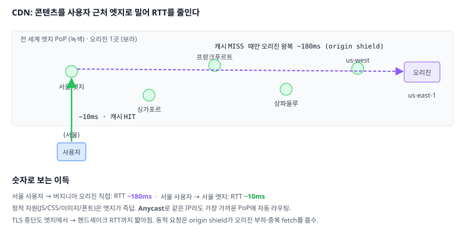

# 06. 웹 성능 — 물리 법칙 위에서 빠르게 보이기

> **핵심 질문**
> 광속도, 서버 위치도, 사용자의 회선도 못 바꾸는 프론트엔드 엔지니어가, 무엇을 조작해서 페이지를 빠르게 만드는가?

## TL;DR

- 웹 성능의 지배 변수는 **대역폭이 아니라 RTT × 왕복 횟수**다. 회선을 늘려도 왕복의 직렬 합은 안 줄어든다.
- 무기는 넷: **왕복을 없앤다**(캐시), **왕복을 짧게 한다**(CDN), **왕복을 미리 한다**(preconnect/preload), **왕복을 겹친다**(HTTP/2·3).
- 캐싱의 정점은 `Cache-Control: max-age=31536000, immutable` + **해시 파일명** — 재검증 왕복(304)조차 없앤다.
- CDN은 콘텐츠를 사용자 근처 엣지로 복제해 **RTT 자체를 180ms → 10ms**로 줄인다.
- 이 모든 것의 진단 도구가 **워터폴**이다. 막대의 색과 계단 모양이 병목의 위치를 말해 준다.

---

## 원자 분해

```
웹 성능
├─ 물리적 제약 ── RTT는 광속 하한, 왕복 횟수 × RTT = 지연
│  └─ RTT vs 대역폭 ── 왜 회선 업그레이드가 체감이 안 되나
├─ 왕복을 없앤다 ── HTTP 캐싱
│  ├─ Cache-Control ── max-age / no-cache / no-store / s-maxage
│  ├─ 재검증 ── ETag + If-None-Match → 304
│  ├─ immutable 패턴 ── 해시 파일명 + 1년 캐시
│  └─ stale-while-revalidate ── 일단 옛것, 뒤에서 갱신
├─ 왕복을 짧게 ── CDN
│  ├─ 엣지 PoP / anycast ── 지리적 근접
│  ├─ cache key / TTL / purge
│  └─ origin shield ── 오리진 보호
├─ 왕복을 미리 ── 리소스 힌트
│  ├─ dns-prefetch / preconnect
│  ├─ preload / modulepreload / prefetch
│  └─ fetchpriority / Early Hints
└─ 진단 ── 워터폴 읽기
   ├─ 타이밍 단계 (DNS→TCP→TLS→TTFB→Download)
   └─ 병목 패턴 ── 계단, 긴 TTFB, 긴 다운로드
```

---

## RTT vs 대역폭 — 지연이 왕이다

직관과 반대되는 사실 하나: **회선 속도를 2배로 올려도 페이지 로드는 거의 안 빨라진다.**

- 실측 기반 통념(구글 연구): 대역폭 **5Mbps 이후로는** 페이지 로드 시간 개선이 급격히 둔화한다. 반면 **RTT는 줄이는 만큼 거의 선형으로** 빨라진다.
- 왜? 페이지 로드는 큰 파일 하나의 다운로드가 아니라 **작은 왕복 수십 번의 직렬 연쇄**이기 때문이다. DNS → TCP → TLS → HTML → (파싱) → CSS/JS → (실행) → API → 이미지…
- 각 왕복은 대역폭과 무관하게 **최소 1 RTT**를 낸다. RTT 100ms에서 왕복 20번이 직렬이면 그것만 2초다.
- **slow start(문서 02)의 14KB 규칙**: 새 TCP 연결의 초기 혼잡 윈도우는 10 MSS ≈ **14KB**. 첫 왕복에 그 이상은 못 실린다. "중요한 것(critical CSS 등)을 첫 14KB 안에"라는 조언의 출처.

| 경로 | RTT | 감각 |
|------|-----|------|
| 같은 도시 (엣지 CDN) | 5~15 ms | 왕복 무료에 가까움 |
| 국내 | 10~30 ms | |
| 서울 ↔ 미국 서부 | 120~150 ms | 왕복 하나가 프레임 8개 |
| 서울 ↔ 미국 동부/유럽 | 150~250 ms | cold HTTPS 연결에만 0.5초 |
| 모바일 3G/혼잡 LTE | 100~400 ms | 힌트·캐시 없으면 체감 붕괴 |

> 그래서 성능 작업의 사고 순서는 항상: **① 이 왕복이 필요한가(캐시)? ② 더 가까이서 할 수 없나(CDN)? ③ 미리 할 수 없나(힌트)? ④ 겹칠 수 없나(h2/h3, 병렬화)?**

## 캐싱 헤더 — 가장 빠른 요청은 안 보낸 요청

브라우저 캐시에 있는 자원은 **RTT 0**이다. 서버는 응답 헤더로 "이걸 언제까지 어떻게 재사용해도 되는지"를 계약한다.

```mermaid
flowchart TD
  REQ["자원 요청"] --> C{브라우저 캐시에<br/>있나?}
  C -->|없음| NET["네트워크 요청<br/>(full download)"]
  C -->|있음| F{max-age 안 지남?<br/>(fresh)}
  F -->|"fresh"| HIT["✅ 캐시에서 즉시 사용<br/>왕복 0, DevTools: (memory/disk cache)"]
  F -->|"stale"| REV["조건부 요청<br/>If-None-Match: (ETag)"]
  REV --> S{서버: 내용<br/>같은가?}
  S -->|같음| N304["304 Not Modified<br/>본문 없이 헤더만 — 왕복 1, 바이트 절약"]
  S -->|다름| N200["200 + 새 본문 + 새 ETag"]
  classDef good fill:#dcfce7,stroke:#22c55e
  classDef warn fill:#fef3c7,stroke:#f59e0b
  class HIT good
  class N304 warn
```

**Cache-Control 디렉티브 — 자주 쓰는 것만 정확히:**

| 디렉티브 | 뜻 | 함정 |
|---------|-----|------|
| `max-age=N` | N초 동안 fresh → 재검증 없이 사용 | 브라우저+CDN 모두 적용 |
| `s-maxage=N` | **공유 캐시(CDN)에만** 적용되는 max-age | 브라우저는 무시 |
| `no-cache` | 캐시하되 **매번 재검증**(304 왕복은 발생) | "캐시 안 함"이 **아니다** |
| `no-store` | 진짜 캐시 금지 (민감 데이터) | |
| `private` / `public` | 브라우저만 / CDN도 캐시 가능 | 인증 응답은 private |
| `immutable` | fresh 동안 **재검증 시도 자체를 생략** | 해시 파일명과 짝 |
| `stale-while-revalidate=N` | 일단 stale을 쓰고 **백그라운드로 갱신** | 체감 지연 0 + 최신성 절충 |

**정석 조합 두 가지**만 기억하면 대부분 커버된다:

```
# ① 빌드 산출물 (파일명에 내용 해시: app.3f2a9c.js)
Cache-Control: public, max-age=31536000, immutable
→ 1년간 어떤 왕복도 없음. 내용이 바뀌면 "파일명이" 바뀌므로 무효화 걱정 자체가 없다.
   캐시 무효화라는 어려운 문제를 "불변 데이터 + 새 이름"으로 치환한 설계.

# ② HTML (진입점 — 항상 최신이어야 함)
Cache-Control: no-cache          (또는 max-age=0, must-revalidate)
→ 매번 ETag 재검증. 내용이 같으면 304로 본문 전송은 생략.
   HTML이 새 해시의 JS/CSS를 가리키는 순간 나머지가 연쇄 갱신된다.
```

- **ETag vs Last-Modified**: ETag는 내용 해시(정확), Last-Modified는 시각(초 단위, 부정확). 둘 다 있으면 ETag 우선. 단, 로드밸런서 뒤 서버마다 ETag가 다르게 생성되면(기본 inode 기반 등) 재검증이 항상 실패하니 주의.
- **헤더를 안 주면?** 브라우저가 **휴리스틱 캐싱**(예: `(현재-Last-Modified)×10%`)으로 멋대로 캐시한다. "배포했는데 일부 사용자만 옛 버전"의 흔한 범인. **캐시 정책은 항상 명시하라.**

## CDN — 왕복 자체를 짧게

캐시가 왕복을 없앤다면, CDN은 **어쩔 수 없는 왕복의 거리**를 줄인다.



- **원리**: 전 세계 수백 개 **PoP(엣지)**에 콘텐츠를 복제하고, **anycast**(문서 01)나 GeoDNS(문서 03)로 사용자를 가장 가까운 엣지로 보낸다. 서울 사용자의 RTT가 180ms(버지니아 오리진)에서 **10ms(서울 엣지)**로.
- **cache key**: 엣지는 기본적으로 `호스트+경로(+쿼리)`를 키로 캐시한다. 쿼리스트링·쿠키·헤더를 키에 넣을수록 적중률이 떨어진다 — 1단계 캐시에서 "불필요한 태그 비트가 적중률을 죽이는" 것과 같은 이야기.
- **TTL 제어**: 오리진이 `s-maxage`(CDN용)와 `max-age`(브라우저용)를 **다르게** 줄 수 있다. 예: 브라우저엔 60초, CDN엔 1시간 — 급하면 CDN만 **purge(무효화)**하면 되니까.
- **origin shield**: 엣지 미스가 곧장 오리진으로 몰리면(특히 배포 직후) 오리진이 무너진다. 중간에 상위 캐시 계층을 하나 더 두어 미스를 **한 곳으로 모아** 오리진 요청을 1회로 합친다(request coalescing).
- **동적 콘텐츠에도 유효**: API 응답은 캐시 못 해도, **TLS 종단을 엣지에서** 하면 핸드셰이크 왕복(2 RTT)이 10ms 거리에서 일어난다. 엣지→오리진 구간은 미리 데워진(cwnd 큰) 연결을 재사용한다.

## 리소스 힌트 — 왕복을 미리 한다

브라우저는 HTML을 파싱하며 자원을 **발견하는 순서대로** 요청한다. 발견이 늦으면 시작이 늦다. 힌트는 이 발견 시점을 앞당긴다.

```html
<link rel="preconnect" href="https://api.example.com" crossorigin>
<!-- DNS+TCP+TLS 3종 왕복을 지금 미리. 곧 확실히 쓸 오리진 3~4개만 -->

<link rel="preload" href="/fonts/main.woff2" as="font" type="font/woff2" crossorigin>
<!-- "이 페이지에서 확실히 쓰는데 발견이 늦는 자원"을 지금 받아라.
     폰트가 대표: CSS 파싱 후에야 발견되는데, preload로 HTML 시점으로 당긴다 -->

<link rel="prefetch" href="/next-page.js">
<!-- 다음 내비게이션에서 쓸 것을 한가할 때 미리. 우선순위 최하 -->


<!-- 같은 이미지라도 LCP 후보는 올리고, 화면 밖은 늦춘다 -->
```

- 힌트별 강도: `dns-prefetch`(DNS만, 매우 쌈) < `preconnect`(연결까지) < `preload`(바이트까지). **비쌀수록 아껴** 쓴다. preload 남발은 오히려 중요한 자원의 대역폭을 뺏는다(우선순위 왜곡).
- **preload 폰트의 단골 버그**: 폰트는 CORS 모드로 받으므로 `crossorigin`을 빼면 **두 번 다운로드**된다(preload 것과 실제 것이 다른 캐시 항목으로 취급).
- **103 Early Hints**(문서 05): 서버가 본응답을 만드는 동안 preload 힌트만 먼저 흘려보내, 서버 think time과 자원 다운로드를 겹친다.

## 워터폴 읽는 법 — 병목은 모양으로 드러난다

DevTools Network의 한 요청 막대는 이렇게 쪼개진다 (괄호는 이 모듈의 해당 문서):

```
[Queueing][Stalled][DNS][Initial connection][SSL][Request sent][Waiting(TTFB)][Content Download]
   대기       대기   (03)      TCP (02)      (04)      ↑          서버 처리+1RTT      본문 전송
                     └── preconnect가 지우는 구간 ──┘                (백엔드+거리)      (대역폭·payload)
```

전형적인 병목 패턴 세 가지:

```
패턴 A. 계단(chain)                 패턴 B. 긴 TTFB                패턴 C. 긴 다운로드
html ▓▓▓                           api  ▓░░░░░░░░░▓               bundle ▓▓▓▓▓▓▓▓▓▓▓▓
css      ▓▓▓                            └ Waiting이 대부분              └ 파랑(다운로드)이 대부분
font         ▓▓▓                   → 서버/DB가 느리거나           → payload가 큼
→ 순차 의존: CSS 안에서 폰트 발견     오리진이 멂                   → 코드 스플리팅, 압축(br),
→ preload/preconnect로 계단 펴기    → 캐시/CDN/백엔드 최적화        이미지 포맷(AVIF), lazy
```

- 요청 수십 개가 **같은 시점에 일제히 멈춰(Stalled)** 있으면: HTTP/1.1의 6연결 제한(문서 05)이거나, 우선순위에 밀린 것.
- 워터폴의 **첫 1/3이 비어** 있으면: 리다이렉트 체인(각각 1 왕복+α)이나 늦은 발견. `http→https`, `/→/home` 같은 리다이렉트 하나가 수백 ms를 먹는다.
- 진단 순서: **어느 구간이 긴가**(연결? TTFB? 다운로드?) → **그 구간을 담당하는 계층의 문서**(02/03/04는 연결, 백엔드·CDN은 TTFB, payload는 다운로드)로 내려가라.

---

## 프론트엔드에서 이렇게 만난다

Lighthouse 감사 항목이 곧 이 문서의 목차다:

| Lighthouse 지적 | 이 문서의 원자 |
|----------------|---------------|
| "Serve static assets with an efficient cache policy" | immutable + 해시 파일명 |
| "Preconnect to required origins" | preconnect |
| "Preload Largest Contentful Paint image" / LCP | preload, fetchpriority |
| "Reduce initial server response time" (TTFB) | CDN, 워터폴의 Waiting |
| "Avoid multiple page redirects" | 왕복 횟수 줄이기 |
| "Avoid enormous network payloads" | 다운로드 구간, 대역폭 |

- **Core Web Vitals와의 연결**: LCP(최대 콘텐츠 표시)는 사실상 "critical path 왕복 수 × RTT + payload"의 함수다. TTFB가 늦으면 LCP의 하한이 올라간다.
- `performance.getEntriesByType('resource')`(Resource Timing API)로 각 자원의 DNS/TCP/TTFB 구간을 **코드에서** 수집해 RUM(실사용자 측정)을 만든다.
- 배포 후 "옛 버전이 보여요" 문의 → 십중팔구 HTML까지 `max-age`를 길게 줬거나, CDN purge를 빠뜨렸거나, 휴리스틱 캐싱에 맡긴 경우다.

---

## 이전 계층과의 연결

- **캐시 계층 전체 ↔ 1단계 [05 메모리 계층](../claude/topics/05-memory-hierarchy.md)·[06 캐시](../claude/topics/06-cache.md)**: 브라우저 메모리 캐시 → 디스크 캐시 → CDN 엣지 → 오리진은 L1 → L2 → L3 → DRAM과 같은 구조다. "가까울수록 빠르고 작다", "적중률이 평균 지연을 지배한다"는 공식(AMAT)이 그대로 적용된다. `immutable`은 "절대 invalidate 안 되는 라인"인 셈.
- **cache key 설계 ↔ 1단계 캐시 매핑**: 키에 불필요한 차원(쿼리·쿠키)을 넣어 적중률이 죽는 건 conflict miss를 자초하는 것과 같다.
- **stale-while-revalidate ↔ 1단계 prefetch**: "지금 것을 쓰면서 다음 것을 미리 가져온다" — 지연 은닉(latency hiding)이라는 동일한 전략.
- **워터폴 ↔ 1단계 [03 파이프라인](../claude/topics/03-pipeline.md)**: 계단형 의존 체인은 파이프라인의 데이터 해저드와 같다. preload는 포워딩처럼 의존을 미리 해소해 stall을 없앤다. 임계 경로(critical path)를 찾아 그것만 최적화하라는 원칙도 동일.
- **연결 풀·소켓 ↔ 2단계 OS**: 브라우저의 연결 재사용 풀은 결국 fd 테이블 위의 소켓들이고, keep-alive 타임아웃 관리도 OS 타이머의 일이다.

---

## 파인만 체크 (10살에게 설명하기)

1. **피자 배달**: 도로를 넓혀도(대역폭) 왕복 거리(RTT)가 멀면 피자는 늦는다. 그래서 동네마다 지점(CDN)을 두고, 자주 시키는 피자는 냉동실(캐시)에 두는 거라고 설명해봐라. 냉동실 피자의 유통기한(max-age)과 "상표가 바뀌면 새로 사기"(해시 파일명)까지 이어가면 완성.
2. **숙제 미리 하기**: preconnect/preload를 "어차피 할 일을, 한가한 지금 미리 해두기"로 설명해봐라. 왜 전부 미리 하면 안 되는지(가방이 무거워짐 = 대역폭·연결 낭비)도.
3. **막대 그림 탐정**: 워터폴 계단 그림을 그려 놓고, "어디가 느린지"를 막대의 어느 부분(연결? 기다림? 다운로드?)이 긴지로 알아내는 법을 설명해봐라.
