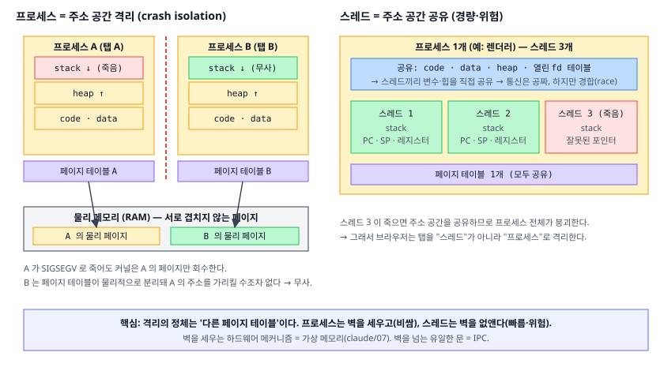
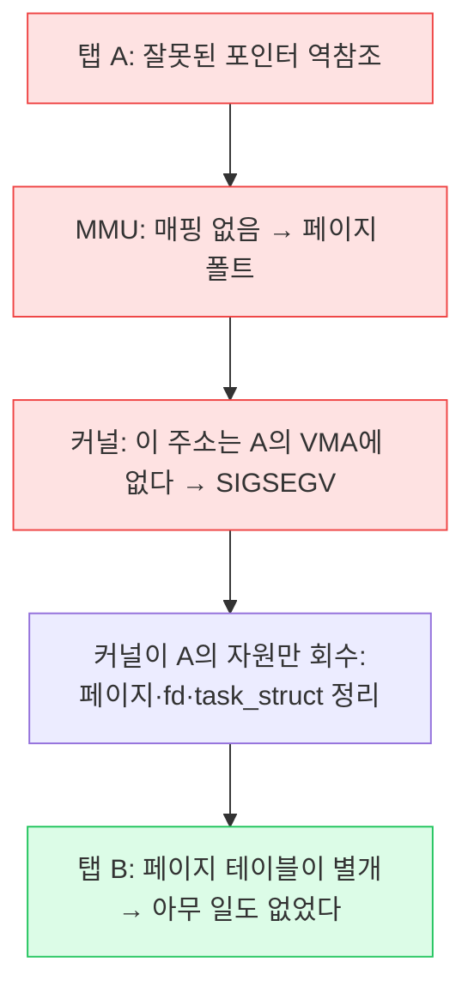
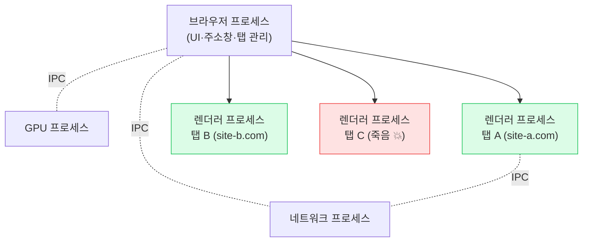

# 01. 프로세스와 스레드 (Process & Thread)

> **핵심 질문:** 브라우저 탭 하나가 죽어도(Aw, Snap!) 왜 옆 탭은 멀쩡히 살아있는가?

## TL;DR

1. **프로세스**는 독립된 *주소 공간*과 자원(열린 파일 등)을 소유한 커널의 회계 단위이고, **스레드**는 그 안에서 도는 실행 흐름(주소 공간을 공유)이다.
2. 격리의 정체는 **가상 메모리**다. 프로세스마다 페이지 테이블이 달라서, 남의 메모리 주소를 *가리킬 수조차 없다*.
3. 그래서 탭 A가 세그폴트로 죽어도 커널은 A의 페이지만 회수한다. 탭 B는 페이지 테이블이 물리적으로 분리돼 있어 영향이 **0**이다.
4. `fork`는 주소 공간을 복제(COW로 싸게)하고, `exec`는 그 껍데기 위에 새 프로그램을 덮어쓴다.
5. 격리의 대가는 **통신 비용**이다. 프로세스끼리 대화하려면 벽을 넘는 문(IPC: 파이프·소켓·공유 메모리)이 필요하다.

---

## 원자 분해

```
"탭이 죽어도 옆 탭이 사는 이유"
├── 프로세스 = 주소 공간의 경계선
│   ├── 주소 공간 = 프로세스별 페이지 테이블 (← claude/07)
│   └── task_struct(PCB) = 커널이 쥔 프로세스의 신원
├── 스레드 = 경계선 안의 여러 실행 흐름
│   ├── 공유: 주소 공간·힙·fd  → 가볍다·위험하다
│   └── 독립: 스택·레지스터·PC
├── 생성 = fork(복제) + exec(덮어쓰기)
├── 크래시 격리 = 커널이 프로세스 단위로 회수
└── 격리의 대가 = IPC (경계를 넘는 유일한 문)
```



---

## 프로세스: 커널이 쥔 "주소 공간 + 자원"의 묶음

프로세스는 실행 중인 프로그램이 아니라, 커널 입장에서는 하나의 **장부 항목**이다. 리눅스는 이걸 `task_struct`(교과서 용어로 PCB, Process Control Block)로 표현한다. 여기엔 이 프로세스의 페이지 테이블 포인터(x86의 `CR3` 값), 열린 파일 디스크립터 테이블, 시그널 핸들러, 우선순위, 부모/자식 관계가 들어있다.

```
PID 4021 ─── task_struct (PCB) ────────────────
             ├─ mm  → 페이지 테이블 (CR3 값)   ← 주소 공간 (격리의 핵심)
             ├─ files → fd 테이블 (0,1,2,3,…)   ← 열린 자원
             ├─ 시그널 핸들러 · 우선순위 · nice
             ├─ 상태 (running/ready/blocked)     ← 02장
             └─ 부모/자식 PID                     ← fork 관계
```

이 중 **주소 공간**이 격리의 핵심이다. 각 프로세스는 자기만의 페이지 테이블을 갖고, CPU가 그 프로세스를 실행할 때 `CR3`에 그 테이블을 로드한다. 프로세스 A의 주소 `0x5000`과 B의 주소 `0x5000`은 페이지 테이블이 다르므로 **완전히 다른 물리 페이지**로 변환된다. A가 B의 데이터를 훔치려면 B의 물리 페이지를 가리키는 가상 주소가 있어야 하는데, A의 페이지 테이블엔 그런 항목이 아예 없다. 이 격리는 소프트웨어 규칙이 아니라 **MMU 하드웨어가 매 접근마다 강제**한다.

> ❓ **면접: "프로세스와 프로그램의 차이는?"** 프로그램은 디스크 위의 정적 파일, 프로세스는 그 프로그램이 주소 공간·자원을 배정받아 실행되는 동적 인스턴스. 같은 프로그램을 두 번 실행하면 프로세스는 둘, 주소 공간도 둘이다.

## 스레드: 한 주소 공간 안의 여러 실행 흐름

스레드는 "실행 흐름"만 따로 떼어낸 것이다. 같은 프로세스의 스레드들은 **코드·전역·힙·열린 fd를 전부 공유**하고, 각자 **스택·프로그램 카운터(PC)·레지스터 세트**만 따로 갖는다.

| | 프로세스마다 별도 | 스레드마다 별도 |
|---|---|---|
| 주소 공간 (페이지 테이블) | O | X (공유) |
| 힙·전역 변수 | O | X (공유) |
| 열린 파일 디스크립터 | O | X (공유) |
| 스택 | O | **O** |
| PC·레지스터 | O | **O** |

공유하기 때문에 스레드 생성은 싸다. 새 페이지 테이블도, fd 테이블 복제도 필요 없이 스택 하나와 커널 스레드 구조체만 만들면 된다. 스레드 생성은 대략 **수 µs~수십 µs**, 프로세스 생성(fork+exec)은 그보다 훨씬 비싸다.

대신 공유는 곧 **경합(race condition)**을 의미한다. 두 스레드가 같은 힙 변수를 동시에 건드리면:

```c
int counter = 0;           // 힙/전역 → 두 스레드가 공유
void *worker(void *_) {
    for (int i = 0; i < 1000000; i++)
        counter++;         // 읽기→+1→쓰기 3단계가 원자가 아님
    return NULL;
}
// 스레드 2개 실행 → 결과는 2000000이 아니라 그보다 작다
```

`counter++`는 "읽고-더하고-쓰는" 세 단계라, 두 스레드가 엇갈리면 갱신이 유실된다. 프로세스였다면 `counter`가 각자의 주소 공간에 따로 있어 애초에 경합이 없다. **공유가 곧 힘이자 위험**이다 — 그래서 뮤텍스가 필요하다(하드웨어 관점의 원자성·메모리 배리어는 [claude/08](../../claude/topics/08-multicore-coherence.md) 참조).

## 생성: fork(복제) + exec(덮어쓰기)

유닉스는 "프로세스를 만든다"를 두 단계로 쪼갰다. 왜 하나로 안 했을까?

- **`fork()`**: 자신을 통째로 복제한다. 자식은 부모와 똑같은 주소 공간·fd를 가진 채 태어난다. 반환값만 다르다(부모는 자식 PID, 자식은 0).
- **`exec()`**: 현재 주소 공간을 버리고 새 프로그램 이미지로 덮어쓴다. PID와 열린 fd는 그대로 유지된다.

```
pid = fork();              // 나를 복제
if (pid == 0) {            // 자식만 여기로
    // ── 이 틈(fork 후, exec 전)이 '창'이다 ──
    dup2(logfd, 1);        // stdout을 파일로 리다이렉트
    close(unused_fd);      // 필요없는 fd 정리
    execvp("grep", args);  // 이제 grep으로 덮어쓰기
}
```

둘로 나눈 이유가 저 주석의 "창"이다. fork로 복제된 직후, exec로 덮어쓰기 직전에 **자식의 환경을 손볼 틈**이 생긴다. 셸의 `grep foo > out.txt` 리다이렉션, 파이프 연결이 전부 이 틈에서 fd를 조작해 이뤄진다. exec가 fd를 유지하기 때문에 가능한 설계다.

`fork`가 4GB 프로세스를 복제해도 즉시 4GB가 더 들지 않는 이유(**COW**)는 다음 장(03)에서 회계사 비유로 자세히 본다.

자식이 끝나면 커널은 종료 코드를 남긴 **좀비(zombie)** 상태로 잠깐 둔다. 부모가 `wait()`로 거둬가야(reap) 완전히 사라진다. 부모가 안 거두면 좀비가 쌓이고(fd·PID 누수), 부모가 먼저 죽으면 자식은 **고아(orphan)**가 돼 `init`(PID 1)이 입양해 대신 거둔다. 컨테이너에서 PID 1로 앱을 직접 띄우면 좀비를 못 거둬 새는 일이 흔해, `tini` 같은 init을 앞에 두는 이유가 이것이다.

## 크래시 격리: 커널이 프로세스 단위로 회수한다

이제 핵심 질문에 답한다. 탭 A가 널 포인터를 역참조하면:



커널은 A의 페이지 프레임을 free 리스트로 돌리고, A가 열었던 fd를 닫고, task_struct를 지운다. **B의 페이지 테이블은 손도 대지 않는다.** B는 A의 물리 페이지를 가리키는 항목이 없으므로, A가 남긴 쓰레기를 볼 수도 없다.

대조가 중요하다. **한 스레드가 죽으면?** 스레드는 주소 공간을 공유하므로, 잘못된 쓰기가 힙을 오염시켰을 수 있고 기본적으로 SIGSEGV는 **프로세스 전체**를 죽인다. 그래서 "한 탭의 크래시를 한 탭에 가두려면" 탭을 스레드가 아니라 **프로세스**로 격리해야 한다. 이것이 브라우저 아키텍처의 출발점이다.

## 격리의 대가: IPC (경계를 넘는 유일한 문)

벽을 세웠으니 대화하려면 문이 필요하다. 프로세스 간 통신(IPC)은 곧 "커널을 경유해 경계를 넘는 법"이다.

| 방식 | 원리 | 특징 |
|---|---|---|
| 파이프 / FIFO | 커널 버퍼를 통한 바이트 스트림 | 단순, 부모-자식 간 흔함 |
| 유닉스 도메인 소켓 | 같은 머신 내 소켓 | 양방향, fd 전달 가능 |
| 공유 메모리 | 같은 물리 페이지를 양쪽에 매핑 | **복사 없음 → 가장 빠름**, 대신 동기화는 직접 |
| 시그널 | 비동기 알림(번호 하나) | 데이터 못 실음, 이벤트 통보용 |
| 메시지 큐 | 커널이 관리하는 메시지 목록 | 경계 있는 메시지 |

공유 메모리가 빠른 이유는 명확하다. 다른 방식은 유저→커널→유저로 **데이터를 복사**하지만, 공유 메모리는 같은 물리 페이지를 양쪽 페이지 테이블에 매핑해 복사를 없앤다(claude/07의 "공유 페이지"가 바로 이것). 대신 락이나 원자적 연산으로 동기화를 직접 해야 한다.

정리하면 **격리와 통신은 트레이드오프**다. 스레드는 벽이 없어 통신이 공짜지만 한 놈이 죽으면 다 죽는다. 프로세스는 벽 덕에 크래시가 갇히지만, 대화하려면 IPC라는 문세(門稅)를 내야 한다. 브라우저가 "탭=프로세스, 탭 내부=스레드"를 택한 건 이 저울에서 **크래시 격리 > 통신 비용**이라고 판단했기 때문이다.

> ❓ **면접: "스레드가 프로세스보다 항상 빠른가?"** 아니다. 생성·전환·통신은 스레드가 싸지만, 격리가 없어 한 스레드의 버그가 전체를 무너뜨린다. 또 CPU 병렬도는 결국 코어 수가 상한이라(02장) 스레드를 무작정 늘려도 빨라지지 않는다. "빠름"이 아니라 "격리 vs 공유"로 골라야 한다.

---

## 프론트엔드에서 이렇게 만난다

현대 브라우저는 이 장의 내용을 그대로 아키텍처로 만든 결과물이다. 하나의 앱이 아니라 **여러 프로세스의 협업**이다.



탭 C의 렌더러가 죽어도 브라우저 프로세스·다른 렌더러는 주소 공간이 분리돼 무사하다. 브라우저 프로세스가 "탭 C가 죽었네" 하고 그 자리에 "Aw, Snap!"만 그린다. 프로세스 간 대화는 전부 **IPC**로 오간다(위 점선).

- **Chrome의 사이트 격리(site-per-process):** 탭(그리고 교차 출처 iframe)마다 별도 **렌더러 프로세스**를 띄운다. 그래서 한 탭의 크래시가 "Aw, Snap!" 한 탭으로 끝난다. 작업 관리자(Shift+Esc)를 열면 탭마다 프로세스가 보인다.
- **렌더러 샌드박스:** 렌더러는 격리된 주소 공간 + seccomp로 시스템 콜까지 제한된다. 웹 콘텐츠의 취약점이 터져도 다른 탭·OS를 건드리기 어렵다.
- **Web Worker ≈ 스레드:** 별도 실행 흐름이지만 메모리를 공유하지 않고 `postMessage`로 통신한다(축소판 IPC). 진짜 공유 메모리가 필요하면 `SharedArrayBuffer`를 쓴다 — 그 순간 경합·`Atomics`가 등장하는 이유가 위 표 그대로다.
- **Node.js:** `child_process.fork()`는 진짜 별도 프로세스(주소 공간 격리), `worker_threads`는 스레드(메모리 공유 가능). 크래시 격리가 필요하면 전자, 데이터 공유·경량 병렬이 필요하면 후자다.

---

## 이전 계층과의 연결

- **주소 공간 격리의 하드웨어 실체** = [claude/07 가상 메모리](../../claude/topics/07-virtual-memory.md). 페이지 테이블·MMU·`CR3`가 격리를 *물리적으로* 강제한다. 이 문서는 "커널이 그 페이지 테이블을 프로세스마다 어떻게 배정·전환하는가"의 정책을 다룬다.
- **fork가 싼 이유(COW)** = claude/07이 하드웨어 메커니즘(read-only 후 write fault)을, 이 모듈 [03장](03-virtual-memory-os-view.md)이 커널 정책을 이어받는다.
- **스레드 전환의 비용·스케줄링** = 다음 [02장](02-scheduling-and-context-switch.md).

---

## 파인만 체크 3개

1. 스레드 하나가 죽으면 프로세스 전체가 죽는데, 프로세스 하나가 죽으면 옆 프로세스는 왜 사는가? (힌트: 무엇을 공유하고 무엇을 분리하는가)
2. `fork()` 직후 부모와 자식은 같은 물리 페이지를 보고 있는데, 왜 서로의 지역 변수를 건드리지 못하는가?
3. 두 탭이 같은 공유 라이브러리(예: libc)를 쓰면 메모리에 코드가 2벌 있는가 1벌 있는가? 왜 그런가? (힌트: read-only 페이지 공유)
