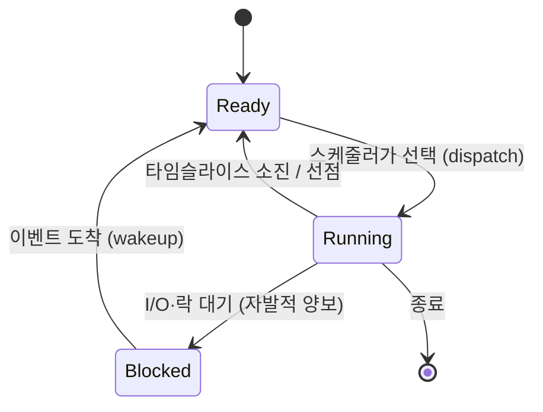
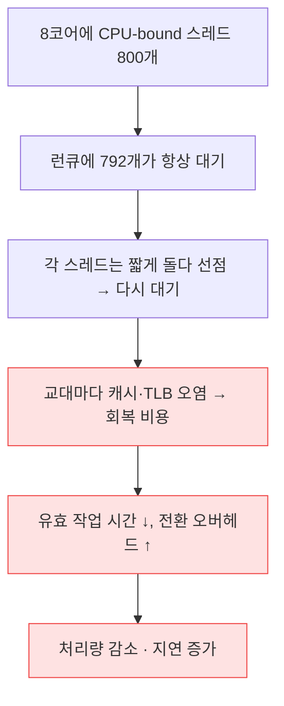

# 02. 스케줄링과 컨텍스트 스위치 (Scheduling & Context Switch)

> **핵심 질문:** 스레드를 많이 만들수록 왜 어느 순간부터 처리량이 *오히려* 떨어지는가?

## TL;DR

1. **스케줄러**는 실행 준비된 스레드들(런큐)에서 다음 주자를 고르는 커널 코드다. 타임슬라이스가 끝나거나 I/O로 블록되면 교대한다.
2. 컨텍스트 스위치의 *진짜* 비용은 레지스터 저장(~수백 ns)이 아니라, 그 후 **캐시·TLB가 식어서(cold)** 생기는 회복 비용이다 → 실질 수 µs, 심하면 수십 µs.
3. 스레드가 코어 수보다 많아지면(**오버서브스크립션**) 각자 조금 돌다 쫓겨나며 서로의 캐시를 오염시킨다. 일은 안 늘고 **전환만** 늘어난다.
4. 우선순위·공정성(리눅스 CFS)은 "누가 얼마나 적게 썼나(vruntime)"로 다음 주자를 정한다. 실시간(RT)은 다른 규칙.
5. 그래서 CPU 작업 서버의 워커 수 ≈ **코어 수**가 기본이다. I/O 대기가 많으면 예외인데, 그건 이벤트 루프(05장)가 더 잘 푼다.

---

## 원자 분해

```
"스레드 많다고 빨라지지 않는 이유"
├── 스케줄러 = 런큐에서 다음 주자 선택
│   ├── 상태: running / ready / blocked
│   ├── 선점(preemption) = 타이머 인터럽트로 강제 교대 (← claude/09)
│   └── 정책: CFS(공정성) · RT(우선순위) · nice
├── 컨텍스트 스위치 = 교대 그 자체
│   ├── 직접 비용: 레지스터·PC·커널스택 저장 (← claude/09)
│   └── 숨은 비용: TLB flush(← claude/07) + 캐시 cold(← claude/05·06)
└── 오버서브스크립션 = 코어보다 스레드 많음 → 전환·오염만 증가
```

---

## 스케줄러가 푸는 문제: 코어 N개, 실행 원하는 것 M개

코어는 8개인데 실행되고 싶은 스레드는 수백 개다(M ≫ N). 물리적으로 동시에 도는 건 N개뿐이므로, 커널은 **시분할(time-sharing)**로 착시를 만든다. 아주 짧은 시간마다 주자를 바꿔치우면, 사람 눈엔 전부 동시에 도는 것처럼 보인다.

각 코어에는 **런큐(run queue)**가 있다. 실행 준비된(ready) 스레드들이 여기 줄 서 있고, 스케줄러는 이 중 하나를 골라 CPU에 올린다(dispatch). 다 쓴 스레드는 다시 런큐로 돌아가거나, I/O를 기다리러 떠난다.

## 프로세스/스레드 상태 머신

스레드는 세 상태를 오간다. 이 그림이 이후 모든 이야기의 뼈대다.



핵심은 **Blocked**다. 스레드가 디스크나 소켓을 기다릴 때, 커널은 그 스레드를 CPU에서 내리고 **대기 큐(wait queue)**에 재운다. 블록된 스레드는 런큐에 없으므로 스케줄러의 선택 대상이 아니다 — CPU를 한 톨도 안 먹는다. 이 사실이 뒤에서 "I/O 서버는 왜 코어보다 많은 동시성을 감당하는가"의 열쇠가 된다(05장에서 회수).

## 선점(preemption): 타이머가 제어를 뺏어온다

한 스레드가 CPU를 양보하지 않고 무한 루프를 돌면? 옛날 협조적(cooperative) 스케줄링에선 시스템이 멈췄다. 현대 커널은 **선점형**이다. 하드웨어 타이머가 주기적으로(예: 1000Hz면 1ms마다) **타이머 인터럽트**를 걸어 커널로 제어를 강제 반납시킨다(인터럽트 메커니즘은 claude/09). 커널은 그 틈에 "이 스레드 그만 쓰고 교대할까?"를 판단한다.

이 강제 교대 주기가 **타임슬라이스**다. 리눅스 CFS는 고정 슬라이스 대신 "실행 가능한 스레드 수로 목표 지연을 나눈" 동적 슬라이스를 쓴다. 스레드가 많아질수록 각자의 몫은 짧아진다 — 이미 여기서 "많으면 잘게 쪼개진다"의 씨앗이 보인다.

```
1코어를 A·B·C 세 스레드가 나눠 쓸 때 (↓ = 타이머 인터럽트)
  시간 →
  A: ████░░░░░░░░████░░░░░░░░       ← 슬라이스만큼 돌고 선점
  B: ░░░░████░░░░░░░░████░░░░
  C: ░░░░░░░░████░░░░░░░░████
       ↓   ↓   ↓   ↓   ↓          ← 매 인터럽트마다 "교대할까?" 판단
  각 교대 지점마다 컨텍스트 스위치 비용 발생 → 잦을수록 순수 낭비
```

## 우선순위와 공정성: 누가 다음인가

리눅스 기본 스케줄러 **CFS(Completely Fair Scheduler)**의 규칙은 한 문장이다: **"지금까지 CPU를 가장 적게 쓴 놈을 다음에 실행한다."** 각 스레드의 사용 시간을 `vruntime`(가상 실행 시간)으로 누적하고, 항상 vruntime이 가장 작은(= 가장 굶은) 스레드를 고른다. `nice` 값(-20~+19)은 이 vruntime이 쌓이는 속도에 가중치를 줘 우선순위를 표현한다.

- **RT(실시간) 클래스**: 공정성 대신 절대 우선순위. 높은 우선순위 RT 스레드는 낮은 것을 항상 이긴다. 오디오·제어처럼 마감이 중요한 작업용.
- **우선순위 역전(priority inversion)**: 낮은 우선순위 스레드가 락을 쥔 채 높은 스레드를 막는 함정. 우선순위 상속으로 해결한다.

## 컨텍스트 스위치의 해부: 진짜 비용은 어디에

여기가 이 장의 심장이다. claude/09가 "레지스터 save/restore + 모드 전환"의 하드웨어 절차를 다뤘다면, 여기선 **그 비용의 전체 청구서**를 뜯어본다.

```
컨텍스트 스위치 1회의 청구서
──────────────────────────────────────────────
① 직접 비용 (눈에 보이는 것)      ~수백 ns
   - 레지스터·PC·SP를 커널 스택에 저장/복원
   - 스케줄러가 다음 주자 선택
   - 페이지 테이블 포인터(CR3) 교체 (프로세스 전환 시)
──────────────────────────────────────────────
② 간접 비용 (숨어있는 것)         ~수 µs ~ 수십 µs
   - TLB: PCID 없으면 flush → 새 프로세스는 페이지 워크부터 (claude/07)
   - 캐시 cold: 새 스레드의 데이터가 L1/L2에 없음 → DRAM에서 다시 (claude/05·06)
   - 분기 예측기·uop 캐시 리셋 → 파이프라인 예열 다시 (claude/04)
──────────────────────────────────────────────
```

직접 비용만 보면 컨텍스트 스위치는 싸 보인다(수백 ns). 하지만 진짜 청구서는 **교대 후 첫 수천 명령이 캐시 미스·TLB 미스로 기어가는 회복 시간**이다. 방금 쫓겨난 스레드가 L1/L2에 쌓아둔 hot 데이터를, 새 스레드가 밀어내 버리기 때문이다(cache pollution). DRAM 한 번이 L1의 ~50배(README 지연 표)라는 사실이 여기서 비용으로 청구된다.

그래서 실측 컨텍스트 스위치 비용은 보통 **1~수 µs**로 이야기되지만, 캐시·TLB가 완전히 식은 최악에는 회복까지 **수십 µs**로 벌어진다. 왜 claude/09보다 더 파고드느냐 — 이 문서의 관심은 "커널 스케줄러가 *언제 이 비용을 감수할 가치가 있는가*"라는 **정책**이기 때문이다.

## 자발적 vs 비자발적 전환: 누가 CPU를 놓았나

같은 컨텍스트 스위치라도 원인이 둘이고, 이 구분이 진단의 핵심이다.

- **자발적(voluntary)**: 스레드가 스스로 CPU를 놓는다. `read()`가 데이터를 기다리며 Blocked로 가는 경우. 할 일이 없어 양보한 거라 대개 건강한 신호다.
- **비자발적(involuntary)**: 타임슬라이스가 끝나 **강제로** 쫓겨난다. 아직 일이 남았는데 밀려난 것. 이게 폭증하면 런큐가 붐빈다는 뜻(오버서브스크립션 의심).

```
/proc/<pid>/status 에서 확인:
  voluntary_ctxt_switches:      1234    ← I/O 대기로 스스로 양보
  nonvoluntary_ctxt_switches:  98765    ← 선점당함 (많으면 CPU 경합 심함)
```

I/O 서버는 자발적 전환이 많은 게 정상이고, CPU 서버에서 비자발적 전환이 치솟으면 스레드를 줄여야 한다는 신호다.

## 왜 스레드가 많다고 빨라지지 않는가

이제 핵심 질문에 답한다. CPU를 계속 쓰는(CPU-bound) 작업을 코어 수보다 많은 스레드로 돌리면:



일할 코어는 8개로 고정인데 스레드만 800개면, 실제 계산량은 그대로이면서 **컨텍스트 스위치와 캐시 오염이라는 순수 낭비만 800/8배로 늘어난다.** `vmstat 1`의 `cs`(context switches) 컬럼이 폭증하고, `us`(user)보다 `sy`(system)가 커진다.

반대로 **I/O-bound** 스레드는 대부분 Blocked 상태라 런큐에 거의 없다. 그래서 I/O 서버는 코어보다 훨씬 많은 스레드/연결을 감당할 수 있다 — 다만 그 경우엔 스레드 자체가 아니라 **이벤트 루프**가 더 효율적인 답이다(05장). 결론: **CPU 작업의 병렬도는 코어 수가 상한이다.**

## 로드 애버리지: 런큐가 얼마나 붐비나

`uptime`/`top`의 **load average**는 "실행하고 싶은데(런큐에 있거나 도는 중) 못 하고 기다리는 평균 스레드 수"다(리눅스는 uninterruptible I/O 대기도 포함). 직관은 간단하다.

```
8코어 기준
  load 4.0  → 코어가 남는다 (여유)
  load 8.0  → 딱 포화 (코어당 1개)
  load 24.0 → 3배 오버서브스크립션 → 각 스레드가 1/3만 진행
```

load가 코어 수를 크게 넘으면 스레드들이 런큐에서 서로 순서를 기다리는 것이고, 이때 비자발적 컨텍스트 스위치가 함께 치솟는다. `vmstat 1`의 `r`(run queue 길이)·`cs`(context switches)와 함께 보면 "이게 CPU 경합인지 I/O 대기인지"가 갈린다.

---

## 프론트엔드에서 이렇게 만난다

- **Node 워커·클러스터 수 = 코어 수**: `os.cpus().length`가 기본값인 이유가 이 장 전체다. CPU 무거운 작업을 그 이상의 워커로 돌리면 처리량이 아니라 컨텍스트 스위치만 늘어난다.
- **Jest `--maxWorkers`**: CI에서 이 값을 코어 수보다 크게 잡으면 테스트가 오히려 느려진다(전환 + 메모리 압박). `--maxWorkers=50%`가 흔한 타협.
- **브라우저 메인 스레드 독점**: 렌더링·레이아웃·JS가 한 스레드를 공유한다. 긴 동기 JS 태스크가 프레임 예산(60fps면 16.6ms)을 넘기면 다른 작업이 "굶어" 버벅인다(jank). 단, 이건 OS 스케줄러가 아니라 **이벤트 루프의 협조적 양보** 문제다(`scheduler.yield()`, 05장).
- **`vmstat`·`htop`의 cs 컬럼**: 서버가 느린데 CPU는 안 찬다면, 컨텍스트 스위치 폭증(락 경합·스레드 과다)을 의심하라.

---

## 이전 계층과의 연결

- **컨텍스트 스위치의 직접 메커니즘**(레지스터 save/restore, 타이머 인터럽트, syscall 모드 전환) = [claude/09 I/O & 인터럽트](../../claude/topics/09-io-and-interrupts.md). 이 문서는 그 위에서 "커널이 언제·왜 교대를 결정하는가"를 다룬다.
- **TLB flush 비용 · PCID/ASID**(전환을 싸게 만드는 하드웨어) = [claude/07 가상 메모리](../../claude/topics/07-virtual-memory.md).
- **캐시 cold의 실제 비용**(DRAM ≈ L1의 50배) = [claude/05 메모리 계층](../../claude/topics/05-memory-hierarchy.md), [claude/06 캐시](../../claude/topics/06-cache.md).
- **블록(Blocked) 상태의 활용** = 다음 이야기는 [05장 논블로킹·epoll](05-nonblocking-and-epoll.md)에서.

---

## 파인만 체크 3개

1. 컨텍스트 스위치의 레지스터 저장은 수백 ns인데, 왜 실질 비용은 수 µs~수십 µs로 벌어지는가? (힌트: 교대 후 첫 수천 명령이 겪는 일)
2. I/O 대기가 많은 서버는 왜 코어 수보다 훨씬 많은 동시성을 감당할 수 있는가? (힌트: Blocked 스레드는 런큐에 있는가)
3. CPU-bound 작업의 스레드를 코어 수의 100배로 늘리면 계산량은 그대로인데 무엇이 100배로 늘어나는가?
