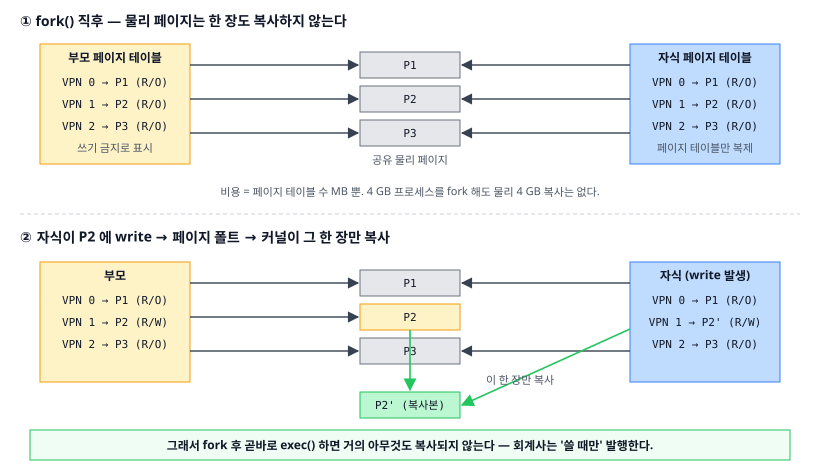
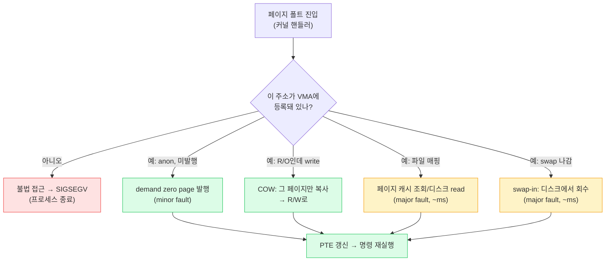

# 03. 가상 메모리 — OS의 시선 (Virtual Memory, the Kernel's Policy)

> **핵심 질문:** `malloc(16GB)`가 즉시 성공하는데 실제 RAM은 8GB다. 커널은 없는 메모리를 어떻게 빌려주는가?

## TL;DR

1. [claude/07](../../claude/topics/07-virtual-memory.md)이 "주소 변환의 **하드웨어**(페이지 테이블·MMU·TLB)"라면, 이 문서는 "그 매핑을 **언제 만들고·뺏고·디스크로 미룰지**"라는 커널 정책이다.
2. 커널은 메모리를 **회계사**처럼 다룬다. 약속(가상 주소)만 먼저 주고, 실제 물리 페이지는 진짜 만질 때(페이지 폴트) 발행한다 → **demand paging**.
3. `fork`가 싼 이유는 **COW**다. 복제를 약속만 하고, 실제 복사는 누군가 *쓸 때* 그 페이지 한 장만 한다.
4. RAM이 모자라면 안 쓰는 페이지를 디스크로 내보낸다(**swap**). 그래도 부족하면 **OOM 킬러**가 희생자를 골라 죽인다.
5. `mmap`은 "파일이나 큰 영역을 주소 공간에 회계 등록"하는 것. `read/write` 없이 메모리 접근만으로 파일을 다룬다.

---

## 원자 분해

```
"없는 메모리를 빌려주는 회계"
├── 페이지 폴트 = 장부의 '미발행' 항목을 만나는 순간
│   ├── HW가 감지 (← claude/07) → 여기: 커널 handler가 결정
│   ├── demand paging: 처음 만질 때 발행
│   ├── COW: fork 복제를 write까지 지연
│   └── swap-in: 디스크로 내보냈던 페이지 회수
├── overcommit: 장부상 약속 > 실제 RAM (malloc이 안 죽는 이유)
├── reclaim: LRU 근사로 cold 페이지 회수 → swap out
└── OOM killer: 약속이 부도날 때의 최후 수단
```



---

## 회계사 비유와 demand paging

`char *buf = malloc(16 * GB)`가 8GB 머신에서 성공하는 이유는, malloc이 **물리 메모리를 준 게 아니라 주소 공간(장부상 항목)만 예약**했기 때문이다. 커널은 "너에게 16GB 주소를 쓸 권리를 약속한다"고 장부에 적을 뿐, 물리 페이지는 한 장도 발행하지 않는다.

물리 페이지는 당신이 그 주소를 **실제로 건드리는 순간** 발행된다.

```c
char *buf = malloc(16L * GB);  // 장부에 약속만. RSS ≈ 그대로
buf[0] = 1;                    // 첫 페이지(4KB)만 진짜 발행
buf[1 * GB] = 1;               // 그 페이지 하나 더 발행
```

이것이 **demand paging(요구 시 페이징)**이다. 커널은 게으른 회계사처럼 "쓸 때만 발행"한다. 그래서 프로세스의 **VSS(가상 크기, 약속)**와 **RSS(실제 물리 사용, 발행량)**가 크게 다르다.

```
malloc(16GB) 직후 → 배열을 조금씩 만질 때
  VSS (약속)  ┃████████████████████┃  16 GB  (변화 없음, 처음부터 예약)
  RSS (실물)  ┃█░░░░░░░░░░░░░░░░░░░░┃  → 만지는 페이지만큼 조금씩 증가
                첫 write        나중
```

`malloc` 직후엔 VSS만 16GB로 뛰고 RSS는 거의 안 변한다. (claude/07의 "lazy allocation / overcommit"이 하드웨어·측정 관점이라면, 여기선 그걸 *회계 정책*으로 다시 읽는 것이다.)

**overcommit 정책**은 이 도박의 강도를 정한다. 리눅스 `vm.overcommit_memory`:

| 모드 | 뜻 | 성격 |
|---|---|---|
| 0 (heuristic, 기본) | 상식적으로 말 안 되는 큰 요청만 거절 | 대부분 통과 |
| 1 (always) | 무조건 약속 | 발행 실패 시 OOM에 맡김 (Redis 등이 선호) |
| 2 (never) | 실제 RAM+swap 한도 내에서만 약속 | `malloc`이 일찍 실패 → OOM은 드묾 |

기본값은 "웬만하면 빌려준다"이다. 그래서 `malloc(16GB)`가 성공하는 것이고, 진짜 부도가 나면 뒤의 OOM 킬러가 등판한다.

## 페이지 폴트 핸들러: 커널의 결정 트리

claude/07은 TLB 미스 → 하드웨어 페이지 워크 → PTE 확인까지의 **변환 흐름**을 다뤘다. 이 문서가 이어받는 지점은 그 뒤, **"PTE가 없어서 폴트가 커널로 넘어온 순간"**부터다. 커널의 폴트 핸들러는 결정 트리를 탄다.



같은 "페이지 폴트"라도 커널이 하는 일은 완전히 다르다. 첫 접근이면 빈 페이지를 발행하고(minor), 파일이면 디스크에서 읽어오고(major), COW면 복사하고, 스왑됐으면 되불러온다. **minor fault(디스크 불필요, ~µs)**와 **major fault(디스크 필요, ~ms)**의 정의는 claude/07에 있으니, 여기선 "커널이 어느 가지를 왜 타는가"에 집중한다.

## COW 심화: fork가 싼 진짜 이유

01장에서 미룬 질문이다. `fork()`가 4GB 프로세스를 복제하는데 왜 4GB가 즉시 안 드는가?

커널은 fork 시 **물리 페이지를 복사하지 않는다.** 대신 (1) 자식의 페이지 테이블만 복제하고, (2) 부모·자식 양쪽의 모든 쓰기 가능 페이지를 **read-only로 표시**한다. 이제 둘은 같은 물리 페이지를 공유한다(위 SVG 위쪽).

어느 한쪽이 그 페이지에 **쓰려는 순간** read-only 위반으로 페이지 폴트가 난다. 커널의 핸들러가 "아, 이건 COW구나" 판단하고 **그 페이지 한 장만 복사**해 쓰는 쪽에 R/W로 준다(SVG 아래쪽). 안 건드린 페이지는 끝까지 공유된다.

그래서 **`fork` 후 곧바로 `exec`하면 거의 아무것도 복사되지 않는다.** exec가 주소 공간을 어차피 통째로 갈아엎으니, 그 사이 공유했던 페이지는 복사될 일이 없다. 회계사는 "쓸 때만 발행한다"는 원칙을 fork에도 그대로 적용한 것이다.

## mmap: 큰 것은 전부 회계 등록

`mmap`은 "이 주소 범위를 이 대상에 연결하라"고 커널 장부에 등록(VMA 생성)하는 시스템 콜이다. 세 가지 용도가 있다.

| 종류 | 대상 | 쓰임 |
|---|---|---|
| 파일 매핑 | 디스크 파일 ↔ 페이지 캐시 | `read/write` 없이 메모리 접근으로 파일 I/O |
| 익명 매핑 | 물리 페이지(파일 없음) | 큰 `malloc`의 실제 구현 |
| 공유 매핑 | 여러 프로세스가 같은 페이지 | IPC 공유 메모리(01장) |

파일을 mmap하면, 그 영역을 처음 읽는 순간 페이지 폴트 → 커널이 해당 부분만 페이지 캐시로 로드한다(lazy). 큰 파일을 앞부분만 볼 때 특히 유리하다. 다만 매핑한 파일이 사라지거나 잘리면 접근 시 `SIGBUS`가 난다. (`mmap` vs `read`의 트레이드오프는 claude/07에 정리돼 있다.)

## swap과 reclaim: RAM이 모자랄 때

발행한 물리 페이지가 RAM을 다 채우면? 커널은 **회수(reclaim)**를 시작한다. LRU(최근 사용) 근사로 "요즘 안 쓰는(cold) 페이지"를 골라:

- **파일 페이지**면 그냥 버린다(디스크에 원본이 있으니 다시 읽으면 됨).
- **익명 페이지**(힙·스택)면 원본이 없으므로 **swap 영역(디스크)으로 내보낸다(swap out).**

나중에 그 주소를 다시 만지면 major fault → 디스크에서 **swap-in**한다. 여기서 무서운 게 **스래싱(thrashing)**이다. 워킹셋이 RAM보다 커지면, 커널이 페이지를 내보내자마자 곧 다시 필요해져 되불러오고를 반복한다. 디스크 왕복은 ~ms — DRAM(~100ns)의 **수만 배**라, 시스템이 문자 그대로 기어간다. CPU는 한가한데 `iowait`만 치솟는 게 신호다. `vm.swappiness`로 회수 성향을 조절한다.

## OOM 킬러: 약속이 부도날 때

overcommit(약속 > 실제)은 "다들 약속만큼 다 쓰진 않는다"는 통계적 도박이다. 그런데 정말로 다들 발행을 요구하면? 스왑까지 꽉 차 물리 페이지를 더 못 만들면, 커널은 **OOM(Out-Of-Memory) 킬러**를 발동한다.

커널은 각 프로세스의 `oom_score`(대체로 메모리를 많이 먹는 놈이 높음)를 보고 **희생자 하나를 골라 `SIGKILL`**한다. 서버에서 프로세스가 로그도 없이 갑자기 증발했다면 십중팔구 이것이다(`dmesg`에 `Out of memory: Killed process ...`). 컨테이너 환경에선 cgroup 메모리 한도를 넘으면 그 컨테이너 안에서 OOM이 발동한다(쿠버네티스의 `OOMKilled`).

---

## 프론트엔드에서 이렇게 만난다

- **탭이 스스로 리로드되는 현상**: 모바일 사파리/크롬에서 백그라운드 탭이 다시 열 때 새로고침되는 건, OS 메모리 압박에 브라우저가 그 렌더러 프로세스를 회수(discard)했기 때문이다. 회계사가 "안 쓰는 탭"의 페이지를 거둬간 것.
- **`OOMKilled`(쿠버네티스)**: Node 서버 컨테이너에 `memory: 512Mi` 한도를 주면, RSS가 이를 넘는 순간 cgroup OOM으로 죽는다. `--max-old-space-size`(V8 힙 상한)와 컨테이너 한도는 별개라, 힙 외 메모리(버퍼·네이티브)까지 합쳐 한도를 넘기면 잡힌다.
- **"8GB 줬는데 왜 죽지"**: `docker stats`의 메모리엔 페이지 캐시가 포함될 수 있다. RSS와 캐시를 구분해야 진짜 사용량이 보인다.
- **esbuild·swc가 빠른 이유 중 하나**: 큰 소스를 `mmap`으로 매핑해 필요한 부분만 페이지 캐시에서 읽는다(불필요한 복사 회피).

---

## 이전 계층과의 연결

- **페이지 테이블·MMU·TLB·minor/major fault의 정의** = [claude/07 가상 메모리](../../claude/topics/07-virtual-memory.md). 이 문서는 그 위의 **커널 정책**(언제 발행·회수·스왑하는가)을 얹는다.
- **overcommit·RSS/VSS·page cache·lazy alloc** = claude/07이 하드웨어·측정 관점으로, 이 문서가 "회계 정책"으로 재해석한다(중복은 claude/07 링크로 위임).
- **swap-in의 디스크 read 지연(~ms)이 왜 치명적인가** = [claude/05 메모리 계층](../../claude/topics/05-memory-hierarchy.md)의 지연 표.
- **fork로 만든 주소 공간이 왜 격리되나** = [01장 프로세스와 스레드](01-process-and-thread.md).

---

## 파인만 체크 3개

1. `malloc(16GB)`가 즉시 성공하는데 RAM은 8GB다. 커널의 "거짓말"은 언제 들통나며, 그때 커널은 무엇을 하는가?
2. 4GB 프로세스를 `fork`해도 왜 물리 메모리 4GB가 즉시 더 들지 않는가? 자식이 배열 하나를 수정하면 무슨 일이 생기는가?
3. 스왑 공간이 있는데도, 스왑을 많이 쓰기 시작하면 왜 시스템 전체가 기어가는가? (힌트: 디스크 왕복 vs DRAM의 지연 배수)
