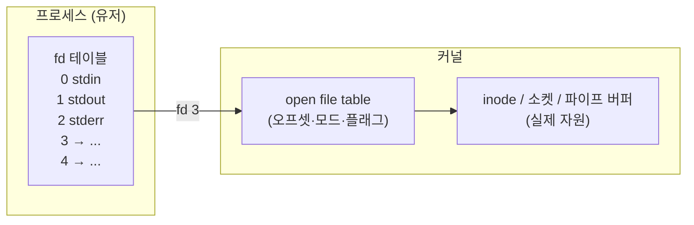
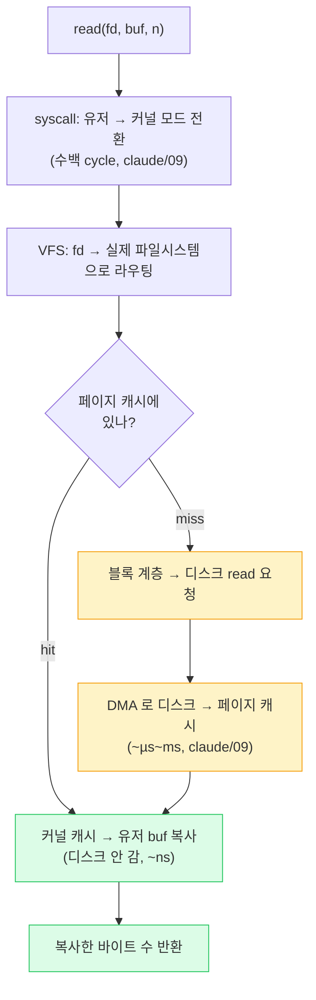

# 04. 파일과 I/O (Files & I/O — "모든 것이 fd")

> **핵심 질문:** 파일·소켓·파이프·표준입출력이 전부 `read()`/`write()` 하나로 다뤄지는 이유는 무엇인가?

## TL;DR

1. **fd(파일 디스크립터)**는 프로세스가 연 자원을 가리키는 작은 정수 = 커널 자원 테이블의 인덱스다. 유닉스의 "모든 것이 파일(everything is a file)"이 여기서 나온다.
2. `read/write`는 그 정수를 들고 커널로 들어가(**시스템 콜**, claude/09), 유저 버퍼 ↔ 커널 버퍼(페이지 캐시)를 복사한다.
3. **페이지 캐시** 덕에 대부분의 read/write는 디스크가 아니라 RAM과 대화한다 → 빠르다. write는 일단 캐시에만 쓴다(**쓰기 지연**, writeback).
4. 그래서 `write()`가 "됐다"고 리턴해도 디스크엔 아직 없을 수 있다. 진짜 새기려면 **`fsync`** — 디스크 왕복이라 수백 µs~수 ms로 느리다.
5. DB는 이 느린 fsync를, 랜덤 갱신 대신 **순차 append 한 번(WAL)** + 그룹 커밋으로 이긴다. 이 저장소의 6단계 engine이 바로 이 싸움을 구현한다.

---

## 원자 분해

```
"모든 것이 fd 인 이유"
├── fd = 커널 자원 테이블의 인덱스 (작은 정수)
│   ├── fd 테이블 → open file(오프셋) → inode / 소켓 / 파이프
│   └── 그래서 read/write/close/poll 하나로 통일 (다형성)
├── read/write 의 여정 = syscall(← claude/09) → VFS → 페이지 캐시 → 블록층 → DMA(← claude/09)
│   ├── 유저 버퍼 ↔ 커널 페이지 캐시 복사
│   └── write 는 캐시까지만 (writeback 지연)
└── 지속성의 값 = fsync = 디스크 왕복(느림) → WAL 이 맞서는 법
```

---

## fd = 인덱스라는 원자

파일 디스크립터는 `3`, `4`, `5` 같은 **작은 정수**다. 왜 포인터가 아니라 정수일까? 그 정수는 **프로세스별 fd 테이블의 인덱스**이기 때문이다. 커널 안에는 세 단계의 표가 있다.



`open()`은 빈 fd 슬롯을 찾아 자원과 연결하고 그 인덱스를 돌려준다. 프로세스가 아는 건 정수뿐, 실제 자원 구조체는 커널이 쥔다. 이 설계가 두 가지를 준다.

- **격리·보안**: 유저는 커널 포인터를 절대 손에 넣지 못한다. fd `5`로 할 수 있는 일은 커널이 검증한다. 남의 프로세스 fd 번호를 안다고 그 자원을 쓸 수도 없다(테이블이 프로세스별).
- **다형성("everything is a file")**: fd 뒤에 뭐가 있든(정규 파일·소켓·파이프·`epoll`·`eventfd`·디바이스) **같은 `read`/`write`/`close`/`poll`**로 다룬다. 그래서 셸 파이프라인이 파일이든 소켓이든 똑같이 흐른다.

기본으로 열려 있는 fd 0/1/2가 stdin/stdout/stderr다. 01장에서 본 셸 리다이렉션(`> out.txt`)이 바로 이 fd 1을 파일로 바꿔 끼우는 것이었다.

> ❓ **면접: "왜 fd는 프로세스마다 0부터 다시 시작하나?"** fd 테이블이 프로세스별이기 때문. `fork`하면 fd 테이블이 복제돼 부모·자식이 같은 open file(같은 오프셋)을 공유한다 — 그래서 셸의 파이프가 성립한다.

## read()의 여정: 정수 하나가 디스크까지 가는 길

`read(fd, buf, 4096)` 한 줄 뒤에서 벌어지는 일을 따라가 보자.



핵심은 **페이지 캐시에서 대부분 끝난다**는 것이다. 커널은 한 번 읽은 디스크 데이터를 남는 RAM에 캐시해 둔다(claude/07의 page cache). 두 번째 read부터는 디스크를 안 가고 캐시→유저 복사만 하므로 나노초급이다. 캐시 미스일 때만 블록 계층으로 내려가 DMA(claude/09)로 디스크에서 끌어온다.

## 유저/커널 버퍼와 복사 비용

위 그림에서 데이터는 최소 **두 번 복사**된다: 디스크 → 커널 페이지 캐시(DMA), 커널 페이지 캐시 → 유저 버퍼(CPU 복사). 유저 공간과 커널 공간의 메모리는 분리돼 있어서(01장 격리), 커널이 유저 버퍼에 직접 DMA하지 않고 자기 캐시를 거친다.

이 유저↔커널 복사가 대용량 전송에선 부담이다. 그래서 이를 없애는 길이 둘 있다.

- **zero-copy**: `sendfile`/`splice`는 파일→소켓을 유저 공간 복사 없이 커널 안에서 직접 옮긴다(정적 파일 서버가 빠른 이유, claude/09).
- **mmap**: 파일을 주소 공간에 매핑하면 유저 버퍼라는 별도 복사본 없이 페이지 캐시를 직접 본다(03장).

## 페이지 캐시: write가 빠른 이유이자 위험

`write(fd, buf, n)`은 보통 디스크를 기다리지 않는다. 유저 버퍼를 **페이지 캐시에 복사하고 그 페이지를 dirty로 표시한 뒤 바로 리턴**한다. 실제 디스크 기록(**writeback**)은 나중에 커널 스레드(`pdflush`/`kworker`)가 모아서 한다.

이 **쓰기 지연**이 write를 빠르게 만든다(디스크 왕복을 숨긴다). 동시에 위험의 근원이다 — **write가 성공을 리턴한 직후 전원이 나가면, 아직 캐시에만 있던 데이터는 사라진다.** 디스크엔 도달하지 않았기 때문이다. read 캐시와 write 캐시는 같은 페이지 캐시로 통합돼 있어서, 방금 write한 내용을 read하면 캐시에서 바로 보이지만(그래서 일관돼 보이지만) 그게 "디스크에 있다"는 뜻은 아니다.

## fsync가 느린 이유

데이터를 정말 디스크에 새기려면 `fsync(fd)`를 호출한다. 이건:

1. 그 파일의 모든 dirty 페이지를 **실제로 디스크에 flush**하고,
2. 디스크에게 **"정말 플래터/NAND에 기록했다"는 확인(FLUSH/FUA)**까지 받는다.

즉 **디스크 왕복**이 포함된다. 그래서 느리다.

```
write() (캐시까지)         : ~µs      (메모리 복사)
fsync() on SSD             : ~수백 µs ~ 수 ms   (NAND 기록 + 확인)
fsync() on HDD             : ~수 ms ~ 수십 ms   (헤드 이동 + 회전)
```

`fdatasync`는 파일 크기 등 메타데이터 갱신을 생략해 조금 빠르다. 어쨌든 fsync는 "빠른 메모리 세계"에서 "느린 디스크 세계"로 넘어가는 **관문**이고, 지속성(durability)의 값을 여기서 치른다.

## DB(WAL)가 fsync와 싸우는 법

DB는 트랜잭션마다 지속성을 보장해야 하니 fsync를 피할 수 없다. 그런데 갱신할 때마다 **데이터 파일의 랜덤 위치**를 고치고 fsync하면? 매번 디스크의 여기저기를 건드리며 왕복해 죽는다.

해법이 **WAL(Write-Ahead Log)**이다.

```
[나쁨] 랜덤 갱신 + 매번 fsync
   페이지 A 수정 → fsync   (디스크 왕복)
   페이지 Z 수정 → fsync   (또 왕복, 헤드 이동)
   ...

[좋음] WAL: 변경을 로그 끝에 '순차 append' 후 로그만 fsync
   변경1·2·3 → 로그 파일 끝에 이어 쓰기 → fsync 한 번
   (데이터 파일 갱신은 나중에 느긋하게 반영)
```

두 가지가 이긴다. (1) **순차 쓰기**는 랜덤 쓰기보다 디스크·페이지 캐시에 훨씬 유리하다. (2) **그룹 커밋**: 짧은 순간의 여러 트랜잭션을 모아 **fsync 한 번**으로 함께 내려보내 왕복 횟수를 나눈다. 크래시 후엔 로그를 재생(replay)해 복구한다.

**이 저장소의 6단계 engine이 바로 이 WAL을 직접 구현한다.** BTree 데이터 파일과 별개로 로그를 두고, fsync 비용을 순차 append + 그룹 커밋으로 어떻게 상쇄하는지를 코드로 만나게 된다.

---

## 프론트엔드에서 이렇게 만난다

- **`fs.writeFile` 후 전원이 나가면?**: Node가 write를 끝내도 페이지 캐시까지만일 수 있다. 정말 지켜야 할 데이터는 flush 옵션이나 명시적 fsync가 필요하다. SQLite·LevelDB 같은 임베디드 DB는 내부에서 WAL+fsync로 이걸 처리해 준다.
- **`EMFILE: too many open files`**: fd는 프로세스당 한도(`ulimit -n`)가 있다. Vite/webpack의 파일 감시나 소켓이 fd를 소진하면 이 에러가 난다. 한도를 올리거나 watcher를 정리해야 한다.
- **HMR 파일 감시의 뿌리**: Vite dev 서버는 폴링 대신 `inotify`(리눅스)·`FSEvents`(macOS)로 커널이 파일 변경을 **fd 이벤트로 통보**받는다 — 저장하면 즉시 리로드되는 그 마법.
- **fetch 응답 = 소켓 fd에서 read**: 브라우저의 `ReadableStream`, Node의 스트림은 결국 소켓 fd에서 조각조각 read하는 것이다. "모든 것이 fd"라 파일 스트림과 네트워크 스트림의 API가 닮았다.
- **컨테이너 로그 = stdout(fd 1)**: 12-factor 앱은 로그를 파일이 아니라 fd 1로 흘리고, 런타임이 그 스트림을 수집한다. 이것도 fd 다형성 덕이다.

---

## 이전 계층과의 연결

- **syscall의 유저→커널 전환 비용, DMA로 디스크→메모리 이동** = [claude/09 I/O & 인터럽트](../../claude/topics/09-io-and-interrupts.md). 이 문서는 그 위에서 "fd 추상화와 페이지 캐시 정책"을 다룬다.
- **페이지 캐시(남는 RAM에 디스크 캐시), mmap, zero-copy** = [claude/07 가상 메모리](../../claude/topics/07-virtual-memory.md).
- **디스크/네트워크 지연 숫자(SSD µs, HDD ms)** = [claude/05 메모리 계층](../../claude/topics/05-memory-hierarchy.md)과 [OS README 지연 표](../README.md).
- **소켓 fd를 '많이' 다루는 법** = 다음 [05장 논블로킹·epoll](05-nonblocking-and-epoll.md). **WAL의 실제 구현** = 이 저장소 engine 6단계.

---

## 파인만 체크 3개

1. fd는 왜 커널 포인터가 아니라 작은 정수인가? 그게 왜 보안·격리에 유리한가?
2. `write()`가 성공을 반환했는데도 데이터가 디스크에 없을 수 있는 이유는? 언제 정말 디스크에 새겨지는가?
3. DB도 결국 똑같이 fsync를 부르는데, 왜 파일 여기저기를 고치며 매번 fsync하는 것보다 빠른가? (힌트: 순차 append + 그룹 커밋)
