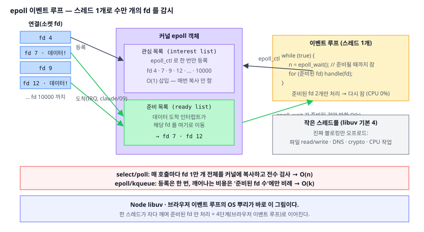
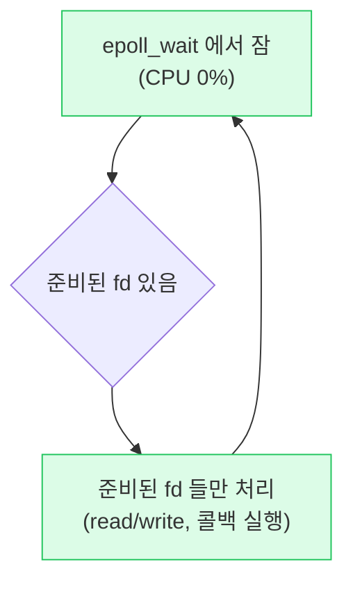

# 05. 논블로킹과 epoll (Non-blocking I/O & Event Loop)

> **핵심 질문:** 서버 하나가 어떻게 스레드 수만 개 없이 수만 개의 연결을 동시에 다루는가? (C10K 문제)

## TL;DR

1. **블로킹** `read`의 정체: 데이터가 없으면 커널이 그 스레드를 **대기 큐**에 재우고 CPU를 뺏는다(블록 = 자발적 컨텍스트 스위치, 02장). 연결마다 스레드를 두면 스레드가 폭발한다.
2. **논블로킹**: "없으면 없다고 즉시 리턴(`EAGAIN`)". 대신 언제 준비됐는지 내가 계속 물어야 한다(폴링 낭비).
3. **멀티플렉싱**: 커널에게 "이 fd들 중 하나라도 준비되면 깨워줘"라고 맡긴다 → `select` → `poll` → **`epoll`/`kqueue`**. epoll은 관심 목록을 커널에 등록해 **O(준비된 수)**로 통지한다.
4. 그래서 **스레드 1개 + epoll로 fd 1만 개**를 돌린다 = **이벤트 루프**. 이것이 C10K의 해법이다.
5. **Node의 libuv, 브라우저 이벤트 루프**의 OS 뿌리가 바로 이 epoll/kqueue다. 스레드풀은 진짜 블로킹(파일·DNS·CPU)에만 남겨둔다.

---

## 원자 분해

```
"스레드 없이 수만 연결"
├── 블로킹 = 커널이 스레드를 대기 큐에 재움 (02의 Blocked 상태)
│   └── 연결당 스레드 → 컨텍스트 스위치·메모리 폭발 (C10K)
├── 논블로킹 = 즉시 리턴(EAGAIN) + 내가 폴링 → CPU 낭비
├── 멀티플렉싱 = 커널이 '준비된 fd'만 통지
│   ├── select/poll: 매번 전체 목록 복사·검사 O(n)
│   └── epoll/kqueue: 등록형, O(준비된 수)
└── 이벤트 루프 = 1스레드 + epoll (libuv·브라우저) + 스레드풀(진짜 블로킹용)
```



---

## 블로킹의 정체: 커널이 스레드를 재운다

`read(sock, buf, n)`을 불렀는데 소켓에 아직 데이터가 없으면? 커널은 그 스레드를 **그 소켓의 대기 큐(wait queue)에 넣고 Blocked 상태로 재운다**(02장 상태 머신). CPU는 즉시 다른 스레드에게 넘어간다. 데이터가 도착하면 NIC 인터럽트(claude/09)가 커널을 깨우고, 커널이 대기 큐의 스레드를 wakeup해 Ready로 되돌린다.

이 모델은 **코딩이 편하다**(그냥 순서대로 read/write 쓰면 됨). 문제는 **연결당 스레드** 구조로 확장할 때다. 동시 연결 1만 개면 스레드 1만 개가 필요한데:

- 스레드마다 스택이 기본 **8MB** → 1만 개면 가상 주소만 **80GB**(실제 RSS는 적어도 부담).
- 런큐가 붐비면 컨텍스트 스위치가 폭증한다(02장). 대부분 데이터를 기다리며 잠들어 있는데도 스레드라는 무거운 자원을 통째로 잡아먹는다.

이것이 **C10K 문제**(동시 연결 1만 개를 어떻게 감당할 것인가)다.

## 논블로킹 fd: 안 자는 대신 내가 물어야 한다

fd를 `O_NONBLOCK`으로 열면 read가 달라진다. 데이터가 없으면 재우지 않고 **즉시 `EAGAIN`을 리턴**한다. 이제 스레드는 잠들지 않는다.

하지만 이것만으론 부족하다. "준비됐나?"를 내가 while로 계속 물으면(busy polling) CPU를 100% 태운다(claude/09의 폴링). 1만 개 fd를 각각 논블로킹으로 돌며 물으면, 대부분 `EAGAIN`인 헛질에 CPU를 낭비한다. 우리에게 정말 필요한 건 **"여러 fd를 한꺼번에 기다리되, 안 자고, 준비된 것만 알려줘"**다.

## 멀티플렉싱 select/poll: 한꺼번에 기다리기

`select`/`poll`은 이 요구의 1세대 답이다. fd 집합을 통째로 커널에 넘기며 "이 중 하나라도 준비되면 리턴하라"고 한 번의 syscall로 요청한다. 하나라도 준비되면 커널이 깨워준다. 스레드 하나로 여러 fd를 감시하는 게 드디어 가능해졌다.

그러나 확장의 벽이 있다.

- **매 호출마다 fd 집합 전체를 유저→커널로 복사**하고, 커널이 **전부 훑어(O(n))** 준비 여부를 검사한다. fd 1만 개면 매 루프마다 1만 개를 복사·검사한다 — 실제 준비된 건 두어 개뿐인데도.
- `select`는 fd 번호 상한 **1024**라는 하드 리밋까지 있다.

연결이 늘수록 "감시 자체의 비용"이 O(n)으로 커진다. C10K에서 select는 무릎을 꿇는다.

## epoll/kqueue: 등록형의 승리

리눅스 `epoll`(그리고 BSD/macOS의 `kqueue`)은 발상을 뒤집는다. 매번 목록을 넘기지 말고, **관심 목록을 커널에 한 번 등록해 두자.**

```
epoll_create()            // 커널에 epoll 객체 생성
epoll_ctl(ADD, fd)        // 관심 fd를 '한 번만' 등록 (interest list)
while (true) {
    n = epoll_wait(...)   // 준비된 fd만 담겨 돌아옴 (ready list)
    for (준비된 fd) handle(fd)
}
```

왜 빠른가? 커널은 각 fd에 콜백을 걸어두고, **데이터가 도착할 때마다 그 fd를 미리 "준비 목록(ready list)"에 옮겨둔다**(위 SVG). `epoll_wait`는 그 준비 목록만 넘겨주므로, 비용이 전체 fd 수 n이 아니라 **실제 준비된 수 k에만 비례**한다(O(k)). 등록은 한 번, 매 루프의 복사·전수검사가 사라진다. 그래서 fd가 1만 개든 10만 개든 감시 비용이 거의 늘지 않는다.

- **level-triggered(기본)**: 준비된 상태가 남아있는 한 계속 알린다(다루기 쉬움).
- **edge-triggered**: 상태가 *바뀌는 순간*만 알린다(빠르지만 `EAGAIN`까지 다 읽어야 함).

(epoll vs select vs io_uring의 성능 비교표와 io_uring은 claude/09에 정리돼 있다. 이 문서는 그 위의 **API·이벤트 루프 관점**을 다룬다.)

## 이벤트 루프 = 최종 형태

epoll을 감싸면 **이벤트 루프**가 된다. 스레드 하나가 `epoll_wait`에서 **자다가**, 준비된 fd만 깨어나 처리하고, 다시 잔다.



CPU는 **진짜 할 일이 있을 때만** 돈다. 블로킹 모델의 "1만 스레드"가 이벤트 루프의 "1 스레드 + epoll"로 접힌다. 이것이 nginx·Redis·Node가 적은 스레드로 막대한 동시성을 내는 비결이다.

**Node.js의 libuv**가 정확히 이 구조다: 메인 이벤트 루프가 소켓 fd를 epoll/kqueue로 돌린다. **브라우저의 이벤트 루프**(태스크 큐·마이크로태스크 큐)도 같은 뿌리에서 자랐다 — 렌더러 프로세스가 네트워크·타이머·입력 이벤트를 이 루프에서 디스패치한다. 이 이야기는 **4단계(브라우저 이벤트 루프)**로 이어진다.

## 트레이드오프: 이벤트 루프 vs 스레드풀

이벤트 루프는 만능이 아니다. 두 개의 아킬레스건이 있다.

1. **CPU 무거운 작업이 루프를 막는다**: 이벤트 루프는 한 스레드다. 콜백 하나가 무거운 계산(큰 for 루프, 동기 JSON 파싱)을 하면, 그동안 다른 모든 fd 이벤트가 **전부 멈춘다.** 서버 전체가 굳고, 브라우저는 버벅인다(jank).
2. **진짜로 블로킹만 되는 API**: 디스크 파일 read, DNS 조회 등은 epoll로 깔끔하게 논블로킹하기 어렵다. 그래서 libuv는 이런 작업을 **작은 스레드풀**(`UV_THREADPOOL_SIZE` 기본 4)로 오프로드한다.

그래서 현대 서버의 정답은 **하이브리드**다.

| 상황 | 좋은 도구 | 이유 |
|---|---|---|
| 수만 개 네트워크 연결(I/O 대기) | **이벤트 루프(epoll)** | 대부분 잠들어 있어 스레드가 아깝다 |
| CPU 무거운 계산 | **스레드/프로세스 풀 = 코어 수**(02장) | 병렬도는 코어가 상한 |
| 파일·DNS 등 블로킹 API | **작은 스레드풀**(libuv) | epoll로 안 되는 걸 우회 |

정리하면: **연결은 이벤트 루프로, CPU와 진짜 블로킹은 작은 풀로.**

---

## 프론트엔드에서 이렇게 만난다

- **Node의 비동기는 마법이 아니라 epoll/kqueue**: 소켓 I/O는 이벤트 루프가, `fs`·`crypto`·`dns`는 libuv 스레드풀(기본 4)이 처리한다. 그래서 CPU 무거운 라우트 하나가 이벤트 루프를 붙잡으면 **서버 전체가 굶는다** — 무거운 작업은 `worker_threads`(01장)로 빼야 한다.
- **브라우저 이벤트 루프**: 동기 `while`로 긴 계산을 돌리면 클릭·스크롤·렌더가 전부 막힌다(블로킹의 프론트엔드 버전). 해법은 작업을 쪼개 양보(`scheduler.yield()`, `requestIdleCallback`)하거나 **Web Worker**로 오프로드하는 것.
- **Vite dev 서버**: 수천 개 모듈 요청과 HMR 웹소켓을 적은 스레드로 감당하는 건 이 epoll 모델 덕이다.
- **`setTimeout`·`Promise`·이벤트 콜백**: 전부 이벤트 루프의 큐에서 디스패치된다. "매크로태스크 vs 마이크로태스크" 순서 논쟁의 무대가 바로 이 루프다.

---

## 이전 계층과의 연결

- **블록 = Blocked 상태 · 대기 큐 · wakeup · 자발적 컨텍스트 스위치** = [02장 스케줄링](02-scheduling-and-context-switch.md). "왜 블로킹 스레드는 CPU를 안 먹는가"의 답이 거기 있다.
- **준비 통지의 하드웨어(소켓 데이터 도착 인터럽트)** = [claude/09 I/O & 인터럽트](../../claude/topics/09-io-and-interrupts.md). epoll vs select vs io_uring 성능표도 여기.
- **폴링 vs 인터럽트의 트레이드오프** = claude/09. 논블로킹 폴링이 왜 CPU를 태우는지의 뿌리.
- **fd 개념 자체** = [04장 파일과 I/O](04-file-and-io.md). 소켓도 fd라서 파일과 같은 멀티플렉싱을 쓴다.
- **다음 계층**: 브라우저 이벤트 루프(4단계), 네트워크.

---

## 파인만 체크 3개

1. 블로킹 `read`는 자고 있어 CPU를 안 먹는데, 왜 "연결당 스레드"는 수만 연결로 확장되지 않는가? (힌트: 스레드가 잠들어 있어도 드는 비용)
2. `select`가 이미 있는데 왜 `epoll`을 또 만들었는가? fd 1만 개에서 매 루프마다 O(n)으로 벌어지는 일은 무엇인가?
3. Node는 "논블로킹"이라면서 왜 큰 동기 for 루프 하나에 서버 전체가 멈추는가? 그 작업을 어디로 빼야 하는가?
